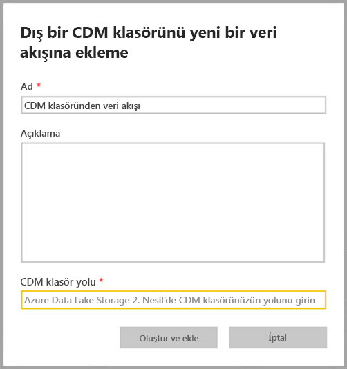
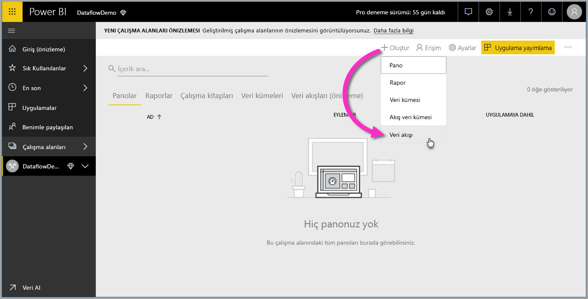
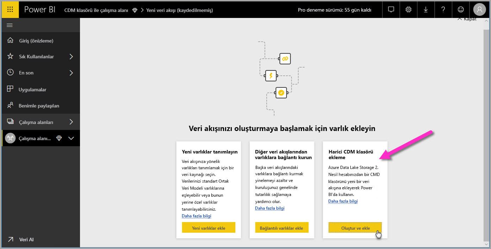

# Power BI'a veri akışı olarak bir CDM klasörü ekleme (Önizleme)

Power BI’da, kuruluşunuzun Azure Data Lake Storage 2. Nesil hesabında depolanan Common Data Model (CDM) klasörlerini veri akışları olarak ekleyebilirsiniz. CDM klasöründen bir veri akışı oluşturduktan sonra, CDM klasörlerine yerleştirdiğiniz verileri temel alan veri kümeleri, raporlar, panolar ve uygulamalar oluşturmak için **Power BI Desktop** ve **Power BI hizmeti** kullanabilirsiniz.

Aşağıdaki listede açıklandığı gibi CDM klasörlerinden veri akışları oluşturmak için birkaç gereksinim vardır:

* Bir yöneticinin, ADLS 2. Nesil depolama hesabını kullanmadan önce Power BI’a bağlaması gerekir. ADLS 2. Nesil hesabını Power BI’a bağlamayı öğrenmek için [Azure Data Lake Storage 2. Nesil’i veri akışı depolaması için bağlama](service-dataflows-connect-azure-data-lake-storage-gen2.md) makalesine göz atın.
* CDM klasörlerinden veri akışları oluşturma *yalnızca*[yeni çalışma alanı deneyiminde](../collaborate-share/service-create-the-new-workspaces.md) mevcuttur. 
* Power BI’a CDM klasörü eklemek için klasörü ekleyen kullanıcının [CDM klasörü ve dosyaları için yetkilendirmeye](./service-dataflows-azure-data-lake-integration.md) sahip olması gerekir.
* CDM klasöründeki tüm dosyaları ve klasörleri Power BI’a eklemek için, size bu dosya ve klasörler üzerinde okuma ve yürütme izinleri verilmesi gerekir.

Aşağıdaki bölümlerde bir CDM klasöründen veri akışı oluşturma işlemi açıklanmaktadır.

## Veri akışı oluşturmak üzere CDM klasörleri için kullanıcıları yetkilendirme

CDM klasöründen bir veri akışı oluşturmak için şu izinlerin eklenmesi gerekir:
* Power BI aracılığıyla CDM klasörüne erişecek kullanıcının, depolama hesabının **Depolama Blobu Veri Sahibi** rolünün altında listelenmesi gerekir.
* Power BI aracılığıyla CDM klasörüne erişecek kullanıcının hem CDM klasörünün kendisinde hem de içindeki tüm dosya veya klasörlerde **Okuma Erişimi** ve **Yürütme Erişimi** ACL’lerine sahip olmalıdır. 

## CDM klasöründen veri akışı oluşturma

CDM klasöründen veri akışı oluşturmaya başlamak için **Power BI hizmetini** başlatın ve gezinti bölmesinden bir **çalışma alanı** seçin. İçinde yeni veri akışı oluşturabileceğiniz yeni bir çalışma alanı da oluşturabilirsiniz.

Görüntülenen ekranda, aşağıdaki görüntüde gösterildiği gibi **Create and attach** seçeneğini belirleyin.

Daha sonra görüntülenen ekran, veri akışınızı adlandırmanıza, veri akışının açıklamasını sağlamanıza ve kuruluşunuzun Azure Data Lake 2. Nesil hesabında CDM klasörünün yolunu sağlamanıza olanak sağlar. [CDM klasör yolunuza nasıl ulaşılacağını](service-dataflows-configure-workspace-storage-settings.md#get-the-uri-of-stored-dataflow-files) açıklayan makale bölümünü okuyun. 

Bilgileri sağladıktan sonra, veri akışı oluşturmak için **Create and attach** seçeneğini belirleyin.

CDM klasörlerindeki veri akışları, Power BI’da görüntülenirken *dış* olarak işaretlenir. Sonraki bölümde, standart veri akışları ve CDM klasörlerinden oluşturulan veri akışları arasındaki farklar açıklanmaktadır.

İzinler düzgün şekilde ayarlandıktan sonra, bu makalenin önceki kısımlarında açıklandığı gibi **Power BI Desktop**’ta veri akışınıza bağlanabilirsiniz.

## Önemli noktalar ve sınırlamalar

CDM klasöründen oluşturulan bir veri akışına yönelik izinlerle çalışılırken süreç, Power BI’daki dış veri kaynaklarına benzer. İzinler, Power BI içinden değil, veri kaynağında yönetilir. Power BI ile düzgün şekilde çalışmak için, CDM klasöründen oluşturulan veri akışı gibi, veri kaynağında izinler düzgün şekilde ayarlanmalıdır.

Aşağıdaki listeler, CDM klasörlerinden alınan veri akışlarının Power BI ile nasıl çalıştığının netleştirilmesine yardımcı olur.

Power BI Pro, Premium ve Embedded çalışma alanları:
* CDM’den alınan veri akışları düzenlenemez
* CDM klasöründen oluşturulan bir veri akışını okumaya yönelik izinler, Power BI tarafından değil, CDM klasörünün sahibi tarafından yönetilir

Power BI Desktop:
* Yalnızca hem içinde veri akışının oluşturulduğu çalışma alanı hem de CDM klasörü için yetkilendirilen kullanıcılar, Power BI Veri Akışları bağlayıcısından verilerine erişebilir

Aşağıdaki listede açıklandığı gibi, dikkate alınacak bazı ek unsurlar da vardır:

* CDM klasörlerinden veri akışları oluşturma *yalnızca*[yeni çalışma alanı deneyiminde](../collaborate-share/service-create-the-new-workspaces.md) mevcuttur
* CDM klasörlerinden oluşturulan veri akışları için bağlantılı varlıklar kullanılamaz

**Power BI Desktop** müşterileri, veri akışının sahibi olmadığı veya veri akışının CDM klasörüne yönelik açıkça yetkilendirilmediği sürece, Azure Data Lake Storage 2. Nesil hesabında depolanan veri akışlarına erişemez. Aşağıdaki durumu dikkate alın:

1.    Ayşe yeni bir çalışma alanı oluşturuyor ve CDM klasöründen veri akışları depolanacak şekilde bu çalışma alanını yapılandırıyor.
2.    Ayşe’nin oluşturduğu çalışma alanının da üyesi olan Berk, Ayşe’nin oluşturduğu veri akışından veri almak için Power BI Desktop ve veri akışı bağlayıcısını kullanmak ister.
3.    Berk, veri gölünde veri akışının CDM klasörüne yetkili bir kullanıcı olarak eklenmediğinden bir hata alır.

  

Bu sorunu çözmek için Berk’e, CDM Klasörü ve dosyaları için okuyucu izinleri verilmelidir. [Bu makalede](./service-dataflows-azure-data-lake-integration.md) CDM Klasörü için nasıl erişim izni verileceği hakkında daha fazla bilgi edinebilirsiniz.

## Sonraki Adımlar

Bu makalede, veri akışları için çalışma alanı depolamanın nasıl yapılandırılacağına ilişkin yönergeler sağlanmıştır. Ek bilgi için aşağıdaki makalelere göz atın:

Veri akışları, CDM ve Azure Data Lake Storage 2. Nesil hakkında daha fazla bilgi için aşağıdaki makalelere göz atın:

* [Veri akışları ve Azure Data Lake tümleştirmesi (Önizleme)](service-dataflows-azure-data-lake-integration.md)
* [Çalışma alanı veri akışı ayarlarını yapılandırma (Önizleme)](service-dataflows-configure-workspace-storage-settings.md)
* [Azure Data Lake Storage 2. Nesil'i veri akışı depolamasına bağlama (Önizleme)](service-dataflows-connect-azure-data-lake-storage-gen2.md)

Genel veri akışları hakkında bilgi için şu makalelere göz atın:

* [Power BI’da veri akışları oluşturma ve kullanma](service-dataflows-create-use.md)
* [Power BI Premium'da hesaplanan varlıkları kullanma](service-dataflows-computed-entities-premium.md)
* [Şirket içi veri kaynakları ile veri akışlarını kullanma](service-dataflows-on-premises-gateways.md)
* [Power BI veri akışları için geliştirici kaynakları](service-dataflows-developer-resources.md)

Azure depolama hakkında daha fazla bilgi için şu makaleleri okuyabilirsiniz:
* [Azure Depolama güvenlik kılavuzu](/azure/storage/common/storage-security-guide)
* [Zamanlanmış yenileme yapılandırma](../connect-data/refresh-scheduled-refresh.md)
* [Azure Veri Hizmetleri’nden github örneklerini kullanmaya başlama](https://aka.ms/cdmadstutorial)

Ortak Veri Modeli hakkında daha fazla bilgi için genel bakış makalesini okuyabilirsiniz:
* [Ortak Veri Modeli - genel bakış ](/powerapps/common-data-model/overview)
* [CDM klasörleri](/common-data-model/data-lake)
* [CDM model dosyası tanımı](/common-data-model/model-json)

Ayrıca her zaman [Power BI Topluluğuna soru sormayı](https://community.powerbi.com/) deneyebilirsiniz.