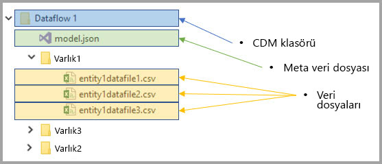
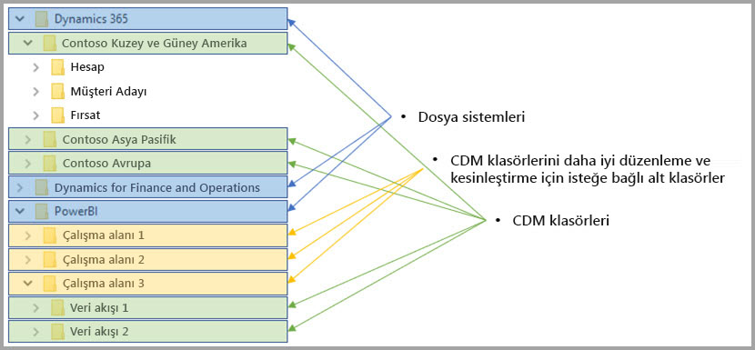

# Veri akışları ve Azure Data Lake tümleştirmesi (Önizleme)

Varsayılan olarak, Power BI ile kullanılan veriler, Power BI tarafından sağlanan iç depolama alanında depolanır. Veri akışları ve Azure Data Lake Storage 2. Nesil (ADLS 2. Nesil) tümleştirmesi ile, kuruluşunuzun Azure Data Lake Storage 2. Nesil hesabında veri akışlarınızı depolayabilirsiniz. 

## CDM klasörleri ile veri akışları arasındaki ilişki

**Veri akışları** ile kullanıcılar ve kuruluşlar, dağınık kaynaklardan gelen verileri birleştirebilir ve modellemeye hazırlar. Common Data Model (CDM) ile kuruluşlar, uygulamalar ve dağıtımlar arasında semantik tutarlılık sağlayan bir veri biçimi kullanabilir. Ayrıca Azure Data Lake Storage 2. Nesil (ADLS 2. Nesil) ile, Azure’da veri göllerine ayrıntılı erişim ve yetkilendirme denetimi uygulanabilir. Bu öğeler birleştirildiğinde, işletme genelindeki uygulamalar ve girişimler için cazip merkezi veriler, yapılandırılmış veriler, ayrıntılı erişim denetimi ve semantik tutarlılık sağlar.

CDM biçiminde depolanan veriler, bir kuruluştaki uygulamalar ve dağıtımlar arasında semantik tutarlılık sağlar. ADLS 2. Nesil ile CDM bütünleştirmesi sayesinde, standart CDM biçimindeki şema biçiminde düzenlenen verileri içeren CDM klasörleri kullanılarak (ADLS 2. Nesil) içinde depolanan verilere aynı yapısal tutarlılık ve semantik anlam uygulanabilir. Bir Azure Data Lake’teki standartlaştırılmış meta veriler ve kendiliğinden açıklayıcı veriler; Power BI, Azure Data Factory, Azure Data Lake, Databricks ve Azure Machine Learning (ML) gibi veri üreticileri ve tüketicileri arasında birlikte çalışabilirliği ve kolay meta veri keşfini elverişli hale getirir. 

Veri akışları, tanımlarını ve verilerini CDM klasörlerinde aşağıdaki biçimlerde depolar:

**Model.json**
* **Model.json** meta veri açıklama dosyası, varlık kayıtları ve öznitelikleriyle ilgili semantik bilgileri ve temel veri dosyalarına bağlantılar içerir. Model.json dosyasının mevcut olması, CDM meta veri biçimiyle uyumluluğu belirtir ve uygulamanın kullanabileceği ek zengin kullanıma hazır semantik meta veriler içeren standart varlıkları kapsayabilir.
* Power BI, her bir veri kaynağı bilgisini Power BI hizmetinde Dataflow Editor deneyimi tarafından oluşturulan **sorgu ve dönüştürmeler** ile birlikte de depolar. Veri kaynaklarının parolaları, model dosyasında depolanmaz.

**Veri dosyaları**
* Veri dosyaları, CDM klasöründe düzgün tanımlanmış yapı ve biçimde bulunur (bu makalenin ilerleyen kısmında açıklandığı gibi alt klasörler isteğe bağlıdır) ve model.json dosyasında bu veri dosyalarına başvurulur. Şu anda veri dosyaları .csv biçiminde olmalıdır, ancak sonraki güncelleştirmelerde ek biçimler desteklenebilir. 

Aşağıdaki diyagramda, Power BI veri akışı tarafından oluşturulan, üç varlık içeren örnek bir CDM klasörü gösterilmektedir:

Önceki görüntüde yer alan model.json veya meta veri dosyası, CDM klasörü boyunca varlık veri dosyalarına işaretçiler sağlar.

## Power BI, veri gölünde CDM klasörlerini düzenler

Power BI veri akışları ve ADLS 2. Nesil ile tümleştirmesi sayesinde Power BI, bir veri gölünde veri üretebilir. Power BI bir veri üreticisi olarak, model.json dosyasını ve ilişkili veri dosyalarını içeren her veri akışı için bir CDM klasörü oluşturmalıdır. Power BI, *dosya sistemlerini* kullanarak veri gölünde diğer veri üreticilerinden yalıtılmış olarak verilerini depolar. Azure Data Lake Storage 2. Nesil dosya sistemi ve hiyerarşik ad alanı hakkında, [onları açıklayan makaleden](/azure/storage/data-lake-storage/namespace) daha fazla bilgi edinebilirsiniz.

Power BI, belirsizliği önlemek ve **Power BI hizmetinde** sunulduğunda verilerin geliştirilmiş düzenlemesini sağlamak için alt klasörleri kullanır. Klasör adlandırması ve yapısı, çalışma alanlarını (Klasörler) ve veri akışlarını (CDM Klasörleri) temsil eder. Aşağıdaki diyagramda, Power BI ve diğer veri üreticileri tarafından paylaşılan bir veri gölünün nasıl yapılandırılmış olabileceği gösterilmektedir. Her bir hizmet (bu durumda Dynamics 365, Dynamics for Finance and Operation ve Power BI) kendi dosya sistemini oluşturur ve korur. Her bir hizmetteki deneyime bağlı olarak, dosya sistemi içinde CDM klasörlerini daha iyi düzenlemek için alt klasörler oluşturulur. 

## Power BI, veri gölünde verileri korur

Power BI, Azure Data Lake Storage2. Nesil tarafından sağlanan *Active Directory OAuth Bearer* belirteçlerini ve *POSIX ACL’leri* işlevlerini kullanır. Bu özellikler, Power BI’ın yönettiği dosya sistemine olan erişiminin kapsamının belirlenmesini ve ayrıca kişilerin yalnızca oluşturdukları veri akışlarına ve CDM klasörlerine olan erişiminin kapsamının belirlenmesini sağlar. 

Power BI dosya sistemi içinde CDM klasörleri oluşturmak ve yönetmek için, dosya sistemine yönelik okuma, yazma ve yürütme izinleri gerekir. Power BI’da oluşturulan her veri akışı kendi CDM klasöründe depolanır ve veri akışının sahibine yalnızca CDM klasörüne ve bu klasörün içeriklerine salt okunur erişim izni verilir. Bu yaklaşım, Power BI’ın oluşturduğu verilerin bütünlüğünü korur ve yöneticilerin, denetim günlüklerini kullanılarak CDM klasörüne hangi kullanıcıların eriştiğini izleyebilmesini sağlar. 

### CDM klasörleri için kullanıcıları veya hizmetleri yetkilendirme

Active Directory OAuth Bearer belirteçleri ve POSIX ACL’leri sayesinde CDM klasörlerinin, verileri okuması gereken kullanıcılar veya hizmetler gibi veri tüketicileriyle paylaşılması kolaylaştırılmıştır. Böylece yöneticilerin CDM klasörüne kimin eriştiğini izleyebilmesi sağlanır. Gereken tek işlem, istediğiniz Active Directory nesnesine (örn. bir kullanıcı grubu veya hizmet) CDM Klasörüne erişme izni vermektir. Veri üreticisi dışındaki tüm kimlikler için CDM klasörüne yönelik tüm erişim izinlerinin salt okunur erişim izni olarak verilmesini öneririz. Böylece, üreticinin oluşturduğu verilerin bütünlüğü korunur.

Power BI’a CDM klasörleri eklemek için, CDM Klasörünü ekleyen kullanıcının hem CDM klasörü üzerinde hem de onun içindeki tüm dosyalar ve klasörler üzerinde *Okuma* Erişimi ACL’lerine sahip olması gerekir. Ayrıca, hem CDM klasörü üzerinde hem de onun içindeki tüm klasörler üzerinde *Yürütme* Erişimi ACL’leri de gerekir. Daha fazla bilgi için hem [Dosyalarda ve dizinde erişim denetim listeleri](/azure/storage/blobs/data-lake-storage-access-control#access-control-lists-on-files-and-directories) hem de [Azure Data Lake Storage 2. Nesil kullanımına yönelik en iyi yöntemler](/azure/storage/blobs/data-lake-storage-best-practices) makalesini gözden geçirmeniz önerilir.

### Alternatif yetkilendirme biçimleri

Power BI dışındaki kişiler veya hizmetler de alternatif yetkilendirme biçimlerinden yararlanabilir. Bu alternatifler, hesaptaki *tüm* kaynaklara temel erişimi olan kişilerin göldeki tüm kaynaklara tam erişim elde etmesine izin verir ve dosya sistemlerine ya da CDM Klasörlerine bunların kapsamı belirlenemez. Bu alternatifler, erişim izni vermenin basit yolları olabilir, ancak veri gölündeki belirli kaynakları paylaşma yeteneğini sınırlar ve kullanıcılara, depolama alanına erişen kişilerin denetimini sağlamaz. Kullanılabilir yetkilendirme şemalarının tüm ayrıntıları [Azure Data Lake Storage 2. Nesil’de erişim denetimi makalesinde](/azure/storage/blobs/data-lake-storage-access-control
) sağlanmıştır.

## Sonraki adımlar

Bu makalede, Power BI veri akışlarının, CDM klasörlerinin ve Azure Data Lake Storage 2. Nesil tümleştirmesine genel bakış sağlanmıştır. Ek bilgi için aşağıdaki makalelere göz atın:

Veri akışları, CDM ve Azure Data Lake Storage 2. Nesil hakkında daha fazla bilgi için aşağıdaki makalelere göz atın:

* [Çalışma alanı veri akışı ayarlarını yapılandırma (Önizleme)](service-dataflows-configure-workspace-storage-settings.md)
* [Power BI’a veri akışı olarak bir CDM klasörü ekleme (Önizleme)](service-dataflows-add-cdm-folder.md)
* [Veri akışı depolaması için Azure Data Lake Storage 2. Nesil'i bağlama (Önizleme)](service-dataflows-connect-azure-data-lake-storage-gen2.md)

Genel veri akışları hakkında bilgi için şu makalelere göz atın:

* [Power BI’da veri akışları oluşturma ve kullanma](service-dataflows-create-use.md)
* [Power BI Premium'da hesaplanan varlıkları kullanma](service-dataflows-computed-entities-premium.md)
* [Şirket içi veri kaynakları ile veri akışlarını kullanma](service-dataflows-on-premises-gateways.md)
* [Power BI veri akışları için geliştirici kaynakları](service-dataflows-developer-resources.md)

Azure depolama hakkında daha fazla bilgi için şu makaleleri okuyabilirsiniz:
* [Azure Depolama güvenlik kılavuzu](/azure/storage/common/storage-security-guide)
* [Azure Veri Hizmetleri’nden github örneklerini kullanmaya başlama](https://aka.ms/cdmadstutorial)

Ortak Veri Modeli hakkında daha fazla bilgi için genel bakış makalesini okuyabilirsiniz:
* [Ortak Veri Modeli - genel bakış ](/powerapps/common-data-model/overview)
* [CDM klasörleri](/common-data-model/data-lake)
* [CDM model dosyası tanımı](/common-data-model/model-json)

Ayrıca her zaman [Power BI Topluluğuna soru sormayı](https://community.powerbi.com/) deneyebilirsiniz.