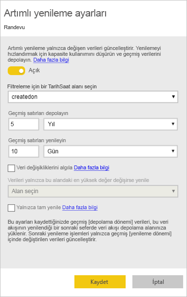
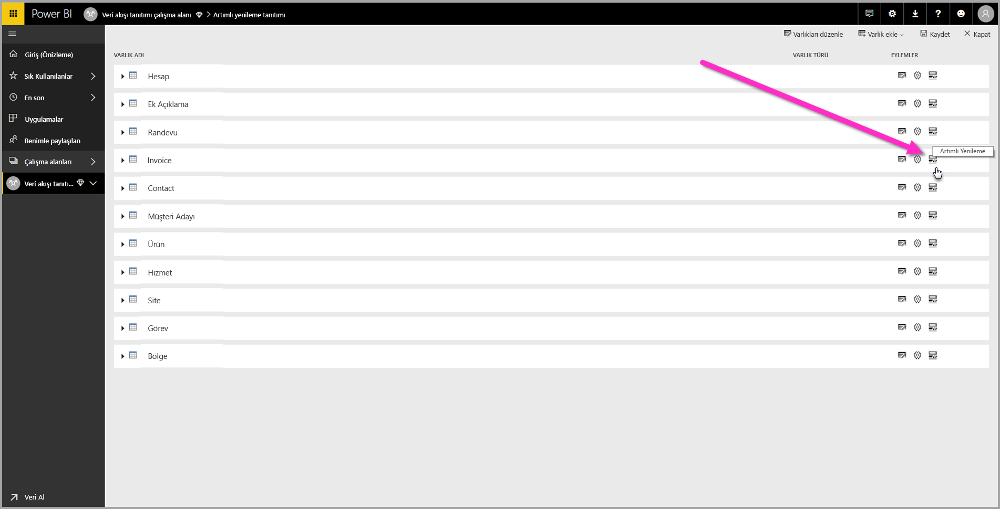
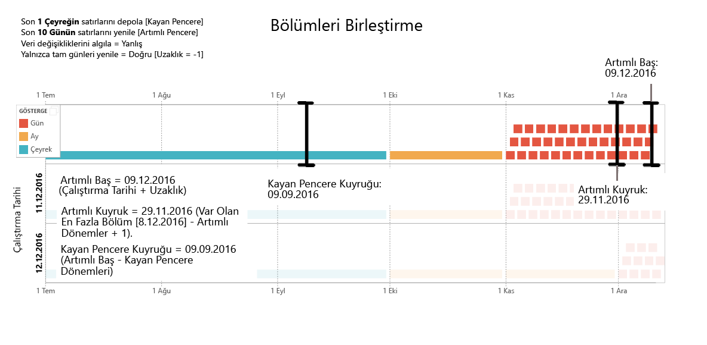
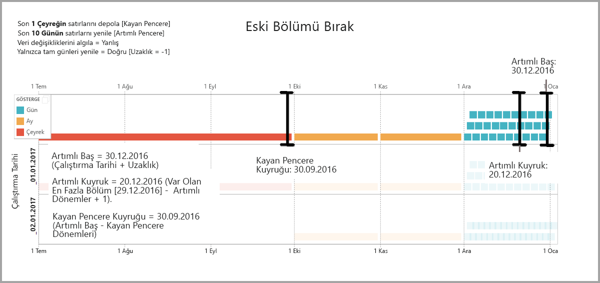
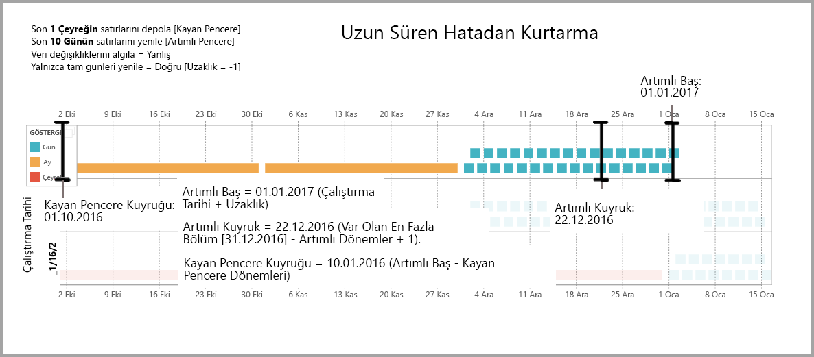

# Power BI veri akışları ile artımlı yenilemeyi kullanma

Veri akışları ile, büyüm miktarlardaki verileri Power BI'a getirebilir, cazip raporlar ve analizler oluşturabilirsiniz. Bununla birlikte bazı durumlarda, her yenileme işleminde kaynak verilerin tam kopyasını güncelleştirmek pratik olmaz. **Artımlı yenileme** buna iyi bir alternatiftir ve veri akışlarına şu avantajları getirir:

* **Yenileme daha hızlı gerçekleşir** - Yalnızca değişmiş olan verilerin yenilenmesi gerekir. Örneğin, 10 yıllık bir veri akışının yalnızca son beş gününü yenileyin.
* **Yenileme daha güvenilir olur** - Örneğin, geçici kaynak sistemlerine uzun süreli bağlantıların sürdürülmesi gerekmez.
* **Kaynak tüketimi azaltılır** - Yenilenecek verilerin daha az olması, belleğin ve diğer kaynakların genel tüketimini azaltır.

Power BI iş akışlarında artımlı yenilemenin kullanılması için, veri akışının durduğu çalışma alanının [Premium kapasitede](../admin/service-premium-what-is.md) çalıştırılması ve veri akışına alınan veri kaynağında artımlı yenilemenin filtreleyebileceği bir *datetime* alanının bulunması gerekir. 

## Veri akışları için artımlı yenilemeyi yapılandırma

Bir veri akışı birçok varlık içerebilir. Artımlı yenileme varlık düzeyinde ayarlanır; böylelikle tek veri akışı hem tümüyle yenilenen varlıkları hem de artımlı olarak yenilenen varlıkları barındırabilir.

Artımlı olarak yenilenen varlık ayarlamak için, başlangıç olarak varlığınızı aynı diğer varlıkları yaptığınız gibi yapılandırın. Veri akışını ayarlama hakkında daha fazla bilgi edinmek için bkz. [Power BI'da self servis veri hazırlığı](service-dataflows-overview.md).

Veri akışı oluşturulduktan ve kaydedildikten sonra, aşağıdaki resimde gösterildiği gibi varlık görünümünde **artımlı yenileme** simgesini seçin:

Simgeye tıkladığınızda, **Artımlı yenileme ayarları** penceresi görüntülenir. Artımlı yenilemeyi **Açık** konuma getirdiğinizde, artımlı yenilemenizi yapılandırabilirsiniz.

Aşağıdaki listede, **Artımlı yenileme ayarları** penceresindeki ayarlar açıklanır. 

1. **Artımlı yenileme açık/kapalı düğmesi** – Bu kaydırıcı varlık için artımlı yenileme ilkesini açar/kapatır
2. **Filtre alanı açılan listesi** – Varlığın artımlar için filtrelenmesi sorgu alanını seçer. Bu alan yalnızca *datetime* alanları içerir. Varlığınızda *datetime* alanı yoksa, artımlı yenilemeyi kullanamazsınız.
3. **Geçmiş satırları depolayın** – Aşağıdaki örnek sonraki birkaç ayarın açıklanmasına yardımcı olacaktır.

    Bu örnek için, toplam 10 yıllık veriyi depolayacak ve toplamda beş yıllık veriyi artımlı olarak yenileyecek şekilde bir yenileme ilkesi tanımladık. Varlık günlük olarak yenilenirse, her yenileme işlemi için aşağıdaki adımlar gerçekleştirilir:

    * Veriler için yeni bir gün ekleme.
    * Güncel tarihe kadarki 10 günü yenileme.
    * Güncel tarihten beş yıl öncesinden daha eski zamana ait takvim yıllarını kaldırma. Örneğin, güncel tarih 1 Ocak 2019 ise, 2013 yılı kaldırılır.

    İlk veri akışı yenilemesinde beş yılın tamamının içeri aktarılması biraz zaman alabilir, ama izleyen yenilemeler büyük olasılıkla ilk yenileme süresinden çok daha kısa bir sürede tamamlanır.

4. **Veri değişikliklerini algıla** - 10 günün artımlı yenilemesi 5 yılın tamamının yenilenmesinden çok daha verimlidir ama daha iyisini de yapabiliriz. **Veri değişikliklerini algıla** onay kutusunu seçtiğinizde, yalnızca verilerin değiştiği günleri belirleyip o günleri yenilemek için bir tarih/saat sütunu seçebilirsiniz. Bu, genellikle denetim amacıyla, kaynak sistemde bir sütunun var olduğunu varsayar. Artımlı aralıktaki dönemlerin her biri için bu sütunun maksimum değeri değerlendirilir. Bu veriler son yenilemeden bu yana değişmemişse dönemin yenilenmesi gerekmez. Örnekte bu, artımlı olarak yenilenen gün sayısını 10’dan ikiye de düşürebilir.

> [!TIP]
> Mevcut tasarım gereği, veri değişikliklerini algılayacak sütunun kalıcı duruma getirilmesi ve önbelleğe alınması gerekir. Kardinalite ve bellek kullanımını azaltmak için aşağıdaki tekniklerden birini dikkate almak isteyebilirsiniz:
>
>    * Power Query işlevini kullanarak, yenileme anında bu sütunun yalnızca maksimum değerini kalıcı duruma getirin.
>    * Duyarlılığı, yenileme sıklığı gereksinimleriniz için kabul edilebilir bir düzeye indirin.

5. **Yalnızca tamamlanan dönemleri yenile** - Yenilemenizin her sabah 04:00'da çalışacak şekilde zamanlandığını düşünün. O günün ilk dört saati boyunca kaynak sistemde veri görüntülenirse, bunu hesaba katmak istemeyebilirsiniz. Petrol ve doğalgaz sektöründe günlük varil sayısı gibi bazı iş ölçümlerinde, kısmi günleri hesaba katmak pratik veya anlamlı olmaz.

    Yalnızca tamamlanan dönemlerin yenilenmesinin uygun olduğu bir diğer örnek de finans sistemindeki verileri yenilenmesidir. Ayın 12. takvim gününde önceki ayın verilerinin onaylandığı bir finansal sistemden verilerin yenilenmesini düşünün. Artımlı aralığı 1 ay olarak ayarlayabilir ve yenilemeyi ayın 12. gününde çalıştırılacak şekilde zamanlayabilirsiniz. Bu seçenek işaretli olduğunda, Ocak verilerini (en son tamamlanan aylık dönem) 12 Şubat'ta yenileyebilir.

> [!NOTE]
> Veri akışı artımlı yenilemesi tarihleri şu mantığa göre belirler: Yenileme zamanlandıysa, veri akışlarının artımlı yenilemesi için yenileme ilkesinde tanımlanan saat dilimi kullanılır. Yenileme zamanlaması yoksa, artımlı yenileme için yenilemenin çalıştırıldığı makinenin saati kullanılır.

## Artımlı yenileme sorgusu

Artımlı yenileme yapılandırıldıktan sonra, veri akışı sorgunuzu tarihe göre filtrelemeyi eklemek için otomatik olarak değiştirir. Yenilemenizi daha ayrıntılı ayarlamak veya özelleştirmek için, otomatik olarak oluşturulmuş sorguyu **Gelişmiş Power Query Düzenleyicisi**'ni kullanarak düzenleyebilirsiniz. Artımlı yenileme ve bunun nasıl çalıştığı hakkında daha fazla bilgi için aşağıdaki bölümü okuyun.

## Artımlı yenileme ve bağlantılı varlıklarla hesaplanan varlıklar karşılaştırması

*Bağlantılı* varlıklar için, artımlı yenileme kaynak varlığı güncelleştirir. Bağlantılı varlıklar yalnızca özgün varlığa yönelik bir işaretçi olduğundan, artımlı yenilemenin bağlantılı varlık üzerinde bir etkisi olmaz. Kaynak varlık tanımlanmış yenileme ilkesine göre yenilendiğinde, her bağlantılı varlık kaynağındaki verilerin güncelleştirildiğini varsayar.

*Hesaplanan* varlıklarda, veri deposunda (bu başka bir veri akışı olabilir) çalıştırılan sorgular temel alınır. Dolayısıyla, hesaplanan varlıklar bağlantılı varlıklarla aynı şekilde davranır.

Hesaplanan varlıklarla bağlantılı varlıklar benzer davranışlar gösterdiğinden, her ikisini gereksinimleri ve yapılandırma adımları da aynıdır. Hesaplanan varlıkların bir farkı, bazı yapılandırmalarda bölümlerin oluşturulma yönteminden dolayı artımlı yenilemenin en iyi durumda çalıştırılamamasıdır. 

## Artımlı yenileme ile tam yenileme arasında geçiş yapma

Veri akışları yenileme ilkesinin artımlı yenileme ile tam yenileme arasında değiştirilmesini destekler. İki yönden birinde (tam yenilemeden artımlıyla veya artımlı yenilemeden tam yenilemeye) bir değişiklik yapıldığında, bu değişiklik veri akışını bir sonraki yenilemeden sonra etkiler.

Veri akışı tam yenilemeden artımlı yenilemeye geçirildiğinde, yeni yenileme mantığı yenileme aralığına ve artıma uyan veri akışını, artımlı yenileme ayarlarında tanımlandığı şekilde güncelleştirir.

Veri akışı artımlı yenilemeden tam yenilemeye geçirildiğinde, tam yenilemede tanımlanan ilke tarafından artımlı yenilemede toplanan tüm verilerin üzerine yazılır. Bu eylemi onaylamanız gerekir.

## Veri akışı artımlı yenilemesi ve veri kümeleri

Veri akışı artımlı yenilemesi ve veri kümesi artımlı yenilemesi, birbirine bağlı çalışacak şekilde tasarlanmıştır. Veri kümesine tümüyle yüklenmiş bir veri akışında artımlı yenilemeli bir varlık bulunması veya veri kümesine artımlı olarak yüklenmiş bir veri akışında tümüyle yüklenmiş bir varlık bulunması desteklenir. 

Her ikisi de yenileme ayarlarında belirttiğiniz tanımlara uygun yaklaşımlardır.
[Power BI Premium'da artımlı yenileme](../admin/service-premium-incremental-refresh.md) başlığı altında artımlı yenileme hakkında daha fazla bilgi bulabilirsiniz.

## Artımlı yenilemede saat dilimi desteği

Veri akışı artımlı yenilemesi, çalıştırıldığı zamana bağımlıdır. Sorgunun filtrelemesi çalıştırıldığı güne bağımlıdır.

Bu bağımlılıklara uyum sağlamak ve veri tutarlılığını güvence altına almak için, veri akışlarının artımlı yenilemesinde *şimdi yenile* senaryoları için aşağıdaki buluşsal yöntemler uygulanır:

* Sistemde zamanlanmış yenilemenin tanımlanmış olması durumunda – artımlı yenileme, zamanlanan yenilemenin saat dilimi ayarlarını kullanır. Bu şekilde, veri akışını yenileyen kişinin bulunduğu saat dilimi ne olursa olsun, sistemin tanımıyla her zaman tutarlı olacaktır.

* Zamanlanmış yenileme tanımlanmadıysa, veri akışlarında yenileme yapan kullanıcının bilgisayarının saat dilimi kullanılır.

Artımlı yenileme API'ler kullanılarak da çağrılabilir. Bu durumda, API çağrısı yenilemede kullanılan saat dilimi ayarını barındırabilir. API'lerin kullanılması test ve doğrulama işlemlerinde yararlı olabilir.

## Artımlı yenileme uygulama ayrıntıları

Veri akışları, artımlı yenileme için bölümlemeyi kullanır. Power BI Premium'un XMLA uç noktaları kullanılabilir olduğunda, bölümler de görünür duruma gelir. Veri akışlarında artımlı yenileme, yenileme ilkesi gereksinimlerini karşılamak için gereken en az sayıda bölümü saklar. Aralığın dışında kalan eski bölümler bırakılarak bir kayan pencere korunur. Gereken toplam bölüm sayısını azaltmak için, bölümler gerektiğinde birleştirilir. Bu sıkıştırmayı geliştirdiği gibi, bazı durumlarda soru performansını da geliştirebilir.

Bu bölümdeki örnekler aşağıdaki yenileme ilkesini paylaşır:

* Son 1 Çeyreğin satırlarını depola
* Son 10 Günün satırlarını yenile
* Veri değişikliklerini algıla = Yanlış
* Yalnızca tam günleri yenile = Doğru

### Bölümleri birleştirme

Bu örnekte, artımlı aralığın dışına çıkan gün bölümleri otomatik olarak ay düzeyinde birleştirilir. Artımlı aralığın içindeki bölümlerin, yalnızca söz konusu günlerin yenilenmesini sağlamak üzere gün ayrıntı düzeyinde tutulması gerekir.
*Çalıştırma Tarihi 11/12/2016* olan yenileme işleminde Kasım ayının günleri birleştirilir çünkü bunlar artımlı aralığın dışında kalır.

### Eski bölümleri bırakma

Toplam aralığının dışında kalan eski bölümler kaldırılır. *Çalıştırma Tarihi 2/1/2017* olan yenileme işleminde Ç3 2016 bölümü bırakılır çünkü toplam aralığının dışında kalır.

### Uzun süren hatadan kurtarma

Bu örnekte, sistemin uzun süren bir hatadan düzgün bir şekilde kurtarılmasının benzetimi yapılır. Yenilemenin başarılı bir şekilde çalıştırılamadığını çünkü veri kaynağı kimlik bilgilerinin süresinin dolduğunu ve bu sorunun çözülmesinin 13 gün sürdüğünü varsayalım. Artımlı aralığı yalnızca 10 gündür.

*Çalıştırma Tarihi 15/1/2017* olan bir sonraki başarılı yenileme işleminde, eksik kalan 13 günün geriye dönük olarak doldurulması ve bunların yenilenmesi gerekir. Ayrıca, önceki 9 gün de yenilenmelidir çünkü bu günler normal zamanlamada yenilenmemiştir. Başka bir deyişle, artımlı aralığı 10 günden 22 güne çıkarılır.

*Çalıştırma Tarihi 16/1/2017* olan bir sonraki yenileme işleminde, Aralık ayındaki günleri ve Ç4 2016'daki ayları birleştirme fırsatı elde edilir.

## Sonraki Adımlar

Bu makalede, veri akışları için artımlı yenileme işlemi açıklanmıştır. Yararlı olabilecek diğer makalelerden bazıları ise aşağıda verilmiştir.

* [Veri akışları ile self servis veri hazırlığı](service-dataflows-overview.md)
* [Power BI’da veri akışları oluşturma ve kullanma](service-dataflows-create-use.md)
* [Şirket içi veri kaynakları ile veri akışlarını kullanma](service-dataflows-on-premises-gateways.md)
* [Power BI veri akışları için geliştirici kaynakları](service-dataflows-developer-resources.md)

Power Query ve zamanlanmış yenileme hakkında daha fazla bilgi için şu makaleleri okuyabilirsiniz:
* [Power BI Desktop'ta sorgulara genel bakış](desktop-query-overview.md)
* [Zamanlanmış yenileme yapılandırma](../connect-data/refresh-scheduled-refresh.md)

Ortak Veri Modeli hakkında daha fazla bilgi için genel bakış makalesini okuyabilirsiniz:
* [Ortak Veri Modeli - genel bakış ](/powerapps/common-data-model/overview)