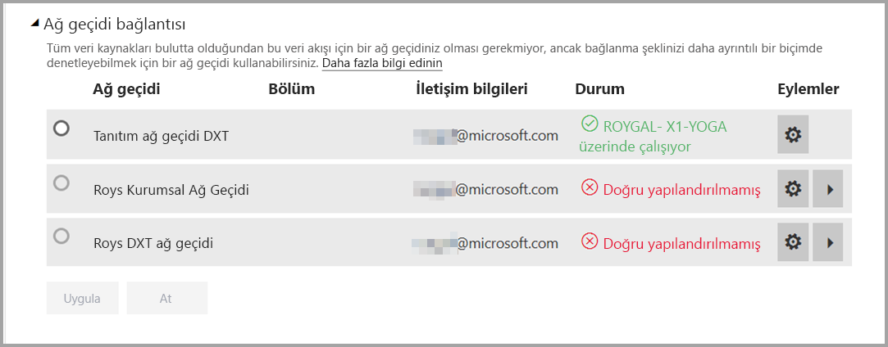
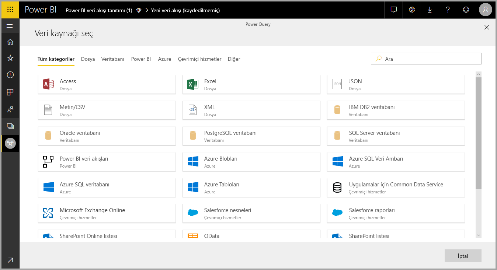
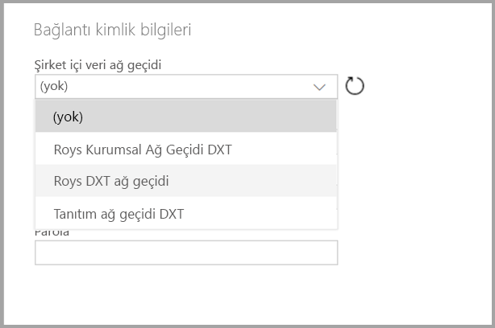

# Şirket içi veri kaynakları ile veri akışlarını kullanma

**Veri akışlarını** kullanarak çeşitli kaynaklardan bir veri koleksiyonu oluşturabilir, verileri temizleyebilir, dönüştürebilir ve sonra Power BI depolama alanına yükleyebilirsiniz. Veri akışı oluştururken şirket içi veri kaynaklarını kullanmak isteyebilirsiniz. Bu makalede veri akışları oluşturma ile ilgili gereksinimler ve bu bağlantıları etkinleştirmek için **Kurumsal Ağ Geçidinizin** nasıl yapılandırılması gerektiği açıklanmaktadır.

## Kurumsal Ağ Geçidini veri akışları ile birlikte kullanmak üzere yapılandırma

Ağ geçidi kullanarak veri akışı oluşturmak isteyen kullanıcıların Kurumsal Ağ Geçidi'nin yöneticisi olması veya yöneticinin, kullanılması planlanan veri kaynağını kullanıcı ile paylaşmış olması gerekir. 

> [!NOTE]
> Veri akışları yalnızca Kurumsal Ağ Geçitleri kullanıldığında desteklenir.

## Şirket içi veri kaynağını bir veri akışında kullanma

Bir veri akışı oluştururken, aşağıdaki görüntüde gösterildiği gibi veri kaynakları listesinden şirket içi veri kaynağı seçin.

Seçiminizi yaptıktan sonra, şirket içi verilere erişmek için kullanılacak Kurumsal Ağ Geçidine yönelik bağlantı bilgilerini sağlamanız istenir. Ağ geçidinin kendisi seçmeniz ve seçili ağ geçidine ait kimlik bilgilerini sağlamanız gerekir.

## Ağ geçidinizi izleme

Bir veri akışı için Kurumsal Ağ Geçidinizi, bir veri kümesi için ağ geçitlerini izlediğiniz şekilde izleyebilirsiniz.

Aşağıdaki görüntüde gösterildiği gibi, Power BI’da veri akışının ayarlar ekranından bir veri akışının ağ geçidi durumunu izleyebilir ve veri akışına bir ağ geçidi atayabilirsiniz.

## Ağ geçidini değiştirme

Belirli bir veri akışı için kullanılan Kurumsal Ağ Geçidini iki şekilde değiştirebilirsiniz:

1. **Yazma aracından** – Tüm sorgularınıza atanmış ağ geçidini, veri akışı yazma aracını kullanarak değiştirebilirsiniz.

    > [!NOTE]
    > Veri akışı yeni ağ geçidini kullanarak gerekli veri kaynaklarını bulmaya veya oluşturmaya çalışacaktır. Bunu yapamazsa, gerekli tüm veri akışları seçili ağ geçidinden ulaşılabilir olana kadar ağ geçidini değiştiremezsiniz.

2. **Ayarlar ekranından** - Power BI hizmetinde veri akışının ayarlar ekranını kullanarak atanmış ağ geçidini değiştirebilirsiniz.

Kurumsal Ağ Geçitleri hakkında daha fazla bilgi için bkz. [Şirket içi veri ağ geçidi](../connect-data/service-gateway-onprem.md).

## Önemli noktalar ve sınırlamalar

Kurumsal Ağ Geçitlerini ve veri akışlarını kullanmanın bilinen birkaç sınırlaması vardır:

* Her veri akışı yalnızca bir ağ geçidi kullanabilir. Bu nedenle, tüm sorgular aynı ağ geçidi kullanılarak yapılandırılmalıdır.
* Ağ geçidinin değiştirilmesi tüm veri akışını etkiler.
* Birkaç ağ geçidi gerekliyse en iyi yöntem birden fazla veri akışı (her ağ geçidi için bir tane) oluşturmak ve verileri birleştirmek için işlem veya varlık başvuru özelliklerinden yararlanmaktır.
* Veri akışları yalnızca kurumsal ağ geçitleri kullanıldığında desteklenir. Kişisel ağ geçitleri açılan listelerde ve ayarlar ekranlarında seçim için sunulmaz.
* [DirectQuery ve İçe Aktarma sorguları için Kerberos üzerinden SSO kullan](../connect-data/service-gateway-sso-kerberos.md#run-a-power-bi-report) seçeneğiyle yapılandırılmış olan şirket içi veri kaynakları, veri akışlarında desteklenmez.

## Sonraki Adımlar

Bu makalede şirket içi veri kaynağını veri akışları için kullanma ve ağ geçitlerinin bu tür verilere erişmek için nasıl kullanılıp yapılandırılacağı hakkında bilgiler verilmiştir. Aşağıdaki makaleler de yardımcı olabilir

* [Veri akışları ile self servis veri hazırlığı](service-dataflows-overview.md)
* [Power BI’da veri akışları oluşturma ve kullanma](service-dataflows-create-use.md)
* [Power BI Premium'da hesaplanan varlıkları kullanma](service-dataflows-computed-entities-premium.md)
* [Power BI veri akışları için geliştirici kaynakları](service-dataflows-developer-resources.md)

Power Query ve zamanlanmış yenileme hakkında daha fazla bilgi için şu makaleleri okuyabilirsiniz:
* [Power BI Desktop'ta sorgulara genel bakış](desktop-query-overview.md)
* [Zamanlanmış yenileme yapılandırma](../connect-data/refresh-scheduled-refresh.md)

Ortak Veri Modeli hakkında daha fazla bilgi için genel bakış makalesini okuyabilirsiniz:
* [Ortak Veri Modeli - genel bakış ](https://docs.microsoft.com/powerapps/common-data-model/overview)
