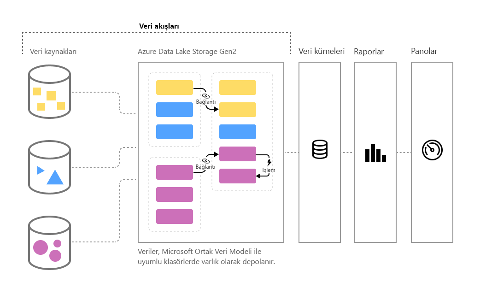

# Power BI’da self servis veri hazırlığı

Veri hacmi artmaya devam ettikçe, bu verileri düzgün biçimlendirilmiş, eyleme geçirilebilir bilgilere dönüştürme güçlüğü de artar. Görselleri, raporları ve panoları doldurmak için analize hazır veriler isteriz, çünkü böylelikle veri hacimlerimizi kolayca eyleme dönüştürülebilir içgörüler haline getirebiliriz. Power BI'da büyük verilere yönelik **self servis veri hazırlığı** ile, yalnızca birkaç tıklamayla verilerden Power BI içgörülerine geçebilirsiniz.

Power BI **veri akışlarını**, kuruluşların dağınık kaynaklardan gelen verileri birleştirmesine ve modellemeye hazırlamasına yardımcı olmak için kullanıma sunmuştur. Analistler tanıdık, self servis araçları kullanarak veri akışlarını kolayca oluşturabilir. Veri akışları, veri kaynağı bağlantılarını, ETL mantığını, yenileme zamanlamalarını ve daha birçok öğeyi tanımlayarak büyük verileri almak, dönüştürmek, tümleştirmek ve zenginleştirmek için kullanılır. Buna ek olarak, veri akışlarının bir parçası olan yeni model odaklı hesaplama altyapısı veri hazırlığı işleminin hem veri analistleri hem de rapor oluşturucuları için daha yönetilebilir, daha belirleyici ve daha az külfetli olmasını sağlar. Elektronik tabloların tüm etkilenen formüller için yeniden hesaplamaları işlemesine benzer şekilde, veri akışları da varlık veya veri öğesinin değişikliklerini sizin adınıza yönetir, güncelleştirmeleri otomatik hale getirir ve temel bir veri yenilemesi için bile bıktırıcı ve zaman alıcı olan mantık denetimlerini azaltır. Veri akışlarıyla, daha önce veri bilimcilerinin gözetiminde yapılması gereken (ve tamamlanması saatlerce veya günlerce süren) görevler artık analistler veya rapor oluşturucuları tarafından birkaç tıklamayla gerçekleştirilebilir. 

Veriler, Azure Data Lake Storage 2. Nesil'de [**Ortak Veri Modeli**](https://docs.microsoft.com/powerapps/common-data-model/overview)'nde varlıklar olarak depolanır. Veri akışları Power BI hizmeti kullanılarak çalışma alanlarında oluşturulur ve yönetilir.  
 
**Veri akışları**, **Ortak Veri Modeli**'ni kullanacak şekilde tasarlanmıştır. Bu veri modeli, Microsoft tarafından yayımlanmış olan ve veri oluşturma, kullanma ve analiz etme konularında kolaylık sağlamak üzere tasarlanmış olan standartlaştırılmış, modüler, genişletilebilir veri şeması koleksiyonudur. Bu modelle, neredeyse hiçbir uyumsuzlukla karşılaşmadan veri kaynaklarından Power BI panolarına geçebilirsiniz.

Veri akışlarını kullanarak, büyük ve büyüyen Dynamics 365, Salesforce, Azure SQL Veritabanı, Excel ve SharePoint gibi daha birçok desteklenen şirket içi ve bulut tabanlı veri kaynağından veri alabilirsiniz.

Ardından verileri Ortak Veri Modeli'ndeki standart varlıklara eşleyebilir, mevcut varlıkları değiştirebilir ve genişletebilir, ayrıca özel varlıklar oluşturabilirsiniz. İleri düzey kullanıcılar self servis, çok az kodlu/kodsuz, yerleşik Power Query yazma deneyimini kullanarak tümüyle özelleştirilmiş veri akışları oluşturabilir. Power Query yazma deneyimi, milyonlarca Power BI Desktop ve Excel kullanıcısının zaten kullanmakta olduğu Power Query deneyimine benzer.  

Veri akışını oluşturduktan sonra, Power BI Desktop'ı veya Power BI hizmetini kullanarak Power BI veri akışlarına yerleştirdiğiniz verileri temel alan veri kümeleri, raporlar, panolar ve uygulamalar oluşturabilirsiniz. Bunlar, iş etkinliklerinize derin içgörüler eklemek için Ortak Veri Modeli'nin gücünden yararlanır. 

Veri akışı yenileme zamanlaması, aynı veri kümeleriniz gibi, doğrudan veri akışının oluşturulduğu çalışma alanından yönetilir. 

## Veri akışı nasıl çalışır?

Burada veri akışlarının nasıl sizin yararınıza çalıştığını gösteren bazı örnekler verilmiştir:

* Kuruluşlar verilerini Ortak Veri Modeli'ndeki standart varlıklara eşleyebilir veya kendi özel varlıklarını oluşturabilir. Bu varlıklar, çalışmaya hazır raporları, panoları ve uygulamaları oluşturmak ve bunları kuruluşlarındaki kullanıcılara dağıtmak için yapı taşları olarak kullanılabilir. 

* Microsoft'un geniş veri bağlayıcıları koleksiyonunu kullanarak, kuruluşlar kendi veri kaynaklarını veri akışlarına bağlayabilir, verileri kaynağından eşlemek ve Power BI'a getirmek için Power Query kullanabilir. Veriler bir veri akışı tarafından içeri aktarıldıktan (ve belirtilen sıklıkta yenilendikten) sonra, bu veri akışı varlıkları cazip raporlar ve panolar oluşturmak amacıyla Power BI Desktop uygulamasında kullanılabilir. 

## Veri akışlarını kullanma

Önceki bölümde, Power BI'da kısa süre içinde güçlü analizler oluşturmak için veri akışlarının çeşitli kullanım yöntemleri açıklandı. Bu bölümde, kuruluşta veri akışlarını kullanarak hızla nasıl içgörüler oluşturabileceğinizi, BI Uzmanlarının kendi iş akışlarını nasıl oluşturabileceğini ve kendi kuruluşları için içgörüleri nasıl özelleştirebileceğini gözden geçireceksiniz.

> [!NOTE]
> Veri akışlarını kullanmak için Power BI Pro veya Power BI Premium hesabı gibi ücretli bir Power BI hesabınız olması gerekir ama veri akışlarının kullanımı için ayrıca ücretlendirilmezsiniz. 

### Ortak veri modelini iş gereksinimlerinize göre genişletme
Ortak Veri Modeli'ni (CDM) genişletmek isteyen kuruluşlarda, veri akışları iş zekası uzmanlarının standart varlıkları özelleştirmesine veya kendi varlıklarını oluşturmasına olanak tanır. Ardından bu self servis veri modelini özelleştirme yaklaşımı veri akışlarıyla birlikte kullanılarak, kuruluşa uyarlanmış uygulamalar ve Power BI panoları oluşturulabilir.

### İş akışlarını programlama yoluyla tanımlama
Ayrıca, iş akışlarını oluşturmak için kendi programlama çözümlerinizi geliştirmek de isteyebilirsiniz. Genel API'lerden ve özel veri akışı tanım dosyalarını (model.json) programlama yoluyla oluşturabilme özelliğinden yararlanarak, kuruluşunuzun benzersiz veri ve analiz gereksinimlerine uyan bir özel çözüm oluşturursunuz. 

Genel API'ler geliştiricilerin Power BI ve iş akışlarıyla basit ve kolay yollarla etkileşimli çalışmasına olanak tanır.

### Azure ile özelliklerinizin kapsamını genişletme
Azure Data Lake Storage 2. Nesil, tüm ücretli Power BI aboneliklerine eklenmiştir (kullanıcı başına 10 GB, P1 düğümü başına 100 TB). Dolayısıyla, Azure Data Lake'te self servis veri hazırlığını kolayca başlatabilirsiniz. 

Power BI, veri akışı verilerini kuruluşunuzun Azure Data Lake Storage 2. Nesil hesabında depolayacak şekilde yapılandırılabilir. Power BI Azure aboneliğinize bağlandığında, veri geliştiricileri ve veri bilimcileri Azure Machine Learning, Azure Databricks ve Azure Data Factory gibi daha birçok güçlü Azure ürününden yararlanabilir.

Power BI, kuruluşunuzun Azure Data Lake Storage hesabında depolanan ve Ortak Veri Modeli biçiminde şema verileri içeren klasörlere de bağlanabilir. Bu klasörler, Azure veri hizmetleri gibi hizmetler tarafından oluşturulabilir. Analistler bu klasörlere bağlanarak, Power BI'da bu verilerle rahatça çalışabilir. 

Azure Data Lake Storage 2. Nesil ve kuruluşunuzun Azure Data Lake hesabında bulunan veri akışları oluşturma da dahil olmak üzere veri akışı tümleştirmesi hakkında daha fazla bilgi için bkz. [veri akışları ve Azure Data Lake tümleştirmesi (Önizleme)](service-dataflows-azure-data-lake-integration.md).

## Power BI Premium'da veri akışı özellikleri

Veri akışı özelliklerinin ve iş yüklerinin Power BI Premium aboneliğinde çalışması için, söz konusu Premium kapasitede veri akışı iş yükünün açılmış olması gerekir. Aşağıdaki tabloda, Power BI Pro hesabı kullanıldığında veri akışı özellikleri ve bunların kapasiteleri açıklanır, ayrıca bunlar Power BI Premium kullanımıyla karşılaştırılır.

|Veri akışı özelliği | Power BI Pro |   Power BI Premium |
|---------|---------|---------|
|Zamanlanmış yenileme| Her gün 8|  48|
|Toplam Depolama Alanı| 10 GB/kullanıcı  |100 TB/düğüm|
|Power Query Online ile Veri Akışı Yazma|    +   |+|
|Power BI'daki Veri Akışı Yönetimi|   +|  +|
|Power BI Desktop'taki Veri Akışları Veri Bağlayıcısı|  +|  +|
|Azure ile tümleştirme|    +|  +|
|Hesaplanan Varlıklar (M üzerinden depolama içi dönüştürmeleri) | |   +|
|Yeni bağlayıcılar|    +|  +|
|Veri akışı artımlı yenilemesi|  |   +|
|Power BI Premium kapasitede çalıştırma / Dönüştürmelerin paralel yürütülmesi|   |   +|
|Veri akışı bağlantılı varlıklar| |        +|
|Standartlaştırılmış Şema / Ortak Veri Modeli için Yerleşik Destek|  +|  +|

Premium kapasitede veri akışı iş yüklerini etkinleştirme hakkında daha fazla bilgi için, [İş yüklerini Premium kapasitede yapılandırma](../admin/service-admin-premium-workloads.md) makalesine bakın. Veri akışı iş yükleri şu anda Multi-Geo kapasitelerinde sağlanmaz.

## Power BI'da büyük veriler için self servis veri hazırlığının özeti
Bu makalede daha önce belirtildiği gibi, **veri akışlarının** iş verilerinizden daha iyi denetim ve daha hızlı içgörü elde etmenize olanak tanıdığı birçok senaryo ve örnek vardır. Ortak Veri Modeli tarafından tanımlanan standart veri modelini (şema) kullanarak, veri akışları değerli iş verilerinizi içeri aktarabilir ve verilerin eskiden oluşturması aylarca hatta daha da uzun süren BI içgörülerini çok kısa bir sürede modellemeye ve oluşturmaya hazır olmasını sağlar. 

İş verilerini **Ortak Veri Modeli**'nin standartlaştırılmış biçiminde depolayarak, BI Uzmanlarınız (veya geliştiricileriniz) hızlı, kolay ve otomatik görseller ve raporlar üreten uygulamalar oluşturabilir. Bunlardan bazıları şunlardır:

* Verileri birleştirmek ve kullanıma hazır içgörüler oluşturmak üzere bilinen şemalardan yararlanmak için, verilerinizi Ortak Veri Modeli'ndeki standart varlıklarla eşleme
* Kuruluşunuz genelinde verileri birleştirmek için kendi varlıklarınızı oluşturma 
* Veri akışının bir parçası olarak **dış verileri** kullanma, yenileme ve içgörüler oluşturmak üzere bu verilerin içeri aktarılmasını etkinleştirme
* Geliştiriciler için veri akışlarıyla çalışmaya başlama

## Sonraki Adımlar

Bu makalede, Power BI'da büyük veriler için self servis veri hazırlığına ve bunu kullanmanın birçok yoluna genel bir bakış sağlanır. Aşağıdaki makalelerde, veri akışlarının yaygın kullanım senaryoları daha ayrıntılı olarak ele alınır. 

* [Power BI’da veri akışları oluşturma ve kullanma](service-dataflows-create-use.md)
* [Power BI Premium'da hesaplanan varlıkları kullanma](service-dataflows-computed-entities-premium.md)
* [Şirket içi veri kaynakları ile veri akışlarını kullanma](service-dataflows-on-premises-gateways.md)
* [Power BI veri akışları için geliştirici kaynakları](service-dataflows-developer-resources.md)
* [Veri akışları ve Azure Data Lake tümleştirmesi](service-dataflows-azure-data-lake-integration.md)

Power Query ve zamanlanmış yenileme hakkında daha fazla bilgi için şu makaleleri okuyabilirsiniz:
* [Power BI Desktop'ta sorgulara genel bakış](desktop-query-overview.md)
* [Zamanlanmış yenileme yapılandırma](../connect-data/refresh-scheduled-refresh.md)

Ortak Veri Modeli hakkında daha fazla bilgi için genel bakış makalesini okuyabilirsiniz:
* [Ortak Veri Modeli - genel bakış ](https://docs.microsoft.com/powerapps/common-data-model/overview)
