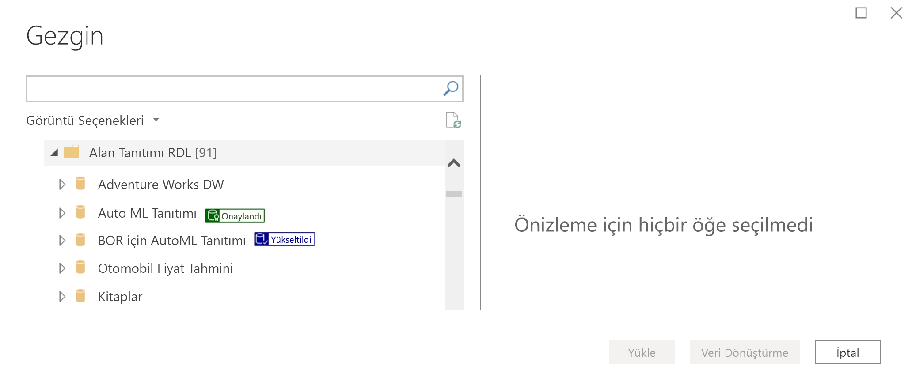
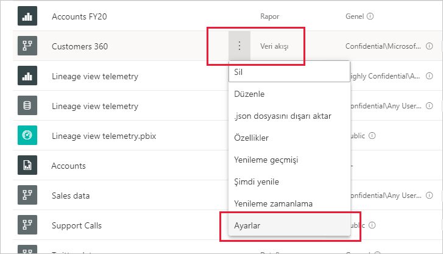
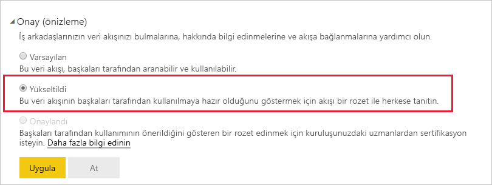
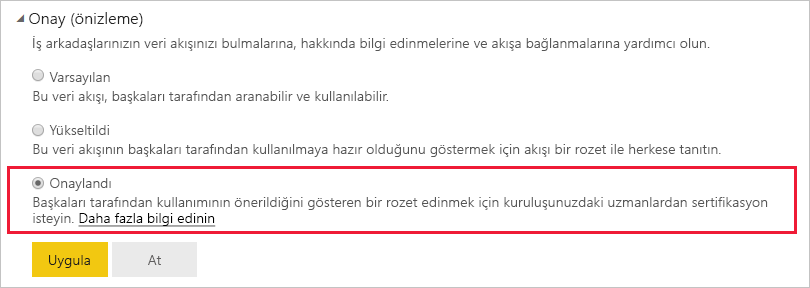

# Veri akışlarını yükseltme veya onaylama (önizleme)

Power BI değerli, yüksek kaliteli veri akışlarınızın görünürlüğünü artırmak için iki yol sağlar: **yükseltme** ve **onaylama**.

* **Yükseltme**: Yükseltme, kullanıcıların değerli olduğunu ve başkalarının da kullanabileceğini düşündüğü veri akışlarını vurgulamasına olanak tanır. Bu yolla kuruluş içinde veri akışlarının işbirliğine dayayı yayılmasını teşvik eder. Tüm veri akışı sahipleri ve veri akışının bulunduğu çalışma alanı üzerinde yazma izinleri olan tüm üyeler, paylaşım için yeterince iyi olduğunu düşündükleri veri akışlarını doğrudan yükseltebilir.

* **Onaylama**: Onaylama veri akışının yetkili bir gözden geçiren tarafından denetlendiği ve gerçekten kuruluş genelinde kullanılmaya hazır, güvenilir ve yetkili bir veri kaynağı olduğu anlamına gelir. Hangi veri akışlarının onaylanacağına, Power BI kiracı yöneticisi tarafından seçilen bir grup gözden geçiren karar verir. Belirli bir veri akışının onaylanması gerektiğini düşünen ama onaylama yetkisi olmayan bir kullanıcı kiracı yöneticisiyle iletişim kurmalıdır.

  Veri akışının onaylanması ancak [Power BI kiracı yöneticisi tarafından etkinleştirilmişse](../admin/service-admin-setup-certification.md) mümkündür.

Veri akışını yükseltme veya onaylama işlemine *onay* adı verilir. Power BI rapor oluşturucularının çoğunlukla aralarından seçim yapabilecekleri birçok farklı veri akışı vardır ve onay işlemi onları güvenilir ve yetkili veri akışlarına yönlendirmeye yardımcı olur.

Onaylanmış veri akışları Power BI’ın birçok yerinde açıkça etiketlenmiştir ve bu da güvenilir veriler arayan rapor oluşturucularının bunları bulmasını kolaylaştırır. Ayrıca yöneticiler ve rapor oluşturucuları kuruluş genelinde bunların nasıl kullanıldığını kolayca izleyebilirler.

Aşağıdaki resimde yükseltilen ve onaylanan veri akışlarının Power Query’de nasıl kolayca belirlenebildiği gösterilir.

Bu makalede şunlar açıklanmaktadır:
* Veri akışını yükseltme (veri akışı sahibi veya veri akışının bulunduğu çalışma alanı üzerinde üye izinleri olan herhangi bir kullanıcı)
* Veri akışını onaylama (kiracı yöneticisi tarafından belirlenen yetkili veri akışı onaylayıcısı)

Veri akışı onaylamasını ayarlama (kiracı yöneticisi) hakkında bilgi için bkz. [Veri kümesi ve veri akışı onaylamasını ayarlama](../admin/service-admin-setup-certification.md)

## Veri akışını yükseltme

Veri akışını yükseltmek için, yükseltmek istediğiniz veri akışının bulunduğu çalışma alanında yazma izinleriniz olmalıdır.

1. Çalışma alanındaki veri akışları listesine gidin.
 
1. Yükseltmek istediğiniz veri akışında **Diğer seçenekler** (...) öğesini seçin ve sonra da **Ayarlar**’ı seçin.

    

1. Onay bölümünü genişletin ve **Yükseltildi** öğesini seçin.

    

1. **Apply** (Uygula) seçeneğini belirleyin.

## Veri akışını onaylama

Bu bölüm kiracı yöneticisi tarafından veri akışlarını onaylama yetkisi verilmiş kullanıcılara yöneliktir. Veri akışlarını onaylamak büyük bir sorumluluktur. Bu bölümde izleyeceğiniz onaylama süreci açıklanır.

1. Onaylamak istediğiniz veri akışının bulunduğu çalışma alanı üzerinde yazma izinleri alın. Bu izinler veri akışı sahibinden veya çalışma alanı üzerinde yönetici izinleri olan herhangi birinden alınabilir. 

1. Veri akışını dikkatle gözden geçirin ve onaylamaya değer olup olmadığını saptayın.

1. Veri akışını onaylamaya karar verirseniz, bunun bulunduğu çalışma alanına gidin.
 
1. Aradığınız veri akışını bulun, **Diğer seçenekler** (...) öğesine tıklayın ve **Ayarlar**’ı seçin.

    

1. Onay bölümünü genişletin ve **Onaylandı** öğesine tıklayın. 

    

2. **Uygula**'ya tıklayın.

## Sonraki adımlar

* [Veri kümesi ve veri akışı onaylamasını ayarlama](../admin/service-admin-setup-certification.md)
* Sorularınız mı var? [Power BI Topluluğu'na sorun](https://community.powerbi.com/)