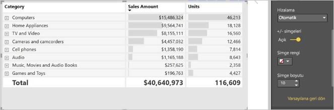
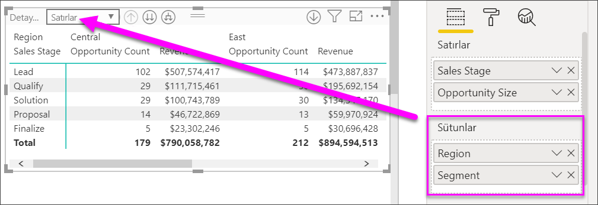
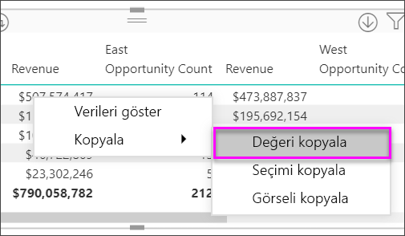
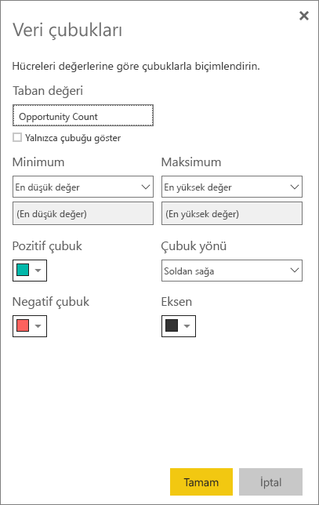

# Power BI’da Matris görselini kullanma
**Matris** görseli **tabloya** benzer.  Tablo iki boyutu destekler ve verileri düzdür; başka bir deyişle yinelenen değerler gösterilir ve toplanmaz. Matris, çok boyutlu verileri daha anlamlı bir şekilde görüntülemeyi kolaylaştırır; basamaklı düzeni destekler. Matris verileri otomatik olarak toplar ve detaya gitmeye olanak tanır. 

**Power BI Desktop** ve **Power BI hizmeti** raporlarınızda matris görselleri oluşturabilir ve matristeki öğeleri bu rapor sayfasındaki diğer görsellerle çapraz vurgulayabilirsiniz. Örneğin satırları, sütunları ve hatta tek tek hücreleri seçip çapraz vurgulama uygulayabilirsiniz. Ayrıca, tek veya birden fazla hücre seçimi kopyalanıp diğer uygulamalara yapıştırılabilir. 

Matrisle ilişkili birçok özellik vardır ve bu özellikler, makalenin ilerleyen bölümlerinde ele alınacaktır.

## Power BI tarafından toplamların nasıl hesaplandığını anlama

**Matris** görselinin nasıl kullanılacağı konusuna geçmeden önce Power BI tarafından tablo ve matrislerdeki toplam ve alt toplam değerlerinin nasıl hesaplandığının öğrenilmesi önemlidir. Toplam ve alt toplam satırları için Power BI ölçümü temel verilerdeki tüm satırlarda hesaplanır; yalnızca görünen veya görüntülenen satırlardaki değerlerin toplanmasından ibaret değildir. Bu, toplam satırında beklediğinizden farklı değerler görebileceğiniz anlamına gelir.

Aşağıdaki matris görsellerini gözden geçirin. 

Bu örnekte, en sağdaki matris görselinin her satırında her satıcı/tarih bileşimi için *Tutar* gösterilmektedir. Ancak, bir satıcının birden çok tarihte göründüğünden, sayılar birden çok kez yer görünebilir. Bu nedenle, temel verilerden elde edilen doğru toplam ile görünen değerlerin basitçe toplanmasından elde edilen değer eşit değildir. Bu, toplanan değer bir bire çok ilişkinin ‘bir’ tarafı olduğunda yaygın olarak kullanılan bir düzendir.

Toplamlara ve alt toplamlara baktığınızda, bu değerlerin temel alınan değerlere dayandığını unutmayın. Yalnızca görünen değerlere dayanmazlar.

<!-- use Nov blog post video

## Expanding and collapsing row headers
There are two ways you can expand row headers. The first is through the right-click menu. You’ll see options to expand the specific row header you clicked on, the entire level or everything down to the very last level of the hierarchy. You have similar options for collapsing row headers as well.

You can also add +/- buttons to the row headers through the formatting pane under the row headers card. By default, the icons will match the formatting of the row header, but you can customize the icons’ color and size separately if you want. 
Once the icons are turned on, they work similarly to the icons from PivotTables in Excel.

The expansion state of the matrix will save with your report. It can be pinned to dashboards as well, but consumers will need to open up the report to change the state. Conditional formatting will only apply to the inner most visible level of the hierarchy. Note that this expand/collapse experience is not currently supported when connecting to AS servers older than 2016 or MD servers.

Watch the following video to learn more about expand/collapse in the matrix:

-->
## Matris görseliyle detaya gitme özelliğini kullanma
Matris görseli ile daha önce kullanılabilir olmayan her türlü ilgi çekici detaya gitme etkinliğini gerçekleştirebilirsiniz. Detaya gitme özelliği satırlar, sütunlar ve hatta tek tek bölümler ve hücreler için kullanılabilir. Şimdi bunlardan her birinin nasıl çalıştığına göz atalım.

### Satır başlıklarında detaya gitme

Görselleştirme bölmesinde, **Alanlar** kutusunun **Satırlar** bölümüne birden çok alan eklediğinizde matris görselinin satırlarında detaya gitme özelliğini etkinleştirmiş olursunuz. Bu, detayına inmenize (ve ardından detaydan çıkmanıza) olanak sağlayacak bir hiyerarşi oluşturup her bir düzeydeki verileri çözümlemeye benzer.

Aşağıdaki görüntüde, **Satırlar** bölümü *Sales stage* ve *Opportunity size* alanlarını içerir ve satırlarda detaylandırabileceğimiz bir gruplandırma (veya hiyerarşi) oluşturur.

Görsel, **Satırlar** bölümünde oluşturulmuş bir gruplama içeriyorsa sol üst köşesinde *detaya git* ve *genişlet* simgelerini görüntüler.

Tıpkı diğer görsellerdeki detaya gitme ve genişletme davranışında olduğu gibi bu düğmeler seçildiğinde de hiyerarşide detaya gidebilir veya detaydan çıkabilirsiniz. Bu örnekte, aşağıdaki görüntüde gösterilen şekilde bir düzey detaya git simgesini (yaba) seçerek *Sales stage*'den *Opportunity size*'a gidebiliriz.

Bu simgeleri kullanmanın yanı sıra ilgili satır başlıklarını seçip açılan menüden seçiminizi yaparak detaya gitmeyi de tercih edebilirsiniz.

Açılan menüde farklı sonuçlar elde etmenizi sağlayan birkaç seçenek bulunmaktadır:

**Detaya Git** seçeneğini belirlediğinizde *ilgili* satır düzeyine yönelik matris genişletilir ve seçilen satır başlığı dışındaki tüm diğer satır başlıkları *dışlanır*. Aşağıdaki resimde **Proposal** > **Detaya Git** seçilmiştir. En üst düzeydeki diğer satırların matriste artık görünmediğine dikkat edin. Bu detaya gitme yöntemi faydalı bir özelliktir ve **çapraz vurgulama** bölümüne gittiğimizde özellikle kullanışlı hale gelir.

**Detaydan çık** simgesini seçerek önceki en üst düzey görünümüne dönün. Ardından **Proposal** > **Sonraki Düzeyi Göster**'i seçtiğinizde, daha üst düzey hiyerarşi kategorileri olmaksızın tüm sonraki düzey öğelerinin (bu örnekteki *Opportunity size* alanı) artan sırada bir listesini görürsünüz.

Matrisin tüm üst düzey kategorileri göstermesi için sol üst köşedeki **Detaydan çık** simgesini seçin, sonra **Proposal** > **Bir sonraki düzeye genişlet**'i seçerek hiyerarşinin her iki düzeyi (*Sales stage* ve *Opportunity size*) için de tüm değerleri görün.

Görüntüde daha fazla denetim sağlamak için **Genişlet** menü öğesini de kullanabilirsiniz.  Örneğin **Proposal** > **Genişlet** > **Seçim**'i seçin. Power BI *Proposal* öğesinin her *Sales stage* alanı ve tüm *Opportunity size* seçenekleri için bir toplam satırı görüntüler.

### Sütun başlıklarında detaya gitme
Satırlarda detaya gitme özelliğine benzer şekilde **sütunlarda** da detaya gidebilirsiniz. Aşağıdaki görüntüde, **Sütunlar** alan kutusunda iki alan vardır ve bunlar yukarıda bahsedilen satırlar için kullandığımıza benzer bir hiyerarşi oluşturur. **Sütunlar** alan kutusunda *Region* ve *Segment* alanları bulunuyor. **Sütunlar**'a ikinci alan eklendiği anda görselde yeni bir açılan menü görüntülenir; şu anda **Satırlar** gösterilmektedir.

Sütunlarda detaya gitmek için, matrisin sol üst köşesinde yer alan **Detaylandır** menüsünden *Sütunlar*'ı seçin. *East* bölgesini seçin ve **Detaya Git**'i seçin.

**Detaya Git**’i seçtiğinizde *Region > East* için sütun hiyerarşisinin sonraki düzeyi (bu örnekte *Opportunity count*) görüntülenir. Başka bir bölge görüntülenir ama soluk gösterilir.

Menünün diğer öğeleri, sütunlarda da satırlarda olduğu gibi işlev görür. (**Satır başlıklarında detaya gitme** adlı önceki bölüme bakın). Satırlarda yaptığınız gibi sütunlarda da **Sonraki Düzeyi Göster** ve **Bir sonraki düzeye genişlet** seçeneklerini kullanabilirsiniz.

> [!NOTE]
> Matris görselinin sol üstündeki detaya git ve detaydan çık simgeleri, yalnızca satırlar için kullanılabilir. Sütunlarda detaya gitmek için sağ tıklama menüsünü kullanmanız gerekir.

## Matris görselleriyle basamaklı düzen

**Matris** görseli, bir hiyerarşide her üst öğenin altındaki alt kategorileri otomatik olarak girintiler ve bu işleme **Basamaklı düzen** adı verilir.

Matris görselinin özgün halinde alt kategoriler tamamen farklı bir sütunda gösterilir ve bu durum, görselde daha fazla alan kullanılmasına neden olur. Aşağıdaki görüntüde, özgün **Matris** görselindeki tablo gösterilmektedir; buradan alt kategorilerin ayrı bir sütunda bulunduğunu görebilirsiniz.

Aşağıdaki görüntü, **Basamaklı düzen** kullanılan bir **Matris** görseli içermektedir. *Computers* kategorisinin alt kategorilerinin (Computers Accessories, Desktops, Laptops, Monitors vb.) hafif girintili olduğunu ve böylece daha net ve yoğun bir görselin ortaya çıktığını görebilirsiniz.

Basamaklı düzen ayarlarını kolayca yapabilirsiniz. **Matris** görseli seçiliyken **Görsel Öğeler** bölmesinin **Biçim** bölümündeki (boya rulosu simgesi) **Satır başlıkları** bölümünü genişletin. İki seçeneğiniz vardır: **Basamaklı düzen** açma/kapatma kaydırıcısı (bu özelliği etkinleştirir veya devre dışı bırakır) ve **Basamaklı düzen girintisi** (piksel cinsinden girinti miktarını belirler).

**Basamaklı düzen**'i devre dışı bırakırsanız Power BI alt kategorileri, üst kategori altında girintilemek yerine başka bir sütunda gösterir.

## Matris görselleri ile alt toplamlar

Hem satırlar hem de sütunlar için matris görsellerindeki alt toplamları etkinleştirebilir veya devre dışı bırakabilirsiniz. Aşağıdaki görüntüde, satır alt toplamlarının **Açık** olarak ayarlandığını görebilirsiniz.

**Görsel Öğeler** bölmesinin **Biçim** bölümündeki **Alt toplamlar** kartını genişletin ve **Satır alt toplamları** kaydırıcısını **Kapalı** olarak ayarlayın. Bunu yaptığınızda alt toplamlar gösterilmez.

Aynı işlem sütun alt toplamları için de geçerlidir.

## Matris görselleri ile çapraz vurgulama

**Matris** görseliyle matristeki herhangi bir öğeyi, çapraz vurgulamada temel alınacak şekilde seçebilirsiniz. **Matriste** bir sütun seçtiğinizde, rapor sayfasındaki diğer görsellerde yapıldığı gibi Power BI bu sütunu da vurgular. Bu çapraz vurgulama türü, diğer görseller ve bir veri noktası seçimleri için ortak bir özellik olduğundan artık **Matris** görseli de aynı işlevi sunar.

Ayrıca, çapraz vurgulama için Ctrl+Tıklama seçeneği de kullanılabilir. Örneğin, aşağıdaki görüntüde **Matris** görselindeki bir alt kategori koleksiyonu seçilmiştir. Görseldeki seçili olmayan öğelerin gri renkte göründüğünü ve sayfadaki diğer görsellerin, **Matris** görselinde yapılan seçimleri yansıttığını görebilirsiniz.

## Power BI’daki değerleri diğer uygulamalarda kullanmak üzere kopyalama

Matrisinizde veya tablonuzdaki içeriği başka uygulamalarda kullanmak isteyebilirsiniz: Dynamics CRM, Excel ve diğer Power BI raporları. Power BI’da sağ tıkladığınızda tek bir hücreyi veya birden fazla hücreyi panonuza kopyalayabilirsiniz. Ardından bunları başka bir uygulamaya yapıştırırsınız.

* Tek bir hücrenin değerini kopyalamak için hücreyi seçin, sağ tıklayın ve **Değeri kopyala**’yı seçin. Panonuza kaydedilen biçimlendirilmemiş hücre değerini başka bir uygulamaya yapıştırabilirsiniz.

    

* Birden fazla hücreyi kopyalamak için bir hücre aralığını veya CTRL tuşunu basılı tutarak birden fazla hücreyi seçin. 

    

* Kopyalanan veriler sütun ve satır üst bilgilerini içerecektir.

    

## Matris görselleriyle gölgelendirme ve yazı tipi renkleri
Matris görseliyle, matris içindeki hücrelerin arka planına **Koşullu biçimlendirme** (renkler, gölgelendirme ve veri çubukları) uygulayabilir, ayrıca metin ve değerlerde de koşullu biçimlendirme gerçekleştirebilirsiniz.

Koşullu biçimlendirme uygulamak için matris görselini seçin ve **Biçim** bölmesini açın. **Koşullu biçimlendirme** kartını genişletin ve **Arka plan rengi**, **Yazı tipi rengi** veya **Veri çubukları** için kaydırıcıyı **Açık** konumuna getirin. Bu seçeneklerden biri etkinleştirildiğinde, koşullu biçimlendirme için renkleri ve değerleri özelleştirmenize olanak sağlayan bir *Gelişmiş denetimler* bağlantısı görüntülenir.
  
  

Ayar yapmanızı sağlayan bir iletişim kutusu görüntülemek için *Gelişmiş denetimler*'i seçin. Bu örnekte **Veri çubukları**'nın iletişim kutusu gösterilir.

## Sonraki adımlar

[Power BI'daki dağılım ve kabarcık grafikleri](power-bi-visualization-scatter.md)

[Power BI'daki görselleştirme türleri](power-bi-visualization-types-for-reports-and-q-and-a.md)