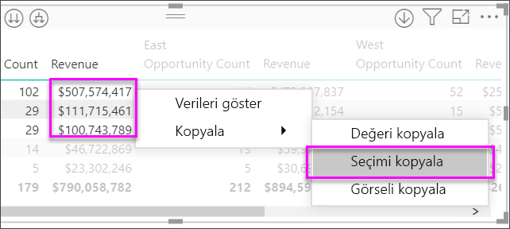

# Power BI’da Matris görselini kullanma
**Matris** görsel özelliğini kullanarak **Power BI Desktop** ve **Power BI hizmeti** raporlarınızda matris görselleri (bazı durumlarda *tablolar* olarak da adlandırılır) oluşturabilir ve matristeki öğeleri diğer görsellerle çapraz vurgulayabilirsiniz. Ayrıca satırları, sütunları ve hatta tek tek hücreleri seçip çapraz vurgulama uygulayabilirsiniz. Tek veya birden fazla hücre seçimi kopyalanarak diğer uygulamalara yapıştırılabilir. Son olarak matris görseli, düzen boşluğundan en iyi şekilde yararlanmak için basamaklı düzeni de desteklemektedir.

Matrisle ilişkili birçok özellik vardır ve bu özellikler, makalenin ilerleyen bölümlerinde ele alınacaktır.

## Rapor temaları
Matris ve tablo görselleri, uygulanan **Rapor Teması**’ndaki stili (renkler dahil) yansıtır. Bunlar, matris görseliniz için görmeyi beklediğiniz renkler değilse **Rapor Teması** yapılandırmanızda değişiklik yapabilirsiniz. Temalar hakkında daha fazla bilgi için bkz. [**Power BI Desktop'ta Rapor Temalarını kullanma**](../desktop-report-themes.md).

## Power BI tarafından toplamların nasıl hesaplandığını anlama

**Matris** görselinin nasıl kullanılacağı konusuna geçmeden önce Power BI tarafından tablo ve matrislerdeki toplam ve alt toplam değerlerinin nasıl hesaplandığının anlaşılması önemlidir. Toplam ve alt toplam satırları için yapılan ölçüm, temel verilerdeki tüm satırlarda değerlendirilir; yalnızca görünen veya görüntülenen satırlardaki değerlerin toplanmasından ibaret *değildir*. Bu, toplam satırında beklediğinizden farklı değerler görebileceğiniz anlamına gelir. 

Aşağıdaki **Matris** görsellerine göz atın. 

Bu örnekte, en sağdaki **Matris** görselinin her satırında her bir satıcı/tarih bileşimi için *tutar* gösterilmektedir. Ancak, bir satıcının birden çok tarihte göründüğünden, sayılar birden çok kez yer görünebilir. Bu nedenle, temel verilerden elde edilen doğru toplam ile görünen değerlerin basitçe toplanmasından elde edilen değer eşit değildir. Bu, toplanan değer bir bire çok ilişkinin ‘bir’ tarafı olduğunda yaygın olarak kullanılan bir düzendir.

Toplam ve alt toplam değerlerine bakarken bunların yalnızca görünen değerleri değil temel verileri temel aldığını unutmayın. 

<!-- use Nov blog post video

## Expanding and collapsing row headers
There are two ways you can expand row headers. The first is through the right-click menu. You’ll see options to expand the specific row header you clicked on, the entire level or everything down to the very last level of the hierarchy. You have similar options for collapsing row headers as well.

You can also add +/- buttons to the row headers through the formatting pane under the row headers card. By default, the icons will match the formatting of the row header, but you can customize the icons’ color and size separately if you want. 
Once the icons are turned on, they work similarly to the icons from PivotTables in Excel.

The expansion state of the matrix will save with your report. It can be pinned to dashboards as well, but consumers will need to open up the report to change the state. Conditional formatting will only apply to the inner most visible level of the hierarchy. Note that this expand/collapse experience is not currently supported when connecting to AS servers older than 2016 or MD servers.

Watch the following video to learn more about expand/collapse in the matrix:

-->
## Matris görseliyle detaya gitme özelliğini kullanma
**Matris** görseli ile daha önce kullanılabilir olmayan her türlü ilgi çekici detaya gitme etkinliğini gerçekleştirebilirsiniz. Detaya gitme özelliği satırlar, sütunlar ve hatta tek tek bölümler ve hücreler için kullanılabilir. Şimdi bunlardan her birinin nasıl çalıştığına göz atalım.

### Satır başlıklarında detaya gitme
**Görsel Öğeler** bölmesinde, **Alanlar** kutusunun **Satırlar** bölümüne birden çok alan eklediğinizde matris görselinin satırlarında detaya gitme özelliğini etkinleştirmiş olursunuz. Bu, detayına inmenize (ve ardından detaydan çıkmanıza) olanak sağlayacak bir hiyerarşi oluşturup her bir düzeydeki verileri çözümlemeye benzer.

Aşağıdaki görüntüde, **Satırlar** bölümü *Category* ve *SubCategory* alanlarını içerir ve satırlarda detaylandırabileceğimiz bir gruplama (veya hiyerarşi) oluşturur.

Görsel, **Satırlar** bölümünde oluşturulmuş bir gruplama içeriyorsa sol üst köşesinde *detaya git* ve *genişlet* simgelerini görüntüler.

Tıpkı diğer görsellerdeki detaya gitme ve genişletme davranışında olduğu gibi bu düğmeler seçildiğinde de hiyerarşide detaya gidebilir veya detaydan çıkabilirsiniz. Bu örnekte, aşağıdaki görüntüde gösterilen şekilde bir düzey detaya git simgesini (yaba) seçerek *Kategori*'den *Alt Kategori*'ye gidebiliriz.

Bu simgeleri kullanmanın yanı sıra ilgili satır başlıklarına sağ tıklayıp açılan menüden seçiminizi yaparak detaya gitmeyi de tercih edebilirsiniz.

Açılan menüde farklı sonuçlar elde etmenizi sağlayan birkaç seçenek bulunmaktadır:

**Detaya Git** seçeneğini belirlediğinizde *ilgili* satır düzeyine yönelik matris genişletilir ve sağ tıklanan satır başlığı dışındaki tüm diğer satır başlıkları *dışlanır*. Aşağıdaki görüntüde, *Computers*'a sağ tıklanmış ve **Detaya Git** seçeneği belirlenmiştir. En üst düzeydeki diğer satırların matriste artık görünmediğine dikkat edin. Bu detaya gitme yöntemi faydalı bir özelliktir ve **çapraz vurgulama** bölümüne gittiğimizde özellikle kullanışlı hale gelir.

**Detaydan çık** simgesine tıklayarak önceki en üst düzey görünümüne dönebilirsiniz. Ardından sağ tıklama menüsünden **Sonraki Düzeyi Göster**'i seçtiğinizde, daha üst düzey hiyerarşi kategorileri olmaksızın tüm sonraki düzey öğelerinin (bu örnekteki *SubCategory* alanı) alfabetik olarak sıralanmış bir listesini görürsünüz.

Matrisin tüm en üst düzey kategorilerini göstermesi için sol üst köşedeki **Detaydan çık** simgesine tıkladıktan sonra bu simgeye tekrar sağ tıklayıp **Bir sonraki düzeye genişlet**'i seçtiğinizde aşağıdaki görseli görürsünüz.

Sağ tıklanan satırı (ve tüm alt kategorileri) matriste gizlemek (veya sırasıyla kaldırmak) için **Ekle** ve **Dışla** menü öğelerini de kullanabilirsiniz.

### Sütun başlıklarında detaya gitme
Satırlarda detaya gitme özelliğine benzer şekilde **Sütunlarda** da detaya gidebilirsiniz. Aşağıdaki görüntüde, **Sütunlar** alan kutusunda iki alan olduğunu ve bunların yukarıda bahsedilen satırlar için kullandığımıza benzer bir hiyerarşi oluşturduğunu görebilirsiniz. **Sütunlar** alan kutusunda *Class* ve *Color* alanları bulunuyor.

**Matris** görselinde bir sütuna sağ tıkladığımızda detaya gitme seçeneğiyle karşılaşırız. Aşağıdaki görüntüde, *Deluxe* sütununa sağ tıklayıp **Detaya Git** seçeneğini belirliyoruz.

**Detaya Git**’i seçtiğinizde *Deluxe* için sütun hiyerarşisinin sonraki düzeyi (bu örnekte *Color*) görüntülenir.

Sağ tıklama menüsünün diğer öğeleri, sütunlarda da satırlarda olduğu gibi işlev görür. (**Satır başlıklarında detaya gitme** adlı önceki bölüme bakın). Satırlarda olduğu gibi sütunlarınızda da **Sonraki Düzeyi Göster**, **Bir sonraki düzeye genişlet**, **Ekle** veya **Dışla** seçeneklerini kullanabilirsiniz.

> [!NOTE]
> Matris görselinin sol üstündeki detaya git ve detaydan çık simgeleri, yalnızca satırlar için kullanılabilir. Sütunlarda detaya gitmek için sağ tıklama menüsünü kullanmanız gerekir.
> 
> 

## Matris görselleriyle basamaklı düzen
**Matris** görseli, bir hiyerarşide her bir üst öğenin altındaki alt kategorileri otomatik olarak girintiler ve bu işleme **Basamaklı düzen** adı verilir.

Matris görselinin *özgün* halinde alt kategoriler tamamen farklı bir sütunda gösterilir ve bu durum, görselde daha fazla alan kullanılmasına neden olur. Aşağıdaki görüntüde, özgün **Matris** görselindeki tablo gösterilmektedir; buradan alt kategorilerin ayrı bir sütunda bulunduğunu görebilirsiniz.

Aşağıdaki görüntü, **Basamaklı düzen** kullanılan bir **Matris** görseli içermektedir. *Computers* kategorisinin alt kategorilerinin (Computers Accessories, Desktops, Laptops, Monitors vb.) hafif girintili olduğunu ve böylece daha net ve yoğun bir görselin ortaya çıktığını görebilirsiniz.

Basamaklı düzen ayarlarını kolayca yapabilirsiniz. **Matris** görseli seçiliyken **Görsel Öğeler** bölmesinin **Biçim** bölümündeki (boya rulosu simgesi) **Satır başlıkları** bölümünü genişletin. İki seçeneğiniz vardır: **Basamaklı düzen** açma/kapatma kaydırıcısı (bu özelliği etkinleştirir veya devre dışı bırakır) ve **Basamaklı düzen girintisi** (piksel cinsinden girinti miktarını belirler).

**Basamaklı düzen**'i devre dışı bırakırsanız alt kategoriler, üst kategori altında girintilenmez ve bunun yerine başka bir sütunda gösterilir.

## Matris görselleri ile alt toplamlar
Hem satırlar hem de sütunlar için matris görsellerindeki alt toplamları etkinleştirebilir veya devre dışı bırakabilirsiniz. Aşağıdaki görüntüde, satır alt toplamlarının **açık** olarak belirlendiğini görebilirsiniz.

**Görsel Öğeler** bölmesinin **Biçim** bölümündeki **Alt toplamlar** kartını genişletin ve **Satır alt toplamları** kaydırıcısını **Kapalı** olarak ayarlayın. Bunu yaptığınızda alt toplamlar gösterilmez.

Aynı işlem sütun alt toplamları için de geçerlidir.

## Matris görselleri ile çapraz vurgulama
**Matris** görseliyle matristeki herhangi bir öğeyi, çapraz vurgulamada temel alınacak şekilde seçebilirsiniz. **Matriste** bir sütun seçtiğinizde, rapor sayfasındaki diğer görsellerde olduğu gibi bu sütun da vurgulanır. Bu çapraz vurgulama türü, diğer görseller ve bir veri noktası seçimleri için ortak bir özellik olduğundan artık **Matris** görseli de aynı işlevi sunar.

Ayrıca, çapraz vurgulama için Ctrl+Tıklama seçeneği de kullanılabilir. Örneğin, aşağıdaki görüntüde **Matris** görselindeki bir alt kategori koleksiyonu seçilmiştir. Görseldeki seçili olmayan öğelerin gri renkte göründüğünü ve sayfadaki diğer görsellerin, **Matris** görselinde yapılan seçimleri yansıttığını görebilirsiniz.

## Power BI’daki değerleri diğer uygulamalarda kullanmak üzere kopyalama

Matrisinizde veya tablonuzda Dynamics CRM ve Excel gibi farklı uygulamalarda ve hatta diğer Power BI raporlarında kullanmak istediğiniz içerik bulunabilir. Power BI’da sağ tıkladığınızda tek bir hücreyi veya birden fazla hücreyi panonuza kopyalayabilir, daha sonra diğer uygulamaya yapıştırabilirsiniz.

* Tek bir hücrenin değerini kopyalamak için hücreyi seçin, sağ tıklayın ve **Değeri kopyala**’yı seçin. Panonuza kaydedilen biçimlendirilmemiş hücre değerini başka bir uygulamaya yapıştırabilirsiniz.

    

* Birden fazla hücreyi kopyalamak için bir hücre aralığını veya CTRL tuşunu basılı tutarak birden fazla hücreyi seçin. Kopyalanan veriler sütun ve satır üst bilgilerini içerecektir.

    

## Matris görselleriyle gölgelendirme ve yazı tipi renkleri
**Matris** görseliyle, matris içindeki hücrelerin arka planına **Koşullu biçimlendirme** (renkler ve gölgelendirme) uygulayabilir, ayrıca metin ve değerlerde de koşullu biçimlendirme gerçekleştirebilirsiniz.

Koşullu biçimlendirme uygulamak için bir matris görseli seçin aşağıdakilerden birini yapın:

* **Alanlar** bölmesinde, Alan'a sağ tıklayın ve menüden **Koşullu biçimlendirme**'yi seçin.
  
  
* Buna alternatif olarak, **Biçim** bölmesindeki **Koşullu biçimlendirme** kartını genişletin ve **Arka plan renk ölçekleri** veya **Yazı tipi renk ölçekleri** için kaydırıcıyı **Açık** durumuna getirin. Bu seçeneklerden biri etkinleştirildiğinde, koşullu biçimlendirme için renkleri ve değerleri özelleştirmenize olanak sağlayan bir *Gelişmiş denetimler* bağlantısı görüntülenir.
  
  

Her iki yöntemle de aynı sonuç elde edilir. *Gelişmiş denetimler* seçildiğinde, ayar yapmanıza olanak sağlayan şu iletişim kutusu görüntülenir:

## Sonraki adımlar

[Power BI'daki dağılım ve kabarcık grafikleri](power-bi-visualization-scatter.md)

[Power BI'daki görselleştirme türleri](power-bi-visualization-types-for-reports-and-q-and-a.md)