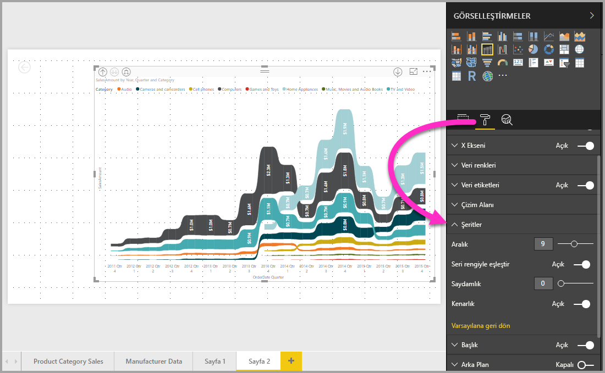

# Power BI'daki şerit grafikleri kullanma
**Power BI**'da verileri görselleştirmek ve en yüksek dereceli (en yüksek değer) veri kategorisini hızla belirlemek için şerit grafikleri kullanabilirsiniz. Şerit grafikler, sıralama değişimini gösterme konusunda etkili bir araçtır; en yüksek sıra (değer) her bir zaman aralığı için her zaman en üstte görüntülenir. **Power BI Desktop**'ta şerit grafikler, Eylül 2017 sürümünden başlayarak ve **Power BI hizmetinde** gerçekleştirilen sonraki güncelleştirmelerle kullanıma sunulmuştur.

## Bir şerit grafik oluşturma
Bir şerit grafik oluşturmak için **Görsel Öğeler** bölmesinden **şerit grafik** seçeneğini belirleyin.

Şerit grafikler, şeritler kullanarak görselleştirilen zaman sürekliliği üzerinden bir veri kategorisine bağlanır ve belirli bir kategorinin, grafiğin x ekseni (genellikle zaman çizelgesi) aralığındaki sıralamasını görmenize olanak sağlar.

## Bir şerit grafiği biçimlendirme
Bir şerit grafik oluşturduğunuzda **Görsel Öğeler** bölmesinin **Biçim** bölümünde bazı biçimlendirme seçenekleri kullanıma sunulur. Şerit grafiklere yönelik biçimlendirme seçenekleri, yığılmış sütun grafiklere yönelik biçimlendirme seçeneklerine benzese de şeritlere özel ek biçimlendirme seçenekleri içerir.

Şerit grafiklere yönelik biçimlendirme seçeneklerini kullanarak aşağıdaki ayarları gerçekleştirebilirsiniz:

* **Aralık**, şeritler arasında ne kadar boşluk olacağını ayarlamanıza olanak sağlar. Sütunun maksimum yüksekliğinin yüzde cinsinden değeridir.
* **Seri rengini eşleştir**, şeritlerin rengiyle seri rengini eşleştirmenizi sağlar. Kapalı olduğunda şeritler gri görünür.
* **Saydamlık**, şeritlerin saydamlığını belirler ve varsayılan olarak 30 değerine ayarlanmıştır.
* **Kenarlık**, şeritlerin üst ve alt kısımlarına koyu renkli bir kenarlık yerleştirmenize olanak sağlar. Varsayılan olarak kenarlıklar kapalıdır.

## Sonraki adımlar
**Power BI Desktop** ve Power BI Desktop'la çalışmaya başlama hakkında daha fazla bilgi için aşağıdaki makalelere başvurun.

* [Power BI Desktop nedir?](../desktop-what-is-desktop.md)
* [Power BI Desktop ile Sorgulara Genel Bakış](../desktop-query-overview.md)
* [Power BI Desktop'ta Veri Kaynakları](../desktop-data-sources.md)
* [Power BI Desktop'taki Verilere Bağlanma](../desktop-connect-to-data.md)
* [Power BI Desktop'ta Verileri Şekillendirme ve Birleştirme](../desktop-shape-and-combine-data.md)
* [Power BI Desktop'taki Genel Sorgu Görevleri](../desktop-common-query-tasks.md)   

