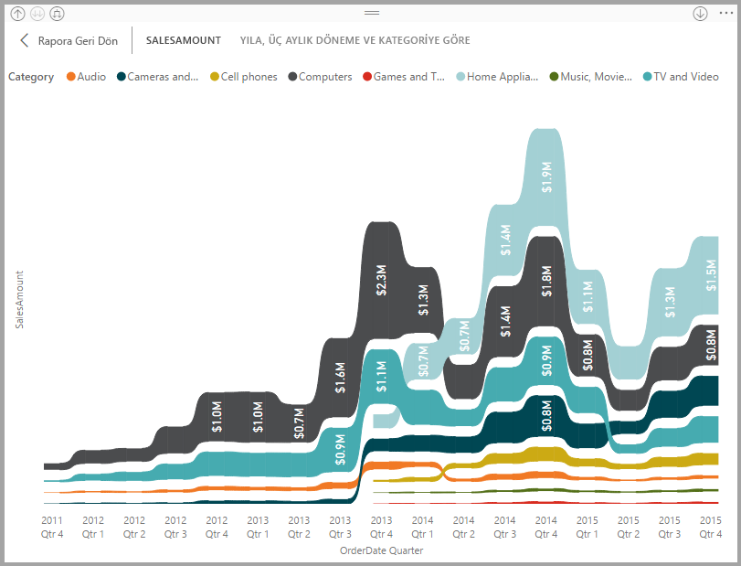
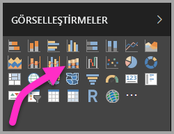
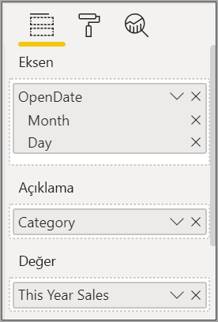
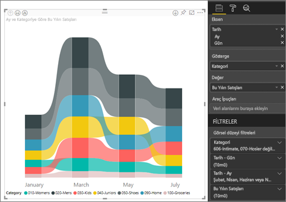
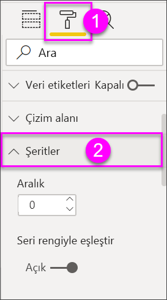
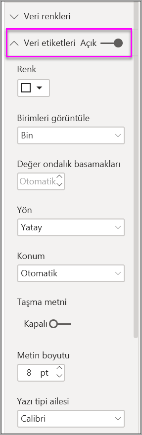
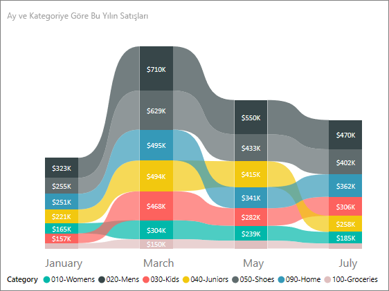

# Power BI'daki şerit grafikleri kullanma
Verileri görselleştirmek ve hangi veri kategorisinin en yüksek dereceye (en yüksek değer) sahip olduğunu hızla keşfetmek için şerit grafikleri kullanabilirsiniz. Şerit grafikler, sıralama değişimini gösterme konusunda etkili bir araçtır; en yüksek sıra (değer) her bir zaman aralığı için her zaman en üstte görüntülenir. 

## Bir şerit grafik oluşturma
Örneği takip etmek için [Perakende analizi örnek raporunu](../sample-retail-analysis.md) açın. 

1. Bir şerit grafik oluşturmak için **Görsel Öğeler** bölmesinden **şerit grafik** seçeneğini belirleyin.

    

    Şerit grafikler, şeritler kullanarak görselleştirilen zaman sürekliliği üzerinden bir veri kategorisine bağlanır ve belirli bir kategorinin, grafiğin x ekseni (genellikle zaman çizelgesi) aralığındaki sıralamasını görmenize olanak sağlar.

2. **Eksen**, **Gösterge** ve **Değer** için alanları seçin.  Biz bu örnekte şunları seçtik: **Date**, **Category** ve **This year sales**.  

    

    Veri kümesi tek bir yılın verilerini içerdiğinden, **Eksen**'den **Year** alanını da kaldırdık. 

3. Şerit grafiğinde tüm diğer ayların derecelendirmesi gösterilir. Zaman içinde derecelendirmenin nasıl değiştiğine dikkat edin.  Örneğin, Home kategorisi üçüncülükten dördüncülüğe geçmiş ve sonra yeniden üçüncülüğe dönmüştür. Juniors kategorisi Temmuz ayında üçüncülükten beşinciliğe geçmiştir. 

    

## Bir şerit grafiği biçimlendirme
Bir şerit grafik oluşturduğunuzda **Görsel Öğeler** bölmesinin **Biçim** bölümünde bazı biçimlendirme seçenekleri kullanıma sunulur. Şerit grafiklere yönelik biçimlendirme seçenekleri, yığılmış sütun grafiklere yönelik biçimlendirme seçeneklerine benzese de şeritlere özel ek biçimlendirme seçenekleri içerir.

Şerit grafikleri için bu biçimlendirme seçenekleri ayarlar yapmanızı sağlar.

* **Aralık**, şeritler arasında ne kadar boşluk olacağını ayarlamanıza olanak sağlar. Sütunun maksimum yüksekliğinin yüzde cinsinden değeridir.
* **Seri rengini eşleştir**, şeritlerin rengiyle seri rengini eşleştirmenizi sağlar. **Kapalı** olarak ayarlandığında, şeritler gridir.
* **Saydamlık**, şeritlerin saydamlığını belirler ve varsayılan olarak 30 değerine ayarlanmıştır.
* **Kenarlık**, şeritlerin üst ve alt kısımlarına koyu renkli bir kenarlık yerleştirmenize olanak sağlar. Varsayılan olarak kenarlıklar kapalıdır.

Şerit grafiğinin y ekseninde etiket olmadığından, veri etiketleri eklemek isteyebilirsiniz. Biçimlendirme bölmesinde **Veri etiketleri**'ni seçin. 

Veri etiketleriniz için biçimlendirme seçeneklerini ayarlayın.  Bu örnekte, metin rengini beyaz, ondalık konumları sıfır ve görüntü birimlerini binler olarak ayarladık. 

## Sonraki adımlar

[Power BI'daki dağılım grafikleri ve kabarcık grafikleri](power-bi-visualization-scatter.md)

[Power BI'daki görselleştirme türleri](power-bi-visualization-types-for-reports-and-q-and-a.md)