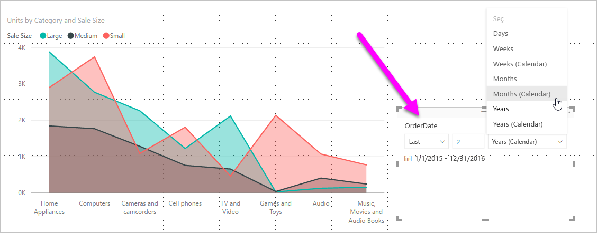

# Power BI’da göreli tarih dilimleyicisi ve filtre kullanma

[!INCLUDE [applies-to](../includes/applies-to.md)] [!INCLUDE [yes-desktop](../includes/yes-desktop.md)] [!INCLUDE [yes-service](../includes/yes-service.md)]

**Göreli tarih dilimleyici** veya **göreli tarih filtresi** ile veri modelinizdeki tarih sütunlarına zamana bağlı filtre uygulayabilirsiniz. Örneğin, **göreli tarih dilimleyiciyi** kullanarak yalnızca son 30 gün içinde (veya ay, takvim ayları ve benzeri) gerçekleşen satışlara ait verileri gösterebilirsiniz. Verileri yenilediğinizde de göreli zaman dönemi otomatik olarak ilgili göreli tarih kısıtlamasını uygular.

## Göreli tarih aralığı dilimleyicisini kullanma

Göreli tarih dilimleyiciyi diğer dilimleyiciler gibi kullanabilirsiniz. Raporunuz için bir **dilimleyici** görseli oluşturup **Alan** değeri olarak bir tarih değeri seçin. Aşağıdaki görüntüde *OrderDate* alanını seçtik.

Tuvalinizin üzerinde dilimleyiciyi ve sonra dilimleyici görselinin sağ üst köşesinde bulunan karatı seçin. Görselin tarih verileri varsa menüde **Göreli** seçeneği gösterilir.

Göreli tarih dilimleyici için *Göreli*'yi seçin.

Ardından ayarları seçebilirsiniz.

*Göreli tarih dilimleyicisindeki* ilk ayar için aşağıdaki seçimleri yapabilirsiniz:

* Last

* Sonraki

* Bu

*Göreli tarih dilimleyicisinde* ikinci (ortadaki) ayar, göreli tarih aralığını tanımlamak üzere bir sayı girmenizi sağlar.

Üçüncü ayar, tarih ölçümünü seçmenize olanak tanır. Aşağıdaki seçimleri yapabilirsiniz:

* Gün

* Hafta

* Hafta (Takvim)

* Ay

* Ay (Takvim)

* Yıl

* Yıl (Takvim)

Listeden **Ay**'ı seçip ortadaki ayara *2* değerini girerseniz şu olur:

* bugün 20 Temmuz ise

* dilimleyici tarafından kısıtlanan görsellere eklenen veriler, önceki iki ayın verilerini gösterir

* 21 Mayıs’ta başlayıp 20 Temmuz’a (bugünün tarihi) kadar devam eden

Buna karşılık *Ay (Takvim)* seçeneğini belirlerseniz kısıtlanan görseller 1 Mayıs-30 Haziran arasındaki (son iki tam takvim ayı) verileri gösterir.

## Göreli tarih aralığı filtresini kullanma

Raporunuzun bir sayfası veya tamamı için göreli tarih aralığı filtresi de oluşturabilirsiniz. Bunun için **Alan** bölmesindeki **Sayfa düzeyi filtreleri** veya **Rapor düzeyi filtreleri** bölmesine bir tarih alanı sürükleyin:

Bu noktadan sonra göreli tarih aralığını değiştirebilirsiniz. Bu işlem, **göreli tarih dilimleyiciyi** özelleştirme işlemiyle benzerdir. **Filtre Türü** açılan menüsünden **Göreli tarih filtresi**'ni seçin.

**Göreli tarih filtresi**'ni seçtikten sonra dilimleyicide olduğu gibi değiştirebileceğiniz ve ortada bir sayısal kutusu bulunan üç bölüm görünür.

## Sınırlamalar ve önemli noktalar

**Göreli tarih aralığı dilimleyici** ve filtresi için geçerli sınırlamalar ve önemli noktalar aşağıda belirtilmiştir.

* **Power BI**'daki veri modellerinde saat dilimi bilgisi yoktur. Modeller saat bilgisi depolayabilir ancak bulundukları saat dilimiyle ilgili bir belirtim mevcut değildir.

* Dilimleyici ve filtre her zaman UTC cinsinden saati temel alır. Bir raporda filtre oluşturup farklı bir saat dilimindeki iş arkadaşınıza gönderirseniz, her ikiniz de aynı verileri görürsünüz. UTC saat diliminde değilseniz, hem sizin hem de iş arkadaşınızın aradaki saat farkını dikkate alması gerekir.

* **Sorgu Düzenleyicisi**'ni kullanarak bir yerel saat diliminde yakalanan verileri UTC'ye dönüştürebilirsiniz.

## Sonraki adımlar

[Power BI Desktop’ta gruplandırma ve gruplama özelliklerini kullanma](../desktop-grouping-and-binning.md) hakkında bilgi edinin.
