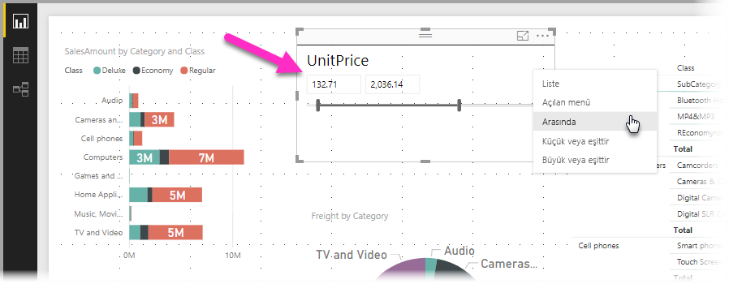
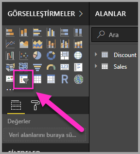
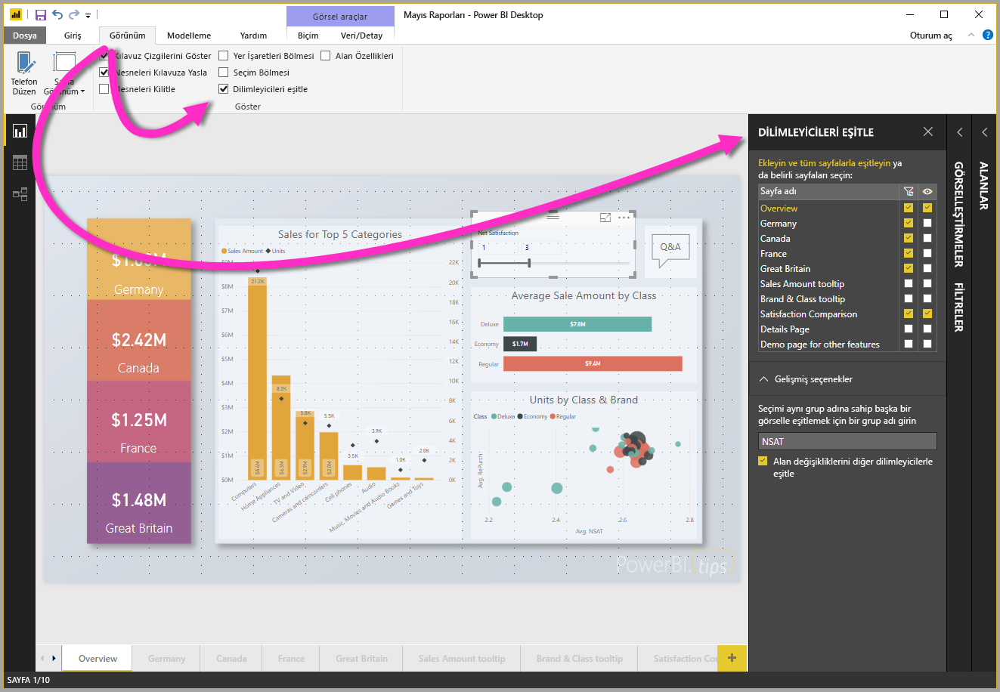
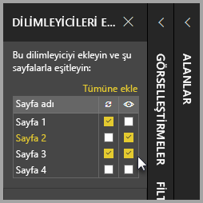
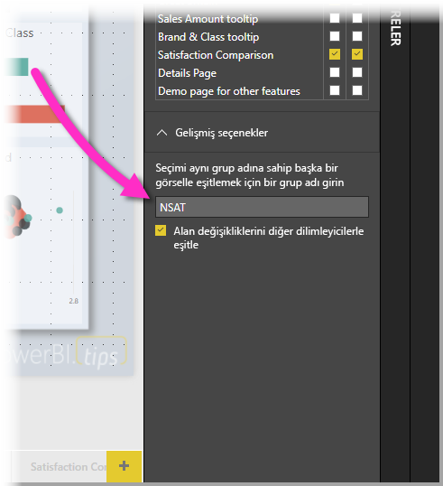

# Power BI Desktop'ta dilimleyicileri kullanma

**Power BI Desktop**’ta bir **dilimleyiciyi** kullanarak rapor sayfanızdaki görsellerin sonuçlarını filtreleyebilirsiniz. Ayrıca, dilimleyicilerin kendisiyle etkileşim kurarak uygulanan filtreyi kolayca ayarlayabilirsiniz. Üstelik, dilimleyicinizin nasıl görüneceği ve bununla nasıl etkileşim kuracağınıza ilişkin seçenekleri belirtebilirsiniz. Aşağıdaki resimde, *tür* açılan menüsü görünen bir dilimleyici gösterilmiştir. 

Çeşitli türlerden birine sahip bir dilimleyici gösterilebilir:

* Liste
* Açılan menü
* Arasında
* Küçük veya eşittir
* Büyük veya eşittir

**Görselleştirmeler** bölmesindeki **dilimleyici** görseline tıklayarak bir rapora dilimleyici ekleyebilirsiniz.

Dilimleyiciler **Power BI Desktop**’ta ve **Power BI hizmetinde** benzer şekilde çalışır. Dilimleyicileri kullanma hakkında bir makale için bkz. [Power BI hizmetindeki dilimleyiciler](power-bi-visualization-slicers.md).

## Rapor sayfaları arasında dilimleyicileri eşitleme

**Power BI Desktop**’ta, dilimleyicileri birden çok rapor sayfasında eşitleyebilirsiniz. Dilimleyicileri eşitlemek için şeritteki **Görünüm** bölmesinde **Dilimleyicileri eşitle**’yi seçin. Dilimleyicileri eşitlediğiniz sırada, aşağıdaki resimde gösterildiği gibi **Dilimleyicileri Eşitleme** bölmesi görünür.

**Dilimleyicileri Eşitleme** bölmesinde, dilimleyicinin rapor sayfalarında nasıl eşitlenmesi gerektiğini belirtin. Tüm dilimleyicilerin her bir rapor sayfasına **uygulanıp uygulanmayacağını** veya dilimleyicinin her bir rapor sayfasında **görünür** olup olmayacağını belirtebilirsiniz.

Örneğin, aşağıdaki resimde gösterildiği gibi raporunuzda **Sayfa 2**’ye bir dilimleyici ekleyebilirsiniz. Daha sonra bu dilimleyicinin seçili sayfaların her birine *uygulanıp uygulanmayacağını* veya rapordaki her bir seçili sayfada *görünür* olup olmayacağını belirleyebilirsiniz. Her dilimleyici için bunların herhangi bir birleşimini uygulayabilirsiniz. 

Bölmedeki **Tümüne ekle** bağlantısının kullanılması durumunda seçili dilimleyici rapordaki tüm sayfalara uygulanır.

**Dilimleyicileri Eşitleme** bölmesinde gösterilen seçimlerin yalnızca *seçili dilimleyici* için geçerli olduğunu unutmayın. Çeşitli sayfalara birden çok dilimleyici uygulayabilir ve bölmeyi kullanarak her bir dilimleyicinin raporunuzdaki çeşitli sayfalara tek tek nasıl uygulanacağını tanımlayabilirsiniz. 

Dilimleyici seçiminiz eşitlenebilir, ancak stil, düzenleme ve silme gibi diğer seçimler *eşitlenmez*. 

## Dilimleyiciler için gelişmiş seçenekler

**Dilimleyicileri eşitle** bölmesinin **Gelişmiş seçenekler** bölümünde bir dilimleyici koleksiyonuna **grup adı** da uygulayabilir ve aynı grubu paylaşan dilimleyicilerin sayfalar arasında eşitlenmesini sağlayabilirsiniz. 

Bu özellik, eşitlenmiş şekilde tutmak için özel bir grup oluşturmanızı sağlar. Varsayılan bir ad sağlanır, ancak tercih ettiğiniz bir ad kullanabilirsiniz. 

Grup adı, dilimleyicilerle ilgili ek esneklik sağlar. Aynı alanı kullanan dilimleyicileri eşitlemek için ayrı gruplar oluşturabilir veya farklı alanları kullanan dilimleyicileri aynı gruba koyabilirsiniz. 

## Filtrelemenin dilimleyici seçimi üzerindeki etkisi

Dilimleyicide bir seçim yapıp ardından normalde seçilen öğeyi kaldıracak bir filtre uygularsanız ilgili öğe dilimleyicideki öğe listesinin en altında kalır. Filtre kaldırıldığında seçim dilimleyicide kalır. Dilimleyicide seçimini kaldırdığınızda öğenin listeden silindiğini görürsünüz.

## Sonraki adımlar

Aşağıdaki makaleler de ilginizi çekebilir:

* [Power BI hizmetindeki dilimleyiciler](power-bi-visualization-slicers.md)
* [Power BI Desktop uygulamasındaki sayısal aralık dilimleyiciyi kullanma](../desktop-slicer-numeric-range.md)
* [Power BI Desktop'ta göreli tarih dilimleyici ve filtre kullanma](desktop-slicer-filter-date-range.md)

