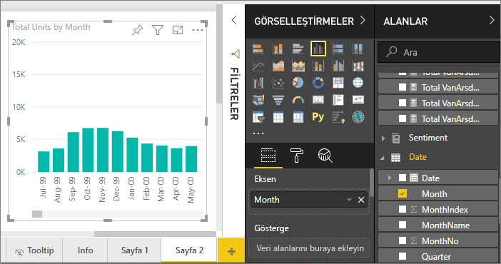
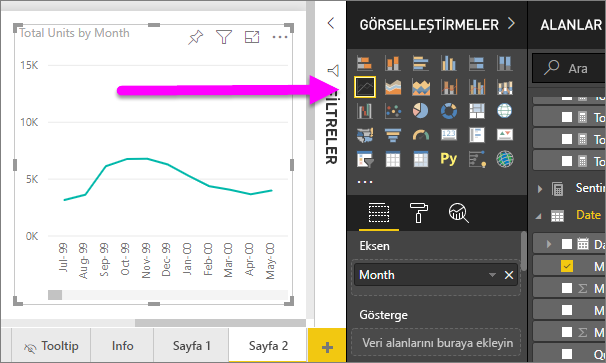
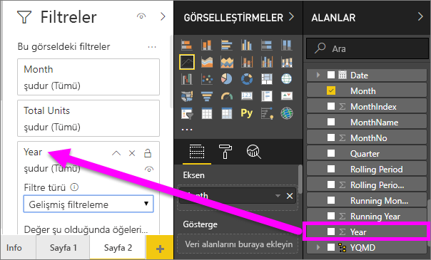
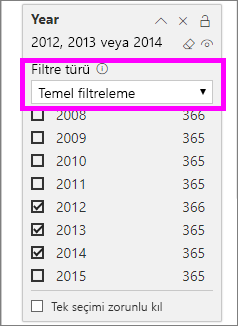
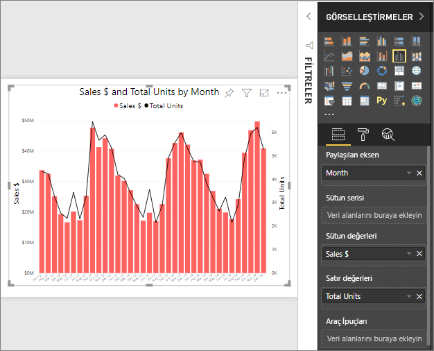
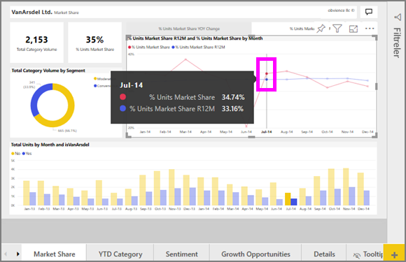

# Power BI'da çizgi grafikler

[!INCLUDE[consumer-appliesto-nyyn](../includes/consumer-appliesto-nyyn.md)]

Çizgi grafik noktalarla gösterilen ve düz çizgilerle bağlanan bir dizi veri noktasıdır. Çizgi grafiğin bir veya birden çok çizgisi olabilir. Çizgi grafiklerin X ve Y eksenleri vardır. 

## Çizgi grafik oluşturma
Bu yönergelerde bu yılın satışlarını kategorilere ayrılmış şekilde gösteren bir çizgi grafik oluşturmak üzere Satış ve Pazarlama Örneği kullanılmaktadır. Konuyu takip etmek için appsource.com'dan örnek uygulamayı alın.

> [!NOTE]
> Raporunuzu bir Power BI iş arkadaşınızla paylaşmak için her ikinizin de bireysel Power BI Pro lisanslarınızın olması veya raporun Premium kapasitede depolanması gerekir.

1. Boş bir rapor sayfasında başlayın. Power BI hizmetini kullanıyorsanız raporu [Düzenleme Görünümü](../create-reports/service-interact-with-a-report-in-editing-view.md)'nde açtığınızdan emin olmanız gerekir.

2. Alanlar bölmesinden **SalesFact** \> **Total units** 'i, sonra da **Date** > **Month** alanını seçin.  Power BI rapor tuvalinizde bir sütun grafik oluşturur.

    

4. Görselleştirmeler bölmesinde bir çizgi grafik şablonu seçerek çizgi grafiğe dönüştürün. 

    
   

4. Çizgi grafiğinizi 2012-2014 yıllarının verilerini gösterecek şekilde filtreleyin. Filtreler bölmeniz daraltılmışsa, şimdi genişletin. Alanlar bölmesinden **Date** \> **Year** alanını seçin ve Filtreler bölmesine sürükleyin. **Bu görseldeki filtreler** başlığı altına bırakın. 
     
    

    **Gelişmiş filtreler** 'den **Temel filtreler** 'e geçin, ardından **2012** , **2013** ve **2014** 'ü seçin.

    

6. İsteğe bağlı olarak [grafik metninin boyutunu ve rengini ayarlayabilirsiniz](power-bi-visualization-customize-title-background-and-legend.md). 

    

## Grafiğe başka çizgiler ekleme
Çizgi grafiklerin birçok farklı çizgisi olabilir. Bazı durumlarda da çizgilerdeki değerler o kadar aykırı oluyor ki, birlikte düzgün görüntülenmiyorlar. Şimdi geçerli grafiğimize başka çizgiler ekleme konusuna değinelim ve çizgilerle temsil edilen değerler çok farklı olduğunda grafiğimizi nasıl biçimlendireceğimizi öğrenelim. 

### Başka çizgiler ekleme
Grafikte tüm bölgelerin toplam birimlerini tek çizgiyle göstermek yerine, toplam birimleri bölgeye göre ayıralım. **Geo** > **Region** alanını Gösterge kutusuna sürükleyerek başka çizgiler ekleyin.

   

### İki Y ekseni kullanma
Peki hem toplam satıları hem de toplam birimleri aynı grafikte görmek isterseniz ne yapacaksınız? Satış rakamları birim sayılarından çok daha büyük olduğundan kullanılabilir bir çizgi grafik elde edemezsiniz. Aslında toplam birimlerin kırmızı çizgisi sıfır gibi görünür.

   

Çok aykırı değerleri tek grafikte görüntülemek için birleşik harita kullanın. [Power BI'da birleşik haritalar](power-bi-visualization-combo-chart.md) makalesini okursanız birleşik haritalarla ilgili her şeyi öğrenebilirsiniz. Aşağıdaki örneğimizde, ikinci bir Y ekseni ekleyerek hem satışları hem de toplam birimleri aynı grafikte birlikte görüntüleyebiliriz. 

   

## Vurgulama ve çapraz filtreleme
Filtreler bölmesini kullanma hakkında bilgi için bkz. [Bir rapora filtre ekleme](../create-reports/power-bi-report-add-filter.md).

Çizgi grafikte bir veri noktası vurgulandığında, rapor sayfasındaki diğer görselleştirmeler için çapraz vurgu ve çapraz filtre uygulanır ve tam tersi de geçerlidir. Konuyu takip etmek için **Market Share** sekmesini açın.  

Çizgi grafikteki tek bir veri noktası, X eksenindeki ve Y eksenindeki birer noktanın kesişimidir. Veri noktasını seçtiğinizde, Power BI rapor sayfasındaki diğer görsellerin çapraz vurgulanmasına ve çapraz filtrelenmesine kaynaklık eden noktayı (tek çizgi için) veya noktaları (iki veya daha çok çizgi olduğunda) göstermek için işaretçiler ekler. Görseliniz fazla yoğunsa Power BI görsel üzerinde tıkladığınız konuma en yakın noktayı seçer.

Bu örnekte şunlara işaret eden veri noktasını seçtik: July 2014, %Units Market Share R12 33.16 ve %Units Market Share 34.74.

Sütun grafiğin nasıl çapraz vurgulandığını ve ölçerin çapraz filtrelendiğini gözlemleyin.

Grafiklerin birbirini çapraz vurgulamasını ve çapraz filtrelemesini yönetmek için bkz. [Power BI raporlarındaki görselleştirme etkileşimleri](../create-reports/service-reports-visual-interactions.md)

## Önemli noktalar ve sorun giderme
* Bir çizgi grafikte çift Y ekseni olamaz.  Bunun yerine birleşik harita kullanmanız gerekir.
* Yukarıdaki örneklerde grafikler yazı tipi boyutu büyütülecek, yazı tipi rengi değiştirilecek, eksen başlıkları eklenecek, grafik başlığı ve gösterge ortalanacak, her iki eksen de sıfırdan başlayacak şekilde biçimlendirilmiştir. Biçim bölmesinde (boyu rulosu simgesi) grafiklerinizin tam istediğiniz gibi görünmesini sağlamanız için neredeyse sınırsız seçenek vardır. Öğrenmenin en iyi yolu Biçim bölmesini açıp keşfetmektir.

## Sonraki adımlar

[Power BI'daki görselleştirme türleri](power-bi-visualization-types-for-reports-and-q-and-a.md)

