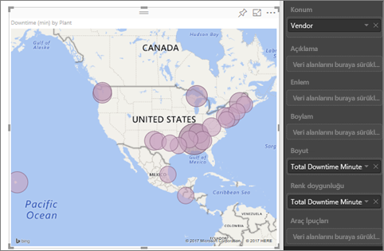
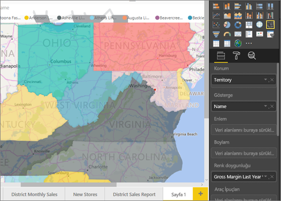
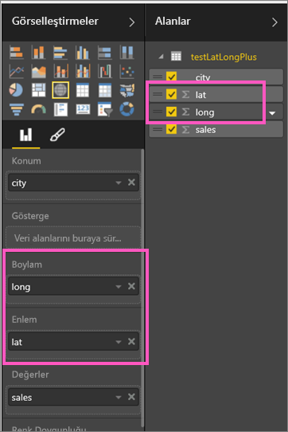
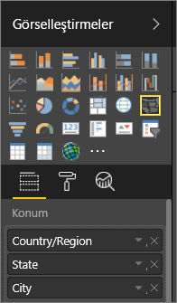

# Power BI harita görselleştirmelerine ilişkin ipuçları ve püf noktaları

[!INCLUDE[consumer-appliesto-nyyn](../includes/consumer-appliesto-nyyn.md)]    

Power BI, haritalar oluşturabilmenizi sağlamak üzere varsayılan harita koordinatları sunmak (coğrafi kodlama adı verilen bir işlem) için Bing Haritalar ile tümleştirilir. Birlikte çalışarak, doğru konumu belirlemek için algoritmalar kullanırlar ancak bazen yalnızca en iyi tahmin sunulabilir. Power BI harita görselleştirmeleri oluşturmayı dener ancak tek başına başarılı olmazsa, Bing Haritalar'dan yararlanır. 

Sizin veya yöneticinizin, güvenlik duvarınızı Bing'in coğrafi kodlama için kullandığı URL'lere erişim izni verilecek şekilde güncelleştirmesi gerekebilir.  Bu URL'ler şunlardır:
* https://dev.virtualearth.net/REST/V1/Locations
* https://platform.bing.com/geo/spatial/v1/public/Geodata
* https://www.bing.com/api/maps/mapcontrol

Doğru coğrafi kodlamayı edinme olasılığını artırmak için aşağıdaki ipuçlarını kullanın. İlk ipucu kümesi, veri kümesine erişiminizin bulunması halinde uygulamanız içindir. İkinci ipucu dizisinde, veri kümesine erişiminizin bulunmaması halinde Power BI'da yapabilecekleriniz ele alınmıştır. 

## Bing Haritalar'a hangi veriler gönderilir?
Power BI hizmeti ve Power BI Desktop, Bing'e harita görselleştirmesini oluşturması için ihtiyaç duyduğu coğrafi verileri gönderir. Buna görselin alan yuvasının **Konum**, **Enlem** ve **Boylam** demetlerinde yer alan veriler dahil olabilir. Tam olarak nelerin gönderildiği ise harita türüne göre değişir. Daha fazla bilgi edinmek için bkz. [Bing Haritalar gizliliği](https://go.microsoft.com/fwlink/?LinkID=248686).

* Haritalarda (kabarcık, dağılım ve nokta çizim haritaları), enlem ve boylam sağlandıysa Bing'e veri gönderilmez. Aksi halde, **Konum** demetindeki tüm veriler Bing'e gönderilir.     

* Kartogramlar, enlem ve boylam sağlanmış olsa bile **Konum** demetinde bir alan bulunmasını gerektirir. **Konum**, **Enlem** veya **Boylam** demetlerindeki tüm veriler Bing'e gönderilir.
  
    Aşağıdaki örnekte, coğrafi kodlama için **Vendor** alanı kullanılmaktadır, bu nedenle Vendor sütunundaki değerler Bing'e gönderilir. **Boyut** ve **Renk doygunluğu** demetlerindeki veriler Bing'e gönderilmez.
  
    
  
    Aşağıdaki ikinci örnekte, coğrafi kodlama için **Territory** alanı kullanılmaktadır, bu nedenle Territory sütunundaki değerler Bing'e gönderilir. **Açıklama** ve **Renk doygunluğu** demetlerindeki veriler Bing'e gönderilmez.
  
    

## Veri kümesinde: temel alınan veri kümesini iyileştirmeye yönelik ipuçları
Harita görselleştirmesinin oluşturulması için kullanılan veri kümesine erişiminiz varsa doğru coğrafi kodlamayı alma olasılığınızı artırmak için yapabileceğiniz birkaç işlem vardır.

**1. Power BI Desktop'taki coğrafi alanları kategorilere ayırma**

Power BI Desktop'ı kullanırken, veri alanlarında *Veri Kategorisi*'ni belirleyerek alanların coğrafi olarak doğru bir şekilde kodlanmasını sağlayabilirsiniz. Veri görünümünde istediğiniz sütunu seçin. Şeritte **Modelleme** sekmesini seçin ve **Veri Kategorisi**'ni **Adres**, **Şehir**, **Kıta**, **Ülke/Bölge**, **İlçe**, **Posta Kodu**, **Eyalet** veya **İl** olarak ayarlayın. Bu veri kategorileri, Bing'in verileri doğru bir şekilde kodlamasına yardımcı olur. Daha fazla bilgi edinmek için bkz. [Power BI Desktop'ta verileri kategorilere ayırma](../transform-model/desktop-data-categorization.md). SQL Server Analysis Services'e canlı olarak bağlanıyorsanız verileri kategorilere ayırma işlemini [SQL Server Veri Araçları'nı (SSDT)](/sql/ssdt/download-sql-server-data-tools-ssdt) kullanarak Power BI'ın dışında gerçekleştirmeniz gerekir.

**2. Birden fazla konum sütunu kullanın.**     
 Bazen, harita oluşturma için veri kategorilerinin belirlenmesi Bing'in amacınızı doğru bir şekilde tahmin etmesi için yeterli olmaz. Konum birden çok ülkede veya bölgede mevcut olduğundan bazı gösterimler anlaşılır değildir. Örneğin, ***Southampton***, İngiltere'nin yanı sıra Pennsylvania ve New York'ta da bulunur.

Power BI, ülkelere ilişkin adres değerlerini temel alan enlem ve boylam koordinatlarını edinmek için Bing'in [yapılandırılmamış URL şablonu hizmetinden](/bingmaps/rest-services/locations/find-a-location-by-address) yararlanır. Verileriniz yeterli konum verisi içermiyorsa söz konusu sütunları ekleyin ve uygun şekilde kategorilere ayırın.

 Örneğin, yalnızca bir Şehir sütununa sahipseniz Bing coğrafi kodlama gerçekleştirmede zorlanabilir. Konumun daha anlaşılır olmasını sağlamak için daha fazla coğrafi veri içeren sütun ekleyin.  Bazı durumlarda tek gereken, veri kümesine bir tane daha konum sütunu (bu örnekte eyalet/il) eklemektir. Sütunu, yukarıdaki 1. Adım'da açıklandığı gibi düzgün bir şekilde kategoriye ayırmayı da unutmayın.

Her alanda yalnızca bir konum kategorisi olduğundan emin olun. Örneğin, Şehir konum alanınızın **Southampton, New York** değil, **Southampton** olması gerekir.  Adres konum alanlarınızın ise **1 Microsoft Way, Redmond, WA** değil, **1 Microsoft Way** şeklinde olması gerekir.

**3. Belirli Enlem ve Boylam değerleri kullanın**

Veri kümenize enlem ve boylam değerleri ekleyin. Böylece belirsizlik ortadan kalkar ve sonuçlar daha hızlı bir şekilde döndürülür. Enlem ve boylam alanlarının *Ondalık Sayı* biçiminde olması gerekir, bu ayarı veri modelinizde belirleyebilirsiniz.

<iframe width="560" height="315" src="https://www.youtube.com/embed/ajTPGNpthcg" frameborder="0" allowfullscreen></iframe>

**4. Tam konum bilgilerini içeren sütunlar için Yer kategorisini kullanın**

Haritalarınızda coğrafi hiyerarşiler kullanmanızı teşvik etsek de, tüm coğrafi bilgileri içeren tek bir konum sütunu kullanmanız gerekiyorsa veri kategorisini **Yer** olarak ayarlayabilirsiniz. Örneğin, sütununuzdaki veriler tam adreslerden (1 Microsoft Way, Redmond Washington 98052 gibi) oluşuyorsa, genelleştirilmiş bu veri kategorisi Bing ile en uyumlu şekilde çalışır. 

## Power BI'da: harita görselleştirmelerini kullanırken daha iyi sonuçlar almaya yönelik ipuçları
**1. Enlem ve boylam alanları (varsa) kullanın**

Power BI'da, kullandığınız veri kümesinde boylam ve enlem için alanlar bulunuyorsa bunları kullanın.  Power BI, harita verilerinin anlaşılır hale getirilmesine yardımcı olacak özel demetler içerir. Enlem verilerinizi içeren alanı **Görsel Öğeler > Enlem** alanına sürüklemeniz yeterlidir.  Aynı işlemi boylam verileriniz için de gerçekleştirin. Bunu gerçekleştirdiğinizde, görselleştirmelerinizi oluştururken *Konum* alanını da doldurmanız gerekir. Aksi halde, veriler varsayılan olarak toplanır. Örneğin, enlem ve boylam şehir düzeyinde değil, eyalet düzeyinde eşlenir.

 

## Farklı konum "düzeylerinde" detaya gidebilmek için coğrafi hiyerarşileri kullanma
Veri kümelerinizde farklı konum verisi düzeyleri bulunuyorsa siz ve iş arkadaşlarınız, Power BI'ı kullanarak *coğrafi hiyerarşiler* oluşturabilirsiniz. Bunu gerçekleştirmek için, **Konum** demetine birden fazla alan sürükleyin. Bu şekilde birlikte kullanıldıklarında, alanlar birer coğrafi hiyerarşi haline gelir. Aşağıdaki örnekte şu kategoriler için coğrafi alanlar ekledik: Ülke/Bölge, Eyalet ve Şehir. Siz ve iş arkadaşlarınız, Power BI'da bu coğrafi hiyerarşiyi kullanarak detaya gitme ve detaydan çıkma işlemleri gerçekleştirebilirsiniz.

  

   

Coğrafi hiyerarşilerle ayrıntılandırma yaparken, her bir ayrıntılandırma düğmesinin nasıl çalıştığını ve Bing Haritalar'a hangi verilerin gönderildiğini bilmekte yarar vardır. 

* En sağda bulunan, Ayrıntı Modu  adlı ayrıntı düğmesi, bir harita Konumu seçmenize ve her seferde söz konusu konuma ilişkin bir sonraki düzeye gitmenize olanak sağlar. Örneğin, Detaya Git özelliğini etkinleştirir ve North America seçeneğine tıklarsanız hiyerarşideki bir sonraki düzeye (Kuzey Amerika'daki eyaletler) inersiniz. Coğrafi kodlama için, Power BI, yalnızca Kuzey Amerika'ya ilişkin ülke ve eyalet verilerini Bing Haritalar'a gönderir.  
* Sol tarafta 2 ayrıntılandırma seçeneği daha bulunur. İlk seçenek olan  tek seferde tüm konumlar için hiyerarşideki bir sonraki düzeye gidilmesini sağlar. Örneğin, ülkelere göz attığınız sırada bir sonraki düzey olan eyaletlere gitmek için bu seçeneği kullandığınızda, Power BI, tüm ülkeler için eyalet verilerini görüntüler. Coğrafi kodlama için, Power BI, tüm konumlara ilişkin eyalet verilerini (ülke verilerini değil) Bing Haritalar'a gönderir. Bu seçenek, hiyerarşinizdeki düzeylerin bir üstlerindeki düzey ile ilgisiz olması durumunda kullanışlıdır. 
* İkinci seçenek olan  Detaya Git özelliğine benzer ancak bu seçenek için haritaya tıklamanız gerekmez.  Geçerli düzeyin bağlamı hatırlanarak hiyerarşinin bir sonraki düzeyine genişletilir. Örneğin, ülkelere göz attığınız sırada bu simgeyi seçerseniz hiyerarşideki bir sonraki düzeye (eyaletler) inersiniz. Coğrafi kodlama için, Power BI, coğrafi kodlamayı daha tutarlı bir şekilde gerçekleştirmesini sağlamak üzere, her bir eyalete ve ilgili ülkeye ilişkin verileri Bing Haritalar'a gönderir. Çoğu haritada, doğru konum bilgilerini almak üzere Bing'e mümkün olduğunca fazla bilgi gönderebilmek için bu seçeneği veya en sağdaki Detaya Git seçeneğini kullanırsınız. 

## Sonraki adımlar
[Power BI görselleştirmelerinde detaya gitme](../consumer/end-user-drill.md)

[Power BI görselleştirmeleri](power-bi-report-visualizations.md)

Başka bir sorunuz mu var? [Power BI Topluluğu'na başvurun](https://community.powerbi.com/)