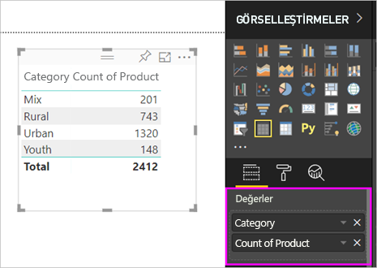
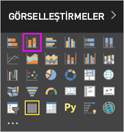
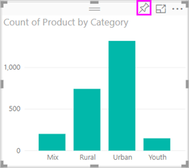

# 1\. Bölüm, Bir Power BI raporuna görselleştirme ekleme

Bu makalede bir raporda görselleştirme oluşturma hakkında özet bilgiler verilmektedir. Bu, hem Power BI hizmeti hem Power BI Desktop için geçerlidir. Daha ayrıntılı içerik için bu serinin [2. Bölümüne bakın](power-bi-report-add-visualizations-ii.md). Rapor tuvali üzerinde farklı görsel oluşturma, düzenleme ve biçimlendirme yöntemlerini gösteren Amanda'yı izleyin. Ardından [Satış ve Pazarlama örneğini](../sample-datasets.md) kullanarak kendi raporunuzu oluşturun.

<iframe width="560" height="315" src="https://www.youtube.com/embed/IkJda4O7oGs" frameborder="0" allowfullscreen></iframe>

## Rapor açma ve yeni sayfa ekleme

1. Bir [raporu Düzenleme Görünümü'nde](../service-interact-with-a-report-in-editing-view.md) açın.

    Bu eğitimde [Satış ve Pazarlama örneği](../sample-datasets.md) kullanılmaktadır.

1. **Alanlar** bölmesi görünür değilse ok simgesini seçerek açın.

   

1. Rapora boş bir sayfa ekleyin.

## Rapora görselleştirme ekleme

1. **Alanlar** bölmesindeki alanlardan birini seçerek bir görselleştirme oluşturun.

    **SalesFact** > **Sales $** gibi bir sayısal alanla başlayın. Power BI, tek sütun içeren bir sütun grafiği oluşturur.

    

    Öte yandan **Name** ve **Product** gibi bir kategori alanıyla da başlayabilirsiniz. Power BI bir tablo oluşturur ve söz konusu alanı da **Değerler**'e ekler.

    

    Öte yandan **Geo** > **City** gibi bir coğrafi alanla da başlayabilirsiniz. Power BI ve Bing Haritalar bir harita görselleştirmesi oluşturur.

    

1. Bir görselleştirme oluşturup türünü değiştirin. **Product** > **Category** ve ardından **Product** > **Count of Product** seçimlerini yaparak ikisini de **Değerler** kutusuna ekleyin.

   

1. **Yığılmış sütun grafiği** simgesini seçerek görselleştirmeyi sütun grafik haline getirin.

   

1. Raporunuzda oluşturduğunuz görselleştirmeleri [panonuza sabitleyebilirsiniz](../service-dashboard-pin-tile-from-report.md). Görselleştirmeyi sabitlemek için raptiye simgesini  seçin.

   
  
## Sonraki adımlar

 Devam edin:

* [2. Bölüm: Power BI raporuna görselleştirme ekleme](power-bi-report-add-visualizations-ii.md) bölümünden devam edin

* Rapordaki [görselleştirmelerle etkileşim kurun](../consumer/end-user-reading-view.md).

* [Görselleştirmelerle daha fazlasını yapın](power-bi-report-visualizations.md).

* [Raporunuzu kaydedin](../service-report-save.md).
