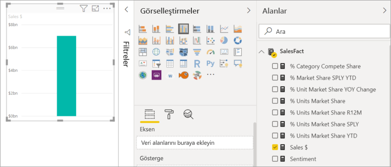

# Power BI raporuna görsel ekleme (1. Bölüm)

[!INCLUDE[consumer-appliesto-nyyn](../includes/consumer-appliesto-nyyn.md)]    

[!INCLUDE [power-bi-visuals-desktop-banner](../includes/power-bi-visuals-desktop-banner.md)]

Bu makalede bir raporda görselleştirme oluşturma hakkında özet bilgiler verilmektedir. Bu, hem Power BI hizmeti hem Power BI Desktop için geçerlidir. Daha ayrıntılı içerik için bu serinin [2. Bölümüne bakın](power-bi-report-add-visualizations-ii.md).

## Önkoşullar

Bu eğitimde [Satış ve pazarlama PBIX dosyası](https://download.microsoft.com/download/9/7/6/9767913A-29DB-40CF-8944-9AC2BC940C53/Sales%20and%20Marketing%20Sample%20PBIX.pbix) kullanılmaktadır.

1. Power BI Desktop menü çubuğunun sol üst kısmından **Dosya** > **Aç**’ı seçin
   
2. **Satış ve pazarlama örneği PBIX dosyası** kopyanızı bulun

1. **Satış ve pazarlama örneği PBIX dosyasını** rapor görünümünde  açın.

1. Seç  yeni bir sayfa ekleyin.

> [!NOTE]
> Raporunuzu bir Power BI iş arkadaşınızla paylaşmak için her ikinizin de bireysel Power BI Pro lisanslarınızın olması veya raporun Premium kapasitede depolanması gerekir. Bkz. [Raporları paylaşma](../collaborate-share/service-share-reports.md)

## Rapora görselleştirme ekleme

1. **Alanlar** bölmesindeki alanlardan birini seçerek bir görselleştirme oluşturun.

    **Sales** > **TotalSales** gibi bir sayısal alanla başlayın. Power BI, tek sütun içeren bir sütun grafiği oluşturur.

    

    Öte yandan **Name** ve **Product** gibi bir kategori alanıyla da başlayabilirsiniz. Power BI bir tablo oluşturur ve söz konusu alanı da **Değerler**'e ekler.

    

    Öte yandan **Geo** > **City** gibi bir coğrafi alanla da başlayabilirsiniz. Power BI ve Bing Haritalar bir harita görselleştirmesi oluşturur.

    

## Görselleştirme türünü değiştirme

 Bir görselleştirme oluşturup türünü değiştirin. 
 
 1. **Product** > **Category** ve ardından **Product** > **Count of Product** seçimlerini yaparak ikisini de **Değerler** kutusuna ekleyin.

    

1. **Yığılmış sütun grafiği** simgesini seçerek görselleştirmeyi sütun grafik haline getirin.

   

1. Görselin sıralama ölçütünü değiştirmek için **Diğer eylemler** (...) öğesini seçin.  Sıralamanın yönünü (artan veya azalan) ve sıralamak için kullanılan sütunu (**Sıralama ölçütü**) değiştirmek üzere sıralama seçeneklerini kullanın.

   
  
## Sonraki adımlar

 Devam edin:

* [2. Bölüm: Power BI raporuna görselleştirme ekleme](power-bi-report-add-visualizations-ii.md) bölümünden devam edin

* Rapordaki [görselleştirmelerle etkileşim kurun](../consumer/end-user-reading-view.md).
