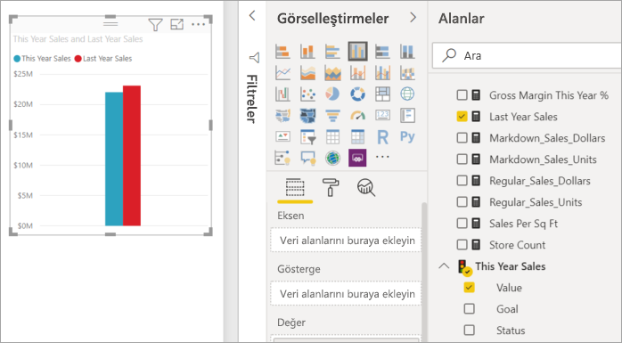
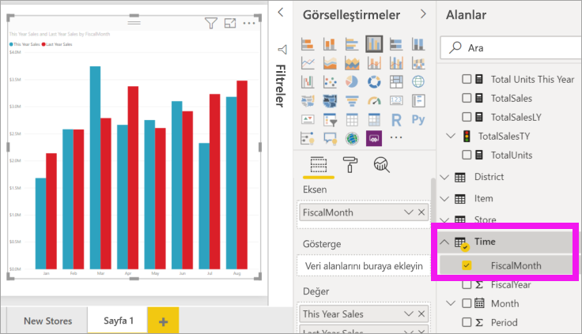
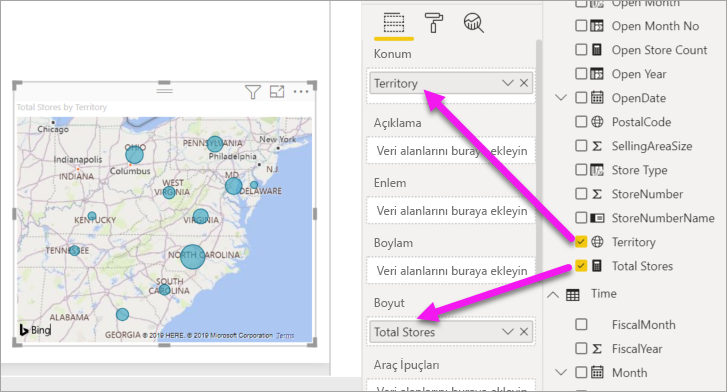
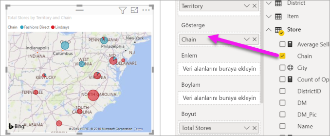

# Power BI raporuna görsel ekleme (2. Bölüm)

[!INCLUDE [power-bi-visuals-desktop-banner](../includes/power-bi-visuals-desktop-banner.md)]

[1. Bölüm](power-bi-report-add-visualizations-i.md)'de alan adlarının yanında bulunan onay kutularını seçerek temel görselleştirmeler oluşturdunuz.  2\. Bölüm'de sürükle bırak işlevini nasıl kullanacağınızı ve her türlü görselleştirmeyi oluşturmak ve değiştirmek için **Alanlar** ve **Görsel Öğeler** bölmelerini tam olarak nasıl kullanabileceğinizi öğreneceksiniz.

## Yeni görselleştirme oluşturma
Bu öğreticide Perakende Analizi veri kümesini derinlemesine inceleyeceğiz ve birkaç temel görselleştirme oluşturacağız.

## Önkoşullar

Bu öğreticide [Perakende analizi örneği PBIX dosyası](https://download.microsoft.com/download/9/6/D/96DDC2FF-2568-491D-AAFA-AFDD6F763AE3/Retail%20Analysis%20Sample%20PBIX.pbix) kullanılmıştır.

1. Power BI Desktop menü çubuğunun sol üst kısmından **Dosya** > **Aç**’ı seçin
   
2. **Perakende Analizi örneği PBIX dosyasının** kopyasını bulun

1. **Perakende Analizi örneği PBIX dosyasını** rapor görünümünde  açın.

1. Select  yeni bir sayfa ekleyin.

## Rapora görselleştirme ekleme

**Alanlar** bölmesindeki alanlardan birini seçerek bir görselleştirme oluşturun. Oluşturulan görselleştirme türü, seçilen alanın türüne bağlıdır. Power BI, sonuçları göstermek için kullanılacak görselleştirmeyi belirlemek için veri türünü kullanır. Görselleştirmeler bölmesinden farklı bir simge seçerek kullanılan görselleştirmeyi değiştirebilirsiniz. Tüm görselleştirmelerin verilerinizi göstermeyeceğini aklınızda bulundurun. Örneğin, coğrafi veriler bir huni grafiği veya çizgi grafik kullanılarak iyi görüntülenmez. 

### Bu yılın satışlarıyla geçen yılın satışlarının karşılaştırılmasının incelendiği bir alan grafiği ekleyin

1. **Sales** tablosundan, **This Year Sales** > **Değer** ve **Last Year Sales** öğelerini seçin. Power BI, bir sütun grafik oluşturur.  Bu grafik ilginizi çektiği için daha derinlemesine incelemek istiyorsunuz. Aylara göre satışların görünümü nasıl?  
   
   

2. Time tablosundan **FiscalMonth** öğesini **Eksen** alanına sürükleyin.  
   

3. [Görselleştirmeyi değiştirerek](power-bi-report-change-visualization-type.md) bir alan grafiğine dönüştürün.  Aralarından seçim yapabileceğiniz pek çok görselleştirme türü bulunur. Hangi türü kullanacağınıza karar vermek için [her birinin açıklamasına, en iyi uygulama ipuçlarına ve öğreticilere](power-bi-visualization-types-for-reports-and-q-and-a.md) başvurabilirsiniz. Görselleştirmeler bölmesinden alan grafiği simgesini  seçin.

4. **Diğer eylemler**’i (...) ve **Sıralama ölçütü** >  **FiscalMonth** öğesini seçerek görselleştirmeyi sıralayın.

5. Görselleştirmeyi seçerek ve ana hat dairelerinden birini yakalayıp sürükleyerek [görselleştirmeyi yeniden boyutlandırın](power-bi-visualization-move-and-resize.md). Kaydırma çubuğunu ortadan kaldırmak için yeterince geniş ve bir başka görselleştirme eklememiz için alan bırakacak kadar da küçük olmasını sağlayın.
   
   
6. [Raporu kaydetme](../service-report-save.md).

### Konuma göre satışları gösteren bir harita görselleştirmesi ekleyin.

1. **Store** tablosundan **Territory** öğesini seçin. **Total Stores** öğesini Boyut alanına sürükleyin. Power BI, Territory'nin bir konum olduğunu algılayarak bir harita görselleştirmesi oluşturur.  
   

2. Bir açıklama ekleyin.  Verileri mağaza adına göre görmek için **Mağaza** > **Zincir** öğesini Gösterge alanına sürükleyin.  
   

## Sonraki adımlar
* [Power BI raporlarındaki görselleştirmeler](power-bi-report-visualizations.md) hakkında daha fazla bilgi.  
* Başka bir sorunuz mu var? [Power BI Topluluğu'na başvurun](https://community.powerbi.com/)

