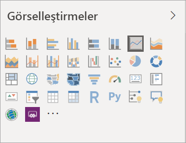
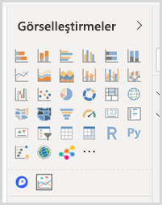
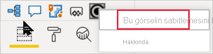
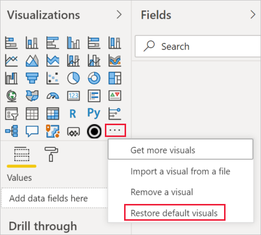

# Power BI raporlarındaki görselleştirmeler

[!INCLUDE[consumer-appliesto-yyyn](../includes/consumer-appliesto-yyyn.md)]    

Görselleştirmeler (kısaca görseller) verilerden elde edilen öngörüleri gösterir. Power BI raporları bir görsel içeren tek sayfadan oluşabileceği gibi görsellerle dolu birçok sayfa da içerebilir. Power BI hizmetinde görseller [raporlardan veya panolardan sabitlenebilir](../create-reports/service-dashboard-pin-tile-from-report.md).

Rapor *tasarımcıları* ile rapor *kullanıcılarını* birbirinden ayırt etmek önemlidir.  Raporu oluşturan veya değiştiren kişiyseniz tasarımcısınız demektir.  Tasarımcılar rapor ve bağlantılı veri kümesine yönelik düzenleme izinlerine sahip olur. Power BI Desktop'ta bu, veri kümesini Veri görünümünde açabileceğiniz ve Rapor görünümünde görseller oluşturabileceğiniz anlamına gelir. Power BI hizmetinde ise veri kümesini veya raporu [Düzenleme görünümü](../consumer/end-user-reading-view.md)'nde rapor düzenleyicisinde açabileceğiniz anlamına gelir. Bir rapor veya pano [sizinle paylaşıldıysa](../consumer/end-user-shared-with-me.md) rapor *kullanıcısı* olursunuz. Raporu görüntüleyebilmenin yanı sıra raporla ve içerdiği görsellerle etkileşim kurabilirsiniz ancak bir *tasarımcının* yapabileceği kadar fazla değişiklik yapamazsınız.

Doğrudan Power BI'daki Görselleştirmeler bölmesinden kullanabileceğiniz çok sayıda farklı görsel türü vardır.

[Microsoft AppSource topluluk sitesinde](https://appsource.microsoft.com) daha fazla Power BI görseli sağlanır. AppSource’da, Microsoft ve topluluk tarafından sağlanan [Power BI görsellerine](../developer/visuals/custom-visual-develop-tutorial.md) göz atabilir ve bunları [indirebilirsiniz](https://appsource.microsoft.com/marketplace/apps?page=1&product=power-bi-visuals).

Power BI'da yeniyseniz veya bilgilerinizi tazelemek istiyorsanız Power BI görselleştirmeleri ile ilgili temel bilgileri edinmek için aşağıdaki bağlantıları kullanın.  Alternatif olarak, daha da fazla faydalı bilgiye ulaşmak için İçindekiler (bu makalenin sol tarafında) başlıklı bölümümüzü kullanabilirsiniz.

## Power BI'da görselleştirme ekleme

Rapor sayfalarınızda [görselleştirmeler oluşturun](power-bi-report-add-visualizations-i.md). [Kullanılabilir görselleştirmelere ve görselleştirmelere ilişkin mevcut eğitimlere](power-bi-visualization-types-for-reports-and-q-and-a.md) göz atın. 

## Dosyadan veya AppSource’dan görselleştirmeyi karşıya yükleme

Kendi oluşturduğunuz veya [Microsoft AppSource topluluk sitesinde](https://appsource.microsoft.com/marketplace/apps?product=power-bi-visuals) bulduğunuz bir görselleştirmeyi ekleyin. Yaratıcılığınızı konuşturmak mı istiyorsunuz? Kaynak kodumuzu inceleyin, yeni bir görselleştirme türü oluşturmak için [geliştirici araçlarımızı](../developer/visuals/custom-visual-develop-tutorial.md) kullanın ve [bunu toplulukla paylaşın](../developer/visuals/office-store.md). Power BI görseli geliştirme hakkında daha fazla bilgi edinmek için, [Power BI görseli geliştirme](../developer/visuals/custom-visual-develop-tutorial.md) bağlantısını ziyaret edin.

## Görselleştirme bölmenizi kişiselleştirme

Görselleştirme bölmesini Power BI görselleri ekleyerek veya kaldırarak kişiselleştirebilirsiniz. Görselleştirme bölmesinden varsayılan görselleri kaldırdıysanız, görseli varsayılan ayarlarına geri yükleyebilir ve tüm varsayılan görselleri geri getirebilirsiniz.

### Görselleştirme bölmesine görsel ekleme

Birden çok raporda aynı görseli kullandığınızı fark ederseniz, bu görseli görselleştirme bölmenize ekleyebilirsiniz. Görsel ekleme özelliği AppSource görselleri, kuruluş görselleri ve dosyalardan eklenen görseller için geçerlidir. Görsel eklemek için, görsele sağ tıklayın.

Bir görsel sabitlendikten sonra diğer varsayılan görsellerle birlikte canlı hale gelir. Bu görsel artık oturum açmış hesabınıza bağlıdır; böylece, oturum açtığınız varsayılarak, oluşturduğunuz tüm yeni raporlara bu görsel otomatik olarak dahil edilir. Düzenli olarak kullandığınız belirli bir görseli artık tek tek her rapora eklemeniz gerekmez.

### Görselleştirme bölmesinden görsel kaldırma

Görseli düzenli olarak kullanmayı bıraktıysanız, görsele sağ tıklayabilir ve görselleştirme bölmesinden kaldırabilirsiniz. Görselleştirme bölmesinden her türlü görsel (varsayılan, dosya, kuruluş ve AppSource görselleri gibi) kaldırılabilir.

### Görselleştirme bölmesini geri yükleme

Görselleştirme bölmesini geri yükleme yalnızca varsayılan görseller için geçerlidir. Görselleştirme bölmesine eklenmiş olan görseller bundan etkilenmez ve görselleştirme bölmesinde kullanılabilir durumda kalır. AppSource veya dosya görsellerini görselleştirme bölmesinden kaldırmak istiyorsanız, bunu el ile yapmalısınız.

Görselleştirme bölmesini varsayılan durumuna geri yüklemek için diğer seçeneklere tıklayın ve **Varsayılan görselleri geri yükle**’yi seçin.

## Görselleştirme türünü değiştirme

Verilerinize en çok hangisinin uyduğunu görmek için [görselleştirme türünü değiştirmeyi](power-bi-report-change-visualization-type.md) deneyin.

## Görselleştirmeyi sabitleme

Power BI hizmetinde görselleştirmeyi istediğiniz hale getirdikten sonra kutucuk olarak [bir panoya sabitleyebilirsiniz](../create-reports/service-dashboard-pin-tile-from-report.md). Raporda kullanılmakta olan görselleştirmeyi sabitledikten sonra değiştirirseniz panodaki kutucuk değişmez. Bu bir çizgi grafiğiyse, siz raporda Halka Grafik olarak değiştirseniz bile çizgi grafiği olarak kalır.

## Sınırlamalar ve önemli noktalar
- Veri kaynağına ve alan sayısına (ölçüler veya sütunlar) bağlı olarak, görsel yavaş yüklenebilir.  Hem okunabilirlik hem de performans nedeniyle görsellerin toplam 10-20 toplam alanla sınırlanması önerilir. 

- Görseller için üst sınır 100 alandır (ölçü veya sütun). Görseliniz yüklenemezse alanların sayısını azaltın.

## Sonraki adımlar

* [Power BI'daki görselleştirme türleri](power-bi-visualization-types-for-reports-and-q-and-a.md)
* [Power BI görselleri](../developer/visuals/power-bi-custom-visuals.md)
