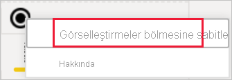

# Power BI raporlarındaki görselleştirmeler

Görselleştirmeler (kısaca görseller) verilerden elde edilen öngörüleri gösterir. Power BI raporları bir görsel içeren tek sayfadan oluşabileceği gibi görsellerle dolu birçok sayfa da içerebilir. Power BI hizmetinde görseller [raporlardan veya panolardan sabitlenebilir](../service-dashboard-pin-tile-from-report.md).

Rapor *tasarımcıları* ile rapor *kullanıcılarını* birbirinden ayırt etmek önemlidir.  Raporu oluşturan veya değiştiren kişiyseniz tasarımcısınız demektir.  Tasarımcılar rapor ve bağlantılı veri kümesine yönelik düzenleme izinlerine sahip olur. Power BI Desktop'ta bu, veri kümesini Veri görünümünde açabileceğiniz ve Rapor görünümünde görseller oluşturabileceğiniz anlamına gelir. Power BI hizmetinde ise veri kümesini veya raporu [Düzenleme görünümü](../consumer/end-user-reading-view.md)'nde rapor düzenleyicisinde açabileceğiniz anlamına gelir. Bir rapor veya pano [sizinle paylaşıldıysa](../consumer/end-user-shared-with-me.md) rapor *kullanıcısı* olursunuz. Raporu görüntüleyebilmenin yanı sıra raporla ve içerdiği görsellerle etkileşim kurabilirsiniz ancak bir *tasarımcının* yapabileceği kadar fazla değişiklik yapamazsınız.

Doğrudan Power BI'daki Görselleştirmeler bölmesinden kullanabileceğiniz çok sayıda farklı görsel türü vardır.

Daha da fazla seçenek için [Microsoft AppSource topluluk sitesini](https://appsource.microsoft.com) ziyaret edip Microsoft ve topluluk tarafından sağlanan [özel görselleri](../developer/visuals/custom-visual-develop-tutorial.md) bulabilir ve [indirebilirsiniz](https://appsource.microsoft.com/marketplace/apps?page=1&product=power-bi-visuals).

<iframe width="560" height="315" src="https://www.youtube.com/embed/SYk_gWrtKvM?list=PL1N57mwBHtN0JFoKSR0n-tBkUJHeMP2cP" frameborder="0" allowfullscreen></iframe>

Power BI'da yeniyseniz veya bilgilerinizi tazelemek istiyorsanız Power BI görselleştirmeleri ile ilgili temel bilgileri edinmek için aşağıdaki bağlantıları kullanın.  Alternatif olarak, daha da fazla faydalı bilgiye ulaşmak için İçindekiler (bu makalenin sol tarafında) başlıklı bölümümüzü kullanabilirsiniz.

## Power BI'da görselleştirme ekleme

Rapor sayfalarınızda [görselleştirmeler oluşturun](power-bi-report-add-visualizations-i.md). [Kullanılabilir görselleştirmelere ve görselleştirmelere ilişkin mevcut eğitimlere](power-bi-visualization-types-for-reports-and-q-and-a.md) göz atın. 

## Özel görselleştirme yükleme ve bunu Power BI'da kullanma

Kendi oluşturduğunuz veya [Microsoft AppSource topluluk sitesinde](https://appsource.microsoft.com/marketplace/apps?product=power-bi-visuals) bulduğunuz bir özel görselleştirmeyi ekleyin. Yaratıcılığınızı konuşturmak mı istiyorsunuz? Kaynak kodumuzu inceleyin, yeni bir görselleştirme türü oluşturmak için [geliştirici araçlarımızı](../developer/visuals/custom-visual-develop-tutorial.md) kullanın ve [bunu toplulukla paylaşın](../developer/office-store.md). Özel görsel geliştirme hakkında daha fazla bilgi edinmek için, [Power BI özel görseli geliştirme](../developer/visuals/custom-visual-develop-tutorial.md) bağlantısını ziyaret edin.

## Görselleştirme bölmenizi kişiselleştirme (önizleme)

Birden çok raporda aynı özel görseli kullandığınızı fark ederseniz, özel görselleştirmenizi görselleştirme bölmenize sabitleyebilirsiniz. Görselleştirmeyi sabitlemek için görsele sağ tıklayarak bölmeye sabitleyin.

Bir görsel sabitlendikten sonra diğer yerleşik görsellerle birlikte canlı hale gelir. Bu görsel artık oturum açmış hesabınıza bağlıdır; böylece, oturum açtığınız varsayılarak, oluşturduğunuz tüm yeni raporlara bu görsel otomatik olarak dahil edilir. Bunun yapılması, belirli bir görseli her bir rapora eklemeye gerek olmadan standart hale getirmeyi son derece kolaylaştırır.

Bu özellik önizleme aşamasında olduğu sürece sabitlenmiş görsellerinizi yalnızca Power BI Desktop'ta göreceksiniz. Ayrıca, bu özelliğin kullanılabilmesi için oturum açmanız gerekir.

## Görselleştirme türünü değiştirme

Verilerinize en çok hangisinin uyduğunu görmek için [görselleştirme türünü değiştirmeyi](power-bi-report-change-visualization-type.md) deneyin.

## Görselleştirmeyi sabitleme

Power BI hizmetinde görselleştirmeyi istediğiniz hale getirdikten sonra kutucuk olarak [bir panoya sabitleyebilirsiniz](../service-dashboard-pin-tile-from-report.md). Sabitledikten sonra, raporda kullanılan görselleştirmeyi değiştirmeniz halinde panodaki kutucuk değişmez. Görselleştirme bir çizgi grafik ise raporda Halka grafik olarak değiştirmiş olsanız bile çizgi grafik olarak kalır.

## Sınırlamalar ve önemli noktalar
- Veri kaynağına ve alan sayısına (ölçüler veya sütunlar) bağlı olarak, görsel yavaş yüklenebilir.  Hem okunabilirlik hem de performans nedeniyle görsellerin toplam 10-20 toplam alanla sınırlanması önerilir. 

- Görseller için üst sınır 100 alandır (ölçü veya sütun). Görseliniz yüklenemezse alanların sayısını azaltın.   

## Sonraki adımlar

* [Power BI'daki görselleştirme türleri](power-bi-visualization-types-for-reports-and-q-and-a.md)
* [Özel görseller](../developer/power-bi-custom-visuals.md)
