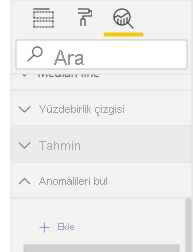

# Anomali algılama (önizleme)

[!INCLUDE[consumer-appliesto-nyyn](../includes/consumer-appliesto-nyyn.md)]    

Anomali algılama, zaman serisi verilerinizdeki anomalileri otomatik olarak algılayarak çizgi grafiklerinizi geliştirmenize yardımcı olur. Ayrıca, kök neden analiziyle ilgili yardımcı olması için anomalilere ilişkin açıklamalar sağlar.  Yalnızca birkaç tıklamayla, verileri ayrıntılı olarak incelemeksizin içgörüleri kolayca bulabilirsiniz. Anomalileri hem Power BI Desktop’ta hem de Power BI hizmetinde oluşturup görüntüleyebilirsiniz. Bu makaledeki adımlar ve gösterimler Power BI Desktop’tan alınmıştır.

Bu özellik önizleme aşamasında olduğundan önce özellik anahtarını açmanız gerekir. **Dosya** > **Seçenekler ve Ayarlar** > **Seçenekler** > **Önizleme özellikleri**’ne gidin ve **Anomali algılama**’nın açık olduğundan emin olun:

:::image type="content" source="media/power-bi-visualization-anomaly-detection//preview-feature-switch.png" alt-text="Anomali algılama önizleme özelliği anahtarının nasıl etkinleştirileceğini gösteren ekran görüntüsü.":::
 
## Kullanmaya başlayın
Bu öğreticide çeşitli ürünlere yönelik çevrimiçi satış verileri kullanılır. Bu öğreticiyi takip etmek için çevrimiçi satış senaryosunu konu alan [örnek dosyayı](https://github.com/microsoft/powerbi-desktop-samples/blob/master/Monthly%20Desktop%20Blog%20Samples/2020/2020SU09%20Blog%20Demo%20-%20September.pbix) indirebilirsiniz.

Grafiği seçip analiz bölmesindeki “Anomalileri Bul” seçeneğini ekleyerek Anomali algılamayı etkinleştirebilirsiniz. 

 

 Örneğin, bu grafik Zaman içindeki geliri gösterir. Anomali algılama özelliğini eklediğinizde, grafik otomatik olarak anomalilerle ve beklenen değer aralıklarıyla zenginleştirilir. Bir değer bu beklenen sınırın dışına çıktığında anomali olarak işaretlenir. Anomali Algılayıcısı algoritması hakkında daha fazla bilgi için bu [teknik bloga](https://techcommunity.microsoft.com/t5/ai-customer-engineering-team/overview-of-sr-cnn-algorithm-in-azure-anomaly-detector/ba-p/982798) göz atın.

 
 
## Anomalileri biçimlendirme

Bu deneyim yüksek düzeyde özelleştirilebilir. Anomalinin şeklini, boyutunu ve rengini, ayrıca beklenen aralığın rengini, stilini ve şeffaflığını biçimlendirebilirsiniz. Algoritmanın parametresini de yapılandırabilirsiniz.  Duyarlılığı artırırsanız algoritma, verilerinizdeki değişikliklere karşı daha duyarlı hale gelir. Bu durumda, küçük bir sapma bile anomali olarak işaretlenir. Duyarlılığı azaltırsanız algoritma, anomali olduğuna karar vereceği öğeler konusunda daha seçici hale gelir.

 
 
## Açıklamalar
Anomalileri algılamanın yanı sıra, verilerdeki anomalileri otomatik olarak açıklayabilirsiniz. Anomaliyi seçtiğinizde, Power BI olası açıklamaları bulmak için veri modelinizdeki alanların tamamında bir analiz çalıştırır. Bu, size anomalinin doğal dildeki açıklamasını ve bu anomalinin açıklayıcı gücüne göre sıralanmış ilişkili faktörlerini verir. Burada, 30 Ağustos’ta Gelir’in 5187 ABD doları olduğunu görebiliyorum, bu beklenen aralık olan 2447-3423 ABD dolarının üstünde. Açıklamanın diğer ayrıntılarını görmek için bu bölmedeki kartları açabilirim.

 
### Açıklamaları yapılandırma
Analiz için kullanılan alanları da denetleyebilirsiniz. Örneğin, Power BI Satıcı ve Şehir alanlarını **Açıklama ölçütü** alan kutusuna sürükleyerek analizi yalnızca bu alanlarla sınırlar. Bu örnekte, 31 Ağustos’taki anomali belirli bir satıcı ve şehirlerle ilişkili gibi görünüyor. Burada, “Fabrikam” adlı satıcının %99 gücü var. Power BI, *gücü* toplam değerdeki sapma boyutuna göre filtrelendiğinde beklenen değerdeki sapma oranı olarak hesaplar. Örneğin bu, anomali noktası için gerçek değer eksi beklenen değerin *Fabrikam* bileşen zaman serisi ve *genel Gelir* toplam zaman serisi arasındaki oranıdır. Bu kartın açılması, bu satıcının gelirinde 31 Ağustos’taki ani bir artışı içeren görseli gösterir. Görseli sayfaya eklemek için **Rapora ekle** seçeneğini kullanın.

## Sınırlamalar
- Anomali algılama, yalnızca Eksen alanındaki zaman serisi verilerini içeren çizgi grafik görselleri için desteklenir.
- Anomali algılamanın göstergelerle, birden çok değerle veya çizgi grafik görsellerindeki ikincil değerlerle kullanımı desteklenmez.
- Anomali algılama için en az 12 veri noktası gerekir.
- Tahmin/Min/Maks/Ortalama/Oranca/Yüzde çizgileri Anomali algılama ile çalışmaz.
- SAP veri kaynağı üzerinde DirectQuery, Power BI Rapor Sunucusu, Azure Analysis Services’a Canlı Bağlantı ve SQL Server Analysis Services desteklenmez.
- Anomali Açıklamaları “Değeri Şu Şekilde Göster” seçenekleriyle çalışmaz.
- Hiyerarşide sonraki düzeye ulaşmak için detaya gitmek desteklenmez.
