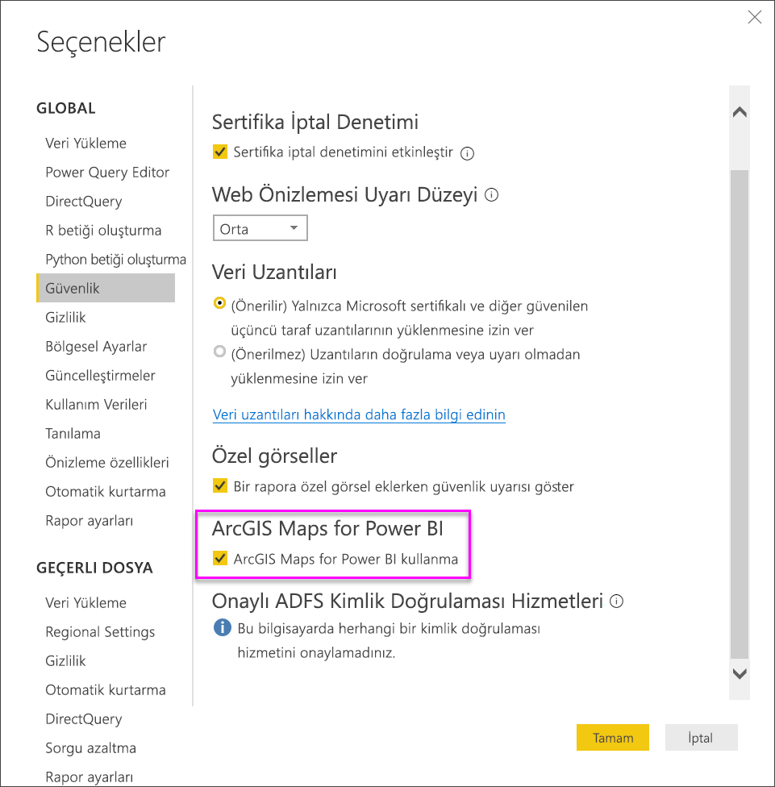

# Power BI Desktop’ta Esri tarafından sunulan ArcGIS haritaları

[!INCLUDE [power-bi-visuals-desktop-banner](../includes/power-bi-visuals-desktop-banner.md)]

Bu eğitim içeriği, ArcGIS haritası oluşturan bir kişinin bakış açısından yazılmıştır. ArcGIS haritasını oluşturan kişi haritayı bir iş arkadaşıyla paylaştıktan sonra, iş arkadaşı haritayı görüntüleyebilir ve haritayla etkileşim kurabilir, ancak değişiklikleri kaydedemez. ArcGIS haritalarını görüntüleme hakkında daha fazla bilgi için bkz. [ArcGIS haritaları ile etkileşim kurma](power-bi-visualizations-arcgis.md).

ArcGIS haritaları ile Power BI birlikte kullanıldığında eşleme deneyimi, haritada belirli noktaları göstermenin ötesinde yepyeni bir boyut kazanıyor. Harika, bilgilendirici harita görselleştirmeleri oluşturmak için altlık haritalar, konum türleri, temalar, sembol stilleri ve başvuru katmanları arasından seçiminizi yapın. Haritalarda yetkilendirmeli veri katmanlarıyla uzamsal çözümlemenin bir arada kullanılması, görselleştirmenizdeki verilerin daha kapsamlı şekilde anlaşılmasını sağlar.

 Mobil cihazlarda ArcGIS haritaları oluşturamazsınız ancak haritaları görüntüleyebilir ve bunlarla etkileşim kurabilirsiniz. Bkz. [ArcGIS haritaları ile etkileşim kurma](power-bi-visualizations-arcgis.md).

> [!TIP]
> GIS, Coğrafi Bilgi Sistemleri anlamına gelir.

Aşağıdaki örnekte, 2016 yılına ait ortanca harcanabilir gelir demografik katmanındaki bölgesel satışların yoğunluk haritası yoluyla gösterilmesi için koyu gri bir tuval kullanılmıştır. Okumaya devam ettikçe fark edeceğiniz üzere, ArcGIS haritalarını kullandığınızda hikayenizi en iyi şekilde anlatabilmeniz için neredeyse sınırsız sayıda gelişmiş eşleme özelliği, demografik veriler ve çok daha ilgili çekici harita görselleştirmeleri elde edersiniz.

> [!TIP]
> Birçok örneğe göz atmak ve referansları okumak için [Esri'nin Power BI sayfasını](https://www.esri.com/powerbi) ziyaret edin. Ardından Esri'nin [ArcGIS Maps for Power BI ile Çalışmaya Başlama sayfasına](https://doc.arcgis.com/en/maps-for-powerbi/get-started/about-maps-for-power-bi.htm) bakın.

## Kullanıcı onayı
ArcGIS Maps for Power BI, Esri (www.esri.com) tarafından sağlanmaktadır. ArcGIS Maps for Power BI kullanımınız Esri'nin koşullarına ve gizlilik ilkesine tabidir. ArcGIS Maps for Power BI görsellerini kullanmak isteyen Power BI kullanıcılarının, onay iletişim kutusunu kabul etmesi gerekir.

**Kaynaklar**

[Koşullar](https://go.microsoft.com/fwlink/?LinkID=826322)

[Gizlilik İlkesi](https://go.microsoft.com/fwlink/?LinkID=826323)

[ArcGIS Maps for Power BI ürün sayfası](https://www.esri.com/powerbi)

 

### ***Power BI Desktop’ta (app.powerbi.com)*** ArcGIS haritasını etkinleştirme
Bu öğreticide PBIX [Perakende Analizi örneği .PBIX dosyası](http://download.microsoft.com/download/9/6/D/96DDC2FF-2568-491D-AAFA-AFDD6F763AE3/Retail%20Analysis%20Sample%20PBIX.pbix
) kullanılmıştır. **ArcGIS Maps for Power BI**'ı etkinleştirmek için:

1. Menü çubuğunun sol üst köşesinden **Dosya** \> **Aç**’ı seçin
   
2. Yerel makinenizde kayıtlı **Perakende Analizi örneği PBIX dosyasını** bulun.

1. **Perakende Analizi Örneği**'ni rapor görünümünde  açın.

1. Seç  yeni bir sayfa ekleyin.

   
3. Görselleştirmeler bölmesinde ArcGIS Maps for Power BI simgesini seçin.
   
    
4. Power BI, rapor tuvaline boş bir ArcGIS harita şablonu ekler.
   
   

 

## ArcGIS harita görseli oluşturma
Will’in birkaç ArcGIS harita görselleştirmesi oluşturduğu videoyu izledikten sonra [Perakende Analizi örneği .PBIX dosyasını](../sample-datasets.md) kullanarak kendiniz denemek için aşağıdaki adımları uygulayın.
   > [!NOTE]
   > Bu videoda Power BI Desktop’ın eski bir sürümü kullanılmaktadır.
   > 
   > 
<iframe width="560" height="315" src="https://www.youtube.com/embed/EKVvOZmxg9s" frameborder="0" allowfullscreen></iframe>

1. **Alanlar** bölmesinden **Konum**, **Enlem** ve/veya **Boylam** demetlerine bir veri alanı sürükleyin. Biz bu örnekte **Store > City** seçeneğini kullanıyoruz.
   
   > [!NOTE]
   > ArcGIS Maps for Power BI, seçtiğiniz alanların haritada şekil mi yoksa nokta olarak mı en iyi şekilde görüntüleneceğini otomatik olarak algılar. Ayarlar bölümünde, varsayılan seçimi belirleyebilirsiniz. (Aşağıya bakın.)
   > 
   > 
   
    

3. Verilerin gösterilme biçimini ayarlamak için **Alanlar** bölmesinden bir ölçüyü **Boyut** demetine sürükleyin. Biz bu örnekte **Sales > Last Year Sales** seçeneğini kullanıyoruz.
   
    

## ArcGIS haritaları için ayarlar ve biçimlendirme
**ArcGIS Maps for Power BI** biçimlendirme özelliklerine erişmek için:

1. Görselleştirmenin sağ üst köşesindeki üç nokta simgesini seçip **Düzenle** seçeneğini belirleyerek ek özelliklere erişin.
   
   
   
   Kullanılabilir özellikler, görselleştirmenin üst kısmında görüntülenir. Her bir özellik seçildiğinde, ayrıntılı seçeneklerin sunulduğu bir görev bölmesi açılır. 
   
   
   
   > [!NOTE]
   > Ayarlar ve özellikler hakkında daha fazla bilgi için aşağıdaki **Ayrıntılı belgeler** bölümüne bakın.
   > 
   > 

 

## Ayrıntılı belgeler
**Esri**, **ArcGIS Maps for Power BI**'ın özellikleri hakkında [kapsamlı belgeler](https://go.microsoft.com/fwlink/?LinkID=828772) sağlamaktadır.

## Özelliklere genel bakış
### Altlık Harita
Dört altlık harita sağlanmıştır: Koyu Gri Tuval, Açık Gri Tuval, OpenStreetMap ve Sokaklar.  Sokaklar, ArcGIS'in standart altlık haritasıdır.

Bir altlık haritayı uygulamak için görev bölmesinde haritayı seçin.

### Konum türü
ArgGIS Maps for Power BI, verilerin haritada en iyi şekilde nasıl görüntüleneceğini otomatik olarak algılar. Noktalar veya Sınırlar seçeneğini belirler. Konum türü seçenekleri, bu seçimlere yönelik ince ayarlar yapmanızı sağlar.

**Sınırlar**, yalnızca verileriniz standart coğrafi değerler içerdiğinde işe yarar. Esri, haritada gösterilecek şekli otomatik olarak belirler. Standart coğrafi değerlere ülkeler, iller, posta kodları vb. dahildir. Ancak, Coğrafi Kodlamada olduğu gibi Power BI da alanın varsayılan olarak sınır olması gerektiğini algılamayabilir veya verileriniz için bir sınıra sahip olmayabilir.  

### Harita teması
Dört harita teması sağlanmıştır. Yalnızca Konum ve Boyut temaları, Power BI'daki Alanlar bölmesinde konumla bağlantılı hale getirdiğiniz ve **Boyut** demetine eklediğiniz alanlara göre otomatik olarak seçilir. Şu anda **Boyut** kullanıyoruz, bu yüzden **Isı haritası** olarak değiştirelim. Sonraki adıma geçmeden önce **Isı haritası**’nı devre dışı bırakmayı unutmayın.  

<table>
<tr><th>Tema</th><th>Açıklama</th>
<tr>
<td>Yalnızca Konum</td>
<td>Konum Türü ayarlarına göre harita üzerinde veri noktaları veya doldurulmuş sınırlar çizer.</td>
</tr>
<tr>
<td>Yoğunluk Haritası</td>
<td>Verilere ilişkin bir yoğunluk haritası çizer.</td>
</tr>
<tr>
<td>Boyut</td>
<td>Harita üzerinde, Alanlar bölmesindeki Boyut demetinde bulunan değere göre boyutlandırılan veri noktalarını çizer.</td>
</tr>
<tr>
<td>Kümeleniyor</td>
<td>Harita üzerinde, bölgelerdeki veri noktası sayısını gösterir. </td>
</tr>
</table>

### Sembol stili
Sembol stilleri, verilerin haritada nasıl gösterildiğine ilişkin ince ayarlar yapmanızı sağlar. Sembol stilleri, seçilen Konum türü ve Harita temasına bağlı ve bağlama duyarlıdır. Aşağıdaki örnekte, Harita türü **Boyut** olarak ayarlanmış bir haritada saydamlık, stil ve boyut ile ilgili olarak yapılan birkaç ayarlama işlemi gösterilmektedir. 

### Raptiye
Raptiye ekleyerek haritanızdaki noktalara dikkat çekin.  

1. **Raptiye** sekmesini seçin.
2. Arama kutusuna anahtar sözcükler (adresler, yerler ve ilgi çekici noktalar gibi) yazın ve açılan menüden seçim yapın. Harita üzerinde bir sembol görüntülenir ve konum otomatik olarak yakınlaştırılır. Arama sonuçları, Raptiye bölmesinde konum kartları olarak kaydedilir. En fazla 10 konum kartı kaydedebilirsiniz.
   
   
3. Power BI ilgili konum için bir raptiye ekler ve raptiyenin rengini değiştirebilirsiniz.
   
   
4. Raptiye ekleyin ve silin.
   
   

### Sürüş zamanı
Sürüş zamanı bölmesi, bir konum seçmenize ve belirtilen bir yarıçap veya sürüş süresi için diğer harita özelliklerini belirlemenize olanak sağlar.  
    

1. **Sürüş zamanı** sekmesini seçin ve ardından, tekli veya çoklu seçim aracını belirleyin. Tekli seçim aracını kullanarak Washington D.C. üzerinde bulunan raptiyeyi seçin.

   
   
   > [!TIP]
   > Harita üzerinde yakınlaştırma yapıldığında (+ simgesi ile) konum seçmek daha kolay hale gelir.
   > 
   > 
2. Birkaç günlüğüne Washington'a gideceğinizi ve hangi mağazaların makul bir sürüş mesafesinde olduğunu hesaplamak istediğinizi varsayalım. Arama alanını **Yarıçap** ve Mesafeyi **50** mil olarak değiştirin ve Tamam'ı seçin.    
   
    

3. Yarıçap mor renkle gösterilir. Ayrıntılarını görüntülemek için herhangi bir konumu seçin. İsterseniz rengi ve ana hat ayarlarını değiştirerek yarıçapı biçimlendirebilirsiniz.
   
    

### Referans Katmanı
#### Referans katmanı - Nüfus Bilgileri
ArcGIS Maps for Power BI, nüfus bilgilerine ilişkin katmanlar sunarak Power BI'daki verilerin bağlama göre ele alınmasına yardımcı olur.

1. **Referans katmanı** sekmesini ve **Nüfus Bilgileri**'ni seçin.
2. Listelenen her katmanda bir onay kutusu bulunur. Katmanı haritaya eklemek için bir onay işareti ekleyin.  Bu örnekte Average Household Income katmanını ekledik. 
   
    
3. Her katman aynı zamanda etkileşimlidir. Ayrıntıları görmek için bir balonun üzerine gelebileceğiniz gibi, harita üzerindeki gölgeli bir alana da tıklayabilirsiniz. 
   
    

#### Referans katmanı - ArcGIS
ArcGIS Online, kuruluşların genel web haritaları yayımlamasına olanak sağlar. Ayrıca Esri, Living Atlas üzerinden bir web haritaları seçkisi sunar. ArcGIS sekmesinde, genel kullanıma sunulan tüm web haritalarını veya Living Atlas haritalarını arayabilir ve bunları referans katmanları olarak haritaya ekleyebilirsiniz.

1. **Referans katmanı** sekmesini seçtikten sonra **ArcGIS** seçeneğini belirleyin.
2. Arama terimleri girin ve ardından bir harita katmanını seçin. Bu örnekte USA Congressional Districts katmanını seçtik.
   
    
3. Ayrıntıları görmek için, gölgeli bir alanı seçerek *Başvuru katmanından seç*'i açın: Başvuru katmanında sınırları veya nesneleri seçmek için başvuru katmanı seçim aracını kullanın.

 

## Veri noktalarını seçme
ArcGIS Maps for Power BI, verilerinizi doğru ve hızlı bir şekilde seçmenize yardımcı olmak için beş seçim modu sunar.

İmlecinizi aşağıdaki görüntüde gösterilen tekli seçim aracı simgesinin üzerine getirerek seçim modunu değiştirin. Bunun yapılması ek araçları göstermek için gizli çubuğu da genişletir:

Her aracın, verilerinizi seçmenize olanak tanıyan benzersiz bir rolü vardır: 

 Tek tek veri noktalarını seçin.

 Harita üzerinde bir dikdörtgen çizer ve içerdiği veri noktalarını seçer.

 Referans katmanlarındaki sınırların veya çokgenlerin, kapsanan veri noktalarının seçilmesi için kullanılmasına olanak sağlar.

 Bir arabellek katmanı kullanarak veri seçmenize olanak tanır.

 Birbirlerine benzer veri noktalarını seçmenize olanak sağlar.

> [!NOTE]
> Aynı anda en fazla 250 veri noktası seçilebilir.
> 
> 

 

## Yardım alma
**Esri**, **ArcGIS Maps for Power BI**'ın özellikleri hakkında [kapsamlı belgeler](https://go.microsoft.com/fwlink/?LinkID=828772) sağlamaktadır.

Power BI [topluluğunun **ArcGIS Maps for Power BI**'a yönelik tartışma sayfasında](https://go.microsoft.com/fwlink/?LinkID=828771) soru sorabilir, en güncel bilgilere ulaşabilir, sorunları bildirebilir ve sorularınıza cevap bulabilirsiniz.

İyileştirme önerileriniz varsa lütfen [Power BI Ideas listesinde](https://ideas.powerbi.com) paylaşın.

 

## Kuruluşunuzda ArcGIS Maps for Power BI kullanımını yönetme
Power BI kullanıcılara, kiracı yöneticilerine ve BT yöneticilerine ArcGIS Maps for Power BI'ın kullanılıp kullanılmayacağını belirleme olanağı sunar. Aşağıda, her bir rolün ArcGIS Haritaları kullanımını yönetmek için uygulayabileceği adımları bulacaksınız. 

### Kullanıcı seçenekleri
Power BI Desktop’ta kullanıcılar ArcGIS Maps for Power BI’ı **Dosya** > **Seçenekler ve ayarlar**’dan devre dışı bırakıp **Seçenekler** > **Güvenlik**’i seçerek ArcGIS Maps for Power BI kullanmayı bırakabilirler. ArcGIS Haritaları devre dışı bırakıldığında varsayılan olarak yüklenmez.

### Kiracı yöneticisi seçenekleri
PowerBI.com’da kiracı yöneticileri, **Ayarlar** > **Yönetici Portalı** > **Kiracı ayarları**’ndan ArcGIS Maps for Power BI’ı devre dışı bırakarak kiracıdaki tüm kullanıcılar tarafından kullanılmasını önleyebilir. Bu işlemin ardından, Power BI'daki Görsel Öğeler bölmesinde artık ArcGIS Maps for Power BI simgesi görünmez.

### BT Yöneticisi seçenekleri
Power BI Desktop, bir kuruluşta dağıtılan bilgisayarlar genelinde ArcGIS Maps for Power BI’ı devre dışı bırakmak amacıyla **Grup İlkesi** kullanımını destekler.

<table>
<tr><th>Öznitelik</th><th>Değer</th>
</tr>
<tr>
<td>key</td>
<td>Software\Policies\Microsoft\Power BI Desktop&lt;/td&gt;
</tr>
<tr>
<td>valueName</td>
<td>EnableArcGISMaps</td>
</tr>
</table>

1 (ondalık) değeri, ArcGIS Maps for Power BI'ı etkinleştirir.

0 (ondalık) değeri, ArcGIS Maps for Power BI'ı devre dışı bırakır.

## Önemli Noktalar ve Sınırlamalar
ArcGIS Maps for Power BI aşağıdaki hizmetlerde ve uygulamalarda kullanılabilir:

<table>
<tr><th>Hizmet/Uygulama</th><th>Kullanılabilirlik</th></tr>
<tr>
<td>Power BI Desktop</td>
<td>Evet</td>
</tr>
<tr>
<td>Power BI hizmeti (PowerBI.com)</td>
<td>Evet</td>
</tr>
<tr>
<td>Power BI mobil uygulamaları</td>
<td>Evet</td>
</tr>
<tr>
<td>Power BI - web'de yayımlama</td>
<td>Hayır</td>
</tr>
<tr>
<td>Power BI Embedded</td>
<td>Hayır</td>
</tr>
<tr>
<td>Power BI hizmeti - ekleme (PowerBI.com)</td>
<td>Hayır</td>
</tr>
</table>

ArcGIS Maps for Power BI'ın kullanılamadığı hizmet veya uygulamalarda ilgili görselleştirme, Power BI logosu içeren boş bir görsel olarak gösterilir.

Adres bilgileri için coğrafi kodlama yapılırken yalnızca ilk 1500 adresin coğrafi kodlaması yapılır. Yer adlarına veya ülkelere yönelik coğrafi kodlama, 1500 adres sınırına tabi değildir.

 

**ArcGIS Maps for Power BI birlikte nasıl çalışır?**
ArcGIS Maps for Power BI, Esri (www.esri.com) tarafından sağlanmaktadır. ArcGIS Maps for Power BI kullanımınız Esri'nin [koşullarına](https://go.microsoft.com/fwlink/?LinkID=8263222) ve [gizlilik ilkesine](https://go.microsoft.com/fwlink/?LinkID=826323) tabidir. ArcGIS Maps for Power BI görsellerini kullanmak isteyen Power BI kullanıcılarının, onay iletişim kutusunu kabul etmesi gerekir (ayrıntılı bilgi için bkz. Kullanıcı Onayı).  Esri tarafından sağlanan ArcGIS Maps for Power BI’ın kullanımı, Esri’nin Koşullarına ve Gizlilik İlkesine tabidir. Bunların bağlantıları, onay iletişim kutusunda da belirtilir. Her kullanıcı ArcGIS Maps for Power BI’ı ilk kez kullanmadan önce onay vermelidir. Kullanıcı, onayı kabul ettikten sonra görsele bağlı veriler en azından coğrafi kodlama (konum bilgilerini bir haritada gösterilebilen enlem ve boylam bilgilerine dönüştürme) için Esri’nin hizmetlerine gönderilir. Veri görselleştirmesine bağlı tüm verilerin Esri’nin hizmetlerine gönderilebildiğini varsaymanız gerekir. Esri; altlık haritalar, uzamsal analiz ve coğrafi kodlama gibi hizmetler sunar. ArcGIS Maps for Power BI görseli, sağlanan bir sertifika ile korunan ve Esri tarafından bakımı yapılan bir SSL bağlantısını kullanarak bu hizmetlerle etkileşime geçer. ArcGIS Maps for Power BI hakkında ek bilgilere Esri’nin [ArcGIS Maps for Power BI ürün sayfasından](https://www.esri.com/powerbi) ulaşılabilir.

Bir kullanıcı, ArcGIS Maps for Power BI aracılığıyla Esri tarafından sunulan bir Plus aboneliğine kaydolduğunda Esri ile doğrudan bir ilişki içine girer. Power BI, Esri’ye kullanıcı hakkındaki kişisel bilgileri göndermez. Kullanıcı, kendi AAD kimliğini kullanarak, Esri tarafından sağlanan bir AAD uygulamasında oturum açar ve bu uygulamaya güvenir. Kullanıcı bunu yaparak kendi kişisel bilgilerini doğrudan Esri ile paylaşmış olur. Kullanıcı, bir ArcGIS Maps for Power BI görseline Plus içeriği ekledikten sonra diğer Power BI kullanıcılarının da söz konusu içeriği görüntülemek veya düzenlemek için Esri’nin Plus aboneliğine ihtiyaç duyar. 

Esri tarafından sağlanan ArcGIS Maps for Power BI’ın nasıl çalıştığıyla ilgili teknik ayrıntılar içeren sorular için Esri’ye destek sitesi üzerinden ulaşın.

**Esri'ye hangi veriler gönderilir?**
Esri'ye aktarılan veriler hakkındaki [belgelerini](https://doc.arcgis.com/en/maps-for-powerbi/get-started/data-transfer.htm) okuyabilirsiniz.

**ArcGIS Maps for Power BI kullanımı için herhangi bir ücret ödenir mi?**

Tüm Power BI kullanıcıları, ArcGIS Maps for Power BI'ı hiçbir ek ücret ödemeden kullanılabilir. Bu, **Esri** tarafından sağlanan bir bileşendir ve bu makalede daha önce belirtildiği üzere, kullanımınız **Esri** tarafından sağlanan koşullara ve gizlilik ilkesine tabidir.

**Power BI Desktop'ta önbelleğimin dolu olduğu hakkında bir hata iletisi alıyorum**

Bu hata üzerinde çalışılmaktadır.  Bu arada, önbelleğinizi temizlemek için lütfen şu konumdaki dosyaları silmeyi deneyin: C:\Users\\AppData\Local\Microsoft\Power BI Desktop\CEF ve ardından Power BI'ı yeniden başlatın.

**ArcGIS Maps for Power BI, Esri Şekil Dosyalarını destekliyor mu?**

ArcGIS Maps for Power BI ülke/bölge, eyalet/il ve posta kodları gibi standart sınırları otomatik olarak algılar. Kendi şekillerinizi sağlamanız gerekiyorsa [Power BI Desktop (Önizleme) için Şekil Haritalarını](desktop-shape-map.md) kullanarak yapabilirsiniz.

**ArcGIS haritalarımı çevrimdışı görüntüleyebilir miyim?**

Hayır, Power BI'ın haritaları görüntülemesi için ağ bağlantısı gerekir.

**Power BI'dan ArcGIS Online hesabıma bağlanabilir miyim?**

Henüz bağlanamazsınız. [Bu fikri oylayın](https://ideas.powerbi.com/forums/265200-power-bi-ideas/suggestions/9154765-arcgis-geodatabases), ilgili özellik üzerinde çalışmaya başladığımızda size bir e-posta gönderelim.  

## Sonraki adımlar
[Sizinle paylaşılan bir ArcGIS haritasıyla etkileşim kurma](power-bi-visualizations-arcgis.md)

[ArcGIS Maps for Power BI'ın kullanıma sunulduğunu duyuran blog gönderisi](https://powerbi.microsoft.com/blog/announcing-arcgis-maps-for-power-bi-by-esri-preview/)

Başka bir sorunuz mu var? [Power BI Topluluğu'na sorun](http://community.powerbi.com/)

