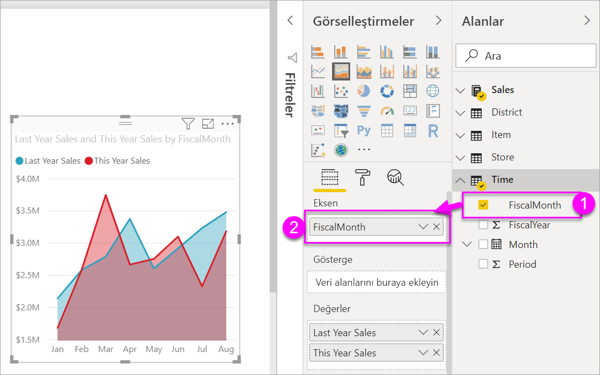
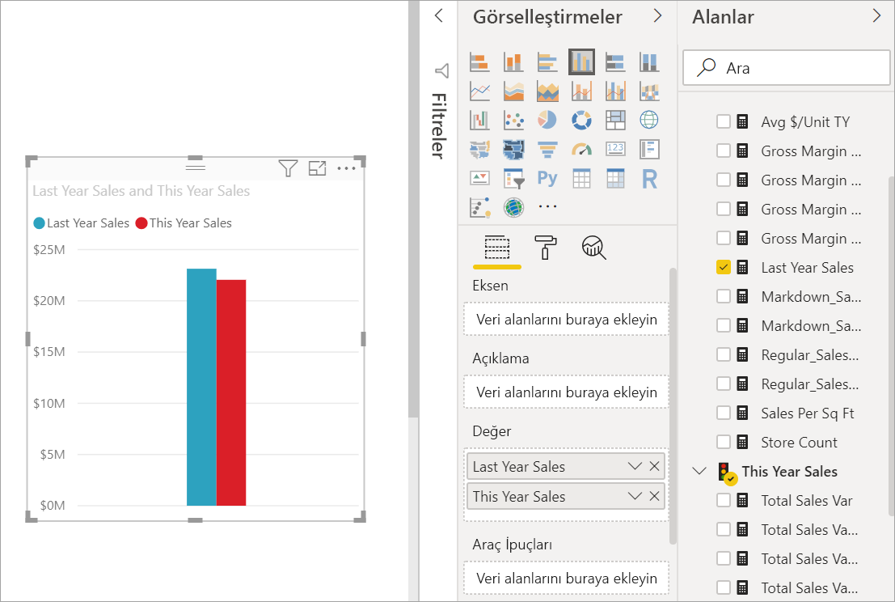
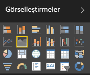
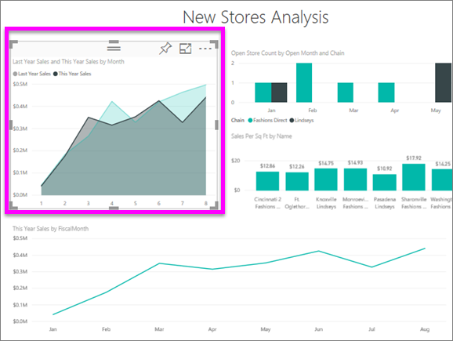
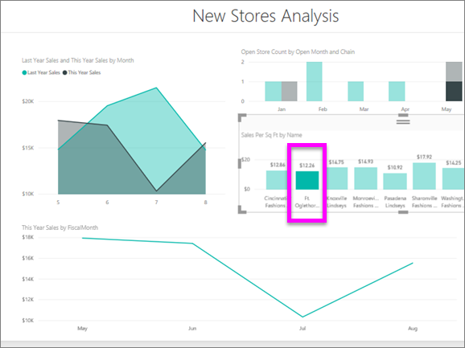

# Basit Alan grafiği
Basit alan grafiği (katmanlı alan grafiği olarak da bilinir) çizgi grafiğini temel alır. Eksen ve çizgi arasındaki alan, hacmi gösteren renklerle doldurulur. 

Alan grafikleri, zaman içindeki değişimin büyüklüğünü vurgular ve bir eğilime ilişkin toplam değere dikkat çekmek için kullanılabilir. Örneğin, zaman içindeki kârı gösteren veriler, bir alan grafiğinde toplam kârı vurgulayacak şekilde gösterilebilir.

## Basit alan grafikleri ne zaman kullanılır?
Basit alan grafikleri aşağıdaki durumlarda harika bir seçimdir:

* zaman serilerindeki hacim eğilimlerini görmek ve karşılaştırmak için 
* fiziksel olarak hesaplanabilen bir kümeyi temsil eden ayrı seriler için

### Önkoşullar
 - Power BI hizmeti
 - Perakende Analizi örneği

Birlikte ilerlemek için Power BI'da oturum açıp **Veri Al \> Örnekler \> Perakende Analizi Örneği > Bağlan**'ı seçtikten sonra **Panoya git** seçeneğini belirleyin. 

## Basit alan grafiği oluşturma
 

1. "Retail Analysis Sample" panosunda, **Total Stores** kutucuğunu seçerek "Retail Analysis Sample" raporunu açın.
2. **Raporu düzenle**'yi seçerek raporu Düzenleme Görünümü'nde açın.
3. Raporun alt kısmında bulunan sarı artı simgesini (+) seçerek yeni bir rapor sayfası ekleyin.
4. İçinde bulunulan yılın ve geçen yılın satışlarını aya göre görüntüleyen bir alan grafiği oluşturun.
   
   a. ALANLAR bölmesinde **Sales \> Last Year Sales** ve **This Year Sales > Değer** seçeneğini belirleyin.

   

   b.  Görsel öğeler bölmesinden Alan grafiği simgesini seçerek grafiği, basit bir alan grafiğine dönüştürün.

   
   
   c.  **Eksen** kutusuna eklemek üzere **Time \> Month** seçeneğini belirleyin.   
   
   
   d.  Grafiği aya göre görüntülemek için, üç nokta (görselin sağ üst köşesinde) simgesini seçin ve **Sıralama Ölçütü: Month** seçeneğini belirleyin. Sıralama düzenini değiştirmek için, üç nokta simgesini tekrar seçin ve **Artan düzende sırala** veya **Azalan düzende sırala**'yı seçin.

## Vurgulama ve çapraz filtreleme
Filtreler bölmesini kullanma hakkında bilgi için bkz. [Bir rapora filtre ekleme](../power-bi-report-add-filter.md).

Grafiğinizdeki belirli bir alanı vurgulamak için ilgili alanı veya üst kenarlığını seçin.  Diğer görselleştirme türlerinin aksine, sayfada başka görselleştirmeler varken basit alan grafiklerini vurguladığınızda rapor sayfasındaki diğer görselleştirmeler için çapraz filtre uygulanmaz. Ancak alan grafikleri, rapor sayfasındaki diğer görselleştirmeler tarafından tetiklenen çapraz filtrelemelerden etkilenir. 

1. Alan grafiğinizi seçip başka bir rapor sayfasına (CTRL-C ve CTRL-V) kopyalayarak deneyin.
2. Gölgeli alanlardan birini ve ardından diğer gölgeli alanı seçin. Sayfadaki diğer görsel öğelerde hiçbir etki olmadığını fark edeceksiniz.

    

3. Şimdi, sayfadaki diğer görsel öğelerden birinde, sütun grafik çubuğu veya çizgi grafikteki ay gibi bir öğe seçin. Alan grafiği üzerindeki filtreleme etkisine dikkat edin.  

     

Daha fazla bilgi edinmek için bkz. [Raporlardaki görsel etkileşimler](../service-reports-visual-interactions.md)

## Önemli noktalar ve sorun giderme   
* [Raporu engelli kişiler için daha kolay erişilebilir hale getirme](../desktop-accessibility.md)
* Basit alan grafikleri, katmanlı alanlardaki kapatma nedeniyle değer karşılaştırmaları için kullanışlı değildir. Power BI, alanlardaki çakışmaları göstermek için saydamlıktan yararlanır. Ancak, bu özellik yalnızca iki veya üç farklı alanda düzgün bir şekilde çalışır. Eğilimi üçten fazla ölçüyle karşılaştırmak için çizgi grafikleri kullanmayı deneyin. Hacmi üçten fazla ölçüyle karşılaştırmak için ise ağaç haritası kullanmayı deneyin.

## Sonraki adım
[Power BI'daki raporlar](power-bi-visualization-card.md)  

