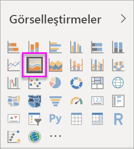

# Basit Alan grafiği

[!INCLUDE [power-bi-visuals-desktop-banner](../includes/power-bi-visuals-desktop-banner.md)]

Basit alan grafiği (katmanlı alan grafiği olarak da bilinir) çizgi grafiğini temel alır. Eksen ve çizgi arasındaki alan, hacmi gösteren renklerle doldurulur. 

Alan grafikleri, zaman içindeki değişimin büyüklüğünü vurgular ve bir eğilime ilişkin toplam değere dikkat çekmek için kullanılabilir. Örneğin, zaman içindeki kârı gösteren veriler, bir alan grafiğinde toplam kârı vurgulayacak şekilde gösterilebilir.

## Basit alan grafikleri ne zaman kullanılır?
Basit alan grafikleri aşağıdaki durumlarda harika bir seçimdir:

* zaman serilerindeki hacim eğilimlerini görmek ve karşılaştırmak için 
* fiziksel olarak hesaplanabilen bir kümeyi temsil eden ayrı seriler için

### Önkoşullar
Bu öğreticide [Perakende Analizi örneği .PBIX dosyası](https://download.microsoft.com/download/9/6/D/96DDC2FF-2568-491D-AAFA-AFDD6F763AE3/Retail%20Analysis%20Sample%20PBIX.pbix) kullanılmıştır.

1. Menü çubuğunun sol üst köşesinden **Dosya** > **Aç**’ı seçin
   
2. **Perakende Analizi örneği PBIX dosyasının** kopyasını bulun

1. **Perakende Analizi örneği PBIX dosyasını** rapor görünümünde  açın.

1. Seç  yeni bir sayfa ekleyin.

## Basit alan grafiği oluşturma
 

1. Bu adımlar, aya göre bu yılın satışını ve geçen yılın satışını görüntüleyen bir alan grafiği oluşturmanıza yardımcı olur.
   
   a. Alanlar bölmesinde **Sales \> Last Year Sales** ve **This Year Sales > Değer** seçeneğini belirleyin.

   

   b.  Görsel öğeler bölmesinden Alan grafiği simgesini seçerek grafiği, basit bir alan grafiğine dönüştürün.

   
   
   c.  **Eksen** kutusuna eklemek üzere **Time \> FiscalMonth** alanını seçin.   
   
   
   d.  Grafiği aya göre görüntülemek için, üç nokta (görselin sağ üst köşesinde) simgesini seçin ve **Sıralama Ölçütü: Month** seçeneğini belirleyin. Sıralama düzenini değiştirmek için, üç nokta simgesini tekrar seçin ve **Artan düzende sırala** veya **Azalan düzende sırala**'yı seçin.

## Vurgulama ve çapraz filtreleme
Filtreler bölmesini kullanma hakkında bilgi için bkz. [Bir rapora filtre ekleme](../power-bi-report-add-filter.md).

Grafiğinizdeki belirli bir alanı vurgulamak için ilgili alanı veya üst kenarlığını seçin.  Diğer görselleştirme türlerinin aksine, sayfada başka görselleştirmeler varken basit alan grafiklerini vurguladığınızda rapor sayfasındaki diğer görselleştirmeler için çapraz filtre uygulanmaz. Ancak alan grafikleri, rapor sayfasındaki diğer görselleştirmeler tarafından tetiklenen çapraz filtrelemelerden etkilenir. 

1. Alan grafiğinizi seçip **Yeni Mağaza Analizi** rapor sayfasına kopyalayarak (CTRL-C ve CTRL-V) deneyin.
2. Alan grafiğinin gölgeli alanlarından birini ve ardından diğer gölgeli alanı seçin. Sayfadaki diğer görsel öğelerde hiçbir etki olmadığını fark edeceksiniz.
1. Şimdi bir öğe seçin. Alan grafiği üzerindeki etkiye dikkat edin, çapraz filtrelenir.

     

Daha fazla bilgi edinmek için bkz. [Raporlardaki görsel etkileşimler](../service-reports-visual-interactions.md)

## Önemli noktalar ve sorun giderme   
* [Raporu engelli kişiler için daha kolay erişilebilir hale getirme](../desktop-accessibility.md)
* Basit alan grafikleri, katmanlı alanlardaki kapatma nedeniyle değer karşılaştırmaları için kullanışlı değildir. Power BI, alanlardaki çakışmaları göstermek için saydamlıktan yararlanır. Ancak, bu özellik yalnızca iki veya üç farklı alanda düzgün bir şekilde çalışır. Eğilimi üçten fazla ölçüyle karşılaştırmak için çizgi grafikleri kullanmayı deneyin. Hacmi üçten fazla ölçüyle karşılaştırmak için ise ağaç haritası kullanmayı deneyin.

## Sonraki adım
[Power BI'daki raporlar](power-bi-visualization-card.md)  

