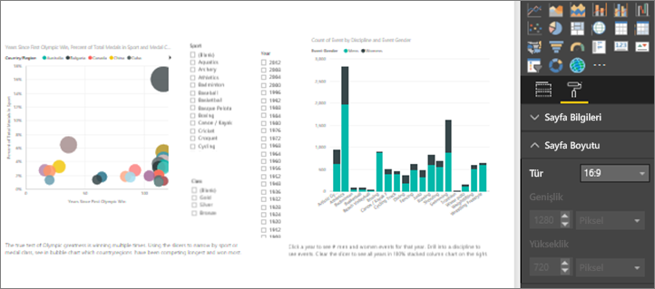
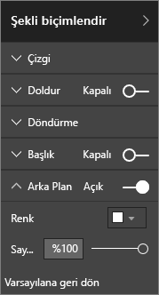
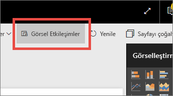

# <a name="best-design-practices-for-reports-and-visuals"></a>Raporlar ve görseller için en iyi tasarım yöntemleri

Bu makale Power BI'da rapor tasarlamaya yönelik en iyi yöntemleri sağlar. Raporlarınıza ve raporu oluşturan sayfalar ile görsellere uygulayabileceğiniz tasarım ilkeleri açıklanır. Bu en iyi uygulamaların çoğu pano tasarımı için de geçerlidir.

> [!NOTE]
> Bu makalede yer alan öneriler, uygun olduğunda uygulamaya alabileceğiniz yönergeler olarak sunulmuştur. Aşağıda açıklanan tüm ilkelerde genelde "oyunun kuralını bozmak" için geçerli nedenler vardır.

Bu makalenin sizin için bir başlangıç noktası olacağını, öğrendiklerinizi kendi raporlarınızda ve görselleştirmelerinize uygulayacağınızı ve [Microsoft Power BI Topluluğu](http://community.powerbi.com/)'nda bilgi alışverişine devam edeceğinizi umuyoruz. BI rapor tasarımı ve görselleştirmesinin kullanımı bu sıralar popüler bir konudur. Bu konuyu ayrıntılı olarak ele alan birçok düşünce lideri, blog yazarı ve web sitesi vardır. Bunların bazılarını makalenin sonunda listeledik.

> *Bilgi yoğunluğunun altında ezilmemizin nedeni elimizde çok fazla bilgi olması değil, bu bilgileri nasıl kullanabileceğimizi bilmiyor olmamızdır.*
-- Stephen Few

## <a name="a-look-at-the-landscape-and-terminology"></a>Ortama ve terimlere bakış

Power BI'da bir raporda bir veya daha fazla rapor sayfası bulunabilir. Bu sayfaların tamamı birlikte rapor olarak adlandırılır. Raporun temel öğeleri görseller (görselleştirmeler olarak da bilinir), tek başına resimler ve metin kutularıdır. Bireysel veri noktalarından rapor öğelerine ve rapor sayfasının kendisine kadar sayısız biçimlendirme seçeneği mevcuttur.

Rapor planlama aşamasından başlayıp temel rapor tasarım ilkeleriyle devam ettikten sonra görsel tasarım ilkelerini ele alacak ve görsel türleriyle ilgili en iyi yöntemlerle incelemeyi tamamlayacağız.

Power BI raporlarını oluşturma ve kullanma hakkında ayrıntılı kılavuzlar ve yönergeler için [Learn Power BI](https://powerbi.microsoft.com/learning/) sayfasını ziyaret edin.

## <a name="before-you-build-your-first-visualization-focus-on-requirements"></a>İlk görselleştirmenizi oluşturmadan önce gereksinimlere odaklanın

Rapor oluşturmanın ilk adımı ilk görseli oluşturmak değildir. İyi bir rapor planlama gerektirir. Çalışma yapacağınız veriler hakkında bilgi sahibi olun ve raporunuzun gereksinimlerini yazın. Kendinize şu soruları sorun:

* İşletmenin ihtiyaçları nelerdir?

* Okuyucular bu verileri nasıl kullanacak?

* Bu verileri kimler kullanacak?

* Okuyucu bu raporu kullanarak hangi kararları almak istiyor?

Bu sorulara vereceğiniz cevaplar tasarımınıza yön verecektir. Her raporun bir hikayesi vardır. Hikayenin işletmenin ihtiyaçlarına uygun olduğundan emin olun. Çarpıcı içgörüler sunan görseller eklemek isteyebilirsiniz ancak bu içgörüler, işletmenin ihtiyaçlarına uygun değilse rapor faydalı olmayacaktır. Aslında bu görsellerle kullanıcıların dikkatini dağıtabilirsiniz. Ayrıca, bu verileri kullanarak karar almak için bilgileri toplayamadığınızı da fark edebilirsiniz. Ölçmeniz gereken şeyi ölçmek için bu raporu kullanabilir misiniz?

Raporları izleme, keşfetme, takip etme, tahmin etme, ölçme, yönetme ve test etme gibi çeşitli amaçlarla kullanabilirsiniz. Örneğin işletmeye performansı ölçen bir satış raporu gerekiyor olabilir. Geçerli satışları inceleyen, bunları önceki yılın ve rakiplerin satışlarıyla karşılaştıran ve uyarı tetikleyen KPI'ler içeren bir rapor tasarlayabilirsiniz. Raporu okuyanlar muhtemelen satış rakamlarının detayına giderek satışları etkileyen mağaza kapanışlarını veya tedarik zinciri sorunlarını da görmek isteyecektir. Başka bir detaylandırma seçeneği de mağazaya, bölgeye, ürüne, sezona ve diğer ölçütlere göre satışları incelemektir.

Raporun hedef müşterilerini tanıyın. Hem onların aşina olduğu terimleri kullanan hem de müşterinin bilgi düzeyinde ayrıntı sunan bir rapor tasarlayın. Birden fazla türde müşteriniz mi var? Her duruma uygun bir çözüm yoktur. Uzmanlık düzeyini temel alarak ayrı rapor sayfaları tasarlayın. Müşterilerin kendilerine uygun sayfayı bulabilmesi için her sayfayı açıkça etiketlediğinizden emin olun. Alternatif olarak, müşterilerin sayfaları kendilerine göre özelleştirmesi için dilimleyiciler kullanabilirsiniz. Müşteriyi planlama aşamasına dahil ederek ihtiyaçları kendiniz belirlemek yerine onlardan öğrenin. Bu ihtiyaçları kendiniz belirleme hatasını yaparsanız, baştan başlamaya ve işlemleri yinelemeye hazır olun.

İşletmenin ihtiyaçlarını, müşterileri ve kullanmak istediğiniz ölçümleri belirledikten sonraki adım, hikayeyi anlatmak için doğru görselleri seçmektir. Bu görselleri mümkün olan en verimli şekilde nasıl göstereceğinizi bulun. Şimdi rapor tasarımının bazı temel ilkeleriyle başlayalım.

## <a name="principles-of-report-design"></a>Rapor tasarım ilkeleri

Rapor sayfalarındaki yer sınırlıdır ve en zor şeylerden biri, istediğiniz tüm öğeleri bu sınırlı alana sığdırıp bilgilerin kolayca anlaşılır olmasını sağlamaktır. Ayrıca, görsel olarak çekici bir raporun değerini de gözden kaçırmayın. Önemli olan cazip bir raporla kullanışlı bir rapor arasındaki dengeyi bulmaktır.

Şimdi düzen, netlik ve estetik konularını ele alalım.

### <a name="layout-of-the-report-canvas"></a>Rapor tuvalinin düzeni

Rapor tuvalindeki alan sınırlıdır. Tüm öğeleri tek bir rapor sayfasına sığdıramazsanız raporu sayfalara bölün. Rapor sayfasını belirli bir hedef kitleye (örneğin İK, BT, Satış, Üst Yönetim) göre uyarlayabilirsiniz. İsterseniz işle ilgili belirli bir soru için de uyarlayabilirsiniz:

* "Hatalar kapalı kalma süremizi nasıl etkiliyor?"

* "Pazarlama kampanyamız Yaklaşımı nasıl etkiledi?"

Buna devam eden bir hikaye olarak yaklaşmak daha iyi olabilir. İlk sayfada genel bir bakış veya dikkatleri çekecek bir “kanca” bulunabilir, ikinci sayfada verilerin hikayesiyle devam edilebilir ve üçüncü sayfada hikaye daha derinden incelenebilir. Raporunuzun tamamının tek bir sayfaya sığması da sorun olmaz. Sığmıyorsa içeriği mantıksal parçalara ayırarak birden fazla rapor sayfası oluşturabilirsiniz. Sayfalara anlamlı ve kullanışlı adlar vermeyi unutmayın.

Bunu bir sanat galerisini doldurmak gibi düşünün. 50 parça sanat eserini küçük bir odaya doldurup, aynı odaya sandalyeleri yerleştirip her duvarı farklı bir renge boyamak istemezsiniz. Galerinin küratörü olarak yalnızca ortak teması olan parçaları seçebilirsiniz. Onların odanın çevresine yerleştirip ziyaretçilerin dolaşması ve düşünmesi için geniş yer bırakırsınız. Neye baktıklarını açıklayan bilgilendirici kartlar bile yerleştirebilirsiniz. Modern galerilerin çoğunda duvarların düz renk olmasının bir nedeni vardır!

Bu makalede, üzerinde çok çalışılması gereken bir rapor örneğiyle başlayacağız. En iyi yöntemlerimizi ve tasarım ilkelerimizi uyguladıkça raporumuz gelişecek.


**Şekil 1: Bu çirkin rapor sayfasında yapılacak çok iş var**

Yukarıdaki örnekte aşağıda ele alacağımız birçok alan (düzen) sorunu mevcut:

* Hizalama, sıralama ve yakınlık kullanımı

* Boşluk ve sıralama özelliklerinin kötü kullanımı

* Dağınıklık

### <a name="alignment-order-and-proximity"></a>Hizalama, sıralama ve yakınlık

Rapor öğelerinin düzeni, okuyucunun kavramasını etkiler ve onu rapor sayfasında yönlendirir. Öğeleri yerleştirme ve konumlandırma şekliniz bir hikaye oluşturur. Hikaye "buradan başlayıp sonra buraya bakın" veya "bu üç öğe birbiriyle ilgili" şeklinde olabilir.

* Birçok kültürde kullanıcılar soldan sağa ve yukarıdan aşağı doğru bakar. En önemli öğeyi raporunuzun sol üst köşesine yerleştirin. Görsellerin geri kalanını mantıksal bir gezinti sunacak ve bilgilerin kavranmasını sağlayacak şekilde düzenleyin.

* Okuyucunun seçim yapmasını gerektiren öğeleri, seçenekten etkilenecek olan görselleştirmelerin sol tarafına yerleştirin. Dilimleyiciler buna örnek olarak verilebilir.

* Konumla ilgili öğeleri birbirine yakın yerleştirin. Yakınlık, öğelerin ilişkili olduğuna işaret eder.

* İlişki belirtmenin farklı bir yöntemi ise ilgili öğelerin etrafına çerçeve veya arkasına renkli arka plan eklemektir. Diğer taraftan raporun farklı bölümlerini birbirinden ayırmak için ayırıcı kullanabilirsiniz.

* Rapor sayfasının farklı bölümlerini ayırmak için beyaz alanı kullanın.

* Rapor sayfasını doldurun. Çok fazla beyaz alan kaldıysa görselleştirmelerinizi büyütün veya tuvali küçültün.

* Rapor öğelerinizin boyutunu belirlerken bilinçli olun. Görselleştirmelerin boyutunu boş alana göre ayarlamayın.

* Diğerlerinden daha önemli olan öğeleri daha büyük hale getirin veya dikkat çekmek için ok gibi görsel öğeler kullanın.

* Rapor sayfasındaki öğeleri, simetrik veya bilinçli olarak asimetrik şekilde hizalayın.

Şimdi hizalamaya daha yakından bakalım.

#### <a name="alignment"></a>Hizalama

Hizalama farklı bileşenlerin aynı boyutta olması gerektiği anlamına gelmez. Raporun her satırında aynı sayıda bileşen olacağı anlamına da gelmez. Yalnızca sayfada gezintiyi ve okumayı yönlendiren bir yapı olduğunu gösterir.

Güncelleştirilmiş raporumuzda rapor bileşenlerini sol ve sağ kenarlara hizaladığımızı görebiliriz. Ayrıca her rapor satırını yatay ve dikey olarak da hizaladık. Dilimleyiciler, etkiledikleri görsellerin sol tarafına alınmıştır.


**Şekil 2: Yukarıdaki çirkin raporun düzen değişiklikleriyle geliştirilmiş hali**

Power BI, görsellerinizi hizalamanıza yardımcı olacak araçlara sahiptir. Power BI Desktop'ta birden fazla görsel seçiliyken, görsellerin konumunu ayarlamak için **Görsel Araçlar** şerit sekmesindeki **Hizala** ve **Dağıt** seçeneklerini kullanabilirsiniz.


**Şekil 3a: Power BI Desktop'ta görselleri hizalama araçları**


**Şekil 3b: Power BI hizmetinde görselleri hizalama araçları**

Power BI hizmetinde ve Power BI Desktop'ta görsellerin boyutu ve konumu üzerinde de tam denetiminiz vardır. Bu denetimi tüm görseller için **Biçim** bölmesinin **Genel** sekmesinde bulabilirsiniz:


**Şekil 4: Görselinizin tam konumunu ayarlama**

Örnek rapor sayfamızda (Şekil 2) Power BI iki kartın ve geniş kenarlığın **X Konumu**'nu 200 olarak ayarlanmıştır.

#### <a name="fit-to-the-space"></a>Alana sığdırma

Elinizdeki alanı en iyi şekilde kullanın. Kişilerin raporu nasıl göreceğini ve görüntüleyeceğini biliyorsanız, rapor tasarımında bunu göz önünde bulundurun. Tuvali doldurmak için boş alanı azaltın. Tek tek görsellerde kaydırma çubuğu görüntülenmemesi için elinizden geleni yapın. Alanı doldururken görsellerin de sıkışmış gibi görünmesini önleyin.

##### <a name="adjust-the-page-size"></a>Sayfa boyutunu ayarlama

Sayfa boyutunu küçülttüğünüzde öğeler sayfaya göre daha büyük hale gelir. Sayfadaki görsellerin seçimini kaldırın ve **Biçim** bölmesindeki **Sayfa Boyutu** sekmesini kullanın.

Burada önce **4:3**, ardından da **16:9** boyutunu kullanan bir rapor sayfası gösterilmiştir. Sayfa düzeninin 16:9 boyutuna daha uygun olduğuna dikkat edin. İkinci görseldeki kaydırma çubuğunu kaldırmak için yeterli alan da vardır.


**Şekil 5a: Sayfa boyutu oranı 4:3 olan rapor**



**Şekil 5b: Sayfa boyutu 16:9 olan rapor**

Diğer kişiler raporunuzu 4:3 veya 16:9 boyutunda mı yoksa başka bir en boy oranında mı görüntülüyor? Küçük ekran mı yoksa büyük ekran mı kullanılacak? Raporunuzu mümkün olan tüm en boy oranları ve boyutlarda görüntüleyecekler mi? Tasarım sırasında bu noktaya dikkat edin.

Örnek rapor sayfası biraz sıkışık görünüyor. Hiçbir görsel seçili değilken:

1.  simgesini seçerek **Biçim** bölmesini açın.

1. **Sayfa Boyutu**'nu genişletin.

1. **Tür** olarak **Özel** seçin.

1. **Yükseklik** değerini **900** olarak değiştirin.

    

**Şekil 6: Sayfa yüksekliğini artırma**

#### <a name="reduce-clutter"></a>Dağınıklığı azaltma

Sayfadaki öğelerin dağınık olması durumunda rapor ilk bakışta anlaşılamayacak ve kullanıcıların gözünü korkutarak ilgilerini dağıtabilecektir. Gerekli olmayan tüm öğeleri rapordan kaldırın. Kavrama veya gezinti konusunda yardımcı olmayacak özellikler eklemeyin. Bilgiyi mümkün olduğunda açık, hızlı ve anlaşılır bir şekilde sunmanız gerekir.

Edward Tufte, *The Visual Display of Quantitative Information* (Nicel Bilgilerin Gösterimi) kitabında bunu "veri/mürekkep oranı" olarak nitelemiştir. Kısacası gerekli olmayan her şeyi kaldırın.

Dağınıklığı kaldırmanız rapor sayfanızda boş alanın artmasına yol açar. Bu sayede [Hizalama, sıralama ve yakınlık](#alignment-order-and-proximity) bölümünde öğrendiğimiz en iyi yöntemleri uygulamak için daha fazla alanınız olur.

Örneğimiz şimdiden daha iyi görünüyor. Dağınıklık yaratan öğeleri kaldırdık ve öğeleri bir arada gruplamak için şekiller ekledik. Arka plan resmini kaldırdık, gereksiz ok şeklini ve metin kutusunu kaldırdık, görsellerin birini raporun farklı bir sayfasına taşıdık ve benzeri düzeltmeler yaptık. Beyaz alanı artırmak için sayfa boyutunu da artırdık.


**Şekil 7: Çirkin raporumuzun dağınıklığı giderildi**

### <a name="tell-a-story-at-a-glance"></a>Hikayeyi tek seferde anlatın

Kilit nokta, önceden bilgi sahibi olmayan birinin, başka bir kişinin anlatmasına gerek kalmadan raporu hızla anlayıp anlamaması olacaktır. Okuyucuların bir bakışta sayfada ne anlatıldığını ve her grafiğin/tablonun hangi bilgileri ilettiğini görebilmesi gerekir.

Okuyucular raporunuza baktığında, gözleri sizin ilk göstermek istediğiniz öğelere odaklanmalıdır. Ardından gözleriyle soldan sağa ve yukarıdan aşağıya izlemeye devam ederler. Bu davranışı değiştirmek için metin kutusu etiketi, şekil, kenarlık, boyut ve renk gibi görsel ipuçları ekleyebilirsiniz.

#### <a name="text-boxes"></a>Metin kutuları

Bazen görselleştirme başlıkları yeterince bilgi vermeyebilir. Raporlarınızı görüntüleyen kişilerle iletişim kurmak için metin kutusu ekleyebilirsiniz. Rapor sayfasını, bir görsel grubunu veya tek bir görseli açıklamak için metin kutularını kullanın. Bu kutular sonuçları açıklar; bir görselin, görseldeki bileşenlerin veya görseller arasındaki ilişkilerin daha iyi şekilde tanımlanmasını sağlar. Metin kutularını, farklı ölçütlere göre dikkat çekme amacıyla kullanabilirsiniz.

Power BI hizmetinde üst menü çubuğundaki **Metin Kutusu**'nu seçin. (Power BI Desktop uygulamasında şeridin **Ekle** bölümünden **Metin Kutusu**'nu seçin.)


**Şekil 8: Power BI hizmetinde metin kutusu ekleme**

Boş kutuya metin girin. Sonra yazı tipi, boyut, hizalama ve diğer özellikleri ayarlamak için denetimleri kullanın. Kutuyu yeniden boyutlandırmak için tutamaçları kullanın.


**Şekil 9: Metin kutusunu biçimlendirme**

Aşırıya kaçmayın. Raporda çok fazla metin olması görsellere gölge düşürür. Rapor sayfanızı anlaşılır hale getirmek için aşırı metin eklemeniz gerektiğini fark ederseniz baştan başlayın. Hikayeyi tek başına anlatan farklı bir görsel seçme olanağınız var mı? Kendi başlığını değiştirerek görseli daha anlaşılır hale getirmeniz mümkün mü?

#### <a name="text"></a>Metin

Metin stil kılavuzu oluşturun ve raporunuzun tüm sayfalarında aynı stili kullanın. Birkaç yazı tipi, metin boyutu ve renk seçin. Bu stil kılavuzunu metin öğelerine uygulayın. Ayrıca görselleştirmelerinizin içindeki yazı tipi seçimlerine de uygulayın. [Görselleştirmelerin parçası olan başlıklar ve etiketler](#titles-and-labels-that-are-part-of-the-visualizations) bölümüne bakın. Kalın ve italik metnin, büyük boyutlu yazı tipinin, belirli renklerin ve diğer stillerin ne zaman kullanılacağına ilişkin kurallar belirleyin. Metinlerin tamamını büyük harfle yazmaktan veya hepsinin altını çizmekten kaçınmaya çalışın.

#### <a name="shapes"></a>Şekiller

Şekiller gezinti ve içeriği kavrama konusunda da yardımcı olabilir. İlgili bilgileri bir araya toplamak ve önemli verileri vurgulamak için şekilleri, gözü yönlendirmek için de okları kullanın. Şekiller okuyuculara raporunuzun hangi kısmından başlamaları ve nasıl ilerlemeleri gerektiğini anlatır. Bu durum tasarım dünyasında genellikle *karşıtlık* olarak adlandırılır.


**Şekil 10a: Power BI hizmetinde şekiller**


**Şekil 10b: Power BI Desktop'ta şekiller**

Örnek sayfamız şimdi nasıl görünüyor? Şekil 11'de metin boyutlarının, yazı tiplerinin ve renklerin tutarlı bir şekilde kullanıldığı daha derli toplu bir sayfa gösterilir. Sol üst köşedeki sayfa başlığı sayfanın içeriği hakkında bilgi vermektedir.


**Şekil 11: Metin kılavuzları uygulanmış ve başlık eklenmiş rapor örneği**

Örneğimizde okuyucuların ilk baktığı nokta olan sol üst köşeye bir rapor sayfası başlığı ekledik. Başlığın sayfanın geri kalanından ayrılması için yazı tipi boyutu 28 nokta, yazı tipi ise Segoe Bold olarak belirlendi. Metin stili kılavuzumuzda arka plan, siyah başlıklar, göstergeler ve etiketler önerilmiyordu. Sayfadaki tüm görsellere bunu mümkün olduğunca uyguladık (Birleşik harita eksenleri ve etiketleri düzenlenebilir değil). Bunun yanı sıra bu öğeler stil kılavuzunun belirtimlerine göre yapılandırıldı:

* Kartlar: **Kategori etiketi** **Kapalı** olarak ayarlandı, **Başlık** **Açık**, 12 nokta boyutunda, siyah ve ortalanmış olarak ayarlandı.

* Görsel başlıkları: Bunlar **Açık** olduğunda, 12 nokta boyutunda ve sola hizalı olarak ayarlayın.

* Dilimleyiciler: **Üst Bilgi** **Kapalı**, **Başlık** ise **Açık** olarak ayarlandı. **Öğeler** > **Metin** seçeneğini gri ve 10 nokta olarak bırakın.

* Dağılım ve Sütun grafikleri: X ve Y Eksenleri ile kullanılıyorsa X ve Y Ekseni başlıkları için siyah yazı tipi.

#### <a name="color"></a>Renk

Rengi tutarlılık sağlama amacıyla kullanın. Daha sonra [Görsel tasarım ilkeleri](#principles-of-visual-design) bölümünde rengi daha ayrıntılı bir şekilde inceleyeceğiz. Şimdi bilinçli renk seçimleri yapma konusuna değiniyoruz. Rengin dikkati dağıtıp okuyucuların raporunuzu hemen anlayabilmesini önlememesi gerekiyor. Çok fazla parlak renk, hisleri kötü yönde etkileyebilir. Bu bölümde daha çok renklerin nasıl kullanılmaması gerektiği anlatılmaktadır.

#### <a name="backgrounds"></a>Arka planlar

Rapor sayfalarının arka planını belirlerken raporu gölgede bırakmayan, sayfadaki diğer renklerle çakışmayan veya genelde gözleri zorlamayan renkler seçin. Bazı renklerin belirli anlamlara sahip olduğunu unutmayın. Örneğin ABD'de rapor içindeki kırmızı renkler "kötü" olarak yorumlanır.


**Şekil 12: Rapor arka planını ayarlama**

Sanat eseri değil işlevsel bir rapor oluşturduğunuzu unutmayın. Rapor öğelerinin okunabilirliğini ve önceliğini geliştiren bir renk seçin. Web sayfalarında renk ve görselleştirme kullanımıyla ilgili bir çalışmada, renkler arasında yüksek karşıtlık olmasının kavrama hızını artırdığı bulunmuştu. Bu konuyu irdeleyen iki inceleme vardır:

* [Metin ve arka plan renginin Web sayfalarında görsel arama üzerindeki etkisi](https://www.sciencedirect.com/science/article/pii/S0141938202000410)

* [Kullanıcıların Web Sayfasının Görsel Karmaşıklığını ve Estetik Özelliklerini Nasıl Algıladığını Saptama](https://www.researchgate.net/publication/301362579_Determining_Users'_Perception_of_Web_Page_Visual_Complexity_and_Aesthetic_Characteristics)

Renklerle ilgili en iyi uygulamaların bazılarını örnek raporumuza (Şekil 20 ve 21) uyguladık. En çok dikkat çeken nokta arka plan renginin siyah olarak değiştirilmiş olmasıdır. Sarı renk çok parlak olduğundan göz alıyordu. Ayrıca **Count of athlete name by year and class** grafiğindeki çubukların sarı bölümü, sarı renkli arka planda kayboluyordu. Siyah (veya beyaz) arka plan en yüksek karşıtlığı sağlar ve görselleri odak noktası haline getirir.

Örnek raporu geliştirmek için gerçekleştirdiğimiz ek adımlar şunlardır:

#### <a name="page-title"></a>Sayfa başlığı

Arka planı siyah olarak değiştirdiğimizde metin kutusu yalnızca siyah yazı biçimine izin verdiğinden başlık kayboldu. Bu sorunu gidermek için metin kutusu başlığı ekledik:

1. Metin kutusu seçili durumdayken metni silin.

1. **Görselleştirmeler** sekmesinde **Başlık**'ı seçin ve **Açık** olarak ayarlayın.

1. Oku seçerek **Başlık** seçeneklerini genişletin.

1. **Başlık Metni** alanına **Summer Olympic Games** metnini girin.

1. **Yazı tipi rengi** olarak beyaz seçin.

    

    **Şekil 13: Sayfa başlığı ekleme**

#### <a name="cards"></a>Kartlar

Kart görselleri için:

1.  simgesini seçerek **Biçim** bölmesini açın.

1. **Arka Plan**'ı **Açık** olarak ayarlayın.

1. **%0** **Saydamlık** değerine sahip beyaz rengi seçin.

    

1. Ardından **Başlık**'ı **Açık** olarak ayarlayın.

1. **Yazı tipi rengi** alanında beyaz ve **Arka plan rengi** alanında siyah seçin.

    

#### <a name="slicers"></a>Dilimleyiciler

Bu noktaya kadar iki dilimleyicinin biçimlendirmeleri farklıydı. Bu tasarım açısından mantıklı değildir. İki dilimleyici için de: 

1. Arka plan rengini açık deniz mavisi olarak değiştirin.

    

    **Şekil 14: Dilimleyici arka plan rengini değiştirme**

    Sayfanın renk paletinde bulunduğu için açık deniz mavisi iyi bir seçenektir. Bunu kartogramda, ağaç haritasında ve sütun grafiğinde görebilirsiniz.

1. Beyaz renkte ince bir kenarlık ekleyin.

    

    **Şekil 15: Dilimleyiciye kenarlık ekleme**

1. Gri yazı tipini açık deniz mavisi üzerinde görmek zordur, bu nedenle **Öğeler** rengini beyaz olarak değiştirin.

    

    **Şekil 16: Dilimleyici yazı tipi rengini değiştirme**

1. Son olarak, **Başlık** bölümünde **Yazı tipi rengi** olarak beyazı, **Arka plan rengi** olarak da siyahı seçin.

    

    **Şekil 17: Dilimleyici başlığını biçimlendirme**

#### <a name="rectangle-shape"></a>Dikdörtgen şekli

Dikdörtgen de siyah arka planda kaybolmuştu. Bu sorunu çözmek için:

1. Şekli seçin.

1. **Şekli biçimlendir** bölmesinde **Arka plan** seçeneğini **Açık** konuma kaydırın.

    

    **Şekil 18: Şekli biçimlendirme**

#### <a name="column-charts-bubble-chart-filled-map-and-treemap"></a>Sütun grafikleri, kabarcık grafikleri, kartogram ve ağaç haritası

Rapor sayfasındaki diğer görsellere beyaz arka plan ekleyin. **Biçim** bölmesinde:

1. **Arka plan** seçeneğini genişletin.

1. **Renk** olarak beyazı ayarlayın.

1. **Saydamlık** ayarını 0 yapın.

    

    **Şekil 19: Diğer görselleştirmelere beyaz arka plan ekleme**

Raporun siz yeniden biçimlendirdikten sonraki görünüşü:


**Şekil 20: En iyi renk yöntemlerinin uygulandığı rapor örneği (siyah arka plan)**


**Şekil 21: En iyi renk yöntemlerinin uygulandığı rapor örneği (beyaz arka plan)**

### <a name="aesthetics"></a>Estetik

Yukarıda estetik kategorisinde sınıflandırabileceğimiz konuların çoğuna değindik: hizalama, renk, yazı tipi seçimler ve dağınıklık. Rapor tasarımı açısından üzerinde durmaya değer birkaç en iyi yöntem daha vardır. Bunlar raporun genel görünümüyle ilgilidir.

Raporunuzun amacının güzel olmak değil işletme ihtiyaçlarını karşılamak olduğunu unutmayın. Özellikle ilk izlenim söz konusu olduğunda göze güzel gelen noktalara yer verilmesi de önemlidir. Nashville danışmanlarından Tony Bodoh bu durumu "Duygular mantıktan yarım saniye önce harekete geçer" sözüyle ifade etmiştir. Okuyucular rapor sayfanıza ilk önce duygusal düzeyde bir tepki verecektir. Ayrıntıları inmeleri biraz daha zaman alır. Sayfanız düzensiz, karmaşık veya amatör görünüyorsa okuyucunuz hikayesini keşfetmek istemeyebilir.

Blog yazarı ve TechTarget sektör analisti Wayne Eckerson bu konuda harika bir benzetme yapmıştır. Rapor tasarlamak, bir odayı dekore etmeye benzer. Farklı zamanlarda vazo, kanepe, sehpa ve tablo gibi parçalar satın alırsınız. Bu eşyaların hepsini ayrı ayrı beğenirsiniz. Seçimlerin her biri kendi başına anlamlı olduğu halde bir araya geldiklerinde birbirleriyle çakışır veya dikkat çekme yarışına girer.

Şu noktalara yoğunlaşın:

* Raporunuz için ortak bir tema veya görünüm oluşturup bunu tüm rapor sayfalarına uygulama.

* Tek tek resimleri ve diğer grafikleri dikkat dağıtmak için değil, gerçek hikayeyi desteklemek için kullanma.

* Makalenin bu bölümüne kadar bahsedilen en iyi yöntemlerin tümünü uygulama.

## <a name="principles-of-visual-design"></a>Görsel tasarım ilkeleri

Rapor tasarım ilkelerini ve rapor öğelerinin raporun hızla anlaşılmasını sağlayacak şekilde düzenlenmesini gözden geçirdik. Şimdi görsellerle ilgili tasarım ilkelerini inceleyeceğiz. Sonraki bölümde de görsellerin ayrıntısına inerek sık kullanılan bazı görsel türleriyle ilgili en iyi yöntemleri anlatacağız.

Örnek rapor sayfamızı bir kenara bırakıp diğer örneklere göz atacağız. Görsel tasarım ilkelerini incelemeyi tamamladıktan sonra örnek rapor sayfamıza dönerek öğrendiklerimizi uygulayacağız. Adım adım yönergeler sağlayacağız.

### <a name="planning--choose-the-right-visual"></a>Planlama: doğru görseli seçme

Bir raporu oluşturmaya başlamadan önce plan yapmanız ne kadar önemliyse her görsel için de plan yapmanız o kadar önemlidir. Kendinize "Bu görselle nasıl bir hikaye anlatmak istiyorum?" sorusunu sorun ve ardından hikayeyi en iyi anlatacak görsel türünü belirleyin. Satış döngüsü ilerlemesini çubuk grafikle de gösterebilirsiniz ancak şelale veya huni grafiği daha iyi olmaz mı? Bu işlemde yardım almak için bu makalenin son bölümü olan [Görsel türleri ve en iyi yöntemler](#visual-types-and-best-practices) bölümünü okuyun. Burada en yaygın görsel türlerinden bazıları için in iyi yöntemler açıklanır. Seçtiğiniz ilk görsel türü en iyi seçenek çıkmazsa şaşırmayın. Hikayeyi en iyi anlatanı belirlemek için birden fazla görsel türünü deneyin.

Nicel ve kategorik veriler arasındaki farkı kavrayın ve her bir veri türüne en uygun görsel türlerini öğrenin. Nicel veriler genelde ölçü olarak adlandırılır ve çoğunlukla sayısal verilerdir. Kategorik veriler genelde boyut olarak adlandırılır ve bunları sınıflandırabilirsiniz. Bu durum [Doğru ölçüyü seçme](#choose-the-right-measure) bölümünde daha ayrıntılı olarak incelenmiştir.

Yalnızca raporunuzun daha etkileyici görünmesini sağlamak için süslü veya karmaşık görsel türlerini kullanma dürtüsüne kapılmayın. Amacınız hikayenizi en basit şekilde anlatmak olmalıdır. Yatay Çubuk grafikler ve basit Çizgi grafikler bilgileri hızla iletebilir. Bunlar sık kullanılan öğeler olduğundan çoğu kullanıcı tarafından kolayca yorumlanabilir. Ayrıca hedef kitlenizin çoğunluğu soldan sağa ve yukarıdan aşağıya doğru okuduğu için bu iki grafik türünü kolayca tarayabilir ve bilgileri hızla kavrayabilir.

Hikayeyi anlamak için görselinizin kaydırılması gerekiyor mu? Mümkünse kaydırmadan kaçının. Filtreleri uygulamayı ve hiyerarşileri/detaya gitme işlevlerini kullanmayı deneyin. Bu öğeler kaydırma çubuğunun kaldırılmasını sağlamıyorsa farklı bir görsel türü seçmeyi göz önünde bulundurun. Kaydırmayı ortadan kaldıramıyorsanız, okuyucularınız yatay kaydırmayı dikey kaydırmaya tercih eder.

Hikayeniz için mevcut en iyi görseli seçmiş olsanız bile hikayeyi anlatırken yine de destek almanız gerekebilir. Etiketler, başlıklar, menüler, renkler ve boyutlar bu konuda size yardımcı olacaktır. Bu tasarım öğelerini daha sonra [Tasarım öğeleri](#design-elements) bölümünde inceleyeceğiz.

### <a name="choose-the-right-measure"></a>Doğru ölçüyü seçme

Görselinizin anlattığı hikaye inandırıcı mı? Önemli mi? Sırf yapmış olmak için görsel oluşturmayın. Belki verilerinizin ilgi çekici bir hikaye anlatacağını düşünmüştünüz ama durum öyle olmadı. Baştan başlamaktan ve daha çok ilgi çekecek bir hikaye bulmaktan korkmayın. Belki de hikaye vardır ancak farklı bir şekilde ölçmeniz gerekiyordur.

Diyelim ki satış müdürlerinizin başarısını ölçmek istiyorsunuz. Bunun için hangi ölçüyü kullanmanız gerekir? Bunu en iyi şekilde ölçmek için toplam satış rakamlarına mı, toplam kâra mı, önceki yıldaki büyüme oranına mı yoksa belirli bir hedefi tutturma performansına mı bakmanız gerekir? Satış temsilcisi Sally en yüksek kâra sahip olabilir. Satış temsilcilerine göre toplam kârı bir çubuk grafikte gösteriyorsanız, bu diğer satış temsilcileri arasında bir yıldız gibi parlayabilir. Sally'nin satış maliyeti (seyahat giderleri, gönderim masrafları, üretim maliyetleri vb.) yüksekse yalnızca satış rakamlarına bakmak en iyi hikayeyi sunmayacaktır.

#### <a name="reflect-reality-dont-distort-reality"></a>Gerçeği yansıtın, gerçekleri çarpıtmayın

Gerçeği çarpıtan bir görsel oluşturmak mümkündür. Veri analizi meraklılarının kötü görseller olarak kabul ettikleri görselleri paylaştığı bir web sitesi vardır. Yorumlarda da genelde ilgili görseli oluşturup dağıtan şirketin yarattığı hayal kırıklığı ifade edilir. Kötü bir görsel ilgili şirketin güvenilir olmadığını mesajını verir.

Bu nedenle, gerçeği kasıtlı olarak çarpıtmayan ve anlatmak istediğiniz hikayeyi ifade etmek için manipüle edilmemiş görseller oluşturun. Şu örneği inceleyebilirsiniz:


**Şekil 22: Çarpıtılmış gerçeklik grafiği**

Bu örnekte dört şirket arasında çok büyük bir fark varmış ve CorpB şirketi diğer üç şirketten çok daha başarılıymış gibi görünüyor. X Ekseninin sıfırdan başlamadığına ve şirketler arasındaki farkın muhtemelen hata marjı içinde kaldığına dikkat edin. Aynı veriler sıfırdan başlayan bir X Eksenine yerleştirildiğinde aşağıdaki gibi görünür.


**Şekil 23: Gerçekçi grafik**

Okuyucular genelde X Ekseninin sıfırdan başladığını kabul eder. Sıfırdan başlamamaya karar verirseniz, bunu sonuçları çarpıtmayacak şekilde yapın. Örneğin normal kullanımdan sapmaya işaret eden bir görsel ipucu veya metin kutusu ekleyebilirsiniz.

### <a name="design-elements"></a>Tasarım öğeleri

Tür ve ölçü seçip görseli oluşturduktan sonra en yüksek verimlilik için ince ayar yapmaya başlayabilirsiniz. Bu bölüm şunları kapsamaktadır:

* Düzen, boşluk ve boyut

* Metin öğeleri: etiketler, açıklamalar, menüler, başlıklar

* Sıralama

* Görsel etkileşim

* Renk

#### <a name="tweaking-visuals-for-best-use-of-space"></a>En iyi alan kullanımı için görselleri ayarlama

Birden fazla grafiği bir rapora sığdırmaya çalışıyorsanız veri-mürekkep oranınızı artırmak, verilerinizdeki hikayeyi daha iyi anlatmanıza yardımcı olacaktır. Yukarıda belirtildiği gibi Edward Tufte "veri-mürekkep oranı" terimini üretmiştir. Amaç okuyucunun verileri yorumlama olanağını azaltmadan grafikten mümkün olduğunca çok işareti kaldırmaktır.

Aşağıdaki ilk grafik kümesinde gereksiz eksen etiketleri vardır: **Jan 2014**, **Apr 2014** vb. Başlıklarda **by Date** tekrarlanmaktadır. Her grafiğin başlığı da grafiğin üzerindeki ayrılmış yatay alanı kullanmaktadır. Grafik başlıklarını kaldırıp ayrı eksen etiketlerini açarak mürekkeplerin bir kısmını kaldırmış ve alanı daha iyi kullanmış olduk. Daha fazla mürekkep azaltmak ve daha fazla veri alanı açmak için üstteki iki grafiğin eksen etiketlerini kaldırabiliriz.

Vurgulamak istediğiniz belirli dönemler varsa grafiklerin arkasından çizgiler veya dikdörtgenler çizebilirsiniz. Bunu yaparak okuyucunun gözünü yukarı ve aşağı yönlendirebilir, daha rahat karşılaştırma yapmasını sağlayabilirsiniz.


**Şekil 24: Önce**


**Şekil 25: Sonra**

**Eksen başlıklarını açmak ve kapatmak için**

1. Görseli seçip etkin duruma getirin.

1.  simgesini seçerek **Biçim** bölmesini açın.

1. **X Ekseni** veya **Y Ekseni** seçeneklerini genişletin.

1. **Başlık** kaydırıcısını açık veya kapalı konuma sürükleyin.

    

    **Şekil 26: Eksen başlıklarını açma ve kapatma**

##### <a name="to-turn-axis-labels-on-and-off"></a>Eksen etiketlerini açmak ve kapatmak için

1. Görseli seçip etkin duruma getirin.

1.  simgesini seçerek **Biçim** bölmesini açın.

1. **X Ekseni** ve **Y Ekseni** alanlarının yanında kaydırıcılar vardır.

1. Etiketleri açmak veya kapatmak için kaydırıcıyı sürükleyin.

    

    **Şekil 27: Eksen etiketlerini açma ve kapatma**

    > [!TIP]
    > Y Ekseni etiketlerini kapatacağınız senaryolardan biri, **Veri etiketleri** özelliğinin açık olmasıdır.

##### <a name="to-remove-visual-titles"></a>Görsel başlıklarını kaldırmak için

1. Görseli seçip etkin duruma getirin.

1.  simgesini seçerek **Biçim** bölmesini açın.

1. **Başlık** kaydırıcısını **Kapalı** konuma getirin.

    

    **Şekil 28: Görsel başlıklarını kaldırma**

Okuyucularınızın raporu nasıl görüntüleyeceğini düşünün. Görsellerinizin ve metinlerinizin metnin okunabilecek büyüklükte ve renkte olduğundan emin olun. Sayfadaki görsellerden biri diğerlerine göre daha büyükse okuyucular bunun en önemli görsel olduğunu düşünebilir. Raporunuzun dağınık ve karışık görünmemesi için görseller arasında yeterli boşluk bırakın. Okuyucularınızın gözlerini yönlendirmeye yardımcı olması için görsellerinizi hizalayın.

##### <a name="to-resize-a-visual"></a>Görseli yeniden boyutlandırmak için

1. Görseli seçip etkin duruma getirin.

1. Boyutunu ayarlamak için tutamaçlardan birini tutup sürükleyin.

    

    **Şekil 29: Görseli yeniden boyutlandırma**

##### <a name="to-move-a-visual"></a>Görseli taşımak için

1. Görseli seçip etkin duruma getirin.

1. Görselin üst orta kısmındaki kavrama çubuğunu seçip tutun

1. Görseli yeni konumuna sürükleyin.

    

    **Şekil 30: Görseli taşıma**

#### <a name="titles-and-labels-that-are-part-of-the-visualizations"></a>Görselleştirmelerin parçası olan başlıklar ve etiketler

Başlıkların ve etiketlerin okunaklı ve anlaşılır olduğundan emin olun. Başlıklardaki ve etiketlerdeki metinlerin ayırt edici renklerde ve en uygun boyutta olması gerekir. Makalenin başlarındaki stil kılavuzunu hatırlıyor musunuz (yukarıdaki [Metin](#text) bölümüne bakın)? Renk sayısını ve boyutları sınırlandırın. Çok farklı yazı tipi boyutu ve rengi kullandığınızda sayfanız karışık görünür. Rapor sayfasındaki tüm görsellerin başlığında aynı yazı tipi rengini ve boyutunu kullanmayı göz önünde bulundurun. Ayrıca rapor sayfasındaki tüm başlıklarda aynı hizalamayı seçin.

**Biçim bölmesi**

Aşağıdaki biçimlendirme değişikliklerinin her biri için boya rulosu simgesini  seçerek seçerek **Biçim** bölmesini açın.


**Şekil 31: Biçim bölmesini açma**

Ardından, ayarlanacak görsel öğeyi seçin ve **Açık** ayarının seçildiğinden emin olun. Görsel öğe örnekleri: **X Ekseni**, **Y Ekseni**, **Başlık**, **Veri etiketleri** ve **Gösterge**. Aşağıdaki örnekte **Başlık** öğesi gösterilmektedir.


**Şekil 32: Görsel başlığını biçimlendirme**

##### <a name="set-the-text-size"></a>Metin boyutunu ayarlama

Başlıkların ve veri etiketlerinin metin boyutu ayarlanabilir ama X veya Y Eksenleri ve göstergelerde ayarlayamazsınız. Özel olarak veri etiketleri için **Görüntü birimleri** ve **Ondalık Basamak** sayısında değişiklikler yapın. Sonunda raporunuzda görüntülenecek bilgiler için en uygun ayrıntı düzeyini bulacaksınız.

##### <a name="set-the-text-alignment"></a>Metin hizalamayı ayarlama

Başlık için sola, sağa veya ortaya hizalamayı seçebilirsiniz. Bu seçeneklerden birini belirleyip sayfadaki tüm görsellerde aynı ayarı kullanın.

##### <a name="set-the-text-position"></a>Metin konumunu ayarlama

Bazı Y Eksenlerinde ve göstergede metin konumunu ayarlayabilirsiniz. Hangi seçimi yaparsanız yapın, sayfadaki diğer Y Eksenleri ve göstergelerde de aynı ayarı kullanın.

##### <a name="set-the-title-and-label-length"></a>Başlık ve etiket uzunluğunu ayarlama

Başlıkların, eksen başlıklarının, veri etiketlerinin ve açıklamaların uzunluğunu ayarlayın. Bu öğelerden herhangi birini görüntülemeye karar verirseniz uzunluk ayarının yapılması (metin boyutuyla birlikte) Power BI'ın değerleri kesmediğinden emin olmanızı sağlar:

* **Başlık** ve **Gösterge** için **Başlık Metni** ayarı kullanılır. Görselde yer alacak gerçek başlığı girin.

* **X Ekseni** ve **Y Ekseni** için **Stil** ayarı kullanılır ve açılan listeden seçim yapabilirsiniz.

* **Veri etiketleri** için **Görüntüleme** ve **Ondalık** ayarı kullanılır. **Görüntüleme** açılır menüsünü kullanarak ölçü birimlerini seçin: **milyon**, **bin**, **yok**, **otomatik** vb. Power BI'da görüntülenecek ondalık basamak sayısını belirlemek için **Ondalık** alanını kullanabilirsiniz.

##### <a name="set-the-text-color"></a>Metin rengini ayarlama

Başlıkların, eksenlerin ve veri etiketlerinin metin rengini ayarlayabilirsiniz.

#### <a name="titles-and-labels-that-arent-part-of-the-visualizations"></a>Görselleştirmelerin parçası olmayan başlıklar ve etiketler

Bu makalenin önceki bölümlerinde rapor sayfalarına metin kutusu ekleme konusunu ele almıştık. Bazen görselleştirme başlıkları yeterince bilgi vermeyebilir. Raporlarınızı okuyan kişilere ek bilgi vermek için metin kutusu ekleyebilirsiniz.

Rapor sayfanızın çok karmaşık veya çok dolu görünmemesi için metin kutularındaki yazı tiplerinin, boyutlarının, renklerin ve hizalamanın tutarlı olmasını sağlayın. Bir metin kutusundaki metinde değişiklik yapmak için metin kutusunu seçerek biçimlendirme menüsünü açın.


**Şekil 33: Metin kutusunda kullanılan yazı tipini biçimlendirme**

#### <a name="sorting"></a>Sıralama

Daha hızlı içgörü sağlama fırsatlarından biri, görsellerin sıralamasını ayarlamaktır. Örneğin Çubuk grafikleri, çubuklardaki değerlere göre azalan veya artan sırada düzenlemeniz, önemli artış bilgilerini daha fazla alan kullanmaya gerek kalmadan hızla göstermenizi sağlar.

Grafiği sıralamak için:

1. Grafiğin sağ üst köşesindeki üç noktayı seçin.

1. **Sırala**'yı seçin.

1. Sıralama ölçütü olarak kullanmak istediğiniz alanı ve sıralama yönünü seçin.

Daha fazla bilgi için bkz. [Görsellerin sıralanma şeklini değiştirme](../consumer/end-user-change-sort.md).

#### <a name="chart-interaction-and-interplay"></a>Grafikler arası etkileşim

Power BI'ın en önemli özelliklerinden biri, grafiklerin birbirleriyle etkileşim kurma şeklini değiştirmenin mümkün olmasıdır. Grafikler varsayılan olarak çapraz şekilde vurgulanmıştır. Bir veri noktasını seçtiğinizde diğer grafiklerdeki ilgili veriler vurgulanır ve ilgili olmayan veriler soluk hale gelir. Bu davranışı geçersiz kılmak için herhangi bir grafiği gerçek filtre olarak kullanabilirsiniz. Bu size sayfa alanından tasarruf sağlayacaktır. Bu değişikliği yapmak için Power BI hizmetinde menü çubuğundan **Görsel Etkileşimler**'i seçin.



**Şekil 34: Görsel etkileşimler**

Ardından, sayfadaki görsellerin her biri için seçilen görseli filtreleme, vurgulama veya herhangi bir işlem yapmama ayarını yapabilirsiniz. Tüm görselleri vurgulayamazsınız. Vurgulayamadığınız görseller için vurgulama denetimi sağlanmaz. Daha fazla bilgi için bkz. [Power BI'da görsel etkileşimler](../consumer/end-user-interactions.md).

> [!TIP]
> Power BI'ı kullanmaya yeni başlamış olan okuyucular, seçerek etkileşim kurma özelliğini ilk bakışta kavrayamayabilir. Okuyucuların seçerek daha fazla içgörüye ulaşabileceği noktaları belirtmek için metin kutuları kullanın.

#### <a name="the-use-of-color-in-visuals"></a>Görsellerde renk kullanımı

Bu makalenin önceki bölümlerinde, raporda renk kullanmak için plan yapmanın önemini vurgulamıştık. Bu bölümde tekrarlanan noktalar mevcuttur ancak öncelikle görsellerdeki renk kullanımı ele alınacaktır. Burada da aynı ilkeler geçerlidir. Renkleri, raporu bir araya getirmek, önemli verileri vurgulamak ve okuyucunun görseli daha iyi kavramasını sağlamak için kullanın. Çok fazla farklı renk kullanmak dikkati dağıtabilir. Okuyucunun nereye bakacağına karar vermesini zorlaştırır. Raporun iyi anlaşılması güzel görünmesinden daha önemlidir. Yalnızca içeriğin daha iyi kavranması amacıyla renk ekleyin.

> [!TIP]
> Hedef kitlenizi tanıyın ve belirli renk kurallarını öğrenin. Örneğin ABD'de yeşil genellikle "iyi", kırmızı ise genellikle "kötü" anlamına gelir.

Aşağıdaki bölümlerde şunları kapsar:

* Veri rengi

* Veri etiketi rengi

* Kategorik değerlere uygun renkler

* Sayısal değerlere uygun renkler

##### <a name="use-colors-to-highlight-interesting-data"></a>Renkleri ilgi çekici verileri vurgulama amacıyla kullanma

Renk kullanmanın en kolay yolu, dikkat çekmek istediğiniz bir veya daha fazla veri noktasının rengini değiştirmektir. Bu örnekte, Olimpiyat oyunlarının 4 yılda bir yerine Kış ve Yaz oyunları şeklinde 2 yılda bir düzenlenmeye başladığı noktada renk değişmektedir.


**Şekil 35: Renkleri hikaye anlatmak için kullanma**

Veri noktası renklerini, **Biçim** bölmesinin **Veri renkleri** sekmesinden değiştirebilirsiniz. Veri noktalarını birbirinden bağımsız olarak özelleştirmek için **Tümünü göster** ayarının **Açık** olduğundan emin olun.


**Şekil 36: Veri noktası renklerini ayarlama**

> [!NOTE]
> Power BI, rapor görsellerinize varsayılan temayı uygular. Tasarımcılar tema renklerini seçerken çeşitlilik ve karşıtlık sağlamayı hedefler. Varsayılan tema paletinden farklı bir renk kullanmak için **Özel renk** seçeneğini belirleyin.
>
> 
>
> **Şekil 37: Özel renk seçme**

Power BI Desktop'ta ikinci bir seri kullanarak bir çizginin **Aykırı Değerlerini** veya belirli bir bölümünü de vurgulayabilirsiniz:


**Şekil 38: Desktop kullanarak aykırı değerleri çizme**

Burada **Aykırı değerler** serisindeki değerler yalnızca Ağustos ayındaki ortalama sıcaklık 60 derecenin altına indiğinde mevcuttur. Bu sonucu elde etmek için şu formülü kullanan bir DAX hesaplanmış sütunu oluştururuz:

```
Outliers = if(Editions[Temp]<60, Editions[Temp], BLANK())
```

Bu örnekte üç aykırı değer vardır: **1952**, **1956** ve **2000**.

##### <a name="colors-for-labels-and-titles"></a>Etiket ve başlık renkleri

Kullanabileceğiniz tüm biçimlendirme seçeneklerini incelediğinizde başlıklara ve göstergelere renk ekleyebileceğiniz birçok farklı yer olduğunu göreceksiniz. Örneğin veri etiketlerinin ve eksen başlıklarının rengini değiştirebilirsiniz. Ama dikkatli olun. Genelde tüm görsel başlıklarında aynı rengin kullanılması tercih edilir. Bu makaledeki diğer yönergeler gibi, her zaman kurallara karşı gelmeyi gerektiren durumlar ve nedenler vardır. Kurallara karşı gelmeye karar verirseniz bunu iyi bir nedenle yapın.

##### <a name="colors-for-categorical-values"></a>Kategorik değerlere uygun renkler

Bir seri içeren grafiklerin açıklama bölümünde genelde kategorik değerler vardır. Örneğin, aşağıdaki açıklamada bulunan her renk, farklı bir Country/Region kategorisini göstermektedir.


**Şekil 39: Varsayılan renkler uygulandı**

Tasarımcılar Power BI'ın farklı kategorik değerlerde farklı renkler kullanarak ayrım yapmayı kolaylaştırmak için tercih ettiği varsayılan renkleri seçmiştir. Bazen kullanıcılar bu renkleri kurumsal renk düzenlerine uyacak şekilde değiştirebilir ancak bu bazı sorunlara yol açabilir.


**Şekil 40: Tek bir rengin tonları olarak uygulanmış renk**

Tek bir tonun kullanılıp renkler arasındaki yoğunluğun değiştirildiği bu görsel, kategoriler arasında hatalı bir sıralama yapılmasına neden olmuştur. Koyu renkli kabarcıkların açık renkli kabarcıklardan daha yüksek veya daha düşük değere sahip olduğunu ima etmektedir. Bu kategorik değer sıralamasında alfabetik sıra haricinde geçerli bir sıralama mevcut değildir.

Varsayılan renkleri değiştirmek için  simgesini seçerek **Biçim** bölmesini açın ve **Veri renkleri**'ni seçin.

##### <a name="colors-for-numerical-values"></a>Sayısal değerlere uygun renkler

Belirli bir sıralamaya veya sayısal değere sahip olan alanlarda veri noktalarının rengini değere göre belirleyebilirsiniz. Veri noktalarını değere göre renklendirme, değerlerin veriler üzerindeki dağılımını göstermenin yanı sıra Power BI'ın tek grafikte iki değişkeni göstermesini de sağlar. Aşağıdaki grafikte en fazla madalya kazanın Çin olduğu net bir şekilde görünürken Japonya ve Tayland'ın daha fazla sayıda Olimpiyat oyununa katılmış olduğu söylenebilir.


**Şekil 41: Veri noktalarını değere göre renklendirme**

Bu grafiği oluşturmak için:

1. Görseli seçip etkin duruma getirin.

1.  simgesini seçerek **Biçim** bölmesini açın.

1. **Veri renkleri** > seçenek > **Koşullu biçimlendirme**'yi seçin:

    

    **Şekil 42: Koşullu biçimlendirme'yi seçme**

1. **Varsayılan renk - *Veri renkleri*** iletişim kutusunda bu renkleri ayarlayın.

    

    **Şekil 43: Doygunluk için kullanılan renkleri ayarlama**

Renkleri, merkezdeki değerin etrafındaki sapmayı vurgulamak için de kullanabilirsiniz. Örneğin pozitif değerleri yeşil, negatif değerleri ise kırmızı renkle gösterebilirsiniz. Pozitif ve negatif değerlere renk atarken kültürel farklılıklara dikkat edin. Her kültürde kırmızı kötü, yeşil de iyi için kullanılmaz.


**Şekil 44: Merkezdeki değerin etrafındaki sapmayı vurgulamak amacıyla renk kullanımı**

### <a name="principles-of-visual-design--applied-to-example-report-page"></a>Görsel tasarım ilkeleri: örnek rapor sayfasına uygulama

Şimdi yukarıda değindiğimiz görsel ilkeleri örnek raporumuza uygulayalım.


**Şekil 45: Örnek raporumuz (önce)**


**Şekil 46: Örnek raporumuz (sonra)**

#### <a name="what-did-we-do"></a>Hangi işlemleri yaptık?

| Öğe | Açıklama |
| ---- | ----------- |
| Dilimleyici | Sayfa düzeyinde filtre ekleyip yalnızca **Altın**, **Gümüş** ve **Bronz**'u seçerek dilimleyicilerdeki boşlukları kaldırdık. <br> **Seçim Denetimleri** ayarını **Tek Seçim** ve **Tümünü Seç** için **Kapalı** hale getirdik. |
| Kabarcık | Göstergede çok fazla öğe olduğu için ekranın kaydırılması gerekiyordu. Açıklamayı kaldırarak **Kategori etiketlerini** etkinleştirdik. Müşteriler ayrıntıları görmek için kabarcıkların üzerine gelebilir.<br> Başlığı kısalttık ve yeterince anlaşılabilir olduğu için "by country region" bölümünü kaldırdık. <br> Grafiği daha kolay anlaşılır hale getirmek için iki eksenin de etiketlerini **Açık** duruma getirdik. |
| Kartogram | Verileri öne çıkarmak için **Veri renklerini** değiştirdik. <br> **Ayrılan** ayarını açıp **Minimum**'u pembe, **Maksimum**'u ise kırmızı olarak ayarladık.
| Treemap | Yalnızca ABD için ayarlanmış olan filtreyi kaldırdık. <br> **Veri etiketleri** ayarını bir ondalık basamak kullanılacak şekilde belirledik. <br> Görsel neredeyse her zaman 3 madalya için %33 değerini verdiğinden kullanışlı olmayan **Sınıf** alanını kullanıyordu: Altın, Gümüş ve Bronz. <br> Farklı ve daha ilgi çekici bir alan olan **Cinsiyet** alanını seçtik. Tasarım amacıyla Aquatics rengini mavi, Athletics rengini ise gri olarak değiştirdik.
| Üst çubuk grafik | Başlığı kısalttık, veri etiketlerini kaldırdık, gösterge başlığını kapattık. <br> Başlığın kelime sırasını, altındaki grafiğe uyacak şekilde değiştirdik.
| Alt çubuk grafik | Yukarıdaki grafiğe uyması için yıla göre artan düzende sıraladık. <br> Renkleri sınıfla eşleşecek şekilde değiştirdik. <br> Başlığı değiştirdik. <br> Verilere daha fazla alan açmak için açıklamayı kapattık. <br> Veri etiketleri etkinleştirildi. Görsel etiketlerin kolayca okunamayacağı kadar küçük olduğundan bunlar raporda gösterilmeyecek. Yalnızca okuyucu görseli **Odak** modunda açtığında gösterilecek. [Odak modu](../consumer/end-user-focus.md) hakkında bilgi edinin. <br> **Araç İpuçları**'na **Etkinlik Sayısı (Benzersiz)** eklendi. Artık yığılmış sütunun üzerine geldiğinizde, araç çubuklarında kişilerin bu yıl kaç yarışmaya katıldığı da bildirilir. |
| Görsel Etkileşimler | Sürekli toplam oyun ve spor sayısını göstermelerini istediğimiz için iki kartın da etkileşimlerini devre dışı bıraktık. |

## <a name="visual-types-and-best-practices"></a>Görsel türleri ve en iyi uygulamalar

Power BI birçok yerel görsel türü sağlar. Bunlara Microsoft ve Power BI topluluğundan edinebileceğiniz özel görselleri de eklediğinizde, toplam seçenek sayısı burada yer veremeyeceğimiz kadar çoğalmış olur. Burada en çok kullanılan yerel görsel türlerinin bazılarını ele alacağız.

### <a name="line-charts"></a>Çizgi grafikler


Çizgi grafikler, zaman içinde değişen verileri incelemenin ideal yollarından biridir. Verilere tabloda baktığınızda gözlerinizin çıkışlara, inişlere, döngülere ve modellere verdiği hızlı tepkilerden faydalanamamış olursunuz. Aşağıdaki örnekte verilen madalya sayısındaki ve bu madalyaları kazanan atlet sayısındaki eğilimler gösterilmiştir.


**Şekil 47: Çizgi grafikler**

#### <a name="best-practices"></a>En iyi yöntemler

* Çizgi grafiklere bakan kullanıcıların ilk gördüğü şey, eğrinin şeklidir. Dolayısıyla zaman veya dağıtım kategorileri gibi eğriyi mantıklı hale getiren bir X ekseniniz olması gerekir. X eksenine ürün veya coğrafya gibi kategorik alanları yerleştirdiğinizde Çizgi grafik ilgi çekici olmayacaktır. Çünkü eğrinin şekli anlamlı bilgiler vermeyecektir.

* Bunun gibi seriler arasında daha kolay karşılaştırma yapmak için alt alta birden fazla grafik eklemek isterseniz X eksenlerini hizalayın. Power BI'ın aynı değer aralığını gösterdiğinden emin olmak için filtre kullanın. Tarih aralıklarına bakıyorsanız bunların aynı olduğundan emin olun. Örnek olarak iki grafikte de 1896 ile 2012 arasını kullanabilirsiniz.

* Alanın tamamını kullanın. Verileriniz açısından anlamlı oluyorsa Y Ekseninin **Başlangıç** ve **Bitiş** noktalarını grafiğinizin altındaki ve üstündeki boş alanı yok edecek şekilde ayarlayın. Bu yaklaşım görselin gerçek veri noktalarına odaklanmasına da yardımcı olur. **Başlangıç** ve **Bitiş** noktalarını ayarlamak için:

  1. Görseli seçip etkin duruma getirin.

  1.  simgesini seçerek **Biçim** bölmesini açın.
  
  1. **Y Ekseni** alanını genişletip **Başlat** ve **Son** noktalarını belirleyin.
  
      
  
      **Şekil 48: Başlangıç ve Bitiş noktalarını ayarlama**

* **Başlangıç** ve **Bitiş** noktalarını açıkça belirtmenin bir başka nedeni de aynı sayfadaki aynı Y Ekseni alanını kullanan iki veya daha fazla grafiği karşılaştırabilmenizdir. Örneğin, toplam olay sayılarına bakıyorsanız ve Birleşik Krallık rakamları 1 ile 70 arasındayken Avustralya rakamları 1 ile 12 arasındaysa iki Çizgi grafikte farklı Y Eksenleri görüntülenecektir (Şekil 49). Bu da ilk bakışta karşılaştırma yapmayı zorlaştırır. Bunun yerine grafikleri aynı Y Ekseni aralığını kullanacak şekilde ayarlayın (Şekil 50).
  
  
  
  **Şekil 49: Farklı Y Eksenlerine sahip Çizgi grafikler**
  
  
  
  **Şekil 50: Eşleşen Y Eksenlerine sahip Çizgi grafikler**

Daha fazla bilgi için bkz:

* [X Ekseni ve Y Ekseni özelliklerini özelleştirme](power-bi-visualization-customize-x-axis-and-y-axis.md)

* [Çizgi Grafikler ve Düzensiz Aralıklar: Uyumsuz Bir Ortaklık](http://www.perceptualedge.com/articles/visual_business_intelligence/line_graphs_and_irregular_intervals.pdf)

* [Veri Görselleştirmeye Giriş: Çizgi Grafikler](http://www.columnfivemedia.com/data-visualization-101-line-charts)

### <a name="bar-and-column-charts"></a>Çubuk ve Sütun grafikleri


Çizgi grafiklerin verilerin zaman içindeki değişimini gösterme alanında standart olması gibi Çubuk grafikler de belirli bir değerin farklı kategorilerdeki durumlarını gösterme alanında standarttır. Çubukları sayıya göre sıralarsanız en yüksek değerleri ve dağılımı kolayca görebilirsiniz. Yatay Çubuk grafikler uzun etiketlerle daha iyi sonuçlar verir.


**Şekil 51: Yatay Çubuk grafik**

#### <a name="best-practices"></a>En iyi yöntemler

* Değerlerin veri etiketlerini görüntüleyin. Bu sayede belirli değerler daha kolay tanımlanabilir. Veri etiketlerini görüntülemek için: 

  1. Görseli seçip etkin duruma getirin.

  1.  simgesini seçerek **Biçim** bölmesini açın.
  
  1. **Veri etiketleri**'ni **Açık** olarak ayarlayın.

      

      **Şekil 52: Veri etiketlerini etkinleştirme**

* Yukarıdaki çubuk grafik, zamanın belirli bir noktasında bir ölçümü diğer birçok ölçümle karşılaştırmak için idealdir. Çizgi grafiğin zaman içindeki eğilimi gösterdiği gibi çubuk grafik de tek bir kategori için belirli bir zamandaki eğilimi gösterir. Çubuk grafiğe baktığımızda İspanya'nın %24,70 ile en kötü işsizlik oranına sahip olduğunu görebiliriz.

* Bir Çubuk veya Sütun grafiğin tamamının ayrılan alana sığmaması durumunda Power BI kaydırma çubukları ekler. Mümkün olduğunda ve mantıklıysa görselin ve raporun yapısını, grafiğin tamamını gösterecek şekilde ayarlayın. Bu şekilde okuyucu tüm dağılımın genel bir görünümünü elde edebilir. Maalesef dünya üzerindeki ülkelerin sayısı göz önüne alındığında bu işlemi örneğimizde yapmamız mümkün değildir.

  Dahil edilen değerleri sınırlamanın yöntemlerinden biri filtre kullanmaktır. Örneğin, yalnızca işsizlik oranının %20'nin üzerinde olduğu ülkeleri gösteren bir **Görsel düzeyi** filtresi ekleyebilirsiniz.

* Çubuk veya Sütun grafiklerinde detaya gidebilirsiniz (ve yeniden detaydan çıkabilirsiniz). Bu, daha fazla alan kaplamadan bir görsele daha fazla bilgi eklemenin en iyi yöntemlerinden biridir. Aşağıdaki örnekte Regions > Countries hiyerarşisi mevcuttur. Bölge çubuğuna çift tıkladığınızda o bölgeyi oluşturan ülkeler açılır. Ayrıtı modu hakkında daha fazla bilgi için bkz. [Power BI’daki görselleştirmelerde ayrıntı modu](../consumer/end-user-drill.md).
  
  
  
  **Şekil 53: Detaya gitme**

Çubuk ve Sütun grafikler hakkında daha fazla bilgi için:

* [Veri Görselleştirmeye Giriş: Çubuk Grafikler](https://insights.newscred.com/data-visualization-101-bar-charts/)

* [Veri Görselleştirme Kataloğu: (Veri Görselleştirme Kataloğu: Ağaç haritalar)](http://www.datavizcatalogue.com/methods/bar_chart.html#.VYV-hY3bLJw)

* [Veri Görselleştirme Kataloğu: (Veri Görselleştirme Kataloğu: Birden Çok Kümeli Çubuk Grafik)](http://www.datavizcatalogue.com/methods/multiset_barchart.html#.VYV_gI3bLJw)

### <a name="stacked-bar-and-column-charts"></a>Yığılmış Çubuk grafikler ve Sütun grafikleri


Çubukta veya sütunda farklı kategorileri yığarak Çubuk ve Sütun grafiklerinize yeni bir boyut ekleyin. Artık grafik bir eğilim hakkında bilgi vermesinin yanı sıra (yüksekliğe ve uzunluğa göre) kategorilerin ilgili eğilim üzerindeki etkilerini de göstermektedir. Aşağıdaki grafikte 2014 yılında geliri 6 milyonun üzerinde olan en iyi futbol takımlarının genel büyümesi gösterilmektedir.


**Şekil 54: Yığılmış sütun grafik**

Bu yığılmış sütun grafik, **Total Revenue** (Toplam Gelir) değerinin zaman içinde arttığını ve **Commercial** ile **Broadcasting** kategorilerinin zaman içinde kararlı bir şekilde yükselerek toplam gelir artışı üzerinde pay sahibi olduğunu göstermektedir. Bununla birlikte bu grafik üç kategorinin birbiri üzerindeki etkisini karşılaştırmayı zorlaştırır. Örneğin, "Broadcasting veya Match Day ile karşılaştırıldığında Commercial kategorisinin büyümesi ne ölçüdedir?" Bu veriler için daha iyi bir seçenek veya bu verilere eklenebilecek görsel, bir Çizgi grafik olacaktır.


**Şekil 55: Çizgi grafiğe dönüştürme**

Bu Çizgi grafikte ticari gelirin en çok arttığını, yayının ve maç gününün de arkasından geldiğini görebilirsiniz.

#### <a name="best-practices"></a>En iyi yöntemler

* Sütun ve Çubuk grafiklerde olduğu gibi yatay veya dikey görüntülemeyi tercih edebilirsiniz. Uzun etiketleriniz varsa yatay, zaman serisi verileriniz varsa dikey daha iyi bir seçenek olacaktır.

* Zaman içindeki eğilimleri veya diğer değişiklik modelleri göstermek istiyorsanız Yığılmış Çubuk ve Sütun grafikleri kullanmayın. Çizgi grafikler gibi seçenekler işinize daha çok yarayacaktır.

* Dağılımın toplam hacme göre veya toplamın yüzde değeri olarak dağıtılmasını da sağlayabilirsiniz.

* Few'ın belirttiği gibi:

    > *... yığılmış çubuk grafiğin parçalarını karşılaştırmak zordur. Parçaları yan yana yerleştirseydiniz ve tümü aynı taban çizgisinden büyümeye başlasaydı yükseklikleri kolayca karşılaştırılabilirdi ancak birbirinin üzerine yerleştirildiğinde bu iş daha zor hale geliyor. Ayrıca değerin (gelir) aydan aya değiştiğini görmek son derece kolay olsa da değerin (gelir) diğer yerlerde (kategoriler) nasıl değiştiğini görmek oldukça zordur*.

* Toplamı 100 yapan yüzde değerlerini kullanırken %100 yığılmış grafiklerden faydalanabilirsiniz. Aşağıdaki örnekte kategorilerin takıma göre ayrılmış halini görüyoruz. Yüzdeler görecelidir ve desenleri bir bakışta görmemizi sağlar. Everton'ın geliri öncelikli olarak Broadcasting (%70'in üzerinde) kaynağından gelirken PSG, gelirinin yalnızca %20'sini Broadcasting kaynağından elde etmektedir. Yatay görüntüleme seçeneği, takım etiketlerinin sığmasını ve gelir türü etkisini görmeyi kolaylaştırır.

  

  **Şekil 56: Yatay yığılmış grafik**

Yığılmış grafikler hakkında daha fazla bilgi için:

* [Veri Görselleştirme Kataloğu: Yığılmış Çubuk Grafikler](http://www.datavizcatalogue.com/methods/stacked_bar_graph.html#top)

* [When are 100% stacked bar graphs useful? (%100 yığılmış çubuk grafikler nerelerde kullanılmalıdır?)](http://www.perceptualedge.com/blog/?p=2239)

### <a name="combo-bar-and-column-charts"></a>Birleşik Çubuk ve Sütun grafikleri


Power BI'da Sütun ve Çizgi grafikleri birleştirerek Birleşik haritalar oluşturabilirsiniz. Seçenekler şunlardır: 

* Çizgi ve Yığılmış Sütun grafik 

* Çizgi ve Kümelenmiş Sütun grafik

İki ayrı görseli birleştirerek değerli tuval alanından tasarruf sağlayabilirsiniz.

Sonraki iki ekran görüntüsünde öncesi ve sonrası gösterilmektedir.


 **Şekil 57: İki ayrı grafik olarak**

İlkinde iki ayrı görsel vardır: Zaman içindeki nüfusu gösteren Sütun grafik ve zaman içindeki GDP değerini gösteren Çizgi grafik. Bu grafikler aynı X Eksenine (yıl) ve değerlerine (2002 ile 2012 arası) sahip olduğundan Birleşik harita için iyi adaylardır. Bunları birleştirerek iki eğilimi tek bir görselde karşılaştırmak istemez misiniz? Bu iki grafiği birleştirdiğinizde verileri daha hızlı şekilde karşılaştırabilirsiniz.


 **Şekil 58: Tek bir birleşik harita olarak**

Yeni rapor sayfasında tek bir görsel bulunur: Çizgi ve Yığılmış Sütun grafik. Bunun yerine bir çizgi ve kümelenmiş sütun grafik de oluşturabilirdik. İki eğilim arasındaki ilişkiyi görmek şimdi daha kolaydır. 2008 yılına kadar nüfus ve GDP verilerinin benzer bir eğilime sahip olduğunu görebiliriz. Ancak, 2009'dan itibaren nüfus artışı düzene girmiş, GDP ise daha dalgalı olmuştur.

#### <a name="best-practices"></a>En iyi yöntemler

* Birleşik haritalar en iyi iki görselin en az bir ekseni ortak olduğunda çalışır.

* Eksenlerinizi izleyin! Birleşik haritanızı okumak ve yorumlamak kolay mı? Farklı aralıklar ve değerler mi kullanılıyor? Sütun grafiğin Y Ekseninin ölçeği, çizgi grafiğin Y Ekseninden çok daha küçükse birleşik harita anlamlı olmayacaktır. En aşağılardaki üçüncü çizgiye (açık deniz mavisi rengindeki) bakın.

   

   **Şekil 59: Başarısız bir Çizgi grafik**

  Aynı şekilde sütun grafiğinizde ve Çizgi grafiğinizde iki farklı ölçü kullanılıyorsa ve iki eksen oluşturmazsanız birleşik haritanız anlamlı olmayacaktır. Örnek olarak dolarla yüzde değerlerini karşılaştırmak düşünülebilir. Okuyucunun grafiği anlamasına yardımcı olmak için iki eksen eklemeniz ve eksenlere etiket uygulamanız önerilir.

  İki eksen oluşturmak için:

    1. Görseli seçip etkin duruma getirin.

    1.  simgesini seçerek **Biçim** bölmesini açın.

    1. **Y Ekseni**'ni genişletin ve **İkincili Göster** seçeneğini **Açık** olarak ayarlayın.

          

          **Şekil 60: İkincil ekseni gösterme**

    1. **Y Ekseni (Sütun)**  > **Başlığı**'nı **Açık** olarak ayarlayın.

    1. **Y Ekseni (Çizgi)**  > **Başlığı**'nı **Açık** olarak ayarlayın.

  Grafik aşağıdaki gibi görünecektir:

  

  **Şekil 61: Yerine geçecek birleşik haritayı oluşturma**

* Çift eksenden faydalanın. Çift eksen farklı değer aralıklarına sahip birden fazla ölçüyü karşılaştırmak için harika bir yoldur. İki ölçü arasındaki bağıntıyı tek bir görselleştirmede ortaya koymaya yardımcı olur.

Daha fazla bilgi için bkz:

* [Power BI'da birleşik grafik](power-bi-visualization-combo-chart.md)

* [Grafiklerde Çift Ölçekli Eksenler: Bunlar En İyi Çözüm Mü? ](http://www.perceptualedge.com/articles/visual_business_intelligence/dual-scaled_axes.pdf)

### <a name="scatter-chart"></a>Dağılım grafiği


Bazen bir arada görmek istediğimiz çok sayıda farklı değişken bulunabilir. Dağılım grafiği genel durumu görmek için yararlı olabilir. Dağılım grafikleri, 2 (Dağılım) veya 3 (Kabarcık) nicel ölçü arasındaki ilişkileri görüntüler. Dağılım grafiğinde her zaman, biri yatay eksende bir sayısal veri kümesi gösteren, diğeri ise dikey eksen üzerinde bir sayısal değer kümesi gösteren iki değer ekseni bulunur. Grafik, X ve Y sayısal değerlerinin kesişim noktalarını gösterir ve bu değerleri tekli veri noktalarına dönüştürür. Power BI bu veri noktalarını yatay eksende eşit olarak veya eşit olmayacak şekilde dağıtılabilir. Bu verilere bağlıdır.

Kabarcık grafiğinde veri noktaları yerine kabarcıklar kullanılır ve kabarcık boyutu verilerin farklı bir boyutunu gösterir.

Aşağıdaki kabarcık grafiği Güney Amerika'yı ele alıp kişi başına GDP (Y Ekseni), GDP toplamı (X Ekseni) ve Güney Amerika ülkesi nüfusunu göstermektedir.


**Şekil 62: Güney Amerika GDP ve nüfusu kabarcık grafiği**

Kabarcıkların boyutu, ilgili ülkenin toplam nüfusunu temsil etmektedir. Brezilya en yüksek nüfusa (kabarcık boyutu) ve Güney Amerika'nın GDP'sinde en yüksek paya sahiptir. X ekseninde en uzakta olan değerdir. Ancak Uruguay, Şili ve Arjantin'deki kişi başı GDP değeri Brezilya'dan daha yüksektir. Y Ekseninde en yukarıda olan değerdir.

Yürütme ekseni eklerseniz Hans Rosling rolüne bürünebilir ve hikayenizi zaman içinde anlatabilirsiniz: [Verilerde İçgörülere ve Etkiye: Microsoft'tan Power View ve PPI ile Afrika'nın İlerleme Durumunu Gösterme](https://www.youtube.com/watch?v=PbaDBJWCeD4). Yürütme ekseni eklemek için **Yürütme Ekseni** kutusuna bir tarih saat alanı sürükleyin.

#### <a name="best-practices"></a>En iyi yöntemler

* Dağılım ve Kabarcık grafikler hikaye anlatma konusunda harikadır. Ama bu grafikler verileri keşfetmeyi sağlama konusunda o kadar kullanışlı değildir. Stephen Few bu noktaya işaret eder:

    > *Bu yaklaşımın gücü bir hikaye anlatırken kullanıldığında kendini gösterir. Rosling'in yorumuyla kabarcıklar etrafta dolanıp değerleri değiştikçe ve görmemizi istediklerini gösterdikçe grafikteki bilgi canlanmaktadır. Diğer taraftan animasyonlu kabarcık grafikleri, verileri kendi kendimize keşfetme ve anlam çıkarma konusunda daha az etkilidir. Rosling'in bu yöntemi hikayeleri yalnızca bilinir hale geldiklerinde söyleme amacıyla keşfetmek için kullanıp kullanmadığı merak konusu. Kabarcıklar hareket ederken birden fazlasını takip edemediğimiz için olan biteni anlama amacıyla animasyonu tekrar tekrar oynatmak zorunda kalabilirsiniz. Seçili kabarcıklara iz ekleyerek bu kabarcıkların ilerledikleri yolun tamamını gözden geçirebiliriz ancak izleri çok sayıda kabarcığa uygulamanız halinde pano hızla dağınık hale gelecektir. Temelde değindiğim nokta bunun inceleme ve çözümleme amacıyla veri görüntülemek için en iyi yöntem olmadığıdır.*

* Hikayeyi anlatmalarına yardımcı olmak için X ve Y Eksenlerine etiket ekleyin. Özellikle Kabarcık grafiklerinde oynatma sırasında çok fazla bileşen vardır ve etiketler, okuyucunun görseli kavramasına yardımcı olur.

* Görselin daha kolay yorumlanması için veri etiketi ekleyin. Özellikle Gösterge bölümünde çok sayıda öğe bulunan Kabarcık grafiklerinde benzer renkleri ayırt etmek zor olabilir. Yukarıdaki görselde Suriname, Columbia ve Ecuador'a ait gösterge renkleri birbirine yakındır.

* Dağılım grafiği oluşturduğunuzda X ve Y Eksenlerindeki verileri yalnızca bir veri noktası mı topluyor? Grafiğiniz tüm değerleri tek bir yatay veya dikey çizgi üzerinde mi topluyor? Toplama sorununu gidermek için **Ayrıntılar** bölümüne bir alan ekleyerek Power BI'a değerleri nasıl gruplandırması gerektiğini anlatın. Alanın, çizmek istediğiniz her nokta için benzersiz olması gerekir. Yardım için bkz. [Power BI dağılım ve kabarcık grafiği eğitimi](power-bi-visualization-scatter.md).

### <a name="treemap-charts"></a>Ağaç haritası grafikleri


Ağaç haritaları özellikle bir bütünü oluşturan farklı bileşenlerin kategorilere göre gruplayabildiğiniz durumlarda birbirine göre boyutunu göstermek için kullanışlı bir yöntemdir. Yeni bir işletmeyi çözmeye çalışırken ana bileşenlerin ağaç haritasına sahip olmak, genel dağılımı öğrenmeniz açısından faydalı olabilir.

Aşağıdaki ilk grafikte Brezilya'nın Güney Amerika'nın GDP'sinin yaklaşık yarısını oluşturduğunu görebilirsiniz. Ayrıca Venezuela ve Arjantin'in de yaklaşık aynı boyutta olduğu görülebilir.

Daha geniş bir bağlama sahip olmak ve yine de en fazla katkıda bulunan ülkelerin etkisiyle ilgili bir fikir edinmek istediğinizi varsayalım. Bölgelerin içinde kategori üyeleriyle (ülkeler) görsel hiyerarşiler oluşturabilirsiniz. Öncelikle, ikinci ağaç haritası bölgelerin birbirlerine göre boyutu hakkında bir fikir veriyor. Sonra da her bölgenin içinde en çok katkıda bulunan ülkeleri görmemizi sağlıyor. Üç büyük bölge olduğunu görebiliyoruz: Avrupa, Asya ve Kuzey Amerika. Bunların içindeki ilk beş ülkeyi/bölgeyi kolayca görebiliriz.

Ağaç haritasının en önemli sınırlaması daha küçük dikdörtgenleri karşılaştırmanın zor olmasıdır. Genel bakış için iyi bir grafiktir ancak farklı bileşenlerin göreli boyutları hakkında daha fazla fikir sahibi olmak için Sütun ve Çubuk grafikler daha iyi bir seçenek olacaktır.

İlk ağaç haritasında GDP boyutunun sırası net bir şekilde gösterilmiştir. Öte yandan özellikle küçük ve etiketsiz yapraklar olmak üzere ülkeler arasındaki farkları tanımlamak zordur. Tek bir grubu karşılaştırdığınız bu veriler için Çubuk veya Sütun grafik daha iyi bir seçenek olabilir.


**Şekil 63: Ağaç haritasında Güney Amerika GDP karşılaştırması**

Ardından başka bir veri düzeyi olarak Bölgeyi ekledik. GDP'nin bölgelere göre toplam etkisini görebiliyoruz. Ayrıca her bölgenin içinde göreli etkisini de görebiliriz. Bu işlemi ayrıntıların toplamının, toplam düzeyinin gerçek değerine karşılık gelmediği toplanabilir olmayan ölçülerde (ortalamalar gibi) yaparken dikkatli olun.


**Şekil 64: Bölgelere ve ülkelere göre GDP ağaç haritası**

Ağaç haritaları hakkında daha fazla bilgi için:

* [Ağaç Haritası Görselleştirmelerini Kullanarak İş Zekasını Keşfetme](http://www.perceptualedge.com/articles/b-eye/treemaps.pdf)

* [Veri Görselleştirme Kataloğu: Ağaç Haritası](http://www.datavizcatalogue.com/methods/treemap.html#.VYhylI3bL7Y)

### <a name="other-charts"></a>Diğer grafikler

#### <a name="pie-or-donut-charts"></a>Pasta grafikleri veya Halka grafikler


Genel olarak Çubuk, Sütun ve Çizgi grafikler çoğu durumda işinizi görecektir. Pasta grafikleri ile Halka grafiklerin insanlar tarafından doğru yorumlanmasının zor olduğu iyi bilinen bir durumdur. Aslında bunlar sıklıkla verileri çarpıtabilir. Mümkünse bu grafikleri kullanmayın. Stephen Few'ın bu grafiklerin tarihi ve tehlikeleri hakkında harika bir yazısı vardır: [Save the Pies for Dessert](https://www.perceptualedge.com/articles/08-21-07.pdf) (Pastayı Yemekten Sonraya Saklayın).

Stephen burada Pasta grafiklerinin yararlı olabileceği tek noktanın parça-bütün ilişkilerini karşılaştırmak olduğunu açıklamıştır. Çok nadir durumlarda %100 Yığılmış Çubuk grafikten daha iyidir.

Pasta grafikleri hakkında başka bir eğlenceli makaleyi (ve animasyonu) [Darkhorse Analytics sitesinde](http://www.darkhorseanalytics.com/blog/salvaging-the-pie) bulabilirsiniz.

#### <a name="radial-gauges--kpis"></a>Radyal ölçerler ve KPI'ler


Radyal ölçerler belirli bir hedefe ulaşma durumunu gösteren yararlı bir görseldir ve özellikle yöneticilere yönelik panolarda popülerdir. Ancak, bu ölçeklerin iki önemli kusuru vardır. Pasta grafiklerinde olduğu gibi gölgeli alanın açısının tam 180 derecelik yay veya hedef çizgiyle karşılaştırılıp yorumlanması zordur. Aynı zamanda kullanıcılara tek bir ölçümü göstermek için çok fazla yer kaplar.

İyi alternatiflerinden biri basit bir KPI görseli kullanmaktır:


KPI'ler aynı miktarda alanda değeri, durumu, hedefi, hedeften sapmayı ve eğilimi gösterir. Veriler hedefe ulaşamadığında yeşil renk kırmızıya döner ve verilerin ara hedeflere ulaşması durumunda sarıya dönebilir. Ölçeğe kıyasla okuması ve yorumlaması çok daha kolaydır.

Daha fazla bilgi için bkz:

* [Power BI'da Radyal Ölçer grafikleri](power-bi-visualization-radial-gauge-charts.md)

* [KPI görselleri](power-bi-visualization-kpi.md)

## <a name="conclusion"></a>Sonuç

Şimdi burada öğrendiğiniz en iyi yöntemleri test edebilirsiniz. İletişim halinde kalın ve kendi en iyi yöntemlerinizi paylaşın. Önerilerimizden farklı fikirleriniz veya kuralları yıkmak için iyi bir nedeniniz mi var? Bu deneyimleri de öğrenmek isteriz.

Başka bir sorunuz mu var? [Power BI Topluluğu'na başvurun](http://community.powerbi.com/)

### <a name="book-recommendations"></a>Kitap önerileri

Ekiplerin görsel tasarım teknikleriyle ilgili bilgilerini tazelemesine yardımcı olacak birçok iyi kitap vardır. Stephen Few'ın *Information Dashboard Design* (Bilgi Panosu Tasarımı) mutlaka okunması gereken kitaplardandır. Diğer iki kitabında daha fazla ayrıntıya girer: *Show Me the Numbers* (Bana Sayıları Göster) ve *Now You See It* (İşte Şimdi Görüyorsunuz). Few ve birkaç farklı yazar, söz konusu alanda klasik olarak kabul edilen *The Visual Display of Quantitative Information* (Nicelik Bilgilerinin Görsel Gösterimi) kitabından ilham almıştır. Tufte, *Visual Explanations* (Görsel Açıklamalar), *Envisioning Information* (Bilgileri Görselleştirme) ve *Beautiful Evidence* (Güzel Kanıt) kitaplarının da yazarıdır. Bir diğer harika seçenek de Andy Kirk’ün yeni kitabı *Data Visualization: A Handbook for Data Driven Design*'dır. Önerilen diğer yazarlardan bazıları: Lachlan James, William McKnight ve Boris Evelson (Forrester), Darkhorse Analytics.
