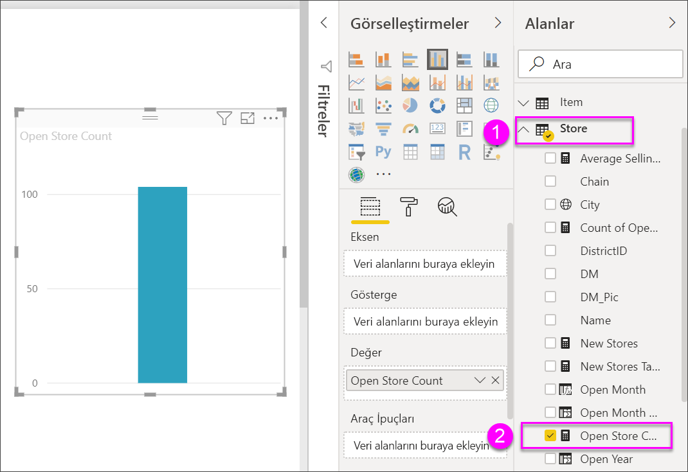
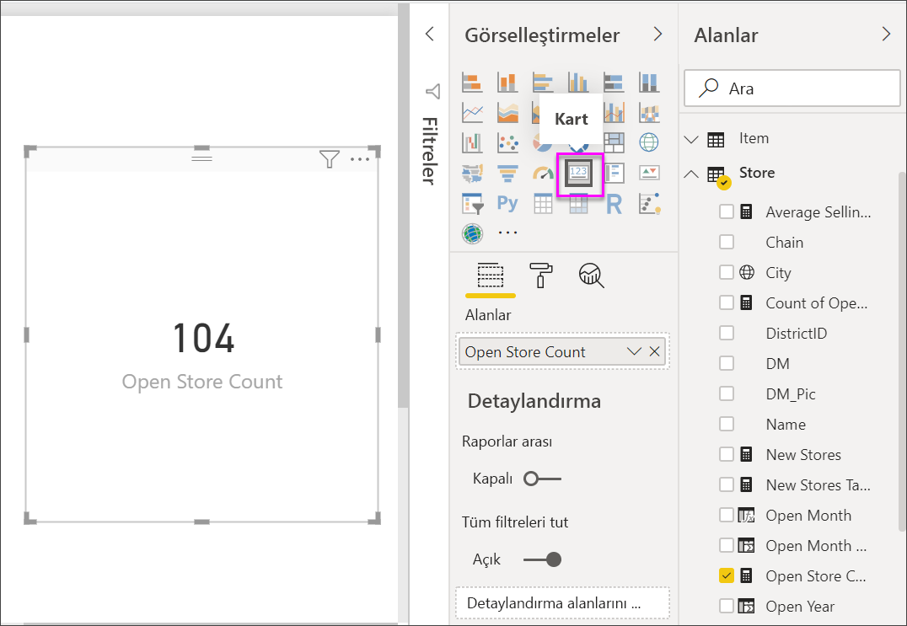
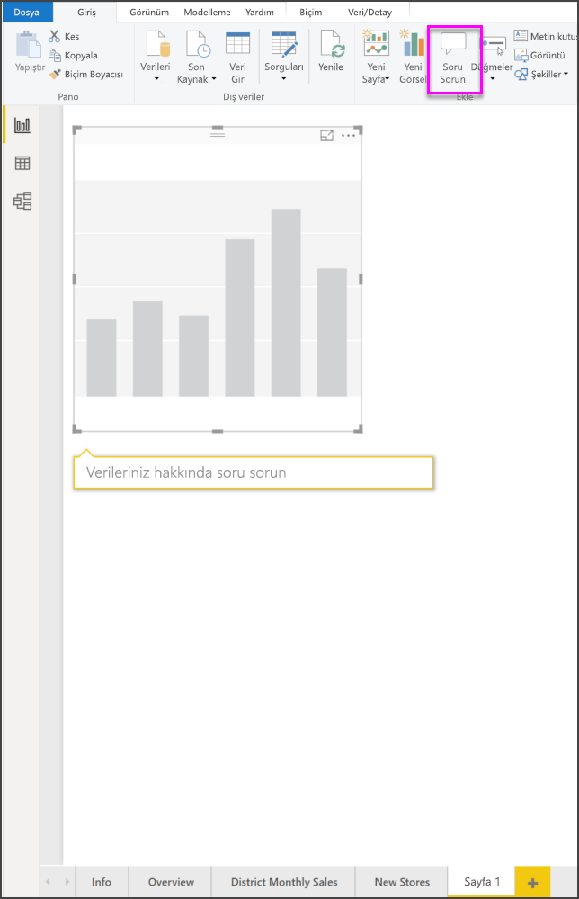
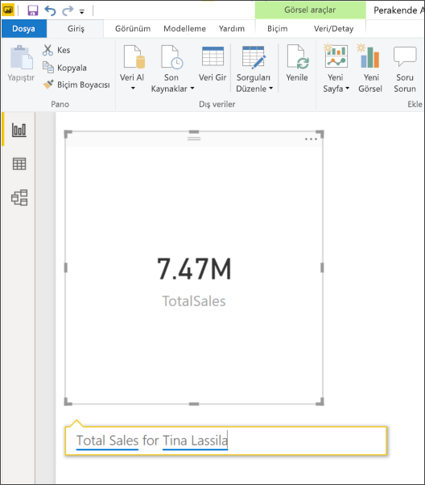
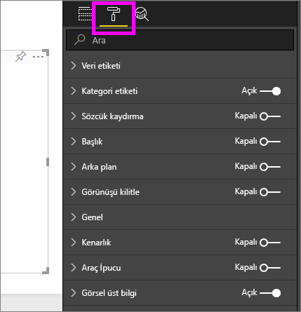
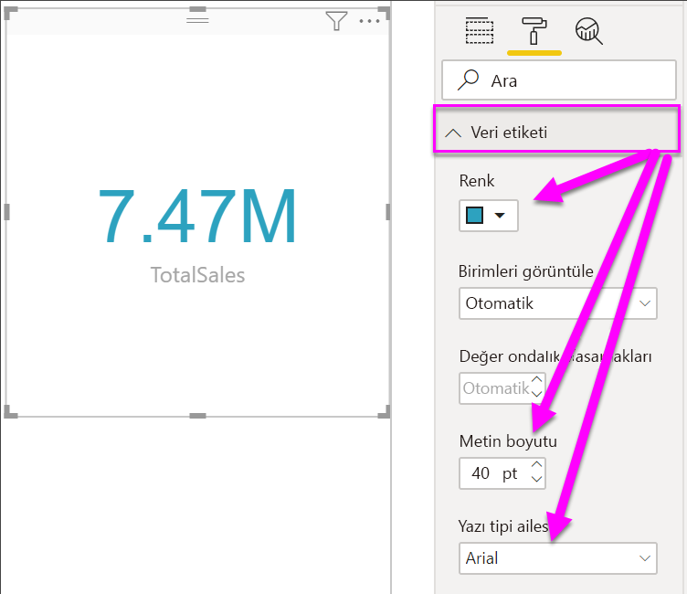
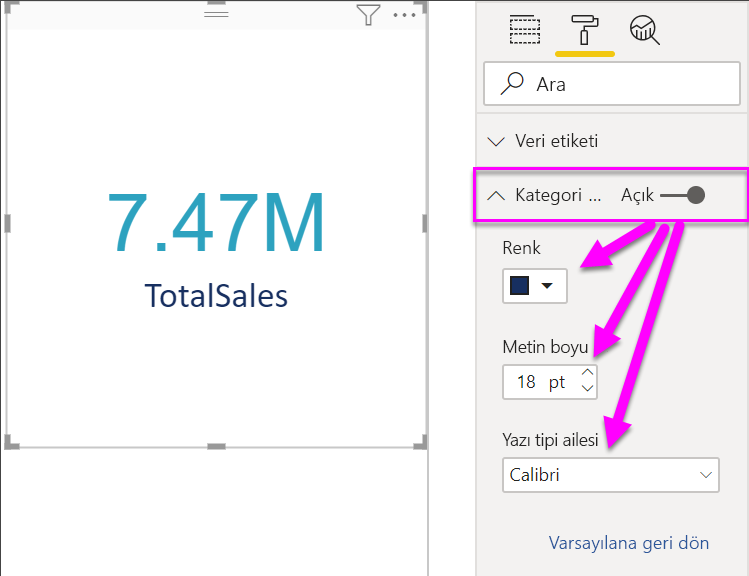
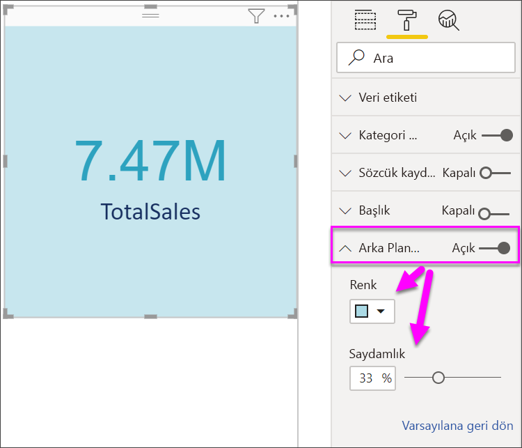

# Kart görselleştirmeleri oluşturma

[!INCLUDE[consumer-appliesto-nyyn](../includes/consumer-appliesto-nyyn.md)]

[!INCLUDE [power-bi-visuals-desktop-banner](../includes/power-bi-visuals-desktop-banner.md)]

Bazen Power BI panonuzda veya raporunuzda izlemek istediğiniz en önemli şey (örneğin, toplam satış, yıldan yıla pazar payı veya toplam fırsat) tek bir sayı olabilir. Bu görselleştirme türüne *Kart* adı verilir. Diğer tüm yerel Power BI görselleştirmelerinde olduğu gibi Kartlar da rapor düzenleyicisi veya Soru-Cevap kullanılarak oluşturulabilir.

> [!NOTE]
> Raporunuzu bir Power BI iş arkadaşınızla paylaşmak için her ikinizin de bireysel Power BI Pro lisanslarınızın olması veya raporun Premium kapasitede depolanması gerekir.

## Önkoşul

Bu öğreticide [Perakende Analizi örneği .PBIX dosyası](https://download.microsoft.com/download/9/6/D/96DDC2FF-2568-491D-AAFA-AFDD6F763AE3/Retail%20Analysis%20Sample%20PBIX.pbix) kullanılmıştır

1. Menü çubuğunun sol üst köşesinden **Dosya** \> **Aç**’ı seçin
   
2. **Perakende Analizi örneği PBIX dosyasının** kopyasını bulun

1. **Perakende Analizi örneği PBIX dosyasını** rapor görünümünde  açın.

1. Seç  yeni bir sayfa ekleyin.

## 1\. Seçenek: Rapor düzenleyicisini kullanarak kart oluşturma

Kart oluşturmaya yönelik ilk yöntem Power BI Desktop içinde rapor düzenleyicisini kullanmaktır.

1. Boş rapor sayfasıyla başlayın ve **Store** \> **Open store count** alanını seçin.

    Power BI, tek sayı içeren bir sütun grafiği oluşturur.

   

2. Görselleştirmeler bölmesinde kart simgesini seçin.

   

Rapor düzenleyicisi ile bir kartı başarıyla oluşturdunuz. Soru-cevap soru kutusu kullanılarak kart oluşturmayı içeren ikinci seçenek aşağıda verilmiştir.

## 2\. Seçenek: Soru-Cevap soru kutusundan kart oluşturma
Soru-cevap soru kutusu, kart oluştururken kullanabileceğiniz başka bir seçenektir. Soru-cevap soru kutusu Power BI Desktop rapor görünümünde kullanılabilir.

1. Boş bir rapor sayfasında başlayın

1. Pencerenin üst kısmında **Soru Sor** simgesini seçin. 

    Power BI, sorunuz için bir kart ve bir kutu oluşturur. 

   

2. Örneğin, soru kutusuna "Tina’nın Toplam Satışı" yazın.

    Soru kutusu öneri ve ifade önerilerinde bulunduktan sonra toplam sayıyı görüntüler.  

   

   

Soru-Cevap soru kutusu ile bir kartı başarıyla oluşturdunuz. Kartınızı özel gereksinimlerinize göre biçimlendirme adımları aşağıda verilmiştir.

## Kart biçimlendirme
Etiketler, metin, renk ve daha fazlasını değiştirmek için çok sayıda seçeneğiniz vardır. Öğrenmenin en iyi yolu, bir kart oluşturduktan sonra Biçimlendirme bölmesini inceleyin. Biçimlendirme seçeneklerinden birkaçı aşağıda verilmiştir. 

Biçimlendirme bölmesi, rapordaki kartla etkileşimli çalışırken kullanılabilir. 

1. Biçimlendirme bölmesini açmak için ilk olarak boya rulosu simgesini seçin. 

    

2. Kart seçili durumdayken **Veri etiketi**’ni genişletin ve renk, boyut ve yazı tipi ailesini değiştirin. Binlerce deponuz olsaydı, binlerce depo sayısını göstermek ve ondalık basamakları denetlemek için **Görüntüleme birimleri**’ni kullanabilirdiniz. Örneğin, 125.832,00 yerine 125,8 bin.

    

3.  **Kategori etiketi**’ni genişletin ve renk ile boyutu değiştirin.

    

4. **Arka plan**’ı genişletin ve kaydırıcıyı Açık konuma taşıyın.  Artık arka plan rengini ve saydamlığı değiştirebilirsiniz.

    

5. Kartınız tam olarak istediğiniz şekilde olana kadar biçimlendirme seçeneklerini incelemeye devam edin. 

## Önemli noktalar ve sorun giderme

Soru kutusu görmüyorsanız Power BI yöneticinizle iletişime geçin.

## Sonraki adımlar
[Power BI'daki birleşik grafikler](power-bi-visualization-combo-chart.md)

[Power BI'daki görselleştirme türleri](power-bi-visualization-types-for-reports-and-q-and-a.md)
