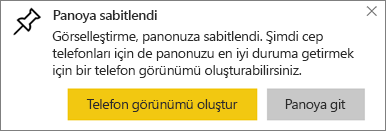
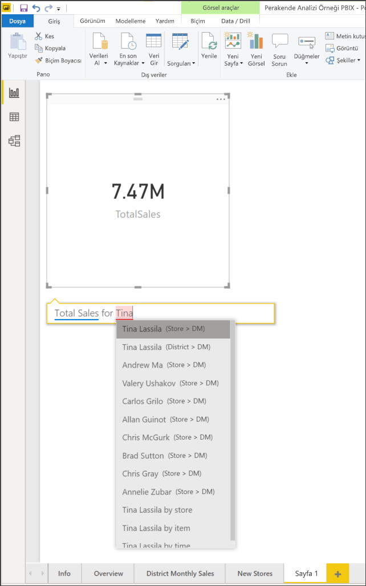
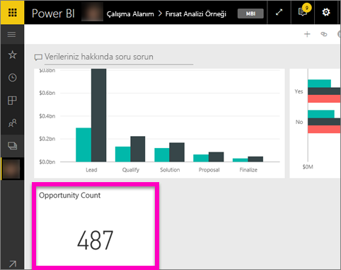
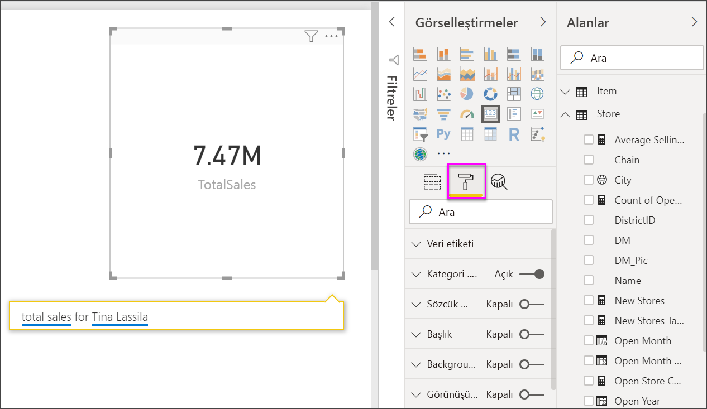

# Kart görselleştirmeleri
Bazen Power BI panonuzda veya raporunuzda izlemek istediğiniz en önemli şey (örneğin, toplam satış, yıldan yıla pazar payı veya toplam fırsat) tek bir sayı olabilir. Bu görselleştirme türüne *Kart* adı verilir. Diğer tüm yerel Power BI görselleştirmelerinde olduğu gibi Kartlar da rapor düzenleyicisi veya Soru-Cevap kullanılarak oluşturulabilir.

## Rapor düzenleyicisini kullanarak kart oluşturma
Bu yönergelerde Perakende Analizi Örneği kullanılmaktadır. Yönergeleri takip etmek için Power BI hizmeti (app.powerbi.com) veya Power BI Desktop [örneğini indirin](../sample-datasets.md).   

1. Boş rapor sayfasıyla başlayın ve **Store** \> **Open store count** alanını seçin. Power BI hizmetini kullanıyorsanız raporu [Düzenleme Görünümü](../service-interact-with-a-report-in-editing-view.md)'nde açmanız gerekir.

    Power BI, tek sayı içeren bir sütun grafiği oluşturur.

   
2. Görsel Öğeler bölmesinde Kart simgesini seçin.

   
6. Kartın üzerine gelin ve görselleştirmeyi panoya eklemek için raptiye simgesini  seçin.

   
7. Kutucuğu, mevcut bir panoya veya yeni bir panoya sabitleyin.

   * Var olan pano: Açılan listeden panonun adını seçin.
   * Yeni pano: Yeni panonun adını yazın.
8. **Sabitle**'yi seçin.

   Sağ üst köşeye yakın bir noktada çıkan Başarılı iletisi, görselleştirmenin bir kutucuk olarak panonuza eklendiğini bildirir.

   
9. **Panoya git**'i seçin. Burada, sabitlenmiş görselleştirmeyi [düzenleyebilir ve taşıyabilirsiniz](../service-dashboard-edit-tile.md).

## Soru-Cevap soru kutusundan kart oluşturma
Soru-Cevap soru kutusu, Kart oluşturmanın en kolay yoludur. Soru-Cevap soru kutusuna Power BI hizmetinde, bir panodan, rapordan ve Masaüstü rapor görünümünden erişebilirsiniz. Aşağıdaki adımlar Power BI hizmeti panosundan Kart oluşturmayı anlatmaktadır. Power BI Desktop'taki Soru-Cevap özelliğini kullanarak kart oluşturmak isterseniz Desktop raporları için Soru-Cevap kullanma [yönergelerini izleyin](https://powerbi.microsoft.com/blog/power-bi-desktop-december-feature-summary/#QandA).

Bu örnekte [Fırsat Analizi Örneği](../sample-opportunity-analysis.md) kullanılmaktadır.

1. Panonuzun en üstündeki soru kutusuna verilerinizle ilgili olarak öğrenmek istediklerinizi yazmaya başlayın. 

   

> [!TIP]
> Bir Power BI hizmeti raporunda, Düzenleme görünümü'nde üstteki menü çubuğundan **Bir soru sorun**'u seçin. Power BI Desktop raporunda boş alan bulun ve çift tıklayarak soru kutusu açın.

2. Örneğin soru kutusuna "number of opportunities" yazın.

   

   Soru kutusu öneri ve ifade önerilerinde bulunduktan sonra toplam sayıyı görüntüler.  
4. Kartı panoya eklemek için sağ üst köşedeki raptiye simgesini  seçin.

   
5. Kartı mevcut bir panoya veya yeni bir panoya kutucuk olarak sabitleyin.

   * Var olan pano: Açılan listeden panonun adını seçin. Seçimleriniz, geçerli çalışma alanındaki panolarla sınırlı olacaktır.
   * Yeni pano: Yeni panonun adını yazarak geçerli çalışma alanınıza eklenmesini sağlayabilirsiniz.
6. **Sabitle**'yi seçin.

   Sağ üst köşeye yakın bir noktada çıkan Başarılı iletisi, görselleştirmenin bir kutucuk olarak panonuza eklendiğini bildirir.  

   
7. Yeni kutucuğu görmek için **Panoya git**'i seçin. Buradan panonuzda [kutucukla ilgili yeniden adlandırma, yeniden boyutlandırma, köprü ekleme, yeniden konumlandırma ve diğer işlemleri](../service-dashboard-edit-tile.md) gerçekleştirebilirsiniz.

   

## Kart biçimlendirme
Etiketler, metin, renk ve daha fazlasını değiştirmek için çok sayıda seçeneğiniz vardır. Öğrenmenin en iyi yolu, bir kart oluşturduktan sonra Biçimlendirme bölmesini inceleyin. Biçimlendirme seçeneklerinden birkaçı aşağıda verilmiştir. 

Biçimlendirme bölmesi, rapordaki kartla etkileşimli çalışırken kullanılabilir. Rapordaki kartta değişiklikler yaparsınız, bu değişiklikleri panonuzda görmek için kartı yeniden sabitleyin. 

1. Biçimlendirme bölmesini açmak için ilk olarak boya rulosu simgesini seçin. 

    
2. Kart seçili durumdayken **Veri etiketi**’ni genişletin ve renk, boyut ve yazı tipi ailesini değiştirin. Binlerce deponuz olsaydı, binlerce depo sayısını göstermek ve ondalık basamakları denetlemek için **Görüntüleme birimleri**’ni kullanabilirdiniz. Örneğin, 125.832,00 yerine 125,8 bin.

3.  **Kategori etiketi**’ni genişletin ve renk ile boyutu değiştirin.

    

4. **Arka plan**’ı genişletin ve kaydırıcıyı Açık konuma taşıyın.  Artık arka plan rengini ve saydamlığı değiştirebilirsiniz.

    

5. Kartınız tam olarak istediğiniz şekilde olana kadar biçimlendirme seçeneklerini incelemeye devam edin. 

    

## Önemli noktalar ve sorun giderme
Soru kutusu görmüyorsanız sistem veya kiracı yöneticinizle iletişime geçin.    

## Sonraki adımlar
[Power BI'daki birleşik grafikler](power-bi-visualization-combo-chart.md)

[Power BI'daki görselleştirme türleri](power-bi-visualization-types-for-reports-and-q-and-a.md)
