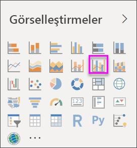
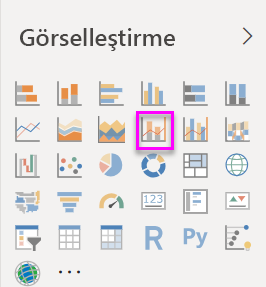
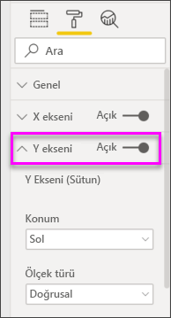
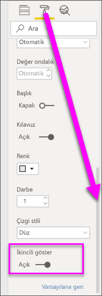

# Power BI'da birleşik haritalar oluşturma ve kullanma

[!INCLUDE[consumer-appliesto-nyyn](../includes/consumer-appliesto-nyyn.md)]

[!INCLUDE [power-bi-visuals-desktop-banner](../includes/power-bi-visuals-desktop-banner.md)]

Power BI'daki birleşik harita, çizgi grafik ile sütun grafiği içeren tek bir görselleştirmedir. Bu 2 grafiği tek bir görselleştirmede birleştirdiğinizde verileri daha hızlı şekilde karşılaştırabilirsiniz.

Birleşik haritalarda bir veya daha fazla Y ekseni bulunabilir.

## Birleşik haritalar ne zaman kullanılır?
Birleşik haritalar aşağıdaki durumlarda harika bir seçimdir:

* aynı X eksenine sahip bir çizgi grafiğiniz ve sütun grafiğiniz olduğunda.
* farklı değer aralıklarına sahip birden fazla ölçüyü karşılaştırmak istediğinizde.
* iki ölçü arasındaki bağıntıyı tek bir görselleştirmede sunmak istediğinizde.
* bir ölçünün, başka bir ölçü tarafından tanımlanan hedefi karşılayıp karşılamadığını kontrol etmek istediğinizde.
* tuval alanını tasarruflu bir şekilde kullanmak istediğinizde.

> [!NOTE]
> Raporunuzu bir Power BI iş arkadaşınızla paylaşmak için her ikinizin de bireysel Power BI Pro lisanslarınızın olması veya raporun Premium kapasitede depolanması gerekir.

### Önkoşullar
Bu öğreticide [Perakende Analizi örneği .PBIX dosyası](https://download.microsoft.com/download/9/6/D/96DDC2FF-2568-491D-AAFA-AFDD6F763AE3/Retail%20Analysis%20Sample%20PBIX.pbix) kullanılmıştır.

1. Menü çubuğunun sol üst köşesinden **Dosya** > **Aç**’ı seçin
   
2. **Perakende Analizi örneği PBIX dosyasının** kopyasını bulun

1. **Perakende Analizi örneği PBIX dosyasını** rapor görünümünde  açın.

1. Seç  yeni bir sayfa ekleyin.

## Basit, tek eksenli bir Birleşik Harita oluşturma
Aşağıdaki videoda Will, Satış ve Pazarlama örneğini kullanarak bir birleşik harita oluşturmaktadır.
   > [!NOTE]
   > Bu videoda Power BI Desktop’ın eski bir sürümü kullanılmaktadır.
   > 
   > 
<iframe width="560" height="315" src="https://www.youtube.com/embed/lnv66cTZ5ho?list=PL1N57mwBHtN0JFoKSR0n-tBkUJHeMP2cP" frameborder="0" allowfullscreen></iframe>  

1. Boş bir rapor sayfasında başlayın ve bu yılın satış verilerini ve aya göre brüt kârı görüntüleyen bir sütun grafiği oluşturun.

    a.  Alanlar bölmesinde **Sales** \> **This Year Sales** > **Değer** seçeneğini belirleyin.

    b.  **Sales** \> **Gross Margin This Year** alanını **Değer** kutusuna sürükleyin.

    c. **Eksen** kutusuna eklemek üzere **Time** \> **FiscalMonth** alanını seçin.

    
5. Görselleştirmenin sağ üst köşesindeki **Diğer seçenekler**’i (...) ve **Sıralama ölçütü > FiscalMonth** öğesini seçin. Sıralama düzenini değiştirmek için, üç nokta simgesini tekrar seçin ve **Artan düzende sırala** veya **Azalan düzende sırala**'yı seçin. Bu örnekte **Artan düzende sırala** kullanılacaktır.

6. Sütun grafiğini bir birleşik haritaya dönüştürün. İki birleşik haritalar vardır: **Çizgi ve yığılmış sütun** ile **Çizgi ve kümelenmiş sütun**. Sütun grafiği seçiliyken **Görsel Öğeler** bölmesinde **Çizgi ve kümelenmiş sütun grafiği**'ni seçin.

    
7. **Alanlar** bölmesinden **Sales** \> **Last Year Sales** alanını **Çizgi Değerleri** demetine sürükleyin.

   

   Birleşik haritanız aşağıdaki gibi görünmelidir:

   

## İki eksenli birleşik harita oluşturma
Bu görevde brüt kâr ile satış verilerini karşılaştıracağız.

1. **Gross Margin Last Year %** verilerini **FiscalMonth** ölçütüne göre gösteren yeni bir çizgi grafik oluşturun. **Ay**’a göre ve **Artan düzende** sıralamak için üç nokta simgesini seçin.  
Ocak ayında brüt kâr %35'lerdeyken Nisan'da %45 ile zirveye ulaşıyor, Temmuz'da düşüyor ve Ağustos'ta tekrar zirveye çıkıyor. Geçen yıla ve bu yıla ait satış verilerini karşılaştırdığımızda benzer bir desen ile karşılaşacak mıyız?

   
2. **This Year Sales > Değer** ve **Last Year Sales** alanlarını çizgi grafiğe ekleyin. **Gross Margin Last Year %** alanının ölçeği, **Sales** alanının ölçeğinden çok daha küçük olduğundan karşılaştırma işlemi zorlaşır.      

   
3. Görselin okunmasını ve yorumlanmasını daha kolay hale getirmek için çizgi grafiği Çizgi ve Yığılmış Sütun grafiğine dönüştürün.

   

4. **Gross Margin Last Year %** alanını **Sütun Değerleri** demetinden alıp **Çizgi Değerleri** demetine sürükleyin. Power BI iki eksen oluşturarak veri kümelerinin farklı şekilde ölçeklenmesine olanak sağlar; sol eksende dolar cinsinden satış değeri gösterilirken sağ eksende yüzde ölçülür. Ve sorumuzun cevabını görüyoruz; evet, benzer bir desen görüyoruz.

       

## Eksenlere başlık ekleme
1. Boya rulosu simgesini  seçerek Biçimlendirme bölmesini açın.
1. **Y Ekseni** seçeneklerini genişletmek için aşağı oku seçin.
1. **Y Ekseni (Sütun)** için **Konum**'u **Sol**, **Başlık**’ı **Açık**, **Stil**’i **Yalnızca başlığı göster** ve **Birimleri görüntüle**’yi **Milyon** olarak ayarlayın.

   
4. **Y Ekseni (Sütun)** altında **İkincili göster** seçeneğini görene kadar sayfayı aşağı kaydırın. Y eksenleri için çok sayıda seçenek olduğundan, her iki kaydırma çubuğunu da kullanmanız gerekebilir. İkinci göster bölümünde, birleşik haritanın çizgi grafik bölümünü biçimlendirmeye ilişkin seçenekler gösterilir.

   
5. **Y Ekseni (Satır)** için **Konum**'u **Sağ**, **Başlık**'ı **Açık**, **Stil**'i ise **Yalnızca başlığı göster** olarak ayarlayın.

   Artık birleşik haritanız başlıkları olan iki eksen görüntüler.

   

6. İsteğe bağlı olarak metin yazı tipini, boyutunu, rengini değiştirebilir; grafiğin görünümünü ve okunabilirliğini geliştirmek için diğer biçimlendirme seçeneklerini ayarlayabilirsiniz.

Bu noktada aşağıdakileri yapmak isteyebilirsiniz:

* [Birleşik haritayı pano kutucuğu olarak ekleme](../create-reports/service-dashboard-tiles.md).
* [Raporu kaydedin](../create-reports/service-report-save.md).
* [Raporu engelli kişiler için daha kolay erişilebilir hale getirin](../create-reports/desktop-accessibility-overview.md).

## Çapraz vurgulama ve çapraz filtreleme

Birleşik haritalarda bir sütun veya satır vurgulandığında, rapor sayfasındaki diğer görselleştirmeler için çapraz vurgu ve çapraz filtre uygulanır ve bu, tam tersi için de geçerlidir. Bu varsayılan davranışı değiştirmek için [görsel etkileşimlerinden](../create-reports/service-reports-visual-interactions.md) yararlanın.

## Sonraki adımlar

[Power BI'daki halka grafikler](power-bi-visualization-doughnut-charts.md)

[Power BI'daki görselleştirme türleri](power-bi-visualization-types-for-reports-and-q-and-a.md)
