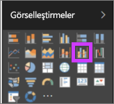
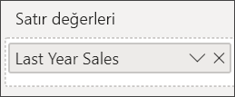
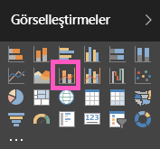
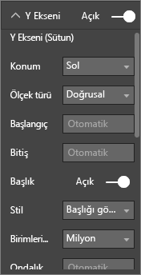
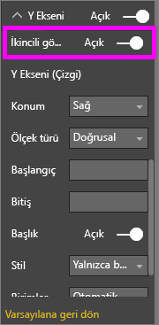

# Power BI'da Birleşik Grafik
Power BI'daki birleşik harita, çizgi grafik ile sütun grafiği içeren tek bir görselleştirmedir. Bu 2 grafiği tek bir görselleştirmede birleştirdiğinizde verileri daha hızlı şekilde karşılaştırabilirsiniz.

Birleşik haritalarda bir veya daha fazla Y ekseni bulunabilir.

## Birleşik Haritaları ne zaman kullanırsınız?
Birleşik haritalar aşağıdaki durumlarda harika bir seçimdir:

* aynı X eksenine sahip bir çizgi grafiğiniz ve sütun grafiğiniz olduğunda.
* farklı değer aralıklarına sahip birden fazla ölçüyü karşılaştırmak istediğinizde.
* iki ölçü arasındaki bağıntıyı tek bir görselleştirmede sunmak istediğinizde.
* bir ölçünün, başka bir ölçü tarafından tanımlanan hedefi karşılayıp karşılamadığını kontrol etmek istediğinizde.
* tuval alanını tasarruflu bir şekilde kullanmak istediğinizde.

### Önkoşullar
Birleşik haritalar Power BI hizmetinde ve Power BI Desktop'ta kullanılabilir. Bu eğitimde, Birleşik harita oluşturmak için Power BI hizmeti kullanılmaktadır. Birlikte ilerlemek için Power BI hizmetini açın ve "Perakende Analizi" örneğine bağlanın. ([İlgili yönergeler aşağıda verilmiştir](#create)).

## Basit, tek eksenli bir Birleşik Harita oluşturma
Aşağıdaki videoda Will, Satış ve Pazarlama örneğini kullanarak bir birleşik harita oluşturmaktadır.

<iframe width="560" height="315" src="https://www.youtube.com/embed/lnv66cTZ5ho?list=PL1N57mwBHtN0JFoKSR0n-tBkUJHeMP2cP" frameborder="0" allowfullscreen></iframe>  

 Kendi birleşik haritanızı oluşturmak için Power BI hizmetinde oturum açıp **Veri Al \> Örnekler \> Perakende Analizi Örneği > Bağlan > Panoya git** seçeneğini belirleyin.

1. "Retail Analysis Sample" panosunda, **Total Stores** kutucuğunu seçerek "Retail Analysis Sample" raporunu açın.
2. **Raporu düzenle**'yi seçerek raporu Düzenleme Görünümü'nde açın.
3. [Yeni bir rapor sayfası ekleyin](../power-bi-report-add-page.md).
4. Bu yılın satış verilerini ve aya göre brüt kârı görüntüleyen bir sütun grafiği oluşturun.

    a.  Alanlar bölmesinde **Sales** \> **This Year Sales** > **Değer** seçeneğini belirleyin.

    b.  **Sales** \> **Gross Margin This Year** alanını **Değer** kutusuna sürükleyin.

    c.  **Eksen** kutusuna eklemek üzere **Time** \> **FiscalMonth** alanını seçin.

    
5. Görselleştirmenin sağ üst köşesindeki üç nokta (...) simgesini seçin ve **Sıralama Ölçütü: FiscalMonth** seçeneğini belirleyin. Artan veya azalan düzende sıralama yapmak için bu seçeneği iki kez belirlemeniz gerekebilir.

6. Sütun grafiğini bir birleşik haritaya dönüştürün. Sütun grafiği seçiliyken **Görsel Öğeler** bölmesinde **Çizgi ve kümelenmiş sütun grafiği**'ni seçin.

    
7. **Alanlar** bölmesinden **Sales** \> **Last Year Sales** alanını **Çizgi Değerleri** demetine sürükleyin.

   

   Birleşik haritanız aşağıdaki gibi görünmelidir:

   

## İki eksenli birleşik harita oluşturma
Bu görevde brüt kâr ile satış verilerini karşılaştıracağız.

1. **Gross Margin Last Year %** verilerini **Month** ölçütüne göre gösteren yeni bir çizgi grafik oluşturun.  Ocak ayında brüt kâr %35'lerdeyken Nisan'da %45 ile zirveye ulaşıyor, Temmuz'da düşüyor ve Ağustos'ta tekrar zirveye çıkıyor. Geçen yıla ve bu yıla ait satış verilerini karşılaştırdığımızda benzer bir desen ile karşılaşacak mıyız?

   
2. **This Year Sales > Değer** ve **Last Year Sales** alanlarını çizgi grafiğe ekleyin. **Gross Margin Last Year %** alanının ölçeği, **Sales** alanının ölçeğinden çok daha küçük olduğundan karşılaştırma işlemi zorlaşır.      

   
3. Görselin okunmasını ve yorumlanmasını daha kolay hale getirmek için çizgi grafiği Çizgi ve Yığılmış Sütun grafiğine dönüştürün.

   
4. **Gross Margin Last Year %** alanını **Sütun Değerleri** demetinden alıp **Çizgi Değerleri** demetine sürükleyin. Power BI iki eksen oluşturarak veri kümelerinin farklı şekilde ölçeklenmesine olanak sağlar; sol eksende dolar cinsinden satış değeri gösterilirken sağ eksende yüzde ölçülür.

       

## Eksenlere başlık ekleme
1. Boya rulosu simgesini  seçin ve Biçimlendirme bölmesini açın.
2. **Y Ekseni** seçeneklerini genişletmek için aşağı oku seçin.
3. **Y Ekseni (Sütun)** için **Konum**'u **Sol**, **Başlık**'ı **Açık**, **Stil**'i **Yalnızca başlığı göster** ve **Birimleri görüntüle**'yi **Milyon** olarak ayarlayın.

   
4. **Y Ekseni (Sütun)** bölümünde ekranı aşağı kaydırın ve **Sonrakini göster**'in **Açık** olarak ayarlandığından emin olun. Bu ayar, birleşik haritanın çizgi grafik bölümünü biçimlendirmeye ilişkin seçenekleri görüntüler.

   
5. **Y Ekseni (Satır)** için **Konum**'u **Sağ**, **Başlık**'ı **Açık**, **Stil**'i ise **Yalnızca başlığı göster** olarak ayarlayın.

   Artık birleşik haritanız başlıkları olan iki eksen görüntüler.

   

6. İsteğe bağlı olarak metin yazı tipini, boyutunu, rengini değiştirebilir; grafiğin görünümünü ve okunabilirliğini geliştirmek için diğer biçimlendirme seçeneklerini ayarlayabilirsiniz.

Bu noktada aşağıdakileri yapmak isteyebilirsiniz:

* [Birleşik haritayı pano kutucuğu olarak ekleme](../consumer/end-user-tiles.md).
* [Raporu kaydedin](../service-report-save.md).
* [Raporu engelli kişiler için daha kolay erişilebilir hale getirme](../desktop-accessibility.md)

## Çapraz vurgulama ve çapraz filtreleme

Birleşik haritalarda bir sütun veya satır vurgulandığında, rapor sayfasındaki diğer görselleştirmeler için çapraz vurgu ve çapraz filtre uygulanır ve bu, tam tersi için de geçerlidir. Bu varsayılan davranışı değiştirmek için [görsel etkileşimlerinden](../consumer/end-user-interactions.md) yararlanın.

## Sonraki adımlar

[Power BI raporlarındaki görselleştirmelere genel bakış](power-bi-report-visualizations.md)

[Power BI'daki görselleştirme türleri](power-bi-visualization-types-for-reports-and-q-and-a.md)

[Power BI - Temel Kavramlar](../consumer/end-user-basic-concepts.md)

Başka bir sorunuz mu var? [Power BI Topluluğu'na başvurun](http://community.powerbi.com/)
