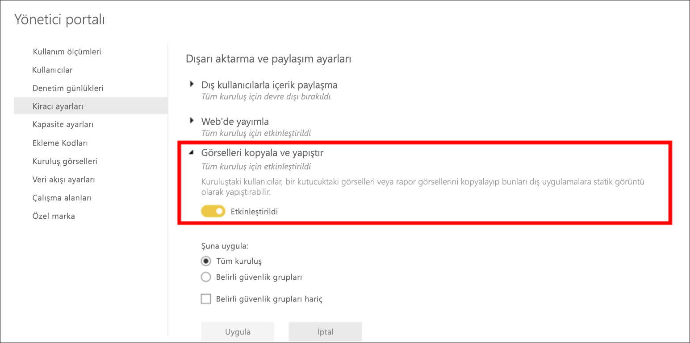

# Rapor görselleştirmesini kopyalayıp yapıştırma

[!INCLUDE[consumer-appliesto-yyyn](../includes/consumer-appliesto-yyyn.md)]

Bu makalede, bir görseli kopyalamanın ve yapıştırmanın iki farklı yolu ele alınmaktadır. 
* rapordaki bir görseli kopyalayın ve bunu başka bir rapor sayfasına yapıştırın (rapor için düzenleme izinleri gerektirir)

* bir görselin görüntüsünü Power BI’dan panonuza kopyalayın ve diğer uygulamalara yapıştırın

## Aynı rapor içinde kopyalayıp yapıştırma
Power BI raporlarındaki görseller raporun bir sayfasından aynı rapordaki aynı sayfaya veya farklı bir sayfaya kopyalanabilir. 

Bir görselleştirmeyi kopyalamak ve yapıştırmak için raporda düzenleme iznine sahip olmanız gerekir. Power BI hizmetinde raporu [Düzenleme Görünümü](../consumer/end-user-reading-view.md)’nde açmanız gerekir. 

*Panolardaki* görselleştirmeler kopyalanıp Power BI raporlarına veya diğer panolara yapıştırılamaz.

1. En az bir görselleştirmeye sahip bir rapor açın.  

2. Görselleştirmeyi seçin ve **Ctrl +C** tuşlarıyla kopyalayıp **Ctrl +V** tuşlarıyla yapıştırın.      

   

## Bir görseli görüntü olarak panonuza kopyalama

Power BI raporundan veya panosundan bir görüntü paylaşmak istediğiniz oldu mu? Artık görseli kopyalayabilir ve yapıştırmayı destekleyen başka bir uygulamaya yapıştırabilirsiniz. 

Görselin statik bir görüntüsünü kopyaladığınızda, meta verilerle birlikte görselin bir kopyasını alırsınız. Buna aşağıdakiler dahildir:
* Power BI raporuna veya panosuna geri dönen bağlantı
* raporun veya panonun başlığı
* görüntünün gizli bilgiler içerip içermediğiyle ilgili uyarı
* Son güncellenme zaman damgası
* görsele uygulanan filtreler

### Pano kutucuğundaki kopya

1. Kopyalamak istediğiniz panoya gidin.

2. Görselin sağ üst köşesinden **Diğer seçenekler(...)** ve ardından **Görseli görüntü olarak kopyala**'yı seçin. 

    

3. **Görselinizi kopyalamaya hazır** iletişim kutusu göründüğünde **Panoya kopyala**'yı seçin.

    

4. Görseliniz hazır olduğunda, **CTRL + V** kullanarak veya sağ tıklayıp > Yapıştır'ı seçerek başka bir uygulamaya yapıştırın. Aşağıdaki ekran görüntüsünde görseli Microsoft Word'e yapıştırdık. 

    

### Rapor görselindeki kopya 

1. Kopyalamak istediğiniz rapora gidin.

2. Görselin sağ üst köşesinden **Görseli görüntü olarak kopyala** simgesini seçin. 

    

3. **Görselinizi kopyalamaya hazır** iletişim kutusu göründüğünde **Panoya kopyala**'yı seçin.

    

4. Görseliniz hazır olduğunda, **CTRL + V** kullanarak veya sağ tıklayıp > Yapıştır'ı seçerek başka bir uygulamaya yapıştırın. Aşağıdaki ekran görüntüsünde görseli bir e-postaya yapıştırdık.

    

5. Rapora uygulanmış bir veri duyarlılığı etiketi varsa, kopyala simgesini seçtiğinizde bir uyarı alırsınız.  

    

    Yapıştırılan görselin altındaki meta verilere bir duyarlılık etiketi eklenir. 

    

### Bir görseli görüntü olarak kopyalama kullanımını yönetme
İçeriğe sahipseniz veya kiracının yöneticisiyseniz, bir rapordaki veya panodaki görselin görüntü olarak kopyalanıp kopyalanamayacağını denetleyebilirsiniz.

#### Belirli bir görsel için görüntü olarak kopyalamayı devre dışı bırakma
Kullanıcıların belirli bir görseli kopyalayabilmesini istemiyorsanız, kopyala simgesini bu görselden kaldırabilirsiniz.
1. Boya rulosu simgesini seçin ve Biçimlendirme bölmesini açın. 

1. **Görsel biçimlendirme** kartını açın.
1. **Görsel üst bilgi**’ye gitmek için aşağı kaydırın, kartı genişletin ve **Kopyala simgesi**'ni kapatın.

    

1. **Görsel üst bilgi** ayarını bulamazsanız, **Rapor ayarları**’nın altındaki modern görsel üst bilgi seçeneğini açın. 

    

1. Değişiklikleri kaydet. Gerektiği gibi yeniden paylaşın ve yeniden yayımlayın.

#### Bir kullanıcı grubu için görüntü olarak kopyalamayı devre dışı bırakma

İçeriğe sahipseniz veya kiracının yöneticisiyseniz, görselleri kimlerin kopyalayabileceğini denetleyebilirsiniz. Bu ayar, kullanıcının Power BI kiracısında eriştiği tüm içerikler için *görseli görüntü olarak kopyalamayı* devre dışı bırakır.
  
1. Yönetici Portalı’na gidin.

1. **Kiracı ayarları** altında **Dışarı aktarma ve paylaşım ayarları**'nı seçin. 

    

1. Seçili kullanıcı gruplarınız için **Görselleri kopyala ve yapıştır**’ı devre dışı bırakın. 

1. Değişiklikleri kaydettiğinizde belirtilen gruplar, Power BI’ın tamamında **Görseli görüntü olarak kopyala** seçeneğini kullanamaz. 
  

## Önemli noktalar ve sorun giderme

   

S: Kopyala simgesi neden bir görselde devre dışıdır?    
Y: Şu anda yerel Power BI görsellerini ve Sertifikalı Görselleri destekliyoruz. Aşağıdakiler dahil belirli görseller için sınırlı destek vardır: 
- ESRI ve diğer Harita görselleri 
- Python görselleri 
- R görselleri 
- PowerApps 
- Sertifikalı olmayan özel görseller: Özel görselinizin desteklenmesi için [özel görselinizi onaylama](../developer/visuals/power-bi-custom-visuals-certified.md) hakkında daha fazla bilgi edinin. 

S: Görselim neden doğru şekilde yapıştırmıyor?    
Y: Görseli görüntü olarak kopyalama ile ilgili aşağıdakilerin dahil olduğu sınırlamalar vardır: 
- Özel görseller için 
    - Uygulanan temalar ve renkler içeren görseller 
    - Yapıştırırken kutucuk ölçeklendirme 
    - Animasyonlar içeren özel görseller 
- Kısıtlamaları kopyalama 
    - Yeni sabitlenmiş bir pano kutucuğu kopyalanamaz 
    - Kullanıcılar, OData filtreleri ve kişisel yer işaretleri gibi yapışkan durumlara sahip içeriğe yeniden yönlendirilemez 
- Panodan HTML biçimli içerikleri yapıştırmak için sınırlı desteğe sahip uygulamalar, görselden kopyalanmış her şeyi işleyemeyebilir 

## Sonraki adımlar
[Power BI raporlarındaki görselleştirmeler](power-bi-report-visualizations.md) hakkında daha fazla bilgi

Başka bir sorunuz mu var? [Power BI Topluluğu'na başvurun](https://community.powerbi.com/)

