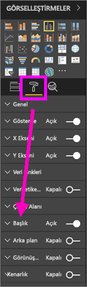
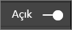
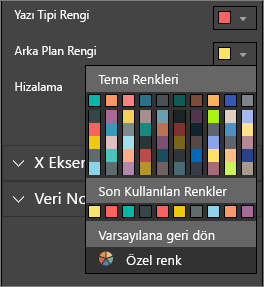
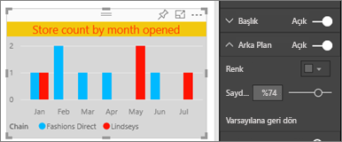
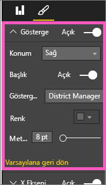
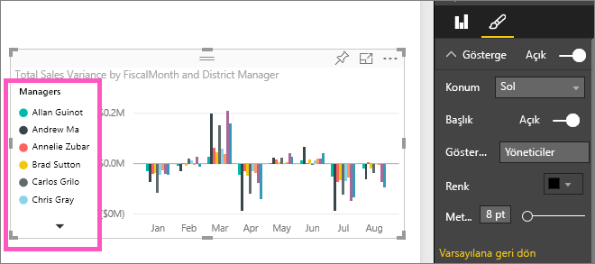

# Görselleştirme başlıklarını, açıklamaları ve arka planları özelleştirme
Bu eğitimde, görselleştirmelerinizi özelleştirmek için izleyebileceğiniz birkaç farklı yol öğreneceksiniz.   Görselleştirmelerinizi özelleştirmeye yönelik pek çok seçenek vardır. Bunların tümü hakkında bilgi edinmenin en iyi yolu, Biçimlendirme bölmesini keşfetmektir (boya rulosu simgesini seçerek).  Başlamanıza yardımcı olmak için, bu makalede, bir görselleştirme başlığını, açıklamayı ve arka planı nasıl özelleştireceğiniz gösterilmektedir.  

Her görselleştirme özelleştirilebilir değildir, [özelleştirilebilir görselleştirmelerin tam listesine bakın](#list).  

Görselleştirmeleri özelleştirme konusunda bir örnek için 4:50 videoda ilerleyelim. Ardından, kendi verilerinizle denemek için videonun altında yer alan yönergeleri uygulayın.

<iframe width="560" height="315" src="https://www.youtube.com/embed/IkJda4O7oGs" frameborder="0" allowfullscreen></iframe>

### Önkoşullar
- Power BI hizmeti veya Power BI Desktop
- Perakende Analizi örneği

## Raporlardaki görselleştirme başlıklarını özelleştirme
Örneği takip etmek için, Power BI hizmetinde (app.powerbi.com) oturum açın ve [Perakende Analizi Örneği](../sample-datasets.md) raporunu [Düzenleme Görünümü](../service-interact-with-a-report-in-editing-view.md)'nde açın.

> [!NOTE]
> Panolara sabitlediğiniz görselleştirmeler birer pano kutucuğu haline gelir.  Kutucuklar da [yeni başlıklar, alt başlıklar ve köprülerle özelleştirilebilir veya yeniden boyutlandırılabilir](../service-dashboard-edit-tile.md).
> 
> 

1. Raporun "New Stores" sayfasına gidin ve "Open Month ve Chain ölçütlerine göre Open Store Count" sütun grafiğini seçin.
2. Görsel Öğeler bölmesinde, biçimlendirme seçeneklerini görüntülemek için boya rulosu simgesini seçin.  Ardından **Başlık** seçeneğini belirleyerek bu bölümü genişletin.  

   
3. Açık (veya Kapalı) kaydırıcısını seçerek **Başlık**'ı etkinleştirebilir ve devre dışı bırakabilirsiniz. Şimdilik **Açık** durumunda bırakın.  

   
4. Metin alanına **Store count by month opened** yazarak **Başlık Metni**'ni değiştirin.  
5. **Yazı tipi rengi**'ni turuncu, **Arka Plan Rengi**'ni ise sarı olarak değiştirin.

   * Açılan menüyü seçin ve **Tema Renkleri**, **Son Kullanılan Renkler** veya **Özel renk**'ten bir renk seçin.
   * Renk penceresini kapatmak için, açılan menüyü seçin.  
     

   Renk penceresindeki **Varsayılana geri dön** seçeneğini belirleyerek dilediğiniz zaman varsayılan renklere dönebilirsiniz.
6. Metin boyutunu 12'ye yükseltin.
7. Grafik başlığı için gerçekleştireceğimiz son özelleştirme olarak, başlığı görselleştirmenin ortasına gelecek şekilde hizalayacağız. Başlık konumu varsayılan olarak sola hizalıdır.  
   

    Eğitimin bu noktasında, sütun grafiğinizin **başlığının** aşağıdaki gibi görünmesi gerekir:  
    

    Bu ana kadar gerçekleştirdiğimiz tüm başlık özelleştirmelerini geri almak için, **Başlık** özelleştirme bölmesinin altında bulunan **Varsayılana Geri Dön** seçeneğini belirleyin.  
    

## Görselleştirme arka planlarını özelleştirme
Aynı sütun grafiği seçili durumdayken Arka Plan seçeneklerini genişletin.

1. Açık (veya Kapalı) kaydırıcısını seçerek arka planı etkinleştirebilir ya da devre dışı bırakabilirsiniz. Şimdilik **Açık** durumunda bırakın.
2. Arka plan rengini %74 gri olarak değiştirin.

   * Açılan menüyü seçin ve **Tema Renkleri**, **Son Kullanılan Renkler** veya **Özel renk**'ten bir gri tonu belirleyin.
   * Saydamlık ayarını %74 olarak değiştirin.   
     

   Bu ana kadar gerçekleştirdiğimiz tüm özelleştirmeleri geri almak için **Arka Plan** özelleştirme bölmesinin altında bulunan **Varsayılana Geri Dön** seçeneğini belirleyin.

## Görselleştirme açıklamalarını özelleştirme
1. **Overview** adlı rapor sayfasını açın "FiscalMonth ve District Manager ölçütlerine göre Total Sales Variance" grafiğini seçin.
2. Görsel Öğeler sekmesinde, biçimlendirme bölmesini açmak için boya fırçası simgesini seçin.  
3. **Açıklama** seçeneklerini genişletin.

      
4. Açık (veya Kapalı) kaydırıcısını seçerek açıklamayı etkinleştirin ya da devre dışı bırakın. Şimdilik **Açık** durumunda bırakın.
5. Açıklamayı görselleştirmenin sol tarafına taşıyın.    
6. **Başlık** seçeneğini **Açık** olarak değiştirip **Gösterge adı** alanına **Managers** yazarak bir açıklama başlığı ekleyin.
   

   Bu ana kadar gerçekleştirdiğimiz tüm özelleştirmeleri geri almak için **Açıklama** özelleştirme bölmesinin altında bulunan **Varsayılana Geri Dön** seçeneğini belirleyin.

## Özelleştirilebilen görselleştirme türleri

| Görselleştirme | Başlık | Arka Plan | Açıklama |
|:--- |:--- |:--- |:--- |
| alan |evet |evet |evet |
| çubuk |evet |evet |evet |
| kart |evet |evet |kullanılamaz |
| çok satırlı kart |evet |evet |kullanılamaz |
| sütun |evet |evet |evet |
| birleşik |evet |evet |evet |
| halka |evet |evet |evet |
| kartogram |evet |evet |evet |
| huni |evet |evet |kullanılamaz |
| ölçer |evet |evet |kullanılamaz |
| kpi |evet |evet |kullanılamaz |
| çizgi |evet |evet |evet |
| harita |evet |evet |evet |
| matris |evet |evet |kullanılamaz |
| pasta |evet |evet |evet |
| dağılım |evet |evet |evet |
| dilimleyici |evet |evet |kullanılamaz |
| tablo |evet |evet |kullanılamaz |
| metin kutusu |hayır |evet |kullanılamaz |
| ağaç haritası |evet |evet |evet |
| şelale |evet |evet |evet |

## Sonraki adımlar
[X ve Y eksenini özelleştirme](power-bi-visualization-customize-x-axis-and-y-axis.md)  
[Renkleri ve eksen özelliklerini özelleştirme](service-getting-started-with-color-formatting-and-axis-properties.md)  
[Power BI - Temel Kavramlar](../consumer/end-user-basic-concepts.md)  
Başka bir sorunuz mu var? [Power BI Topluluğu'na başvurun](http://community.powerbi.com/)

