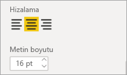

# Görselleştirme başlıklarını, arka planlarını ve göstergelerini özelleştirme

Bu öğreticide, görselleştirmelerinizi özelleştirmek için izleyebileceğiniz birkaç farklı yol öğreneceksiniz. Görselleştirmelerinizi özelleştirmeye yönelik çok sayıda seçenek vardır. Bunların tümü hakkında bilgi edinmenin en iyi yolu **Biçimlendirme** bölmesi keşfetmektir (boya rulosu simgesini seçin). Başlamanıza yardımcı olmak için bu makalede görselleştirme başlığını, göstergesini, arka planını özelleştirme ve tema ekleme işlemleri gösterilir.

Tüm görselleştirmeler özelleştirilemez. Ayrıntılar için görselleştirmelerin [tam listesine](#visualization-types-that-you-can-customize) bakın.

## Önkoşullar

- Power BI hizmeti veya Power BI Desktop

- Perakende Analizi Örneği raporu

## Raporlardaki görselleştirme başlıklarını özelleştirme

Birlikte ilerleyebilmek için Power BI Desktop'ta oturum açın ve [Perakende Analizi Örneği](../sample-datasets.md) raporunu açın.

> [!NOTE]
> Panolara sabitlediğiniz görselleştirmeler birer pano kutucuğu haline gelir. Kutucukları da [yeni başlıklar, alt başlıklar ve köprülerle özelleştirebilir veya yeniden boyutlandırabilirsiniz](../service-dashboard-edit-tile.md).

1. **Perakende Analizi Örneğinin** **Yeni Depolar** sayfasına gidin.

1. **Open Store Count by Open Month and Chain** kümelenmiş sütun grafiğini seçin.

1. **Görsel Öğeler** bölmesinde biçimlendirme seçeneklerini görüntülemek için boya rulosu simgesini seçin.

1. **Başlık** seçeneğini belirleyerek bu bölümü genişletin.

   

1. **Başlık** kaydırıcısını **Açık** konumuna getirin.

1. Başlığı değiştirmek için, **Başlık metni** alanına *Store count by month opened* yazın.

    

1. **Yazı tipi rengi**’ni beyaz, **Arka plan rengi**’ni ise mavi olarak değiştirin.    

    a. Açılan menüyü seçin ve **Tema renkleri**, **Son kullanılan renkler** veya **Özel renk**’ten bir renk seçin.

        

    b. Renk penceresini kapatmak için, açılan menüyü seçin.

1. Metin boyutunu **16 puntoya** yükseltin.

1. Grafik başlığı için gerçekleştireceğiniz son özelleştirme olarak, başlığı görselleştirmenin ortasına gelecek şekilde hizalayacaksınız.

    

    Öğreticinin bu noktasında, kümelenmiş sütun grafiğinizin başlığı aşağıdaki gibi görünür:

    

Yaptığınız değişiklikleri kaydedin ve sonraki bölüme geçin.

Yaptığınız tüm değişiklikleri geri almanız gerekirse, **Başlık** özelleştirme bölmesinin altındaki **Varsayılana dön** seçeneğini belirleyin.

## Görselleştirme arka planlarını özelleştirme

Aynı kümelenmiş sütun grafiği seçili durumdayken **Arka Plan** seçeneklerini genişletin.

1. **Arka plan** kaydırıcısını **Açık** konumuna getirin.

1. Açılır menüyü seçin ve bir gri tonu belirleyin.

1. **Saydamlık** ayarını **%74** olarak değiştirin.

Öğreticinin bu noktasında, kümelenmiş sütun grafiğinizin arka planı aşağıdaki gibi görünür:

Yaptığınız değişiklikleri kaydedin ve sonraki bölüme geçin.

Yaptığınız tüm değişiklikleri geri almanız gerekirse, **Arka plan** özelleştirme bölmesinin altındaki **Varsayılana dön** seçeneğini belirleyin.

## Görselleştirme açıklamalarını özelleştirme

1. **Genel bakış** adlı rapor sayfasını açın **Total Sales Variance by FiscalMonth and District Manager** grafiğini seçin.

1. **Görselleştirme** sekmesinde, Biçimlendirme bölmesini açmak için boya fırçası simgesini seçin.

1. **Gösterge** seçeneklerini genişletin:

    

1. **Gösterge** kaydırıcısını **Açık** konumuna getirin.

1. Açıklamayı görselleştirmenin sol tarafına taşıyın.

1. **Başlık** seçeneğini **Açık** olarak ayarlayarak bir gösterge başlığı ekleyin.

1. **Gösterge adı** alanına *Yönetici* yazın.

1. **Renk** değerini siyah olarak değiştirin.

Yaptığınız değişiklikleri kaydedin ve sonraki bölüme geçin.

Yaptığınız tüm değişiklikleri geri almanız gerekirse, **Gösterge** özelleştirme bölmesinin altındaki **Varsayılana dön** seçeneğini belirleyin.

## Tema kullanarak renkleri özelleştirme

Rapor temalarıyla raporunuzun tamamında kurumsal renkler kullanmak, simge kümelerini değiştirmek veya yeni varsayılan görsel biçimlendirmeyi uygulamak gibi tasarım değişiklikleri uygulayabilirsiniz. Rapor teması uyguladığınızda, raporunuzdaki tüm görsellerde seçtiğiniz temanın renkleri ve biçimlendirmesi kullanılır.

Raporunuza tema uygulamak için menü çubuğundan **Temayı değiştir**'i seçin. Tema seçin.  Aşağıdaki raporda **Güneş** teması kullanılmıştır.

 

## Özelleştirebileceğiniz görselleştirme türleri

Görselleştirmelerin ve her biri için kullanılabilir özelleştirme seçeneklerinin bir listesi aşağıda verilmiştir:

| Görselleştirme | Başlık | Arka Plan | Gösterge |
|:--- |:--- |:--- |:--- |
| Alan | evet | evet |evet |
| Çubuk | evet | evet |evet |
| Kart | evet | evet |yok |
| Çok Satırlı Kart | evet | evet | yok |
| Sütun | evet | evet | evet |
| Birleşik | evet | evet | evet |
| Halka | evet | evet | evet |
| Kartogram | evet | evet | evet |
| Huni | evet | evet | yok |
| Ölçer | evet | evet | yok |
| Ana Etmen | evet | evet | yok |
| KPI | evet | evet | yok |
| Çizgi | evet | evet | evet |
| Harita | evet | evet | evet |
| Matris | evet | evet | yok |
| Pasta | evet | evet | evet |
| Soru-Cevap | evet | evet | yok |
| Dağılım | evet | evet | evet |
| Şekil | evet | evet | evet |
| Dilimleyici | evet | evet | yok |
| Tablo | evet | evet | yok |
| Metin Kutusu | hayır | evet | yok |
| Treemap | evet | evet | evet |
| Şelale | evet | evet | evet |

## Sonraki adımlar

- [X Ekseni ve Y Ekseni özelliklerini özelleştirme](power-bi-visualization-customize-x-axis-and-y-axis.md)

- [Renk biçimlendirme ve eksen özelliklerini kullanmaya başlama](service-getting-started-with-color-formatting-and-axis-properties.md)

Başka bir sorunuz mu var? [Power BI Topluluğu'na başvurun](https://community.powerbi.com/)
