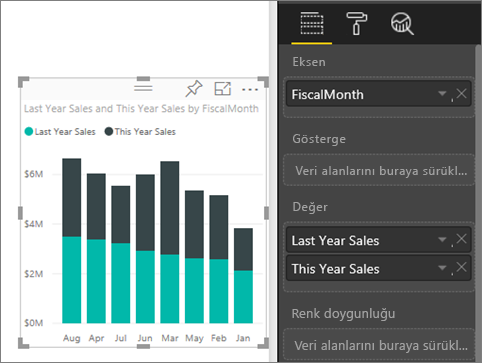
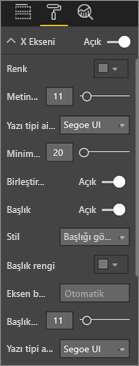
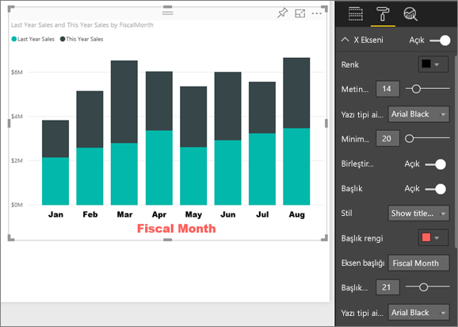
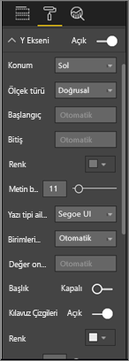
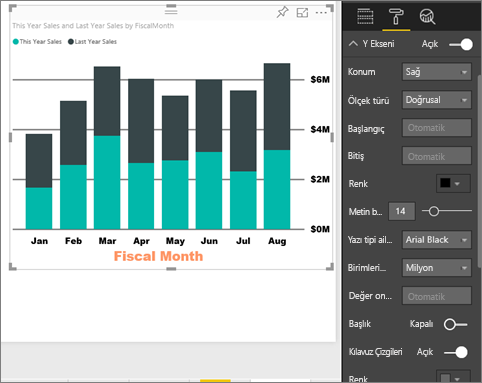
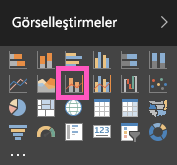
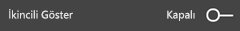
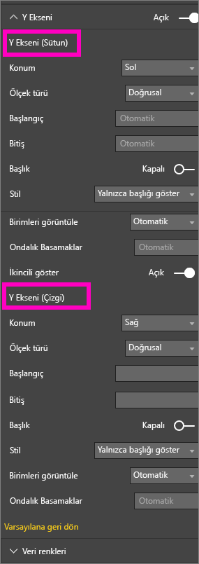
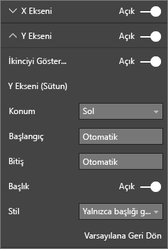

# X ve Y ekseni özelliklerini özelleştirme
Bu eğitimde görsellerinizin x eksenini ve y eksenini özelleştirmenin pek çok farklı yolunu öğreneceksiniz. Tüm görsellerde eksenler bulunmaz ve tüm görseller özelleştirilemez; örneğin Pasta grafiklerde eksen bulunmaz. Özelleştirme seçenekleri görsellere göre farklılık gösterir. Tek bir makalede ele alınamayacak kadar çok seçenek vardır. Bu nedenle en sık kullanılan bazı eksenlere ilişkin özelleştirmeleri inceleyerek Power BI rapor tuvalinde görsel biçimlendirme sekmesini rahatlıkla kullanmanızı sağlayacağız.  

> [!NOTE]
> Bu sayfa hem Power BI hizmeti hem Power BI Desktop için geçerlidir. **Biçim** (boya rulosu simgesi  ) seçiliyken kullanılabilen bu özelleştirmeler Power BI Desktop'ta da kullanılabilir.  
>
>

Amanda'nın X ve Y eksenlerini nasıl özelleştirdiğini izleyin ve detaydan çıkma ve detaya gitme işlevlerini kullanırken birleştirmeyi denetlemeye ilişkin çeşitli yöntemleri öğrenin. Ardından, Perakende Analizi örneği ile kendiniz denemek için videonun altındaki adım adım yönergeleri uygulayın.

<iframe width="560" height="315" src="https://www.youtube.com/embed/9DeAKM4SNJM" frameborder="0" allowfullscreen></iframe>

## Raporlarda görselleştirme X eksenlerini özelleştirme
## Yığılmış grafik görselleştirmesi oluşturma
Power BI hizmetinde oturum açın ve **Retail Analysis Sample** raporunu [Düzenleme Görünümü](../service-interact-with-a-report-in-editing-view.md)'nde açın. Örneği takip etmek için [Perakende Analizi örneğine bağlanın](../sample-datasets.md).

1. Bu yılın ve geçen yılın satış değerlerini mali aya göre gösteren yeni bir sütun grafik oluşturun.
2. Yığılmış sütun grafiğe dönüştürün.

    

## X eksenini özelleştirme
1. Görsel Öğeler ve Filtreler bölmesinde özelleştirme seçeneklerini görüntülemek için **Biçim** (boya rulosu simgesi  ) öğesini seçin.
2. X ekseni seçeneklerini genişletin.

   
3. Açık (veya Kapalı) kaydırıcısını seçerek X eksenini etkinleştirin veya devre dışı bırakın. Şimdilik **Açık** durumunda bırakın.  Daha fazla veri için alan ayırmak üzere X eksenini kapatmak isteyebilirsiniz.

    
4. Metin rengini, boyutunu ve yazı tipini biçimlendirin. Bu örnekte **Renk** için siyah, **Metin Boyutu** için 14 ve **Yazı Tipi** için Arial Black seçeneğini belirledik.  
5. X ekseni Başlığını **Açık** duruma getirin ve X ekseninin adını görüntüleyin; bu durumda, **FiscalMonth** şeklindedir.  
6. Başlığın metin rengini, boyutunu ve yazı tipini biçimlendirin.  Bu örnekte **Başlık rengi** için turuncu, **Eksen başlığı** için **Fiscal Month** ve **Başlık metin boyutu** için 21 seçeneğini belirledik.
7. FiscalMonth değerine göre sıralamak için grafiğin sağ üst köşesindeki üç noktayı (...) ve ardından **Sıralama Ölçütü: FiscalMonth** seçeneğini belirleyin.

    Bu özelleştirmelerin ardından sütun grafiğiniz aşağıdakine benzer şekilde görünür:

     

Şu ana dek yaptığınız tüm X ekseni özelleştirmelerini geri almak için **X ekseni** özelleştirme bölmesinin altındaki **Varsayılana Geri Dön** seçeneğini belirleyin.

## Y eksenini özelleştirme
1. Y ekseni seçeneklerini genişletin.

   

2. Açık (veya Kapalı) kaydırıcısını seçerek Y eksenini açın veya kapatın. Şimdilik **Açık** durumunda bırakın.  Daha fazla veri için alan ayırmak üzere Y eksenini kapatmak isteyebilirsiniz.
   
    
3. Y Ekseni **Konumunu** sağ olarak ayarlayın.
4. Metin rengini, boyutunu ve yazı tipini biçimlendirin. Bu örnekte **Renk** için siyah, **Metin Boyutu** için 14 ve **Yazı Tipi** için Arial Black seçeneğini belirledik.  
5. **Görüntüleme birimleri** seçeneğini Milyon olarak ve **Değer ondalık basamakları** seçeneğini sıfır olarak bırakın.
6. Bu görselleştirme için Y ekseni başlığının görüntülenmesi görseli geliştirmediğinden **Başlık** seçeneğini Kapalı olarak bırakın.  
7. **Renk** seçeneğini koyu gri olarak değiştirerek ve **Darbe genişliği** değerini 2'ye artırarak kılavuz çizgilerini belirginleştirin.

    Bu özelleştirmelerin ardından sütun grafiğiniz aşağıdakine benzer şekilde görünür:

     

## Çift y eksenli görselleştirmeleri özelleştirme
Mağaza sayısının satış üzerindeki etkisini gösteren bir Birleşik harita oluşturun.  Bu, [Birleşik harita Eğitimi](power-bi-visualization-combo-chart.md)'nde oluşturulan aynı grafiktir. Ardından çift y eksenini biçimlendirin.

### İki Y eksenli bir grafik oluşturun
1. **Time > FiscalMonth** tarafından **Sales > Gross Margin last year %** değerini izleyen yeni bir çizgi grafiği oluşturun.
2. Üç noktayı (...) ve ardından **Sıralama ölçütü: Month** seçeneğini belirleyerek görseli sıralayın

    

> [NOTE]: For help sorting by month, see [sorting by other criteria](../power-bi-report-change-sort.md#other)
> 1. Ocak ayında brüt kâr %35'lerdeyken Nisan'da %45 ile zirveye ulaşıyor, Temmuz'da düşüyor ve Ağustos'ta tekrar zirveye çıkıyor. Geçen yıla ve bu yıla ait satış verilerini karşılaştırdığımızda benzer bir desen ile karşılaşacak mıyız?
> 2. **This Year Sales > Değer** ve **Last Year Sales** alanlarını çizgi grafiğe ekleyin. Geçen yıla ait brüt kâr yüzdesini gösteren **Gross Margin Last Year %** alanının (0M% kılavuz çizgisi boyunca görüntülenen mavi çizgi) ölçeği, satış verilerini gösteren **Sales** alanının ölçeğinden çok daha küçük olduğundan karşılaştırma işlemi zorlaşır. Y ekseni etiket yüzdeleri mantıksızdır.      

   
5. Görselin okunmasını ve yorumlanmasını daha kolay hale getirmek için çizgi grafiği Çizgi ve Yığılmış Sütun grafiğine dönüştürün.

   

6. **Gross Margin Last Year %** alanını **Sütun Değerleri** demetinden alıp **Çizgi Değerleri** demetine sürükleyin. Artık yukarıda oluşturduğumuz yığılmış sütun grafiğimiz ***ve*** bir çizgi grafiğimiz vardır.  (İsteğe bağlı olarak, eksen yazı tipi rengini ve boyutunu biçimlendirmek üzere yukarıda öğrendiklerinizi uygulayın.)
   

   Power BI iki eksen oluşturarak veri kümelerinin farklı şekilde ölçeklenmesini sağlar; sol eksende dolar cinsinden para değeri gösterilirken sağ eksende yüzde ölçülür.

   

### İkincil y eksenini biçimlendirme
1. **Görsel Öğeler** bölmesinde, biçimlendirme seçeneklerini görüntülemek için boya rulosu simgesini seçin.
2. Aşağı oku seçerek Y Ekseni seçeneklerini genişletin.
3. **Sonrakini göster** seçeneklerini bulana dek listeyi kaydırın. **Sonrakini Göster** seçeneğini **Kapalı** yerine **Açık** olarak ayarlayın.

   

   
4. (İsteğe bağlı) İki ekseni özelleştirin. Sütun ekseni veya çizgi ekseni için **Konum** değerini değiştirirseniz iki eksen yer değiştirir.

   

### Her iki eksene başlık ekleme
Bu düzeyde karmaşık olan görselleştirmelerde eksen başlıklarının eklenmesi faydalıdır.  Başlıklar, iş arkadaşlarınızın görselleştirmeniz ile anlatılanları anlamasına yardımcı olur.

1. **Y Ekseni (Sütun)** ve **Y Ekseni (Satır)** için **Başlık** değerini **Açık** olarak ayarlayın.
2. **Stil** seçeneğini **Yalnızca başlığı göster** olarak ayarlayın.

   
3. Artık Birleşik haritanız başlıkları olan iki eksen görüntüler.

   

Daha fazla bilgi için bkz. [Renk biçimlendirme, etiketleme ve eksen özellikleri ile ilgili ipuçları ve püf noktaları](service-tips-and-tricks-for-color-formatting.md).

## Önemli noktalar ve sorun giderme
X ekseni rapor sahibi tarafından tarih türü olarak kategorize edilirse **Tür** seçeneği görüntülenir ve sürekli veya kategorik arasında seçim yapabilirsiniz.

## Sonraki adımlar
[Power BI raporlarındaki görselleştirmeler](power-bi-report-visualizations.md) hakkında daha fazla bilgi

[B](power-bi-visualization-customize-title-background-and-legend.md)[aşlıkları, arka planları ve açıklamaları özelleştirme](power-bi-visualization-customize-title-background-and-legend.md)

[Renkleri ve eksen özelliklerini özelleştirme](service-getting-started-with-color-formatting-and-axis-properties.md)

[Power BI - Temel Kavramlar](../service-basic-concepts.md)

Başka bir sorunuz mu var? [Power BI Topluluğu'na başvurun](http://community.powerbi.com/)
