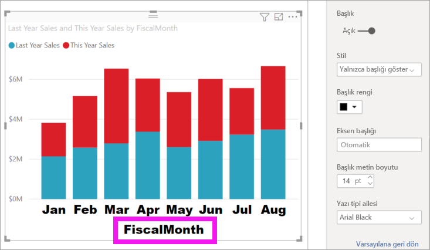

# X ekseni ve Y ekseni özelliklerini özelleştirme

[!INCLUDE [power-bi-visuals-desktop-banner](../includes/power-bi-visuals-desktop-banner.md)]

Bu öğreticide görsellerinizin X eksenini ve Y eksenini özelleştirmenin pek çok farklı yolunu öğreneceksiniz. Tüm görsellerin ekseni yoktur. Örneğin pasta grafiklerinde eksen bulunmaz. Özelleştirme seçenekleri de bir görselden diğerine farklılık gösterir. Bir makalenin kapsamına sığmayacak kadar çok seçenek vardır; bu nedenle en sık kullanılan bazı özelleştirmeleri inceleyerek Power BI rapor tuvalinde görsel **Biçim** bölmesini rahatlıkla kullanmanızı sağlayacağız.  

Amanda'nın X ve Y eksenlerini özelleştirmesini izleyin. Detaya gitme ve detaydan çıkma kullanılırken birleştirme işlemini denetlemenin farklı yollarını da gösterecek.

> [!NOTE]
> Bu videoda Power BI’ın eski bir sürümü kullanılmaktadır.

<iframe width="560" height="315" src="https://www.youtube.com/embed/9DeAKM4SNJM" frameborder="0" allowfullscreen></iframe>

## Önkoşullar

- Power BI Desktop

- [Perakende Analizi Örneği](https://download.microsoft.com/download/9/6/D/96DDC2FF-2568-491D-AAFA-AFDD6F763AE3/Retail%20Analysis%20Sample%20PBIX.pbix)

## Yeni görselleştirme ekleme

Görselleştirmenizi özelleştirebilmek için önce oluşturmanız gerekir.

1. Power BI Desktop’ta Perakende Analizi örneğini açın.  

2. En alttaki sarı artı simgesini seçerek yeni bir sayfa ekleyin. 

    

1. **Görselleştirmeler** bölmesinden yığılmış sütun grafiği simgesini seçin. Bu işlem, rapor tuvalinize boş bir şablon ekler.

    

1. X ekseni değerlerini ayarlamak için **Alanlar** bölmesinde **Zaman** > **MaliAy** alanını seçin.

1. Y ekseni değerlerini ayarlamak için **Alanlar** bölmesinden **Satışlar** > **Önceki Yılın Satışları** ve **Satışlar** > **Bu Yılın Satışları** > **Değer** alanını seçin.

    

    Artık X eksenini özelleştirebilirsiniz. Power BI, görselleştirmenizi biçimlendirmek için neredeyse sınırsız sayıda seçenek sunar. 

## X eksenini özelleştirme
X ekseninde özelleştirebileceğiniz birçok seçenek vardır. X eksenine veri etiketi ve başlık ekleyebilir, var olanları değiştirebilirsiniz. Kategoriler için çubukların, sütunların, çizgilerin ve alanların genişliğini, boyutunu ve doldurma özelliklerini değiştirebilirsiniz. Değerler için de görüntüleme birimlerini, ondalık basamakları ve kılavuz çizgilerini düzenleyebilirsiniz. Aşağıdaki örnekte bir sütun grafiğinin özelleştirilmesi gösterilmiştir. Seçenekleri tanımanız için burada birlikte birkaç özelleştirme seçeneği ekleyeceğiz. Geri kalanları da sonrasında kendiniz keşfedebilirsiniz.

### X ekseni etiketlerini özelleştirme
X ekseni etiketleri, grafiğin sütunlarının altında görüntülenir. Etiketler şu anda açık gri renkte, küçük ve okunmaları zor. Şimdi bunu değiştirelim.

1. **Görselleştirmeler** bölmesinde **Biçim** (boya rulosu simgesi ) öğesini seçin. Bunu yaptığınızda özelleştirme seçenekleri açılır.

2. X ekseni seçeneklerini genişletin.

   

3. **X ekseni** kaydırıcısını **Açık** konuma getirin.

    

    Bazı durumlarda X eksenini **Kapalı** duruma getirmek isteyebilirsiniz. Görselleştirme, etiket olmadan anlaşılabilir durumda olabilir veya rapor sayfası kalabalık olduğu için daha fazla veriye yer açma gereksinimi duyuyor olabilirsiniz.

4. Metin rengini, boyutunu ve yazı tipini biçimlendirin:

    - **Renk**: Siyahı seçin

    - **Metin boyutu**: *14* girin

    - **Yazı tipi ailesi**: **Arial Black** seçin

    - **İç dolgu**: *%40* girin

        
    
5. X ekseni metninin açılı olarak görünmesini istemiyor olabilirsiniz. Burada birkaç seçeneğiniz vardır. 
    - Metin boyutunu 14'ten daha küçük bir değerle değiştirin.
    - Görselleştirmeyi büyütün. 
    - **Minimum kategori genişliği** değerini artırarak daha az sütun görüntüleyin ve kaydırma çubuğu ekleyin. 
    
    Burada ikinci seçeneği tercih ettik ve görselleştirmeyi daha geniş hale getirmek için yeniden boyutlandırma çubuklarından birini tuttuk. Artık metni açılı olarak veya kaydırma çubuğu ile görüntülemeye gerek duymadan 14 nokta metni görüntüleyebiliyor. 

   

### X ekseni başlığını özelleştirme
X ekseni başlığı **Açık** olduğunda X ekseni etiketlerinin altında X ekseni başlığı görüntülenir. 

1. İlk olarak X ekseni başlığını **Açık** konuma getirin.  

    

    Göreceğiniz ilk şey, görselleştirmenizde artık varsayılan bir X ekseni başlığı olduğudur.  Bu örnekte ad **FiscalMonth** olur.

   

1. Başlığın metin rengini, boyutunu ve yazı tipini biçimlendirin:

    - **Başlık rengi**: Turuncu seçin

    - **Eksen başlığı**: *Mali Ay* (boşluk bırakarak) yazın

    - **Başlık metin boyutu**: *18* girin

    Özelleştirmeleri bitirdikten sonra yığılmış sütun grafiğiniz aşağıdakine benzer görünecektir:

    

1. Yaptığınız değişiklikleri kaydedin ve sonraki bölüme geçin. Yaptığınız tüm değişiklikleri geri almanız gerekirse, **X Ekseni** özelleştirme bölmesinin altındaki **Varsayılana geri dön** seçeneğini belirleyin. Ardından Y Ekseninizi özelleştireceksiniz.

## Y eksenini özelleştirme
Y ekseninde özelleştirilebilecek birçok özellik vardır. Veri etiketi, Y ekseni başlığı ve kılavuz çizgileri ekleyip var olanları değiştirebilirsiniz. Değerler için görüntüleme birimlerini, ondalık basamakları, başlangıç ve bitiş noktalarını değiştirebilirsiniz. Kategoriler için de çubukların, sütunların, çizgilerin ve alanların genişliğini, boyutunu ve doldurma özelliklerini düzenleyebilirsiniz. 

Aşağıdaki örnekte sütun grafiğini özelleştirme işlemleri devam ettirilmektedir. Seçenekleri tanımanız için burada birlikte birkaç değişiklik yapacağız. Geri kalanları da sonrasında kendiniz keşfedebilirsiniz.

### Y ekseni etiketlerini özelleştirme
Y ekseni etiketleri varsayılan olarak sol tarafta gösterilir. Etiketler şu anda açık gri renkte, küçük ve okunmaları zor. Şimdi bunu değiştirelim.

1. Y ekseni seçeneklerini genişletin.

   

1. **Y Ekseni** kaydırıcısını **Açık** konuma getirin.  

    

    Daha fazla veriye yer açmak için Y eksenini kapatmak isteyebilirsiniz.

1. Metin rengini, boyutunu ve yazı tipini biçimlendirin:

    - **Renk**: Siyahı seçin

    - **Metin boyutu**: *10* girin

    - **Görüntüleme birimleri**: **Milyon**'u seçin

    

### Y ekseni başlığını özelleştirme
Y ekseni başlığı **Açık** olduğunda Y ekseni etiketlerinin yanında Y ekseni başlığı görüntülenir. Bu görselleştirme için Y ekseni başlığının görüntülenmesi görseli geliştirmediğinden, **Başlık** seçeneğini **Kapalı** olarak bırakın. Bu öğreticinin ilerleyen bölümlerinde çift eksenli bir görsele Y ekseni başlıklarını ekleyeceğiz. 

### Kılavuz çizgilerini özelleştirme
Rengi değiştirerek ve darbeyi artırarak kılavuz çizgilerini belirginleştirin:

- **Renk**: Turuncu seçin

- **Darbe**: *2* girin

Bu özelleştirmelerin ardından sütun grafiğiniz aşağıdakine benzer şekilde görünür:

## Çift Y eksenli görselleştirmeleri özelleştirme

Bazı görselleştirmelerde iki Y ekseni bulunabilir. Birleşik haritalar buna iyi bir örnektir. Çift Y eksenini biçimlendirmek için satış ve brüt kar eğilimlerini karşılaştıran bir birleşik harita oluşturacağız.  

### İki Y Eksenli bir grafik oluşturun

1. Sütun grafiğini seçip *Çizgi ve yığılmış sütun* grafiği olarak değiştirin. Bu tür görseller tek bir çizgi grafik değerini ve birden çok yığılabilir sütun değerini destekler. 

    
   

2. Alanlar bölmesindeki **Satış** > **Brüt Kar Önceki Yıl %** değerini **Satır Değerleri** kutusuna sürükleyin.

    

    
3. Görselleştirmeyi yeniden biçimlendirerek açılı X ekseni etiketlerini kaldırın. 

   

   Power BI iki Y ekseni oluşturarak değerlerin farklı ölçeklendirilmesine olanak tanır. Sol taraftaki eksen satış doları tutarını ölçer ve sağ taraf eksen de brüt kar yüzdesini ölçer.

### İkinci Y eksenini biçimlendirme
Görselleştirmeye tek bir biçimlendirilmiş Y ekseniyle başladığımız için Power BI, aynı ayarlarla ikinci bir Y ekseni ekledi. Ancak bunu değiştirebiliriz. 

1. **Görselleştirmeler** bölmesinde biçim seçeneklerini görüntülemek için boya rulosu simgesini seçin.

1. Y ekseni seçeneklerini genişletin.

1. **İkincili göster** seçeneğini bulana kadar ekranı aşağı kaydırın. Bu seçeneğin **Açık** olduğundan emin olun. İkincil Y ekseni, çizgi grafiği temsil eder.

   

1. (İsteğe bağlı) İki eksenin yazı tipi rengini, boyutunu ve görüntüleme birimini özelleştirin. Sütun ekseni veya çizgi ekseni için **Konum** değerini değiştirirseniz iki eksen yer değiştirir.

### Her iki eksene başlık ekleme

Bu düzeyde karmaşık olan görselleştirmelerde eksen başlıklarının eklenmesi faydalıdır.  Başlıklar, iş arkadaşlarınızın görselleştirmeniz ile anlatılanları anlamasına yardımcı olur.

1. **Y Ekseni (Sütun)** ve **Y Ekseni (Satır)** için **Başlık** değerini **Açık** olarak ayarlayın.

1. Her ikisi için de **Stil** seçeneğini **Yalnızca başlığı göster** olarak ayarlayın.

   

1. Artık birleşik haritanız başlıkları olan iki eksen gösterir.

   

1. Başlıkları biçimlendirin. Bu örnekte başlıklardan birini kısalttık ve ikisinin birden yazı tipi boyutunu küçülttük. 
    - Yazı tipi boyutu: **9**
    - İlk Y ekseninin (sütun grafiği) **Eksen başlığı** kısaltıldı: Önceki yılın ve bu yılın satışları

    

Daha fazla bilgi için bkz. [Power BI'da renk biçimlendirmeye ilişkin ipuçları ve püf noktaları](service-tips-and-tricks-for-color-formatting.md) ve [Görselleştirme başlıklarını, açıklamaları ve arka planları özelleştirme](power-bi-visualization-customize-title-background-and-legend.md). Yeni başlık biçimlendirme seçenekleri çok yakında kullanıma sunulacak. 

## Sonraki adımlar

- [Power BI raporlarındaki görselleştirmeler](power-bi-report-visualizations.md)

Başka bir sorunuz mu var? [Power BI Topluluğu'na başvurun](https://community.powerbi.com/)
