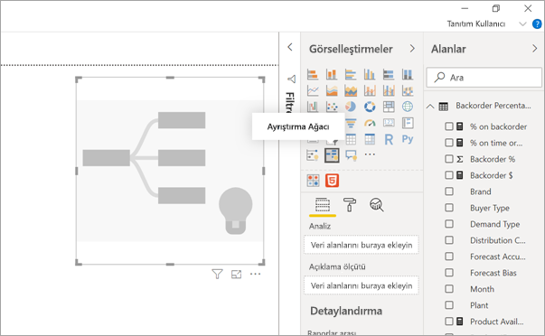
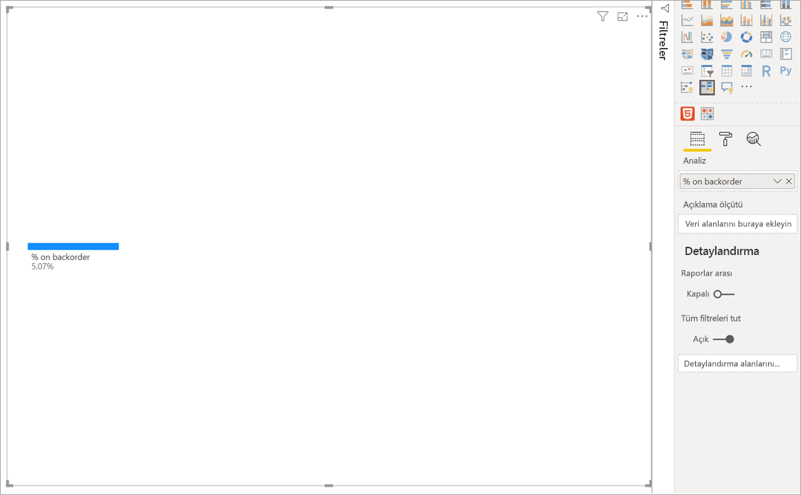
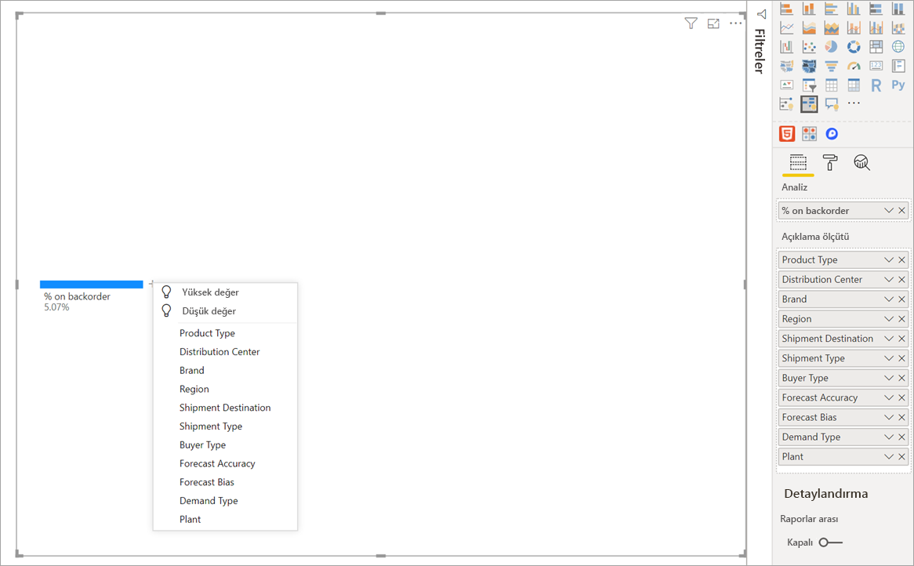
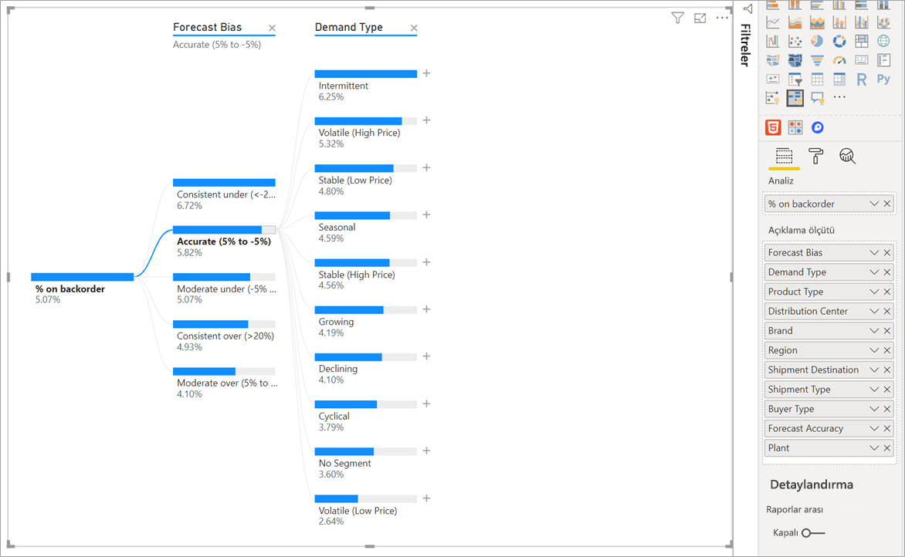
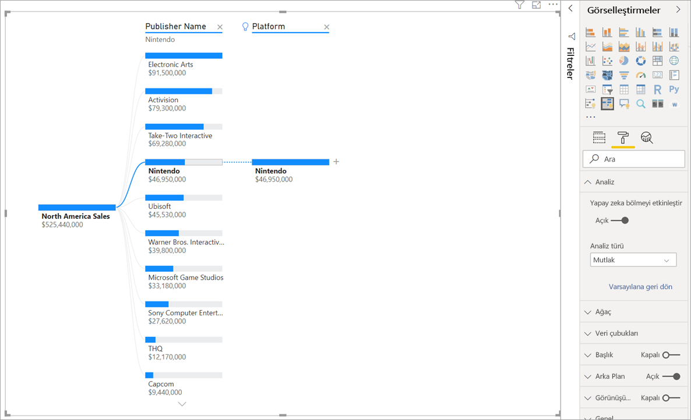
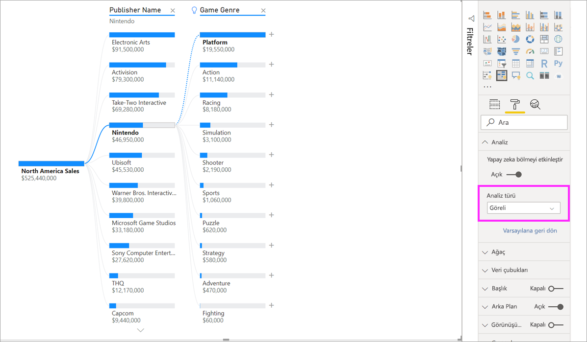
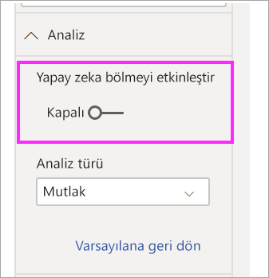

# Power BI’da ayrıştırma ağacı görselleri oluşturma ve görüntüleme

[!INCLUDE[consumer-appliesto-nyyn](../includes/consumer-appliesto-nyyn.md)]

[!INCLUDE [power-bi-visuals-desktop-banner](../includes/power-bi-visuals-desktop-banner.md)]

Power BI'da ayrıştırma ağacı görseli birden çok boyutta verileri görselleştirmenize olanak tanır. Verileri otomatik olarak toplar ve herhangi bir sırada boyutlarınızda detaya gitmenizi sağlar. Aynı zamanda bir yapay zeka (AI) görselleştirmesi olduğundan, belirli ölçütler temelinde detayına gidilecek bir sonraki boyutu bulmasını isteyebilirsiniz. Bu da geçici bir inceleme yapmak ve kök neden analizi yürütmek için değerli bir araç olmasını sağlar.

Bu öğreticide iki örnek kullanılır:

- Şirketin sipariş açığı olan (tükenen sipariş) ürün yüzdesini analiz eden bir tedarik zinciri senaryosu.  
- Video oyunu satışlarını oyun türü ve yayıncı gibi çeşitli faktörlere göre çözümleyen bir satış senaryosu.

Tedarik zinciri senaryosunda kullanılan pbix dosyasını burada bulabilirsiniz: [Tedarik Zinciri Örneği.pbix](
https://github.com/microsoft/powerbi-desktop-samples/blob/master/Sample%20Reports/Supply%20Chain%20Sample.pbix).

> [!NOTE]
> Raporunuzu bir Power BI iş arkadaşınızla paylaşmak için her ikinizin de bireysel Power BI Pro lisanslarınızın olması veya raporun Premium kapasitede depolanması gerekir.    

## Kullanmaya başlayın
Görselleştirmeler bölmesinden ayrıştırma ağacı simgesini seçin.

Görselleştirme için iki tür giriş gerekir:

 - **Analiz** – analiz etmek istediğiniz ölçüm. Bu bir ölçüm veya toplam değer olabilir.  
 - **Açıklama Ölçütü** – detayına gitmek istediğiniz bir veya birden fazla boyut.

Ölçünüzü bir alana sürüklediğinizde görsel toplam ölçüyü gösterecek şekilde güncelleştirilir. Aşağıdaki örnekte sipariş açığı olan ürünlerin ortalama yüzdesini (%5,07) görselleştiriyoruz.

Sonraki adım detayına gitmek istediğiniz bir veya birden fazla boyutu getirmektir. Bu alanları **Açıklama ölçütü** demetine ekleyin. Kök düğümünüzün yanında bir artı işareti gösterildiğine dikkat edin. Bu + işaretinin seçilmesi hangi alanda detaya gitmek istediğinizi seçmenize olanak tanır (alanlarda istediğiniz sırada detaya gidebilirsiniz).

**Forecast bias** (Tahmin sapması) öğesinin seçilmesi, ağacın genişlemesine ve ölçünün sütundaki değerlere göre ayrılmasına neden olur. Bu işlem detaya gidilecek başka bir düğüm seçilerek tekrarlanabilir.

Son düzeyden bir düğüm seçildiğinde verilere çapraz filtre uygulanır. Önceki düzeyden bir düğüm seçildiğinde yol değişir.

Diğer görsellerle etkileşim kurulduğunda ayrıştırma ağacına çapraz filtre uygulanır. Sonuç olarak düzeylerin içindeki düğüm sırası değişebilir.
Aşağıdaki örnekte Ubisoft'a göre ağaca çapraz filtre uyguladık. Yol güncelleştirildi ve PlayStation tarafından geride bırakılan Xbox satışları ilk sıradan ikinci sıraya geçti. 

Ağaca Nintendo'ya göre çapraz filtre uygularsak, Xbox tarafından geliştirilmiş Nintendo oyunu olmadığından Nintendo satışları boş olur. Xbox, bunu izleyen yolla birlikte filtrelenerek görünümün dışında kalır.

Yol görüntüden kaldırılsa da mevcut düzeyler (bu örnekte Game Genre) ağaçta sabitlenmiş olarak durur. Dolayısıyla Nintendo düğümü seçildiğinde ağaç otomatik olarak Game Genre öğesine genişletilir.

## AI bölmeleri

Verilerde bundan sonra nereye bakacağınızı anlamak için “AI Bölmeleri”ni kullanabilirsiniz. Bu bölmeler listenin en üstünde görüntülenir ve bir ampulle işaretlenir. Bölmelerin amacı, verilerdeki yüksek ve düşük değerleri otomatik olarak bulmanıza yardımcı olmaktır.

Tercihlerinize bağlı olarak analiz iki yönde de çalışabilir. Varsayılan davranış şöyledir:

 - **Yüksek Değer**: Tüm kullanılabilir alanları dikkate alır ve analiz edilen ölçümün en yüksek değerini elde etmek için hangisinde detaya gidileceğini saptar.  
 - **Düşük Değer**: Tüm kullanılabilir alanları dikkate alır ve analiz edilen ölçümün en düşük değerini elde etmek için hangisinde detaya gidileceğini saptar.  

Sipariş açığı örneğinde **Yüksek Değer** seçildiğinde sonuç aşağıdaki gibi olur:

**Product Type** öğesinin yanında, bunun ‘AI bölmesi’ olduğunu gösteren bir ampul görüntülenir. Ayrıca ağaç, **Patient Monitoring** (Hasta İzleme) düğümünü öneren bir noktalı çizgi de sağlar çünkü bu düğüm en yüksek sipariş açığı değerini verir (%9,2). 

Araç ipucunu görmek için ampulün üzerine gelin. Bu örnekte araç ipucu şöyledir: “% on backorder is highest when Product Type is Patient Monitoring” (Ürün Türü Hasta İzleme olduğunda en yüksek sipariş açığı yüzdesi elde edilir).

Görseli yapılandırarak **Mutlak** AI bölmeleri yerine **Göreli** AI bölmelerini bulabilirsiniz. 

Göreli modda öne çıkan yüksek değerlere bakılır (sütundaki diğer verilerle karşılaştırıldığında). Bunu göstermek için bir örneğe göz atalım:

Yukarıdaki ekran görüntüsünde video oyunlarının Kuzey Amerika satışlarına bakıyoruz. Ağacı önce **Publisher Name** (Yayıncı Adı) öğesine göre bölüyor ve sonra da Nintendo'da detaya gidiyoruz. **High Value** (Yüksek Değer) seçildiğinde **Platform is Nintendo** genişletmesi elde ediliyor. Nintendo (yayıncı) yalnızca Nintendo konsolları için oyun geliştirdiğinden, tek bir değer var ve kuşkusuz en yüksek değer de bu.

Yine de, hangi yüksek değerin aynı sütundaki diğer değerlere göre öne çıktığına bakmak daha ilginç bir bölme olabilir. **Mutlak** olan Analiz türünü **Göreli** olarak değiştirirsek, Nintendo için aşağıdaki sonuçları elde ediyoruz: 

Bu kez önerilen değer **Platform within Game Genre** (Oyun Türü içinde Platform).  Platform, Nintendo'dan daha yüksek bir mutlak değer ortaya koymuyor(19.950.000 ABD doları - 46.950.000 ABD doları). Yine de bu öne çıkan bir değer.

Daha net ortaya koymak gerekirse, 10 tane Game Genre değeri olduğundan bunlar eşit bölünecekse Platform için beklenen 4,6 milyon ABD doları olabilir. Platform'un değeri neredeyse 20 milyon ABD doları olduğuna göre, beklenen sonuçtan dört kat büyük olan bu değer ilgi çekici bir sonuç oluyor.

Hesaplama şöyle yapılıyor:

Platform için Kuzey Amerika Satışları/ Abs(Avg(Oyun Türü için Kuzey Amerika Satışları))  
-  
Nintendo için Kuzey Amerika Satışları/ Abs(Avg(Platform için Kuzey Amerika Satışları))  

Bunu şöyle gösterebiliriz:

19.550.000 / (19.550.000 + 11.140.000 + ... + 470.000 + 60.000 /10) = 4,25x  
-  
46.950.000/ (46.950.000/1) = 1x  

Ağaçta hiçbir AI bölmesi kullanmamayı tercih ederseniz, bunları **Analiz biçimlendirme** seçenekleri altında kapatabilirsiniz:  

## AI bölmeleriyle ağaç etkileşimleri

Birbirini izleyen birden çok AI düzeyiniz olabilir. Ayrıca farklı türlerdeki AI düzeylerini karma kullanabilirsiniz (Yüksek Değerden (High Value) Düşük Değere (Low Value) ve sonra yine Yüksek Değere gitme):

Ağaçta farklı bir düğüm seçerseniz AI Bölmeleri sıfırdan yeniden hesaplanır. Aşağıdaki örnekte **Forecast Bias** düzeyinde seçilen düğümü değiştirdik. İzleyen düzeyler doğru Yüksek ve Düşük Değerleri ortaya koyacak şekilde değişir.

Ayrıştırma ağacına başka bir görselle çapraz filtreleme uyguladığınızda da AI düzeyleri yeniden hesaplanır. Aşağıdaki örnekte, Plant #0477'de sipariş açığı yüzdemizin en yüksek düzeyde olduğunu görebiliriz.

Ama çubuk grafikte **April**'i (Nisan) seçersek, en yüksek değer **Advanced Surgical Ürün Türü** olarak değişir. Bu durumda yalnızca düğümler yeniden sıralanmakla kalmaz, tamamen farklı bir sütun seçilir. 

AI düzeylerinin AI olmayan düzeyler gibi davranmasını istiyorsanız, ampul simgesini seçerek varsayılan davranışa dönün. 

Birden çok AI düzeyi zincirleme bağlanabilir ama bir AI düzeyini AI olmayan bir düzey izleyemez. AI bölmesinin ardında bir el ile bölmeniz varsa, AI düzeyinin ampulü görüntüden kaldırılır ve düzey normal düzeye dönüştürülür. 

## Kilitleme

İçerik oluşturucusu düzeyleri rapor tüketicilerine kilitleyebilir. Düzey kilitlendiğinde kaldırılamaz veya değiştirilemez. Tüketici kilitli düzeyin içinde farklı yolları keşfedebilir ama düzeyin kendisini değiştiremez. Bir oluşturucu olarak mevcut düzeylerin üzerine gelip kilit simgesini görebilirsiniz. İstediğiniz kadar çok düzeyi kilitleyebilirsiniz ama kilitli düzeylerden önce kilitsiz düzeyler bulunduramazsınız.

Aşağıdaki örnekte ilk iki düzey kilitlenmiştir. Diğer bir deyişle rapor tüketicileri 3. ve 4. düzeyleri değiştirebilir, hatta bunlardan sonra yeni düzeyler ekleyebilir. Öte yandan ilk iki düzey değiştirilemez:

## Bilinen sınırlamalar

Ağaçta en fazla 50 düzey bulunabilir. Ağaçta tek seferde en fazla 5000 veri noktası görselleştirilebilir. İlk n noktayı göstermek için düzeyler kesilir. Bu değer şu an için her düzeyde en fazla 10 olarak belirlenmiştir. 

Ayrıştırma ağacı aşağıdaki senaryolarda desteklenmez:  
-   Şirket içi Analysis Services

AI bölmeleri aşağıdaki senaryolarda desteklenmez:  
-   Azure Analysis Services
-   Power BI Rapor Sunucusu
-   Web'de yayımla
-   'Analiz'de karmaşık ölçüler ve uzantı şemalarından ölçüler

Diğer sınırlamalar:
- Soru-Cevap içinde destek

## Sonraki adımlar

[Power BI halka grafiği](power-bi-visualization-doughnut-charts.md)

[Power BI görselleştirmeleri](power-bi-report-visualizations.md)

