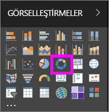
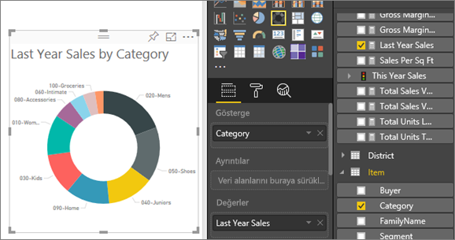

# Power BI'da halka grafik oluşturma ve kullanma

[!INCLUDE[consumer-appliesto-nyyn](../includes/consumer-appliesto-nyyn.md)]

[!INCLUDE [power-bi-visuals-desktop-banner](../includes/power-bi-visuals-desktop-banner.md)]

Halka grafik de pasta grafiği gibi parçaların bütünle olan ilişkisini gösterir. Tek fark ortasının boş ve bir etiket veya simge yerleştirmeye müsait olmasıdır.

## Önkoşul

Bu öğreticide [Perakende Analizi örneği .PBIX dosyası](https://download.microsoft.com/download/9/6/D/96DDC2FF-2568-491D-AAFA-AFDD6F763AE3/Retail%20Analysis%20Sample%20PBIX.pbix) kullanılmıştır.

1. Menü çubuğunun sol üst köşesinden **Dosya** > **Aç** ’ı seçin
   
2. **Perakende Analizi örneği PBIX dosyasının** kopyasını bulun

1. **Perakende Analizi örneği PBIX dosyasını** rapor görünümünde  açın.

1. Seç  yeni bir sayfa ekleyin.

> [!NOTE]
> Raporunuzu bir Power BI iş arkadaşınızla paylaşmak için her ikinizin de bireysel Power BI Pro lisanslarınızın olması veya raporun Premium kapasitede depolanması gerekir.    

## Halka grafik oluşturma

1. Boş bir rapor sayfasında başlayın ve Alanlar bölmesinden **Satış** \> **Geçen Yılın Satışları** ’nı seçin.  
   
3. Görsel Öğeler bölmesinde çubuk grafiğinizi halka grafiğe dönüştürmek için halka grafik simgesini  seçin. **Last Year Sales** , **Değerler** alanında görüntülenmiyorsa oraya sürükleyin.
     
   

4. **Item** \> **Category** 'yi seçerek **Açıklama** alanına ekleyin. 
     
    

5. İsteğe bağlı olarak [grafik metninin boyutunu ve rengini ayarlayabilirsiniz](power-bi-visualization-customize-title-background-and-legend.md). 

## Önemli noktalar ve sorun giderme
* Halka grafikteki değerlerin toplamının %100 olması gerekir.
* Çok fazla kategori kullanılması durumunda grafiği okumak ve yorumlamak zor olabilir.
* Halka grafikler, bölümleri birbirleriyle karşılaştırmaktan çok belirli bir bölümü bütünle karşılaştırma durumlarında kullanışlıdır. 

## Sonraki adımlar
[Power BI'da huni grafikleri](power-bi-visualization-funnel-charts.md)

[Power BI'daki görselleştirme türleri](power-bi-visualization-types-for-reports-and-q-and-a.md)

