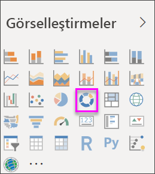
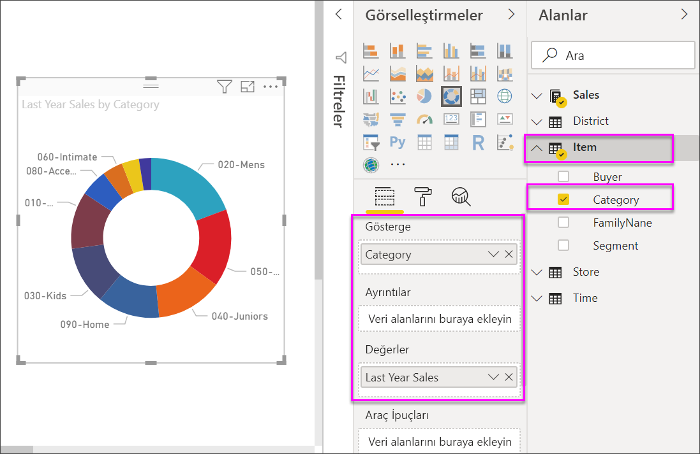

# Power BI'da halka grafikler
Halka grafik de pasta grafiği gibi parçaların bütünle olan ilişkisini gösterir. Tek fark ortasının boş ve bir etiket veya simge yerleştirmeye müsait olmasıdır.

## Halka grafik oluşturma
Bu yönergelerde bu yılın satışlarını kategorilere ayrılmış şekilde gösteren bir Halka grafik oluşturmak üzere Retail Analysis Sample kullanılmaktadır. Yönergeleri takip etmek için Power BI hizmeti veya Power BI Desktop [örneğini indirin](../sample-datasets.md).

1. [Boş bir rapor sayfasında](../power-bi-report-add-page.md) başlayın. Power BI hizmetini kullanıyorsanız raporu [Düzenleme Görünümü](../service-interact-with-a-report-in-editing-view.md)'nde açtığınızdan emin olmanız gerekir.

2. Alanlar bölmesinde **Sales** \> **Last Year Sales** seçeneğini belirleyin.  
   
3. Görsel Öğeler bölmesinde çubuk grafiğinizi halka grafiğe dönüştürmek için halka grafik simgesini  seçin. **Last Year Sales**, **Değerler** alanında görüntülenmiyorsa oraya sürükleyin.
     
   

4. **Item** \> **Category**'yi seçerek **Açıklama** alanına ekleyin. 
     
    

5. İsteğe bağlı olarak [grafik metninin boyutunu ve rengini ayarlayabilirsiniz](power-bi-visualization-customize-title-background-and-legend.md). 

## Önemli noktalar ve sorun giderme
* Halka grafikteki değerlerin toplamının %100 olması gerekir.
* Çok fazla kategori kullanılması durumunda grafiği okumak ve yorumlamak zor olabilir.
* Halka grafikler, bölümleri birbirleriyle karşılaştırmaktan çok belirli bir bölümü bütünle karşılaştırma durumlarında kullanışlıdır. 

## Sonraki adımlar
[Power BI'da huni grafikleri](power-bi-visualization-funnel-charts.md)

[Power BI'daki görselleştirme türleri](power-bi-visualization-types-for-reports-and-q-and-a.md)

