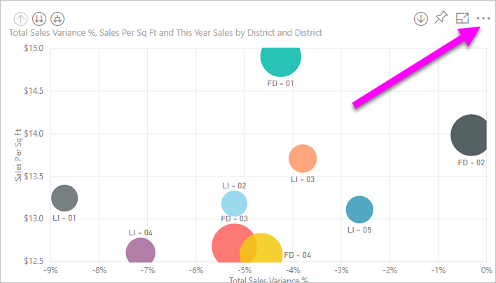
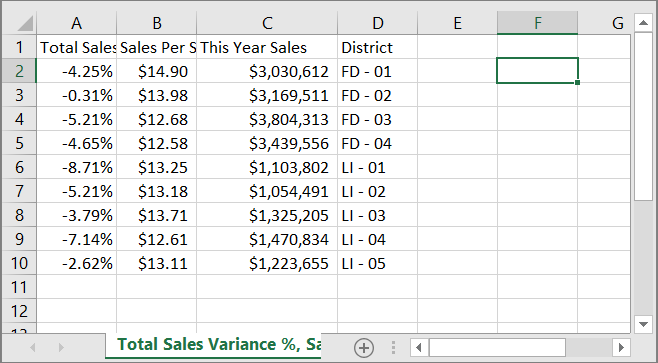
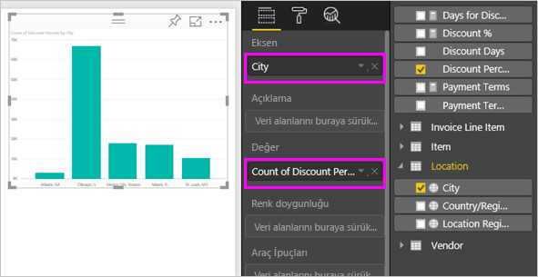
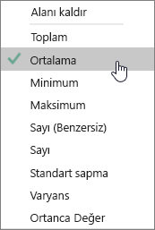
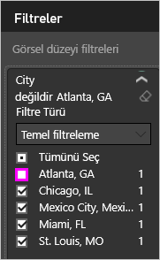
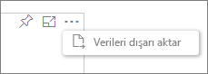
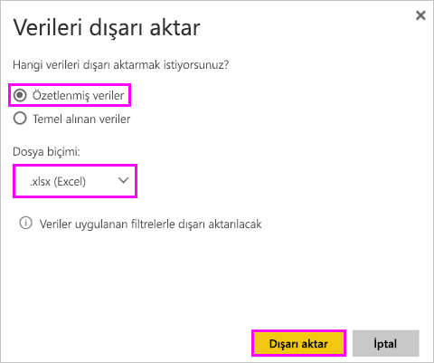
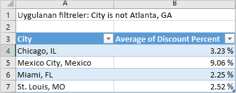
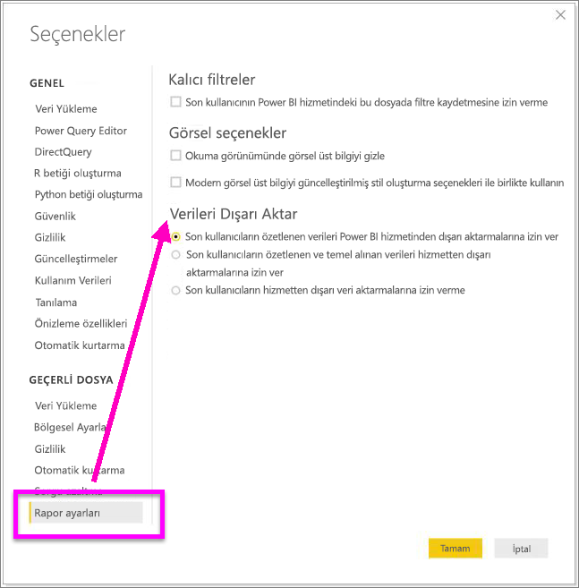

# Görselleştirmelerdeki verileri dışarı aktarma
Bir görselleştirmenin oluşturulması için kullanılan verileri görmek isterseniz söz konusu verileri Power BI’da görüntüleyebilir veya bir .xlsx ya da .csv dosyası olarak Excel'e aktarabilirsiniz. Verileri dışarı aktarma seçeneği Pro veya Premium lisansına ek olarak veri kümesi ve rapor için düzenleme izinleri gerektirir. 

Will raporundaki görselleştirmelerden birindeki verileri dışarı aktarıp, .xlsx dosyası olarak kaydedip dosyayı Excel'de açarken ona eşlik edin. Ardından, videonun altında yer alan adım adım yönergeleri izleyerek bu işlemi kendiniz deneyin.

<iframe width="560" height="315" src="https://www.youtube.com/embed/KjheMTGjDXw" frameborder="0" allowfullscreen></iframe>

## Bir Power BI panosunda bulunan görselleştirmeden
1. Görselleştirmenin sağ üst köşesinde bulunan üç nokta simgesini seçin.

    
2. **Verileri dışarı aktar** simgesini seçin.

    
3. Veriler bir .csv dosyasına aktarılır. Görsel filtrelenmişse, indirilen veriler de filtrelenmiş olur.    
4. Tarayıcınız sizi dosyayı kaydetmeye yönlendirir.  Kaydedilen .csv dosyasını Excel'de açın.

    

## Bir raporda bulunan görselleştirmeden
Birlikte ilerleyebilmek için, [Tedarik analizi örneği raporunu](../sample-procurement.md) [Düzenleme görünümü](../consumer/end-user-reading-view.md)'nde açın. [Yeni bir boş rapor sayfası ekleyin](../power-bi-report-add-page.md). Ardından, aşağıdaki adımları uygulayarak bir toplama ve görsel düzeyi filtresi ekleyin.

1. Yeni bir sütun grafiği oluşturun.  Alanlar bölmesinde, **Location > City** ve **Invoice > Discount Percent** seçeneklerini belirleyin.  **İndirim Yüzdesi**’ni Değer bölümüne taşımanız gerekebilir. 

    
2. **Discount Percent** için **Sayı** olan toplama işlemini **Ortalama** olarak değiştirin. Değer kutusunda, **Discount Percent**'in (**Sayı Discount Percent** olarak da görünüyor olabilir) sağında bulunan oku seçin ve ardından **Ortalama** seçeneğini belirleyin.

    
3. **City**'ye bir filtre ekleyerek **Atlanta**'yı kaldırın.

   

   Artık dışarı aktarma işlemine yönelik iki seçeneği de denemeye hazırız. 

4. Görselleştirmenin sağ üst köşesinde bulunan üç nokta simgesini seçin. **Verileri dışarı aktar** seçeneğini belirleyin.

   
5. Power BI Online'da, görselleştirmeniz bir toplama işlemi içeriyorsa (*ortalama*, *toplam* veya *minimum* olarak değiştirdiğiniz **Sayı** gibi), iki seçeneğe sahip olursunuz: **Özetlenmiş veriler** ve **Temel alınan veriler**. Power BI Desktop'ta yalnızca **Özetlenmiş veriler** seçeneği bulunur. Toplama işlemlerini anlama konusunda yardım için bkz. [Power BI'da toplama işlemleri](../service-aggregates.md).
    
6. **Özetlenmiş veriler** > **Dışarı Aktar**'ı seçin ve .xlsx veya .csv seçeneğini belirleyin. Power BI, verileri dışarı aktarır.  Görselleştirmeye filtreler uyguladıysanız, dışarı aktarılan veriler de filtrelenmiş olur. **Dışarı Aktar** seçeneğini belirlediğinizde, tarayıcınız sizi dosyayı kaydetmeye yönlendirir. Kaydedilen dosyayı Excel'de açın.

   **Özetlenmiş veriler**: Bu görselde gördükleriniz için verileri dışarı aktarmak istiyorsanız bu seçeneği belirtin.  Bu tür bir dışarı aktarma işlemi size yalnızca görseli oluşturmak için seçtiğiniz verileri (sütunlar ve ölçüler) gösterir.  Görselin toplaması varsa, toplanan verileri dışarı aktarırsınız. Örneğin, 4 çubuk gösteren bir çubuk grafiğiniz varsa 4 veri satırı elde edersiniz. Özetlenen veriler .xlsx ve .csv olarak kullanılabilir.

   Bu örnekte, dışarı aktarma işlemiyle oluşturulmuş Excel dosyasında her şehir için bir satır bulunur. Filtrelediğimiz Atlanta, sonuçlarda yer almaz.  Elektronik tablomuzun ilk satırında, Power BI'daki veriler ayıklanırken kullanılan filtreler gösterilir.

   
7. Şimdi de **Temel alınan veriler** > **Dışarı aktar**'ı seçip .xlsx seçeneğini belirlemeyi deneyin. Power BI, verileri dışarı aktarır. Görselleştirmelere filtreler uyguladıysanız, dışarı aktarılan veriler de filtrelenmiş olur. **Dışarı Aktar** seçeneğini belirlediğinizde, tarayıcınız sizi dosyayı kaydetmeye yönlendirir. Kaydedilen dosyayı Excel'de açın.

   >[!WARNING]
   >Temel alınan verilerin dışarı aktarılması, kullanıcıların verileri tüm ayrıntılarıyla (verilerdeki tüm sütunlar) görebilmesine olanak sağlar. Power BI hizmeti yöneticileri kuruluşlarında bu özelliği devre dışı bırakamaz. Veri kümesinin sahibiyseniz özel bilgilerin bulunduğu sütunları "gizli" olarak ayarlayabilir ve böylece bu bilgilerin Desktop veya Power BI hizmetindeki Alanlar listesinde gösterilmemesini sağlayabilirsiniz.

   **Temel alınan veriler**: Görseldeki verileri ***ve*** modelden ek verileri görmek istiyorsanız bu seçeneği belirtin (ayrıntılar için aşağıdaki grafiğe bakın).  Görselleştirmenizin toplaması varsa, *Temel alınan veriler*'in seçilmesi toplamayı kaldırır. **Dışarı Aktar** seçeneğini belirlediğinizde, veriler bir .xlsx dosyası olarak dışarı aktarılır ve tarayıcınız sizi dosyayı kaydetmeye yönlendirir. Kaydedilen dosyayı Excel'de açın.

   Bu örnekte bulunan, dışarı aktarmayla oluşturduğumuz Excel dosyasında, veri kümemizdeki her City satırı için bir satır ve söz konusu tek girişe ilişkin indirim yüzdesi gösterilir. Başka bir deyişle, veriler toplanmamış, düzleştirilmiştir. Elektronik tablomuzun ilk satırında, Power BI'daki veriler ayıklanırken kullanılan filtreler gösterilir.  

   

## Temel alınan veri ayrıntılarını dışarı aktarma
**Temel alınan veriler**'i seçtiğinizde görecekleriniz değişebilir. Bu ayrıntıların anlaşılması için Yöneticinizin veya BT bölümünüzün yardımı gerekebilir. Power BI Desktop'ta veya Power BI hizmetinde, rapor görünümündeki Alanlar listesinde hesap makinesi simgesiyle  bir *ölçü* görüntülenir. Ölçüler Power BI hizmetinde değil Power BI Desktop'ta oluşturulur.

| Görselin içeriği |                                                                              Dışarı aktarma işleminde görecekleriniz                                                                              |
|-----------------|-------------------------------------------------------------------------------------------------------------------------------------------------------------------------------------|
|   Toplamalar    |                                                 *İlk* toplama ve bu toplama için tablonun tamamından gizli olmayan veriler                                                  |
|   Toplamalar    | ilgili veriler - görselde toplamayı içeren veri tablosuyla *\*\*ilgili*\* olan başka veri tablolarından veriler kullanılıyorsa (ilişki \*:1 veya 1:1 olduğu sürece) |
|    Ölçüler     |                                      Görseldeki tüm ölçüler *ve* görselde kullanılan bir ölçünün yer aldığı diğer veri tablosundaki tüm ölçüler                                      |
|    Ölçüler     |                                       Bu ölçüyü içeren tablolardaki tüm gizli olmayan veriler (ilişki \*:1 veya 1:1 olduğu sürece)                                       |
|    Ölçüler     |                                      Bir \*:1 veya 1:1 zinciri yoluyla ölçüleri içeren tabloyla ilgili olan tüm tablolardaki tüm veriler                                      |
|  Yalnızca ölçüler  |                                                   Tüm ilgili tablolardaki tüm gizli olmayan sütunlar (ölçüyü genişletmek için)                                                   |
|  Yalnızca ölçüler  |                                                             Model ölçüleri için tüm yinelenen satırların özetlenmiş verileri.                                                              |

### Dışarı aktarma seçeneklerini ayarlama
Power BI rapor tasarımcıları, tüketicilerine sunulacak veri dışarı aktarma seçeneklerini denetleyebilir. Seçenekler şunlardır:
- Yalnızca özetlenmiş verilerin dışarı aktarılmasına izin ver (bu yeni raporlar için varsayılan ayardır) 
- Özetlenmiş ve temel alınan verilerin dışarı aktarılmasına izin ver (Ekim 2018 öncesi varsayılan ayar) 
- Verilerin dışarı aktarılmasına izin verme  

    > [!IMPORTANT]
    > Rapor tasarımcılarının eski raporları yeniden ziyaret ederek dışarı aktarma seçeneğini el ile sıfırlamasını öneririz.

1. Bu seçenekleri ayarlamak için Power BI Desktop'ı başlatın.

2. Sol üst köşeden **Dosya** > **Seçenekler ve Ayarlar** > **Seçenekler** yolunu izleyin. 

3. **Geçerli dosya** bölümünde **Rapor ayarları**'nı seçin.

    

4. **Verileri dışarı aktar** açılan menüsünden seçiminizi yapın.

Bu ayarı Power BI hizmetinden de güncelleştirebilirsiniz.  

Power BI yönetici portalındaki ayarlarla raporun dışarı aktarma ayarları farklı olduğunda yönetici ayarları, veri dışarı aktarma ayarlarını geçersiz kılacaktır. 

## Sınırlamalar ve önemli noktalar
* **Power BI Desktop** ve **Power BI hizmetinden** bir .csv dosyasına aktarılabilen maksimum satır sayısı 30.000'dir.
* .xlsx dosyalarına aktarılabilen maksimum satır sayısı 150.000'dir.
* Veri kaynağı bir Analysis Services canlı bağlantısıysa, 2016'dan önceki bir sürüm kullanılıyorsa ve modeldeki tablolar benzersiz bir anahtara sahip değilse *Temel alınan veriler* seçeneğiyle dışarı aktarma özelliği kullanılamaz.  
* Dışarı aktarılan görselleştirme için *Veri içermeyen öğeleri göster* seçeneği etkinse *Temel alınan veriler* seçeneğiyle dışarı aktarma özelliği kullanılamaz.
* DirectQuery kullanılırken, dışarı aktarılabilen maksimum veri miktarı 16 MB'tır. Bu, özellikle de çok sayıda sütun, sıkıştırılması zor veriler ve dosya boyutunu artırıp dışarı aktarılan satır sayısını düşüren diğer faktörlerin bulunması halinde maksimum sayının altında satırın dışarı aktarılmasına neden olabilir.
* Görselde birden fazla veri tablosundaki veriler kullanılıyorsa ve veri modelinde söz konusu tablolar için ilişki yoksa, yalnızca ilk tablonun verileri dışarı aktarılır. 
* Şu anda özel görseller ve R görselleri desteklenmemektedir.
* Verileri dışarı aktarma özelliği, kendileriyle paylaşılan bir panoyu kullanmakta olan, kuruluşunuzun dışındaki kullanıcılar tarafından kullanılamaz. 
* Power BI’da alana çift tıklanıp yeni bir ad yazılarak alan (sütun) yeniden adlandırılabilir.  Bu yeni ad, *diğer ad* olarak adlandırılır. Bir Power BI raporunun yinelenen alan adları içermesi mümkündür ancak Excel yinelenen adlara izin vermez.  Bu nedenle, veriler Excel'e gönderildiğinde alan diğer adları özgün alan (sütun) adlarına geri döner.  
* .csv dosyasında bir unicode karakter varsa metin Excel'de düzgün bir şekilde görüntülenmeyebilir. Ancak dosyayı Not Defteri'nde açmak yeterli olacaktır. Para birimi simgeleri ve yabancı kelimeler unicode karakterlere örnek olarak verilebilir. Bu soruna yönelik bir geçici çözüm olarak, CSV dosyasını doğrudan açmak yerine Excel'e aktarabilirsiniz. Bunu gerçekleştirmek için:

  1. Excel'i açın
  2. **Veri** sekmesinde, **Dış veri al** > **Metinden** seçeneğini belirleyin.
* Power BI yöneticileri verilerin dışarı aktarılmasını devre dışı bırakabilir.

## Sonraki adımlar
[Power BI'daki panolar](../consumer/end-user-dashboards.md)  
[Power BI - Temel Kavramlar](../consumer/end-user-basic-concepts.md)

Başka bir sorunuz mu var? [Power BI Topluluğu'na sorun](http://community.powerbi.com/)

