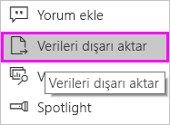
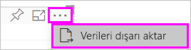
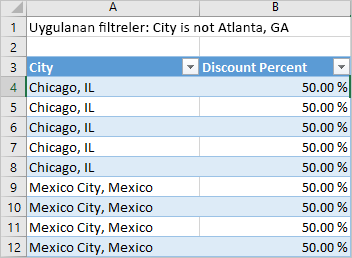

# Görselleştirmelerdeki verileri dışarı aktarma

Bir görselleştirmenin oluşturulması için Power BI’ın kullandığı verileri görmek isterseniz [söz konusu verileri Power BI’da görüntüleyebilirsiniz](service-reports-show-data.md). Bu verileri bir *.xlsx* veya *.csv* dosyası olarak Excel'e de aktarabilirsiniz. Verileri dışarı aktarma seçeneği Pro veya Premium lisansına ek olarak veri kümesi ve rapor için düzenleme izinleri gerektirir.

Will raporundaki görselleştirmelerden birindeki verileri dışarı aktarıp, *.xlsx* dosyası olarak kaydedip dosyayı Excel'de açarken ona eşlik edin. Ardından, videonun altında yer alan adım adım yönergeleri izleyerek bu işlemi kendiniz deneyin.

<iframe width="560" height="315" src="https://www.youtube.com/embed/KjheMTGjDXw" frameborder="0" allowfullscreen></iframe>

## Power BI panosundan verileri dışarı aktarma

1. Görselleştirmenin sağ üst köşesindeki üç noktayı seçin.

    

1. **Verileri dışarı aktar** simgesini seçin.

    

1. Power BI, verileri bir *.csv* dosyasına aktarır. Görselleştirmeyi filtrelediyseniz, uygulama da indirilen verileri filtreler.

1. Tarayıcınız sizi dosyayı kaydetmeye yönlendirir.  Kaydedilen *.csv* dosyasını Excel'de açın.

    

## Rapordaki verileri dışarı aktarma

Birlikte ilerleyebilmek için, [Tedarik analizi örneği raporunu](../sample-procurement.md) Düzenleme görünümünde açın. Yeni bir boş rapor sayfası ekleyin. Ardından, aşağıdaki adımları uygulayarak bir toplama ve görsel düzeyi filtresi ekleyin.

1. Yeni bir **Yığılmış sütun grafiği** oluşturun.

1. **Alanlar** bölmesinde **Location > City** ve **Invoice > Discount Percent** seçeneklerini belirleyin.  **Discount Percent** değerini **Değer** kutusuna taşımanız gerekebilir.

    

1. **Discount Percent** için **Sayı** olan toplama işlemini **Ortalama** olarak değiştirin. **Değer** kutusundaki **Discount Percent**'in (**Count of Discount Percent** olarak da görünüyor olabilir) sağında bulunan oku seçin ve ardından **Ortalama**'yı seçin.

    

1. **City** için filtre ekleyin, tüm şehirleri seçin ve **Atlanta**'yı kaldırın.

    

   Artık dışarı aktarma işlemine yönelik iki seçeneği de denemeye hazırız.

1. Görselleştirmenin sağ üst köşesindeki üç noktayı seçin. **Verileri dışarı aktar**'ı seçin.

    

    Power BI Online'da, görselleştirmeniz bir toplama işlemi içeriyorsa (*ortalama*, *toplam* veya *minimum* olarak değiştirdiğiniz **Sayı** gibi), iki seçeneğiniz vardır:

    - **Özetlenmiş veriler**

    - **Temel alınan veriler**

    Power BI Desktop'ta yalnızca **Özetlenmiş veriler** seçeneği bulunur. Toplama işlemlerini anlama konusunda yardım için bkz. [Power BI'da toplama işlemleri](../service-aggregates.md).

1. **Verileri dışarı aktar** altında **Özetlenmiş veriler**'i, ardından *.xlsx* veya *.csv*'yi ve sonra da **Dışarı Aktar**'ı seçin. Power BI, verileri dışarı aktarır.

    

    Görselleştirmelere filtre uyguladıysanız, dışarı aktarılan veriler de filtrelenmiş olur. **Dışarı Aktar** seçeneğini belirlediğinizde, tarayıcınız sizi dosyayı kaydetmeye yönlendirir. Kaydedilen dosyayı Excel'de açın.

    **Özetlenmiş veriler**: Bu görselde gördükleriniz için verileri dışarı aktarmak istiyorsanız bu seçeneği belirtin.  Bu tür bir dışarı aktarma işlemi size yalnızca görseli oluşturmak için seçtiğiniz verileri (sütunlar ve ölçüler) gösterir.  Görselin toplaması varsa, toplanan verileri dışarı aktarırsınız. Örneğin, dört çubuk gösteren bir çubuk grafiğiniz varsa dört veri satırı elde edersiniz. Özetlenmiş veriler *.xlsx* ve *.csv* olarak sağlanır.

    Bu örnekte, dışarı aktarma işlemiyle oluşturulmuş Excel dosyasında her şehir için bir satır bulunur. Filtrelediğimiz Atlanta, sonuçlarda yer almaz. Elektronik tablomuzun ilk satırında, veriler ayıklanırken Power BI’nin kullandığı filtreler gösterilir.

    

1. Şimdi **Temel alınan veriler**'i, *.xlsx*'i ve ardından **Dışarı Aktar**'ı seçmeyi deneyin. Power BI, verileri dışarı aktarır. 

    > [!NOTE]
    > Temel alınan verileri dışarı aktarma seçeneğinizin olup olmadığı, rapor ayarlarına bağlıdır.

    Görselleştirmelere filtre uyguladıysanız, dışarı aktarılan veriler de filtrelenmiş olur. **Dışarı Aktar** seçeneğini belirlediğinizde, tarayıcınız sizi dosyayı kaydetmeye yönlendirir. Kaydedilen dosyayı Excel'de açın.

    >[!WARNING]
    >Temel alınan verilerin dışarı aktarılması, kullanıcıların verileri tüm ayrıntılarıyla (verilerdeki tüm sütunlar) görebilmesine olanak sağlar. Power BI hizmeti yöneticileri kuruluşlarında bu özelliği devre dışı bırakamaz. Veri kümesinin sahibiyseniz özel bilgilerin bulunduğu sütunları **gizli** olarak ayarlayabilir ve böylece bu bilgilerin Desktop veya Power BI hizmetindeki **Alanlar** listesinde gösterilmemesini sağlayabilirsiniz.

    **Temel alınan veriler**: Görseldeki verileri ***ve*** modelden ek verileri görmek istiyorsanız bu seçeneği belirtin (ayrıntılar için aşağıdaki grafiğe bakın). Görselleştirmenizin toplaması varsa, *Temel alınan veriler*'in seçilmesi toplamayı kaldırır. **Dışarı Aktar**'ı seçtiğinizde Power BI verileri bir *.xlsx* dosyası olarak dışarı aktarır ve tarayıcınız sizi dosyayı kaydetmeye yönlendirir. Kaydedilen dosyayı Excel'de açın.

    Bu örnekte bulunan ve dışarı aktarmayla oluşturduğumuz Excel dosyasında, veri kümemizdeki her City satırı için bir satır ve söz konusu tek girdiye ilişkin indirim yüzdesi gösterilir. Power BI verileri düzleştirir. Bunları toplamaz. Elektronik tablomuzun ilk satırında, veriler ayıklanırken Power BI’nin kullandığı filtreler gösterilir.  

    

## Temel alınan veri ayrıntılarını dışarı aktarma

**Temel alınan veriler**'i seçtiğinizde görecekleriniz değişebilir. Bu ayrıntıların anlaşılması için yöneticinizin veya BT bölümünüzün yardımı gerekebilir. Power BI Desktop'ta veya Power BI hizmetindeki rapor görünümünde *Alanlar* listesinde **ölçü** bir hesap makinesi simgesiyle  gösterilir. Power BI Desktop Ölçüleri oluşturur. Power BI hizmeti oluşturmaz.

| Görselin içeriği | Dışarı aktarma işleminde görecekleriniz  |
|---------------- | ---------------------------|
| Toplamalar | *İlk* toplama ve bu toplama için tablonun tamamından gizli olmayan veriler |
| Toplamalar | ilgili veriler - görselde toplamayı içeren veri tablosuyla *ilgili* olan başka veri tablolarından veriler kullanılıyorsa (ilişki \*:1 veya 1:1 olduğu sürece) |
| Ölçüler | görseldeki tüm ölçüler *ve* görselde kullanılan bir ölçünün yer aldığı diğer veri tablosundaki tüm ölçüler |
| Ölçüler | bu ölçüyü içeren tablolardaki tüm gizli olmayan veriler (ilişki \*:1 veya 1:1 olduğu sürece) |
| Ölçüler | bir \*:1 veya 1:1 zinciri yoluyla ölçüleri içeren tabloyla ilgili olan tüm tablolardaki tüm veriler |
| Yalnızca ölçüler | tüm ilgili tablolardaki tüm gizli olmayan sütunlar (ölçüyü genişletmek için) |
| Yalnızca ölçüler | model ölçüleri için tüm yinelenen satırların özetlenmiş verileri |

### Dışarı aktarma seçeneklerini ayarlama

Power BI rapor tasarımcıları, tüketicilerine sunulacak veri dışarı aktarma seçeneklerini denetleyebilir. Seçenekler şunlardır:

- Son kullanıcıların özetlenen verileri Power BI hizmetinden veya Power BI Rapor Sunucusundan dışarı aktarmalarına izin ver

- Son kullanıcıların özetlenen ve temel alınan verileri hizmetten veya Rapor Sunucusundan dışarı aktarmalarına izin ver

- Son kullanıcıların hizmetten veya Rapor Sunucusundan dışarı veri aktarmalarına izin verme

    > [!IMPORTANT]
    > Rapor tasarımcılarının eski raporları yeniden ziyaret ederek dışarı aktarma seçeneğini el ile sıfırlamasını öneririz.

Bu seçenekleri ayarlamak için:

1. Power BI Desktop'ı başlatın.

1. Sol üst köşeden **Dosya** > **Seçenekler ve Ayarlar** > **Seçenekler** yolunu izleyin.

1. **GEÇERLİ DOSYA** bölümünde **Rapor ayarları**'nı seçin.

    

1. **Verileri dışarı aktar** bölümünden seçiminizi yapın.

Bu ayarı Power BI hizmetinden de güncelleştirebilirsiniz.

Power BI yönetim portalındaki ayarlarla raporun dışarı aktarma ayarları farklı olduğunda yönetici ayarları, veri dışarı aktarma ayarlarını geçersiz kılacaktır.

## Sınırlamalar ve önemli noktalar
Bu sınırlamalar ve önemli noktalar Power BI Desktop ve Power BI hizmeti (Power BI Pro ve Premium dahil) için geçerlidir.

- Görseldeki verileri dışarı aktarmak için [Temel alınan veri kümesi üzerinde Derleme izniniz](https://docs.microsoft.com/power-bi/service-datasets-build-permissions#build-permissions-for-shared-datasets) olmalıdır.

-  **Power BI Desktop**’ın ve **Power BI hizmetinin** bir *.csv* dosyasına aktarabildiği maksimum satır sayısı 30.000'dir.

- Uygulamaların bir *.xlsx* dosyasına aktarabildiği maksimum satır sayısı 150.000'dir.

- *Temel alınan verileri* kullanarak dışarı aktarma aşağıdaki durumlarda çalışmaz:

  - Veri kaynağı bir Analysis Services canlı bağlantısıdır.

  - Sürüm 2016'dan eskidir.

  - Modeldeki tabloların benzersiz anahtarı yoktur.
    
  -  Yönetici veya rapor tasarımcısı bu özelliği devre dışı bırakmıştır.

- Power BI'ın dışarı aktardığı görselleştirme için *Veri içermeyen öğeleri göster* seçeneğini etkinleştirdiyseniz *Temel alınan verileri* kullanarak dışarı aktarma özelliği çalışmaz.

- DirectQuery kullanılırken, Power BI’nin dışarı aktarabildiği maksimum veri miktarı 16 MB'tır. Maksimum satır sayısından daha azını dışarı aktarma gibi istenmeyen bir sonuçla karşılaşabilirsiniz. Bunun olası nedeni:

    - Çok fazla sütun vardır.

    - Sıkıştırması zor olan veriler vardır.

    - Dosya boyutunu artıran ve Power BI'ın dışarı aktarabildiği satır sayısını azaltan başka faktörler iş başındadır.

- Görselleştirme birden fazla veri tablosundaki veriler kullanıyorsa ve veri modelinde söz konusu tablolar için ilişki yoksa, Power BI yalnızca ilk tablo için verileri dışarı aktarır.

- Şu anda özel görseller ve R görselleri desteklenmemektedir.

- Verileri dışarı aktarma özelliği, bir iç kullanıcının kendileriyle paylaştığı panoyu kullanmakta olan, kuruluşunuzun dışındaki kullanıcılar tarafından kullanılamaz.

- Power BI’da alana çift tıklayıp yeni bir ad yazarak alanı (sütun) yeniden adlandırabilirsiniz. Power BI yeni adı *diğer ad* olarak kabul eder. Bir Power BI raporunun yinelenen alan adları içermesi mümkündür ancak Excel yinelenen adlara izin vermez. Bu nedenle, Power BI verileri Excel'e aktardığında alan diğer adları özgün alan (sütun) adlarına geri döndürülür.  

- *.csv* dosyasında Unicode karakterler varsa metin Excel'de düzgün görüntülenmeyebilir. Para birimi simgeleri ve yabancı sözcükler Unicode karakterlere örnek olarak verilebilir. Dosyayı Not Defteri'nde açabilirsiniz ve burada Unicode düzgün görüntülenecektir. Dosyayı Excel'de açmak istiyorsanız geçici bir çözüm olarak *.csv*'ye içeri aktarılabilir. Dosyayı Excel'de içeri aktarmak için:

  1. Excel'i açın.

  1. **Veri** sekmesine gidin.
  
  1. **Dış veri al** > **Metinden** seçeneğini belirleyin.
  
  1. Dosyanın depolandığı yerel klasöre gidin ve *.csv*'yi seçin.

- Power BI yöneticileri verilerin dışarı aktarılmasını devre dışı bırakabilir.

Başka bir sorunuz mu var? [Power BI Topluluğu'na sorun](http://community.powerbi.com/)