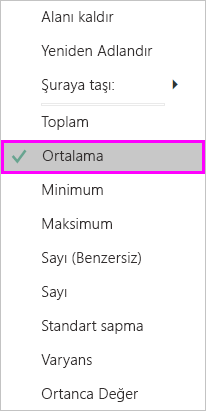
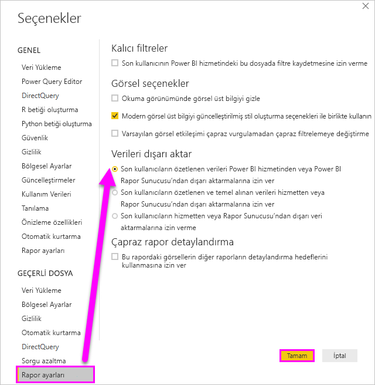

# Görselleştirmeyi oluşturmak için kullanılan verileri dışa aktarma

> [!IMPORTANT]
> Tüm veriler kullanıcılar tarafından görüntülenemez veya dışarı aktarılamaz. Rapor tasarımcılarının ve yöneticilerin pano ve rapor oluştururken kullandığı bazı korumalar vardır. Bazı veriler kısıtlı, gizli veya özeldir ve özel izinler olmadan görülemez veya dışarı aktarılamaz. 

## Verileri kimler dışarı aktarabilir?

Veriler üzerinde izinleriniz varsa, Power BI'ın görselleştirmeyi oluşturmak için kullandığı verileri görebilir ve dışarı aktarabilirsiniz. Sıklıkla veriler gizlidir veya belirli kullanıcılarla sınırlıdır. Böyle durumlarda söz konusu verileri göremez veya dışarı aktaramazsınız. Ayrıntılar için bu belgenin sonundaki **Sınırlamalar ve önemli noktalar** bölümüne bakın. 

## Verileri görüntüleme ve dışarı aktarma

Bir görselleştirmenin oluşturulması için Power BI’ın kullandığı verileri görmek isterseniz [söz konusu verileri Power BI’da görüntüleyebilirsiniz](service-reports-show-data.md). Bu verileri bir *.xlsx* veya *.csv* dosyası olarak Excel'e de aktarabilirsiniz. Verileri dışarı aktarma seçeneği Pro veya Premium lisansına ek olarak veri kümesi ve rapor için düzenleme izinleri gerektirir. Panoya veya rapora erişiminiz varsa ama veriler *çok gizli* olarak sınıflandırılmışsa, Power BI verileri dışarı aktarmanıza izin vermez.

Will raporundaki görselleştirmelerden birindeki verileri dışarı aktarıp, *.xlsx* dosyası olarak kaydedip dosyayı Excel'de açarken ona eşlik edin. Ardından, videonun altında yer alan adım adım yönergeleri izleyerek bu işlemi kendiniz deneyin. Bu videoda Power BI’ın eski bir sürümünün kullanıldığını unutmayın.

<iframe width="560" height="315" src="https://www.youtube.com/embed/KjheMTGjDXw" frameborder="0" allowfullscreen></iframe>

## Power BI panosundan verileri dışarı aktarma

1. Görselleştirmenin sağ üst köşesinde Diğer eylemler (...) öğesini seçin.

    

1. **CSV'ye aktar** seçeneğini belirtin.

    

1. Power BI, verileri bir *.csv* dosyasına aktarır. Görselleştirmeyi filtrelediyseniz, .csv dışarı aktarması da filtrelenir. 

1. Tarayıcınız sizi dosyayı kaydetmeye yönlendirir.  Kaydedilen *.csv* dosyasını Excel'de açın.

    

## Rapordaki verileri dışarı aktarma

Birlikte ilerleyebilmek için, [Tedarik analizi örneği raporunu](../create-reports/sample-procurement.md) Power BI hizmetinde Düzenleme görünümünde açın. Yeni bir boş rapor sayfası ekleyin. Ardından, aşağıdaki adımları uygulayarak bir toplama, hiyerarşi ve görsel düzeyi filtresi ekleyin.

### Yığılmış sütun grafik oluşturma

1. Yeni bir **Yığılmış sütun grafiği** oluşturun.

    

1. **Alanlar** bölmesinde **Konum > City**, **Konum > Country/Region** ve **Fatura > Discount Percent**'i seçin.  **Discount Percent** değerini **Değer** kutusuna taşımanız gerekebilir.

    

1. **Discount Percent** için **Sayı** olan toplama işlemini **Ortalama** olarak değiştirin. **Değer** kutusundaki **Discount Percent**'in (**Count of Discount Percent** olarak da görünüyor olabilir) sağında bulunan oku seçin ve ardından **Ortalama**'yı seçin.

    

1. **City** için filtre ekleyin, tüm şehirleri seçin ve **Atlanta**'yı kaldırın.

    

   
1. Hiyerarşide bir düzey detaya gidin. **City** düzeyinde detaylandırmayı ve detaya gitmeyi açın. 

    

Artık dışarı aktarma işlemine yönelik iki seçeneği de denemeye hazırız.

### ***Özetlenmiş*** verileri genişletme
Görselde gördükleriniz için verileri dışarı aktarmak istiyorsanız **Özetlenmiş veriler** seçeneğini belirtin.  Bu tür bir dışarı aktarma işlemi size yalnızca görseli oluşturmak için kullanılmakta olan verileri (sütunlar ve ölçüler) gösterir.  Görselin toplaması varsa, toplanan verileri dışarı aktarırsınız. Örneğin, dört çubuk gösteren bir çubuk grafiğiniz varsa dört Excel veri satırı elde edersiniz. Özetlenmiş verileri Power BI hizmetinde *.xlsx* ve *.csv* olarak ve Power BI Desktop'ta .csv olarak sağlanır.

1. Görselleştirmenin sağ üst köşesindeki üç noktayı seçin. **Verileri dışarı aktar**'ı seçin.

    

    Power BI hizmetinde görselleştirmenizin bir toplaması olduğundan (**Sayı**'yı *ortalama* olarak değiştirdiniz), iki seçeneğiniz vardır:

    - **Özetlenmiş veriler**

    - **Temel alınan veriler**

    Toplama işlemlerini anlama konusunda yardım için bkz. [Power BI'da toplama işlemleri](../create-reports/service-aggregates.md).

    > [!NOTE]
    > Power BI Desktop'ta özetlenmiş verileri yalnızca .csv dosyası olarak dışarı aktarma seçeneğiniz vardır. 
    
    
1. **Verileri dışarı aktar** altında **Özetlenmiş veriler**'i, ardından *.xlsx* veya *.csv*'yi ve sonra da **Dışarı Aktar**'ı seçin. Power BI, verileri dışarı aktarır.

    

1. **Dışarı Aktar** seçeneğini belirlediğinizde, tarayıcınız sizi dosyayı kaydetmeye yönlendirir. Kaydedilen dosyayı Excel'de açın.

    

    Bu örnekte, dışarı aktarma işlemiyle oluşturulmuş Excel dosyasında her şehir için bir satır bulunur. Filtrelediğimiz Atlanta, sonuçlarda yer almaz. Elektronik tablomuzun ilk satırında, veriler ayıklanırken Power BI’nin kullandığı filtreler gösterilir.
    
    - Görsel için yalnızca geçerli detaylandırma düzeyinde kullanılan veriler değil, hiyerarşi tarafından kullanılan tüm veriler dışarı aktarılır. Örneğin City düzeyine detaya gittik ama dışarı aktarma işlemimiz Country verilerini de içerir.  

    - Dışarı aktarılan verilerimiz toplanmıştır. Her City için bir toplam satırı alırız.

    - Görselleştirmelere filtre uyguladığımızdan, dışarı aktarılan veriler de filtrelenmiş olur. İlk satırda **Uygulanan filtreler: City is not Atlanta, GA** ifadesini görüntülendiğine dikkat edin. 

### ***Temel*** verileri dışarı aktar

Görseldeki verileri ***ve*** veri kümesinden ek verileri görmek istiyorsanız bu seçeneği belirtin (ayrıntılar için aşağıdaki grafiğe bakın). Görselleştirmenizin toplaması varsa, **Temel alınan veriler**'in seçilmesi toplamayı kaldırır. Bu örnekte bulunan ve dışarı aktarmayla oluşturduğumuz Excel dosyasında, veri kümemizdeki her City satırı için bir satır ve söz konusu tek girdiye ilişkin indirim yüzdesi gösterilir. Power BI verileri düzleştirir, bunları toplamaz.  

**Dışarı Aktar**'ı seçtiğinizde Power BI verileri bir *.xlsx* dosyası olarak dışarı aktarır ve tarayıcınız sizi dosyayı kaydetmeye yönlendirir. Kaydedilen dosyayı Excel'de açın.

1. Görselleştirmenin sağ üst köşesindeki üç noktayı seçin. **Verileri dışarı aktar**'ı seçin.

    

    Power BI hizmetinde görselleştirmenizin bir toplaması olduğundan (**Sayı**'yı **ortalama** olarak değiştirdiniz), iki seçeneğiniz vardır:

    - **Özetlenmiş veriler**

    - **Temel alınan veriler**

    Toplama işlemlerini anlama konusunda yardım için bkz. [Power BI'da toplama işlemleri](../create-reports/service-aggregates.md).

    > [!NOTE]
    > Power BI Desktop'ta yalnızca özetlenmiş verileri dışarı aktarma seçeneğiniz vardır. 
    
    
1. **Verileri dışarı aktar**'dan **Temel veriler**'i ve sonra da **Dışarı aktar**'ı seçin. Power BI, verileri dışarı aktarır.

    

1. **Dışarı Aktar** seçeneğini belirlediğinizde, tarayıcınız sizi dosyayı kaydetmeye yönlendirir. Kaydedilen dosyayı Excel'de açın.

    
    
    - Bu ekran görüntüsünde size Excel dosyasının yalnızca küçük bir parçası gösterilir; dosyanın 100.000'den fazla satırı vardır.  
    
    - Görsel için yalnızca geçerli detaylandırma düzeyinde kullanılan veriler değil, hiyerarşi tarafından kullanılan tüm veriler dışarı aktarılır. Örneğin City düzeyine detaya gittik ama dışarı aktarma işlemimiz Country verilerini de içerir.  

    - Görselleştirmelere filtre uyguladığımızdan, dışarı aktarılan veriler de filtrelenmiş olur. İlk satırda **Uygulanan filtreler: City is not Atlanta, GA** ifadesini görüntülendiğine dikkat edin. 

## Verileri dışarı aktarma kullanıcı deneyimini özelleştirme

[Satır düzeyi güvenlik (RLS)](../admin/service-admin-rls.md), erişimlerini kısıtlamadığı sürece, bir rapora erişim izni verilen kullanıcılara **temeldeki veri kümesinin tamamına erişim izni verilmiş olur**. Rapor yazarları ve Power BI yöneticileri, kullanıcı deneyimini özelleştirmek için aşağıda açıklanan özellikleri kullanabilir.

- Kullanıcılara [hangi *dışarı aktarma*](#set-the-export-options) seçeneklerinin sağlanacağına rapor yazarları karar verir.  

- Power BI yöneticileri, kuruluşlarındaki bazı dışarı aktarma seçeneklerini veya tümünü kapatabilir.  

- Veri kümesi sahipleri satır düzeyi güvenlik (RLS) ayarlayabilir. RLS erişimi salt okuma kullanıcılarıyla kısıtlar. Ama uygulama çalışma alanını yapılandırdıysanız ve üyelerine düzenleme izinleri verdiyseniz, RLS rolleri söz konusu üyeler için geçerli olmaz. Daha fazla bilgi için bkz. [Satır düzeyi güvenlik](../admin/service-admin-rls.md).

- Rapor yazarları sütunları gizleyerek bunların **Alanlar** listesinde gösterilmemesini sağlayabilir. Daha fazla bilgi için bkz. [Veri kümesi özellikleri](../developer/automation/api-dataset-properties.md)

**Bu özelleştirilmiş kullanıcı deneyimi, veri kullanıcılarının veri kümesinde erişebileceği öğeleri kısıtlamaz. Her bir kullanıcının kimlik bilgilerinin erişebilecekleri verileri belirlemesini sağlamak için veri kümesinde [satır düzeyi güvenlik (RLS)](../admin/service-admin-rls.md) kullanın.**

## Power BI’ın dışına aktarılırken verileri koruma

- Rapor yazarları, Microsoft Information Protection [duyarlılık etiketlerini](../admin/service-security-data-protection-overview.md) kullanarak raporları sınıflandırıp etiketleyebilir. Duyarlılık etiketlerinde koruma ayarları varsa Power BI bu koruma ayarlarını rapor verilerini Excel’e, PowerPoint’e veya PDF dosyalarına dışarı aktardığında uygular. Korunan dosyaları yalnızca yetkili kullanıcılar açabilir.

- Güvenlik ve Power BI yöneticileri [Microsoft Cloud App Security](../admin/service-security-data-protection-overview.md) kullanarak kullanıcı erişimini ve etkinliğini izleyebilir, gerçek zamanlı risk analizi yapabilir ve etikete özel denetimler belirleyebilir. Örneğin, kuruluşlar kullanıcıların Power BI’daki hassas içerikleri yönetilmeyen cihazlara indirmesini önleyen bir ilke yapılandırmak üzere Microsoft Cloud App Security’yi kullanabilir.

## Temel alınan veri ayrıntılarını dışarı aktarma

**Temel alınan veriler**'i seçtiğinizde görecekleriniz değişebilir. Bu ayrıntıların anlaşılması için yöneticinizin veya BT bölümünüzün yardımı gerekebilir. 

>

| Görselin içeriği | Dışarı aktarma işleminde görecekleriniz  |
|---------------- | ---------------------------|
| Toplamalar | *İlk* toplama ve bu toplama için tablonun tamamından gizli olmayan veriler |
| Toplamalar | ilgili veriler - görselde toplamayı içeren veri tablosuyla *ilgili* olan başka veri tablolarından veriler kullanılıyorsa (ilişki \*:1 veya 1:1 olduğu sürece) |
| Ölçüler* | görseldeki tüm ölçüler *ve* görselde kullanılan bir ölçünün yer aldığı diğer veri tablosundaki tüm ölçüler |
| Ölçüler* | bu ölçüyü içeren tablolardaki tüm gizli olmayan veriler (ilişki \*:1 veya 1:1 olduğu sürece) |
| Ölçüler* | bir \*:1 veya 1:1 zinciri yoluyla ölçüleri içeren tabloyla ilgili olan tüm tablolardaki tüm veriler |
| Yalnızca ölçüler | tüm ilgili tablolardaki tüm gizli olmayan sütunlar (ölçüyü genişletmek için) |
| Yalnızca ölçüler | model ölçüleri için tüm yinelenen satırların özetlenmiş verileri |

\* Power BI Desktop'taki veya Power BI hizmetindeki rapor görünümünde *Alanlar* listesinde **ölçü** bir hesap makinesi simgesiyle  gösterilir. Ölçüler Power BI Desktop'ta oluşturulabilir.

### Dışarı aktarma seçeneklerini ayarlama

Power BI rapor tasarımcıları, tüketicilerine sunulacak veri dışarı aktarma seçeneklerini denetleyebilir. Seçenekler şunlardır:

- Son kullanıcıların özetlenen verileri Power BI hizmetinden veya Power BI Rapor Sunucusundan dışarı aktarmalarına izin ver

- Son kullanıcıların özetlenen ve temel alınan verileri hizmetten veya Rapor Sunucusundan dışarı aktarmalarına izin ver

- Son kullanıcıların hizmetten veya Rapor Sunucusundan dışarı veri aktarmalarına izin verme

    > [!IMPORTANT]
    > Rapor tasarımcılarının eski raporları yeniden ziyaret ederek dışarı aktarma seçeneğini el ile sıfırlamasını öneririz.

Bu seçenekleri ayarlamak için:

1. Power BI Desktop'ı başlatın.

1. Sol üst köşeden **Dosya** > **Seçenekler ve Ayarlar** > **Seçenekler** yolunu izleyin.

1. **GEÇERLİ DOSYA** bölümünde **Rapor ayarları**'nı seçin.

    

1. **Verileri dışarı aktar** bölümünden seçiminizi yapın.

Bu ayarı Power BI hizmetinden de güncelleştirebilirsiniz.

Power BI yönetim portalındaki ayarlarla raporun dışarı aktarma ayarları farklı olduğunda yönetici ayarları, veri dışarı aktarma ayarlarını geçersiz kılacaktır.

## Sınırlamalar ve önemli noktalar
Bu sınırlamalar ve önemli noktalar Power BI Desktop ve Power BI hizmeti (Power BI Pro ve Premium dahil) için geçerlidir.

- Görseldeki verileri dışarı aktarmak için [Temel alınan veri kümesi üzerinde Derleme izniniz](../connect-data/service-datasets-build-permissions.md) olmalıdır.

-  **Power BI Desktop** ve **Power BI hizmetinin** **içeri aktarma modu raporundan** bir *.csv* dosyasına aktarabildiği en fazla satır sayısı 30.000’dir.

- Uygulamaların **içeri aktarma modu raporundan** bir *.xlsx* dosyasına aktarabildiği en fazla satır sayısı 150.000'dir.

- *Temel alınan verileri* kullanarak dışarı aktarma aşağıdaki durumlarda çalışmaz:

  - 2016'dan önceki sürümlerde.

  - Modeldeki tabloların benzersiz anahtarı olmadığında.
    
  -  Yönetici veya rapor tasarımcısı bu özelliği devre dışı bırakmışsa.

- Power BI'ın dışarı aktardığı görselleştirme için *Veri içermeyen öğeleri göster* seçeneğini etkinleştirdiyseniz *Temel alınan verileri* kullanarak dışarı aktarma özelliği çalışmaz.

- DirectQuery kullanılırken, Power BI’ın dışarı aktarabildiği maksimum veri miktarı 16 MB sıkıştırılmamış veridir. 150.000 maksimum satır sayısından daha azını dışarı aktarma gibi istenmeyen bir sonuçla karşılaşabilirsiniz. Bunun olası nedeni:

    - Çok fazla sütun var. Sütun sayısını azaltmayı ve yeniden dışarı aktarmayı deneyin.

    - Sıkıştırması zor olan veriler vardır.

    - Dosya boyutunu artıran ve Power BI'ın dışarı aktarabildiği satır sayısını azaltan başka faktörler iş başındadır.

- Görselleştirme birden fazla veri tablosundaki veriler kullanıyorsa ve veri modelinde söz konusu tablolar için ilişki yoksa, Power BI yalnızca ilk tablo için verileri dışarı aktarır.

- Şu anda Power BI görselleri ve R görselleri desteklenmemektedir.

- Power BI’da alana çift tıklayıp yeni bir ad yazarak alanı (sütun) yeniden adlandırabilirsiniz. Power BI yeni adı *diğer ad* olarak kabul eder. Bir Power BI raporunun yinelenen alan adları içermesi mümkündür ancak Excel yinelenen adlara izin vermez. Bu nedenle, Power BI verileri Excel'e aktardığında alan diğer adları özgün alan (sütun) adlarına geri döndürülür.  

- *.csv* dosyasında Unicode karakterler varsa metin Excel'de düzgün görüntülenmeyebilir. Para birimi simgeleri ve yabancı sözcükler Unicode karakterlere örnek olarak verilebilir. Dosyayı Not Defteri'nde açabilirsiniz ve burada Unicode düzgün görüntülenecektir. Dosyayı Excel'de açmak istiyorsanız geçici bir çözüm olarak *.csv*'ye içeri aktarılabilir. Dosyayı Excel'de içeri aktarmak için:

  1. Excel'i açın.

  1. **Veri** sekmesine gidin.
  
  1. **Dış veri al** > **Metinden** seçeneğini belirleyin.
  
  1. Dosyanın depolandığı yerel klasöre gidin ve *.csv*'yi seçin.

- *.csv* olarak dışarı aktarma sırasında, dosyanın Excel’de açılması durumunda betik yürütme gerçekleşmesini engellemek için başa **'** koyularak belirli karakterlere kaçış uygulanır eklenir. Aşağıdaki durumlarda bu gerçekleşir:
  - Sütun, **_ve_** veri modelinde “metin” türü olarak tanımlandığında
  - Metnin ilk karakteri şunlardan biri olduğunda: **=, @, +, -**

- Power BI yöneticileri verilerin dışarı aktarılmasını devre dışı bırakabilir.

Başka bir sorunuz mu var? [Power BI Topluluğu'na sorun](https://community.powerbi.com/)