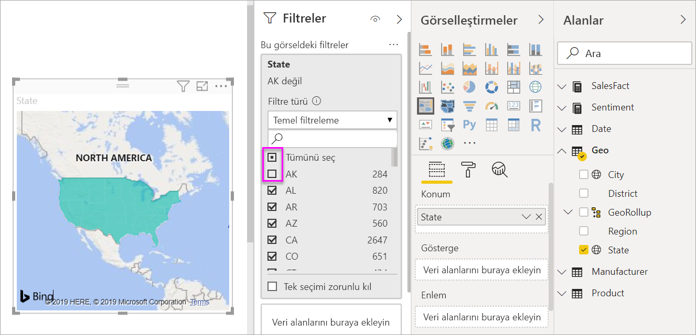

# Power BI'da kartogram (koroplet harita) oluşturma ve kullanma

[!INCLUDE[consumer-appliesto-nyyn](../includes/consumer-appliesto-nyyn.md)]

[!INCLUDE [power-bi-visuals-desktop-banner](../includes/power-bi-visuals-desktop-banner.md)]

Bir kartogram, değerlerin bir coğrafya veya bölge üzerinde orantısal olarak nasıl farklılık gösterdiğini görüntülemek için gölgelendirmeyi ya da tonlandırmayı veya desenleri kullanır.  Bu göreli farklılıkları açıktan (daha az sık/daha düşük) koyuya (daha fazla sık/daha yüksek) çeşitlilik gösteren gölgelendirme ile hızlıca görüntüleyin.    

## Bing'e neler gönderilir?
Power BI, varsayılan harita koordinatlarını sağlamak için Bing ile tümleşir (coğrafi kodlama adlı bir işlem). Power BI hizmetinde veya Power BI Desktop'ta bir harita görselleştirmesi oluşturduğunuzda **Konum**, **Enlem** ve **Boylam** demetlerindeki veriler (söz konusu görselleştirmenin oluşturulması için kullanılan) Bing'e gönderilir.

Sizin veya yöneticinizin, güvenlik duvarınızı Bing'in coğrafi kodlama için kullandığı URL'lere erişim izni verilecek şekilde güncelleştirmesi gerekebilir.  Bu URL'ler şunlardır:
- https://dev.virtualearth.net/REST/V1/Locations    
- https://platform.bing.com/geo/spatial/v1/public/Geodata    
- https://www.bing.com/api/maps/mapcontrol

Bing'e gönderilen tüm veriler hakkında daha fazla bilgi ve coğrafi kodlama başarınızı artırmaya yönelik ipuçları için bkz. [Harita görselleştirmeleri için ipuçları ve püf noktaları](power-bi-map-tips-and-tricks.md).

## Kartogram ne zaman kullanılır?
Kartogramlar şu durumlarda kullanım için mükemmel seçimdir:

* bir haritada nicel bilgiler görüntülemek için.
* uzamsal desenleri ve ilişkileri göstermek için.
* verileriniz standartlaştırıldığında.
* sosyoekonomik verilerle çalışırken.
* bölgelerin tanımlanması önemli olduğunda.
* coğrafi konumlarda dağıtıma ilişkin bir genel bakış edinmek için.

### Önkoşullar
Bu eğitimde [Satış ve Pazarlama örneği PBIX dosyası](https://download.microsoft.com/download/9/7/6/9767913A-29DB-40CF-8944-9AC2BC940C53/Sales%20and%20Marketing%20Sample%20PBIX.pbix) kullanılmaktadır.
1. Menü çubuğunun sol üst kısmından **Dosya** > **Aç**’ı seçin
   
2. **Satış ve Pazarlama örneği PBIX dosyası** kopyanızı bulun

1. **Satış ve Pazarlama örneği PBIX dosyasını** rapor görünümünde  açın.

1. Seç  yeni bir sayfa ekleyin.

> [!NOTE]
> Raporunuzu bir Power BI iş arkadaşınızla paylaşmak için her ikinizin de bireysel Power BI Pro lisanslarınızın olması veya raporun Premium kapasitede depolanması gerekir.    

### Kartogram oluşturma
1. Alanlar bölmesinde, **Geo** \> **State** alanını seçin.    

   
2. [Grafiği](power-bi-report-change-visualization-type.md) kartograma dönüştürün. **State** alanının artık **Konum** kutusunda olduğunu görebilirsiniz. Bing Haritalar, haritayı oluşturmak için **Konum** kutusundaki alanı kullanır.  Konum kutusunda çok sayıda geçerli konum bulunabilir: ülkeler, eyaletler, iller, ilçeler, şehirler, posta kodları vb. Bing Haritalar, dünya genelindeki konumlar için kartogram gölgeleri sağlar. Konum kutusunda geçerli bir giriş olmadan Power BI, kartogramı oluşturamaz.  

   
3. Haritayı, yalnızca Kıtasal Amerika Birleşik Devletleri görüntülenecek şekilde filtreleyin.

   a.  Görsel Öğeler bölmesinin sol tarafında **Filtreler** bölmesini bulun. Simge durumuna küçültüldüyse genişletin

   b.  **State** seçeneğinin üzerine gelin ve genişlet köşeli çift ayracını seçin  
   

   c.  **Tümü** seçeneğinin yanına bir onay işareti koyun ve **AK** seçeneğinin yanındaki onay işaretini kaldırın.

   
4. Boya rulosu simgesini seçip biçimlendirme bölmesini açtıktan sonra **Veri renkleri** seçeneğini belirleyin.

    

5. Üç dikey noktayı seçip **Koşullu Biçimlendirme** seçeneğini belirleyin.

    

6. Kartogramınızın nasıl gölgelendirileceğini belirlemek için **Varsayılan renk - Veri renkleri** ekranını kullanın. Burada gölgelendirmenin temel alacağı alanı belirleyebilir ve gölgelendirmenin nasıl uygulanacağını seçebilirsiniz. Bu örnekte **SalesFact** > **Sentiment** alanını kullanıp yaklaşımın en düşük değerini turuncu, en yüksek değerini de mavi olarak ayarlayacağız. En fazla ve en düşük değer arasındaki değerler turuncu ile mavinin tonlarında olacak. Ekranın alt kısmındaki gösterim kullanılacak renk aralığını gösterir. 

    

7. Kartogram yeşil ve kırmızı ile gölgelendirilir; kırmızı daha düşük yaklaşım sayılarını, yeşil ise daha yüksek ve daha pozitif yaklaşımı temsil eder.  Ek ayrıntıları görüntülemek için bir alanı araç ipucu kutusuna sürükleyin.  Burada **SalesFact** > **Yaklaşım aralığı** ekledik. Idaho (ID) eyaletinin vurgulanması yaklaşım aralığının 6 gibi düşük bir değerde olduğunu gösterir.
   

10. [Raporu kaydedin](../create-reports/service-report-save.md).

Power BI, kartogramınızın görünümü üzerinde büyük ölçüde denetim elde etmenizi sağlar. İstediğiniz görünümü elde edinceye kadar bu veri rengi denetimleri üzerinde deneme yapın. 

## Vurgulama ve çapraz filtreleme
Filtreler bölmesini kullanma hakkında bilgi için bkz. [Bir rapora filtre ekleme](../create-reports/power-bi-report-add-filter.md).

Bir kartogramda bir konumun vurgulanması, rapor sayfasındaki diğer görselleştirmelere çapraz filtre uygular ve bu tam tersi için de geçerlidir.

1. İzlemek için önce **Dosya > Kaydet**’i seçerek bu raporu kaydedin. 

2. CTRL-C kısayolunu kullanarak kartogramı kopyalayın.

3. Rapor tuvalinin alt kısmından **Yaklaşım** sekmesini seçerek Yaklaşım raporu sayfasını açın.

    

4. Yer açmak için sayfadaki görselleştirmeleri taşıyıp yeniden boyutlandırın ve sonra CTRL-V kısayolunu kullanarak önceki rapordan kartogramı yapıştırın. (Aşağıdaki resmi görürsünüz)

   

5. Kartogramda bir eyalet seçin.  Bu işlem ile sayfadaki diğer görselleştirmeler çapraz vurgulanır ve çapraz filtrelenir. Örneğin **Texas**'ın seçilmesi kartlarda çapraz filtre uygular ve çubuk grafiğini çapraz vurgular. Buradan, Yaklaşımın 75 olduğunu ve Texas’ın Central District #23’te yer aldığını anlarım.   
   
2. VanArsdel üzerinde bir veri noktası seçin - Aya Göre Yaklaşım çizgi grafiği. Bu, rakibi için değil, VanArsdel için Yaklaşım verilerini göstermek amacıyla kartogramı filtreler.  
   

## Önemli noktalar ve sorun giderme
Belirli durumlarda harita verileri kafa karıştırıcı olabilir.  Örneğin, bir Paris, Fransa mevcuttur ancak Paris, Texas da bulunmaktadır. Coğrafi verileriniz büyük olasılıkla ayrı sütunlarda (şehir adları için bir sütun, eyalet veya il adları için ayrı bir sütun vb.) depolanır, bu nedenle Bing Paris'leri ayırt edemeyebilir. Veri kümeniz zaten enlem ve boylam verileri içeriyorsa Power BI, harita verilerinin anlaşılır hale getirilmesine yardımcı olacak özel alanlara sahiptir. Enlem verilerinizi içeren alanı Görsel Öğeler \> Enlem alanına sürüklemeniz yeterlidir.  Aynı işlemi boylam verileriniz için de gerçekleştirin.    

Power BI Desktop'ta veri kümesini düzenleme izniniz varsa haritalarla ilgili kafa karıştırıcı durumların ele alınmasına yardımcı olabilecek şu videoyu izleyin.

> [VİDEO https://www.youtube.com/embed/Co2z9b-s_yM ]

Enlem ve boylam verilerine erişiminiz yoksa ama veri kümesi üzerinde düzenleme erişiminiz varsa [veri kümenizi güncelleştirmek için bu yönergeleri izleyin](https://support.office.com/article/Maps-in-Power-View-8A9B2AF3-A055-4131-A327-85CC835271F7).

Harita görselleştirmeleri hakkında daha fazla yardım için bkz. [Harita görselleştirmeleri için ipuçları ve püf noktaları](./power-bi-map-tips-and-tricks.md).

## Sonraki adımlar

[Şekil haritası](desktop-shape-map.md)

[Power BI'daki görselleştirme türleri](power-bi-visualization-types-for-reports-and-q-and-a.md)