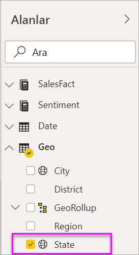
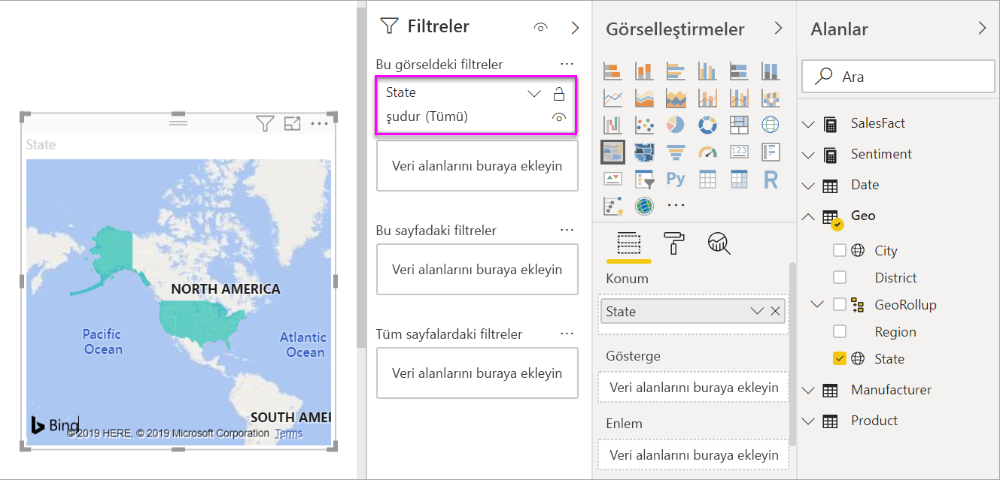

# Power BI'da kartogramlar (koroplet haritalar)
Bir kartogram, değerlerin bir coğrafya veya bölge üzerinde orantısal olarak nasıl farklılık gösterdiğini görüntülemek için gölgelendirmeyi ya da tonlandırmayı veya desenleri kullanır.  Bu göreli farklılıkları açıktan (daha az sık/daha düşük) koyuya (daha fazla sık/daha yüksek) çeşitlilik gösteren gölgelendirme ile hızlıca görüntüleyin.    

## Bing'e neler gönderilir?
Power BI, varsayılan harita koordinatlarını sağlamak için Bing ile tümleşir (coğrafi kodlama adlı bir işlem). Power BI hizmetinde veya Power BI Desktop'ta bir harita görselleştirmesi oluşturduğunuzda **Konum**, **Enlem** ve **Boylam** demetlerindeki veriler (söz konusu görselleştirmenin oluşturulması için kullanılan) Bing'e gönderilir.

Sizin veya yöneticinizin, güvenlik duvarınızı Bing'in coğrafi kodlama için kullandığı URL'lere erişim izni verilecek şekilde güncelleştirmesi gerekebilir.  Bu URL'ler şunlardır:
- https://dev.virtualearth.net/REST/V1/Locations    
- https://platform.bing.com/geo/spatial/v1/public/Geodata    
- https://www.bing.com/api/maps/mapcontrol

Bing'e gönderilen tüm veriler hakkında daha fazla bilgi ve coğrafi kodlama başarınızı artırmaya yönelik ipuçları için bkz. [Harita görselleştirmeleri için ipuçları ve püf noktaları](power-bi-map-tips-and-tricks.md).

## Kartogram ne zaman kullanılır?
Kartogramlar şu durumlarda kullanım için mükemmel seçimdir:

* bir haritada nicel bilgiler görüntülemek için.
* uzamsal desenleri ve ilişkileri göstermek için.
* verileriniz standartlaştırıldığında.
* sosyoekonomik verilerle çalışırken.
* bölgelerin tanımlanması önemli olduğunda.
* coğrafi konumlarda dağıtıma ilişkin bir genel bakış edinmek için.

### Önkoşullar
- Power BI hizmeti veya Power BI Desktop
- Satış ve Pazarlama Örneği

Örneği takip etmek için bu öğreticide Power BI Desktop yerine Power BI hizmeti kullanılmaktadır.

## Temel bir kartogram oluşturma
Bu videoda Kim, temel bir harita oluşturup bunu kartograma dönüştürüyor.

<iframe width="560" height="315" src="https://www.youtube.com/embed/ajTPGNpthcg" frameborder="0" allowfullscreen></iframe>

### Veri alma ve rapora yeni bir boş sayfa ekleme
1. Kendi kartogramınızı oluşturmak için Power BI'da oturum açıp **Veri Al \> Örnekler \> Satış ve Pazarlama \> Bağlan** seçeneklerini belirleyerek [Satış ve Pazarlama örneğini indirin](../sample-datasets.md).
2. Başarılı iletisi görüntülendiğinde, iletiyi kapatın ve **Raporlar** sekmesini seçin. Raporu açmak için **Satış ve Pazarlama Örneği**’ni seçin.

   
3. Power BI, raporu açar. **Raporu düzenle**’yi seçerek [Düzenleme Görünümü](../service-interact-with-a-report-in-editing-view.md)’nde raporu açın.

4. Rapor tuvalinin alt kısmında bulunan sarı artı işaretini seçerek yeni bir sayfa ekleyin.

    

### Kartogram oluşturma
1. Alanlar bölmesinde, **Geo** \> **State** alanını seçin.    

   
5. [Grafiği](power-bi-report-change-visualization-type.md) kartograma dönüştürün. **State** alanının artık **Konum** kutusunda olduğunu görebilirsiniz. Bing Haritalar, haritayı oluşturmak için **Konum** kutusundaki alanı kullanır.  Konum kutusunda çok sayıda geçerli konum bulunabilir: ülkeler, eyaletler, iller, ilçeler, şehirler, posta kodları vb. Bing Haritalar, dünya genelindeki konumlar için kartogram gölgeleri sağlar. Konum kutusunda geçerli bir giriş olmadan Power BI, kartogramı oluşturamaz.  

   
6. Haritayı, yalnızca Kıtasal Amerika Birleşik Devletleri görüntülenecek şekilde filtreleyin.

   a.  Görsel Öğeler bölmesinin alt tarafında **Filtreler** alanını bulun.

   b.  **State** seçeneğinin üzerine gelin ve genişlet köşeli çift ayracına tıklayın  
   

   c.  **Tümü** seçeneğinin yanına bir onay işareti koyun ve **AK** seçeneğinin yanındaki onay işaretini kaldırın.

   
7. **SalesFact** \> **Sentiment** seçeneğini belirleyerek **Renk doygunluğu** kutusuna ekleyin. **Renk doygunluğu** kutusundaki alan, harita gölgelendirmesini denetler.  
   
8. Kartogram yeşil ve kırmızı ile gölgelendirilir; kırmızı daha düşük yaklaşım sayılarını, yeşil ise daha yüksek ve daha pozitif yaklaşımı temsil eder.  Burada Wyoming (WY) eyaletini vurguladım ve Sentiment (Yaklaşım) düzeyinin oldukça iyi (74) olduğunu görüyorum.  
   
9. [Raporu kaydedin](../service-report-save.md).
##    Renk biçimlendirmesini ayarlama
Power BI, kartogramınızın görünümü üzerinde büyük ölçüde denetim elde etmenizi sağlar.
1. Biçimlendirme bölmesini açmak için boya rulosu simgesini seçin.

    

2. Renk seçeneklerini görüntülemek için **Veri renkleri**’ni seçin.
3. Minimum ve Maksimum renkleri sarı ve mavi olarak ayarlayın. Ve verilerinize göre Minimum ve Maksimum değerler ekleyin. İstediğiniz görünümü elde edinceye kadar bu denetimler üzerinde deneme yapın. 

    

## Vurgulama ve çapraz filtreleme
Filtreler bölmesini kullanma hakkında bilgi için bkz. [Bir rapora filtre ekleme](../power-bi-report-add-filter.md).

Bir Kartogramda bir konumun vurgulanması, rapor sayfasındaki diğer görselleştirmelere çapraz filtre uygular ve bu, tam tersi için de geçerlidir.

1. İzlemek için önce **Dosya > Kaydet**’i seçerek bu raporu kaydedin. 

2. CTRL-C kısayolunu kullanarak kartogramı kopyalayın.

3. Rapor tuvalinin alt kısmından **Yaklaşım** sekmesini seçerek Yaklaşım raporu sayfasını açın.

    

4. Yer açmak için sayfadaki görselleştirmeleri taşıyıp yeniden boyutlandırın ve sonra CTRL-V kısayolunu kullanarak önceki rapordan kartogramı yapıştırın.

   

5. Kartogramda bir eyalet seçin.  Bu işlem, sayfadaki diğer görselleştirmeleri vurgular. Örneğin, **Texas** seçeneği belirlendiğinde Yaklaşımın 74 olduğu ve Texas’ın Central District \#23’te olduğu bana gösterilir.   
   
2. VanArsdel üzerinde bir veri noktası seçin - Aya Göre Yaklaşım çizgi grafiği. Bu, rakibi için değil, VanArsdel için Yaklaşım verilerini göstermek amacıyla kartogramı filtreler.  
   

## Önemli noktalar ve sorun giderme
Belirli durumlarda harita verileri kafa karıştırıcı olabilir.  Örneğin, bir Paris, Fransa mevcuttur ancak Paris, Texas da bulunmaktadır. Coğrafi verileriniz büyük olasılıkla ayrı sütunlarda (şehir adları için bir sütun, eyalet veya il adları için ayrı bir sütun vb.) depolanır, bu nedenle Bing Paris'leri ayırt edemeyebilir. Veri kümeniz zaten enlem ve boylam verileri içeriyorsa Power BI, harita verilerinin anlaşılır hale getirilmesine yardımcı olacak özel alanlara sahiptir. Enlem verilerinizi içeren alanı Görsel Öğeler \> Enlem alanına sürüklemeniz yeterlidir.  Aynı işlemi boylam verileriniz için de gerçekleştirin.    

Power BI Desktop'ta veri kümesini düzenleme izniniz varsa haritalarla ilgili kafa karıştırıcı durumların ele alınmasına yardımcı olabilecek şu videoyu izleyin.

<iframe width="560" height="315" src="https://www.youtube.com/embed/Co2z9b-s_yM" frameborder="0" allowfullscreen></iframe>

Enlem ve boylam verilerine erişiminiz yoksa [veri kümenizi güncelleştirmek için bu yönergeleri uygulayın](https://support.office.com/article/Maps-in-Power-View-8A9B2AF3-A055-4131-A327-85CC835271F7).

Harita görselleştirmeleri hakkında daha fazla yardım için bkz. [Harita görselleştirmeleri için ipuçları ve püf noktaları](../power-bi-map-tips-and-tricks.md).

## Sonraki adımlar

[Şekil haritası](desktop-shape-map.md)

[Power BI'daki görselleştirme türleri](power-bi-visualization-types-for-reports-and-q-and-a.md)