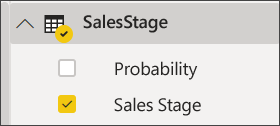

# Huni grafiği oluşturma ve kullanma

[!INCLUDE[consumer-appliesto-nyyn](../includes/consumer-appliesto-nyyn.md)]

[!INCLUDE [power-bi-visuals-desktop-banner](../includes/power-bi-visuals-desktop-banner.md)]

Huni grafik, birbirine bağlı sıralı aşamalara sahip doğrusal süreçleri görselleştirmenize yardımcı olur. Örneğin, şu aşamalarda müşterileri izleyen bir satış hunisi: Müşteri Adayı \> Nitelikli Müşteri Adayı \> Olası Müşteri \> Sözleşme \> Kapanış.  Huninin şekli ilk bakışta takip ettiğiniz sürecin ilerleme durumu hakkında bilgi verir.

Huninin her aşaması, toplamın belirli bir yüzdesini temsil eder. Bu nedenle çoğu durumda huni grafik bir huniye benzer. İlk aşama en büyüktür ve sonraki her aşama da bir öncekinden küçüktür.  Armut şeklindeki huni de kullanışlıdır. Süreçte bir sorun olduğunu belirtebilir.  Ancak genellikle ilk aşama olan "giriş" aşaması en büyük olandır.

> [!NOTE]
> Raporunuzu bir Power BI iş arkadaşınızla paylaşmak için her ikinizin de bireysel Power BI Pro lisanslarınızın olması veya raporun Premium kapasitede depolanması gerekir.    

## Huni grafik kullanım alanları
Huni grafikler aşağıdaki durumlarda harika bir seçimdir:

* veriler sıralı olduğunda ve en az 4 aşama boyunca ilerlediğinde.
* ilk aşamadaki "öğelerin" sayısının son aşamadaki sayıdan büyük olması beklendiğinde.
* potansiyeli (gelir/satış/anlaşma vs.) aşamalara göre hesaplamak için.
* dönüşüm ve elde tutma oranlarını hesaplayıp takip etmek için.
* doğrusal bir süreçteki sorunlu noktaları ortaya çıkarmak için.
* alışveriş sepeti iş akışını takip etmek için.
* tıklama ile yapılan reklam/pazarlama kampanyalarının ilerleme ve başarı durumunu takip etmek için.

## Huni grafiklerle çalışma
Huni grafikler:

* Sıralanabilir.
* Çoklu öğe desteği sunar.
* Aynı rapor sayfasındaki diğer görselleştirmeler tarafından vurgulanabilir ve çapraz filtre uygulanabilir.
* Aynı rapor sayfasındaki diğer görselleştirmeleri vurgulamak ve çapraz filtre uygulamak için kullanılabilir.
   > [!NOTE]
   > Aşağıdaki videoda Will, Satış ve Pazarlama örneğini kullanarak bir huni grafiği oluşturmaktadır. Sonra, Fırsat Analizi PBIX örnek dosyasını kullanarak kendiniz denemek için videonun altında bulunan adımları izleyin
   > 
   > 
## Önkoşul

Bu öğreticide [Fırsat Analizi örneği PBIX dosyası](https://download.microsoft.com/download/9/1/5/915ABCFA-7125-4D85-A7BD-05645BD95BD8/Opportunity%20Analysis%20Sample%20PBIX.pbix
) kullanılmıştır.

1. Menü çubuğunun sol üst köşesinden **Dosya** > **Aç** ’ı seçin
   
2. **Fırsat Analizi örneği PBIX dosyası** kopyanızı bulun

1. **Fırsat Analizi örneği PBIX dosyasını** rapor görünümünde  açın.

1. Seç  yeni bir sayfa ekleyin.

## Basit bir huni grafik oluşturma
Aşağıdaki videoda Will, Satış ve Pazarlama örneğini kullanarak bir huni grafiği oluşturmaktadır.

<iframe width="560" height="315" src="https://www.youtube.com/embed/qKRZPBnaUXM" frameborder="0" allow="autoplay; encrypted-media" allowfullscreen></iframe>

Artık satış aşamalarındaki fırsat sayılarını gösteren bir huni grafik oluşturabilirsiniz.

1. Boş rapor sayfasıyla başlayın ve **SalesStage** \> **Sales Stage** alanını seçin.
   
    

1. Huni simgesini seçerek  sütun grafiğini huni grafiğine dönüştürün.

2. **Alanlar** bölmesinde **Fact** \> **Opportunity Count** seçimini yapın.
   
    
4. Çubuklardan birinin üzerine geldiğinizde bilgiler görüntülenir.
   
   * Aşamanın adı
   * Bu aşamada olan fırsat sayısı
   * Genel dönüşüm oranı (Aday Müşteri Yüzdesi) 
   * Önceki aşamaya göre (bu örnekte Proposal Stage/Solution Stage) % cinsinden aşamalar arası karşılaştırma (Düşme Oranı olarak da bilinir)
     
     

6. [Raporu kaydedin](../create-reports/service-report-save.md).

## Vurgulama ve çapraz filtreleme
Filtreler bölmesini kullanma hakkında bilgi için bkz. [Bir rapora filtre ekleme](../create-reports/power-bi-report-add-filter.md).

Hunideki bir çubuğun vurgulanması rapor sayfasındaki diğer görselleştirmelere çapraz filtre uygular ve bu, tam tersi için de geçerlidir. Örneği takip etmek için huni grafiğin bulunduğu rapor sayfasına birkaç görsel daha ekleyin.

1. Hunide **Proposal** çubuğunu seçin. Bu işlem ile sayfadaki diğer görselleştirmeler çapraz vurgulanır. Birden fazla seçim yapmak için CTRL tuşunu kullanın.
   
   
2. Görsellerin birbirini çapraz vurgulaması ve çapraz filtrelemesiyle ilgili tercihleri ayarlamak için bkz. [Power BI'daki görsel etkileşimleri](../create-reports/service-reports-visual-interactions.md)

## Sonraki adımlar

[Power BI’daki ölçerler](power-bi-visualization-radial-gauge-charts.md)

[Power BI'daki görselleştirme türleri](power-bi-visualization-types-for-reports-and-q-and-a.md)

