# Ana etmenler görselleştirmelerini oluşturma

[!INCLUDE[consumer-appliesto-nyyn](../includes/consumer-appliesto-nyyn.md)]    

[!INCLUDE [power-bi-visuals-desktop-banner](../includes/power-bi-visuals-desktop-banner.md)]

Ana etmenler görseli ilgilendiğiniz bir ölçümü etkileyen faktörleri anlamanıza yardımcı olur. Verilerinizi çözümler, önemli faktörleri derecelendirir ve bunları ana etmenler olarak görüntüler. Örneğin, çalışan kaybı olarak da bilinen personel değişim oranını etkileyen etmenleri öğrenmek istediğinizi varsayalım. Faktörlerden biri istihdam sözleşmesinin süresi ve diğeri de çalışanların yaşı olabilir. 
 
## Ana etmenler ne zaman kullanılmalı? 
Ana etmen görseli şunları yapmak için harika bir seçimdir: 
- Çözümlenen ölçümü hangi faktörlerin etkilediğini görme.
- Bu faktörlerin göreli önemini karşılaştırma. Örneğin, kısa vadeli sözleşmeler çalışan kaybını uzun vadeli sözleşmelerden daha mı fazla etkiliyor? 

## Ana etmenler görselinin özellikleri

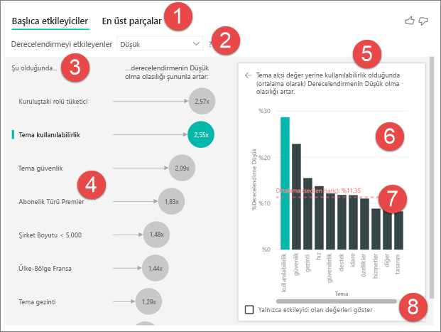

1. **Sekmeler**: Görünümler arasında geçiş yapmak için bir sekme seçin. **Ana etmenler** size seçili ölçüm değerine en çok katkıda bulunan öğeleri gösterir. **En üst segmentler** seçilen ölçüm değerine en çok katkıda bulunan segmentleri gösterir. *Segment*, bir değer bileşiminden oluşur. Örneğin, bir segment en az 20 yıldır müşteriniz olan ve batı bölgesinde yaşayan tüketicilerden oluşabilir. 

2. **Açılan kutu**: İncelenen ölçümün değeri. Bu örnekte, **Derecelendirme** ölçümüne bakın. **Düşük** değeri seçilmiştir.

3. **İfade**: Sol bölmedeki görseli yorumlamanıza yardımcı olur.

4. **Sol bölme**: Sol bölme tek bir görsel içerir. Bu örnekte, sol bölmede en önemli ana etmenlerin listesi gösterilmektedir.

5. **İfade**: Sağ bölmedeki görseli yorumlamanıza yardımcı olur.

6. **Sağ bölme**: Sağ bölme tek bir görsel içerir. Bu örnekteki sütun grafiğinde, sol bölmede seçilen **Tema** ana etmeninin tüm değerleri görüntüleniyor. Sol bölmedeki **kullanılabilirliğin** değeri yeşil renkte gösterilir. **Tema** için tüm diğer değerler siyah renkte gösterilir.

7. **Ortalama çizgisi**: **Tema** etmeninin **kullanılabilirlik** (bu seçilen etmendir) dışındaki tüm olası değerlerinin ortalaması hesaplanır. Bu nedenle hesaplama siyah renkli tüm değerleri içerir. Bu, diğer **Tema** değerlerinin hangi oranda düşük derecesi olduğunu gösterir. Bu örnekte düşük derece %11,35'tir (noktalı çizgiyle gösterilir).

8. **Onay kutusu**: Sol bölmede yalnızca bu alanın etmenleri olan değerleri gösterecek şekilde görseli filtreler. Bu örnekte görseli kullanılabilirlik, güvenlik ve gezintiye göre filtreleyebilir.

## Kategorik olan bir ölçümü analiz etme
 
Kategorik bir ölçümle ana etmenler görseli oluşturmayı öğrenmek için bu videoyu izleyin. Ardından, bir ana etmen görseli oluşturmak için bu adımları izleyin. 

   > [!NOTE]
   > Bu videoda Power BI Desktop’ın önceki bir sürümü kullanılmaktadır.
   > 
   > 
<iframe width="560" height="315" src="https://www.youtube.com/embed/fDb5zZ3xmxU" frameborder="0" allow="accelerometer; autoplay; encrypted-media; gyroscope; picture-in-picture" allowfullscreen></iframe>

Ürün Yöneticiniz, müşterilerin bulut hizmetiniz hakkında olumsuz incelemeler yazmasına hangi faktörlerin yol açtığını bulmanızı istiyor. Takip etmek için, Power BI Desktop’ta [Customer Feedback (Müşteri Geri Bildirimi) PBIX dosyasını](https://github.com/microsoft/powerbi-desktop-samples/tree/master/Monthly%20Desktop%20Blog%20Samples/2019/customerfeedback.pbix) açın. [Power BI hizmeti veya Power BI Desktop için Customer Feedback Excel dosyasını](https://github.com/microsoft/powerbi-desktop-samples/tree/master/Monthly%20Desktop%20Blog%20Samples/2019/customerfeedback.xlsx) da indirebilirsiniz. Bağlantılardan birini ve sonra açılan GitHub sayfasından **İndir**'i seçin.

> [!NOTE]
> Customer Feedback veri kümesinde şu makale temel alınmıştır: [Moro et al., 2014] S. Moro, P. Cortez ve P. Rita. “A Data-Driven Approach to Predict the Success of Bank Telemarketing.” *Decision Support Systems*, Elsevier, 62:22-31, Haziran 2014. 

1. Raporu açın ve **Ana etmenler** simgesini seçin. 

    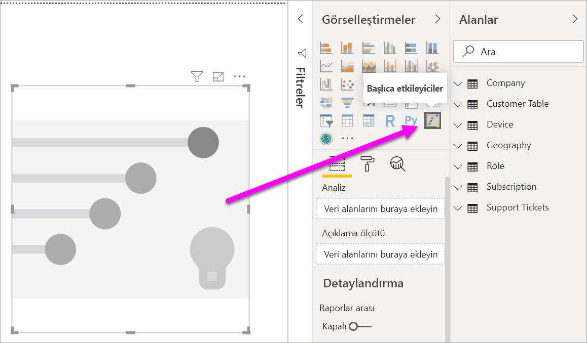

2. Araştırmak istediğiniz ölçümü **Çözümle** alanına taşıyın. Müşterilerin hizmeti düşük olarak derecelendirmesine yol açan sebepleri görmek için **Müşteri Tablosu** > **Derecelendirme**’yi seçin.

3. **Derecelendirme** üzerinde etkisi olabileceğini düşündüğünüz alanları **Açıklama ölçütü** alanına taşıyın. İstediğiniz kadar alanı taşıyabilirsiniz. Bu durumda şunlarla başlayın:
    - Ülke-Bölge 
    - Role in Org (Kuruluştaki Rol) 
    - Subscription Type (Abonelik Türü) 
    - Company Size (Şirket Boyutu) 
    - Tema
    
4. **Genişletme ölçütü** alanını boş bırakın. Bu alan yalnızca ölçümü veya özetlenmiş alanı analiz ederken kullanılır. 

5. Olumsuz derecelendirmelere odaklanmak için **Derecelendirmenin şu olmasını etkileyenler:** açılan kutusundan **Düşük** değerini seçin.  

    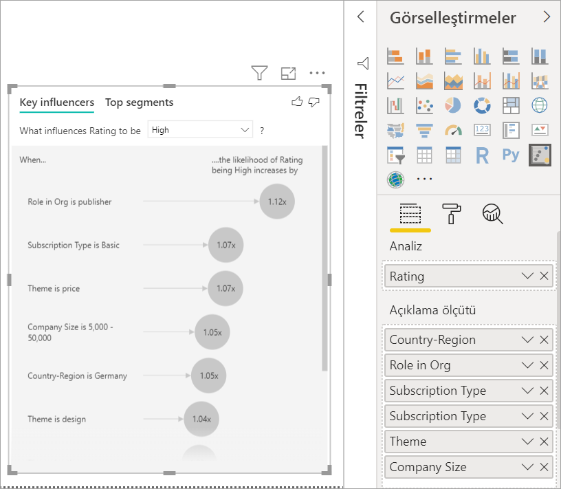

Çözümleme, çözümlenen alanın tablo düzeyinde çalıştırılır. Bu durumda, bu **Derecelendirme** ölçümüdür. Bu ölçüm müşteri düzeyinde tanımlanır. Her müşteri yüksek veya düşük puan vermiştir. Tüm açıklayıcı faktörlerin, görselde kullanılabilmek üzere müşteri düzeyinde tanımlanması gerekir. 

Önceki örnekte, tüm açıklayıcı faktörlerle ölçüm arasında bire bir veya çoğa bir ilişki vardı. Bu örnekte her müşteri derecelendirmesine tek bir tema atadı. Benzer şekilde, müşteriler tek bir ülkededir, tek bir üyelik türüne sahiptir ve kuruluşlarında tek bir rolü gerçekleştirir. Açıklayıcı faktörler zaten müşterinin öznitelikleridir ve dönüşüme gerek yoktur. Görsel bunları hemen kullanabilir. 

Öğreticinin devamında bire çok ilişkilerin olduğu daha karmaşık örnekleri gözden geçireceksiniz. Bu durumlarda, çözümlemeyi çalıştırabilmeniz için önce sütunların toplanıp müşteri düzeyine getirilmesi gerekir. 

Açıklayıcı faktörler olarak kullanılan ölçüler ve toplamlar da **Çözümle** alanındaki ölçümün tablo düzeyinde değerlendirilir. Bu makalenin sonraki bölümlerinde bazı örnekler gösterilecektir. 

## Kategorik ana etmenleri yorumlama 
Şimdi, düşük derecelendirmelerin ana etmenlerini gözden geçirelim. 

### Düşük derecelendirme olasılığını en çok etkileyen ilk faktör

Bu örnekteki müşterinin üç rolü olabilir: tüketici, yönetici ve yayımcı. Tüketici olma, düşük derecelendirmeye en çok katkıda bulunan faktördür. 

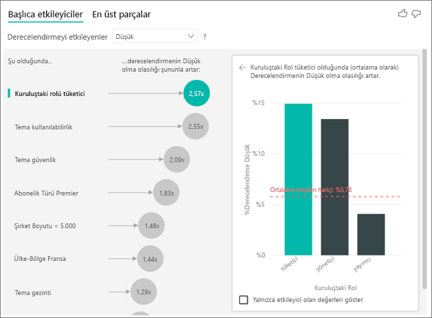

Daha kesin olarak belirtmek gerekirse, tüketicilerinizin hizmetinize olumsuz puan verme olasılığı 2,57 kat fazladır. Ana etmenler grafiğinde, soldaki listede **Kuruluştaki rolü tüketici** en üstte yer alıyor. **Kuruluştaki Rol** seçildiğinde Power BI sağ bölmede ek ayrıntıları gösterir. Her rolün düşük derecelendirme üzerindeki olası etkisinin karşılaştırması aşağıda gösterilmiştir.
  
- Tüketicilerin %14,93'ü düşük puan veriyor. 
- Ortalama olarak, diğer tüm roller %5,78 oranında düşük puan veriyor.
- Diğer rollere kıyasla tüketicilerin düşük puan verme olasılığı 2,57 kat fazladır. Yeşil çubuğu kırmızı noktalı çizgiden bölerek bunu belirleyebilirsiniz. 

### Düşük derecelendirme olasılığını en çok etkileyen ikinci faktör

Ana etmenler görseli, faktörleri birçok farklı değişkene göre karşılaştırır ve derecelendirir. İkinci etmenin **Kuruluştaki Rol** ile ilgisi yoktur. Listede ikinci etmen olan **Tema kullanılabilirlik** faktörünü seçin. 

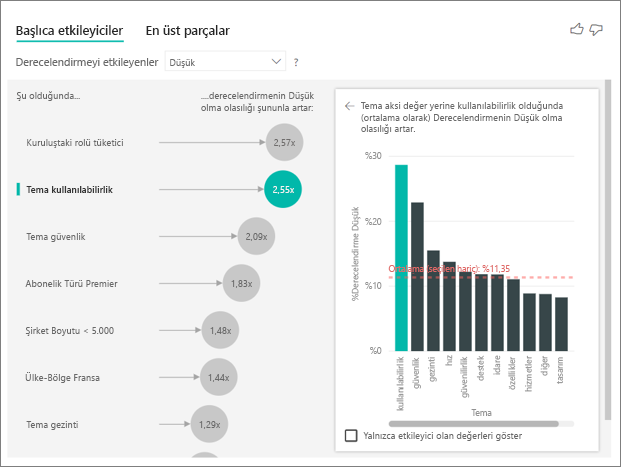

İkinci en önemli faktör müşteri incelemesinin temasıyla ilgilidir. Ürünün kullanılabilirliği ile ilgili yorum yapan müşterilerin düşük puan verme olasılığı diğer temalarla (güvenilirlik, tasarım veya hız gibi) ilgili yorum yapanlara göre 2,55 kat daha yüksektir. 

Görseller arasında ortalamanın (kırmızı noktalı çizgiyle gösterilir) %5,78'den %11,34'e değiştiğini görebilirsiniz. Ortalama, tüm diğer değerlerin ortalamasını temel aldığından dinamiktir. Ortalamada, ilk etmen için müşteri rolü hariç tutulmuştur. İkinci etmen için, kullanılabilirlik teması hariç tutulmuştur. 
 
Sadece etmen değerlerini kullanarak filtrelemek için **Yalnızca etmen olan değerleri göster** onay kutusunu seçin. Bu durumda, düşük puan alınmasına sebep olan roller bunlardır. Power BI’ın düşük puan alınmasına sebep olan tema olarak tanımladığı tema sayısı 12’den 4’e düşürüldü. 

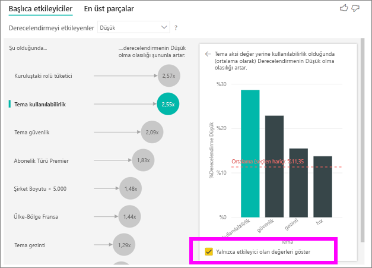

## Diğer görsellerle etkileşimli çalışma 
 
Bir dilimleyiciyi, filtreyi veya tuvaldeki başka bir görseli her seçtiğinizde, ana etmenler görseli yeni veri parçası üzerinde çözümlemeyi yeniden çalıştırır. Örneğin, **Şirket Boyutu** alanını rapora taşıyıp dilimleyici olarak kullanabilirsiniz. Kurumsal müşterileriniz için ana etmenlerin, nüfusun genelinden farklı olup olmadığını görmek için bunu kullanın. Kurumsal boyuttaki bir şirketin 50.000’den fazla çalışanı bulunur.
 
**>50.000** seçildiğinde çözümleme yeniden çalıştırılır. Bu durumda etmenlerin değiştiğini görebilirsiniz. Büyük kurumsal müşterilerde düşük derecelendirmelerin en önemli etmeni olarak güvenlik ile ilgili tema görünüyor. Büyük müşterilerinizi mutsuz eden belirli güvenlik özellikleri olup olmadığını görmek için konuyu daha fazla araştırabilirsiniz. 

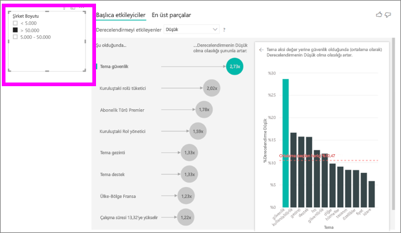

## Sürekli ana etmenleri yorumlama 
 
Şimdiye kadar farklı kategorik alanların düşük derecelendirmeleri nasıl etkilediğini incelemek için görselin nasıl kullanılacağını gördünüz. **Açıklama ölçütü** alanında yaş, boy ve fiyat gibi sürekli faktörlerin olması da mümkündür. Şimdi, **Kullanım Süresi** alanı, müşteri tablosundan **Açıklama ölçütü**’ne taşındığında ne olduğuna bakalım. Kullanım Süresi, müşterinin hizmeti ne kadar süreyle kullandığını gösterir. 
 
Kullanım Süresi değeri arttıkça düşük derecelendirme alma olasılığı da artar. Bu eğilim, uzun süreli müşterilerin olumsuz puan verme olasılığının daha yüksek olduğunu belirtir. Bu içgörü ilginizi çekebilir, bunu daha sonra incelemek için takip edebilirsiniz. 
 
Görselleştirme, kullanım süresinin her 13,44 ay artması durumunda, ortalama olarak düşük derecelendirme olasılığının 1,23 kat arttığını gösteriyor. Bu örnekte 13,44 ay kullanım süresinin standart sapması oluyor. Bundan çıkardığınız içgörüde, kullanım süresini standart bir miktarda artırmanın (kullanım süresinin standart sapması) düşük derecelendirme alma olasılığını nasıl etkilediğine bakılıyor. 
 
Sağ bölmedeki dağılım grafiği, her Kullanım Süresi değeri için ortalama düşük puan yüzdesini belirtir. Eğilim çizgisiyle eğimi vurgular.

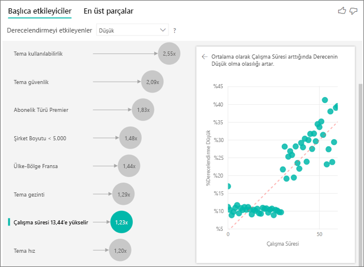

## Sürekli ana etmenleri bölme

Bazı durumlarda, sürekli faktörlerinizin otomatik olarak kategorik faktörlere dönüştürüldüğünü görebilirsiniz. Bu, değişkenlerin arasındaki ilişkinin doğrusal olmadığını fark edip ilişkiyi yalnızca artan veya azalan olarak (yukarıdaki ilk örnekte yaptığımız gibi) tanımlayamadığımız için yaşandı.

Etmenlerin hedef açısından ne kadar doğrusal olduğunu belirlemek için bağıntı testleri yaparız. Hedef sürekli ise Pearsons, kategorik ise çift serili bağıntı testleri gerçekleştiririz. İlişkinin yeterince doğrusal olmadığını algılarsak, denetimli bölme gerçekleştirip en fazla 5 grup oluştururuz. Hangi bölmelerin en mantıklı olduğunu anlamak için açıklayıcı faktör ve analiz edilen hedef arasındaki ilişkiyi inceleyen bir denetimli bölme yöntemi kullanırız.

## Ana etmenler olarak ölçüleri/toplamları yorumlama 
 
Çözümlemelerinizin içinde açıklayıcı faktörler olarak ölçüleri ve toplamları da kullanabilirsiniz. Örneğin, müşteri destek biletlerinin sayısının veya ortalama açık bilet süresinin, aldığınız puan üzerindeki etkisini görmek isteyebilirsiniz. 
 
Bu örnekte, müşterinin destek biletleri sayısının verilen puanı etkileyip etkilemediğini görmek istiyorsunuz. Şimdi, destek bileti tablosundan **Destek Bileti Kimliğini** getirin. Müşterinin birden çok destek bileti olabileceği için, kimliği müşteri düzeyinde toplayın. Çözümleme müşteri düzeyinde çalıştırıldığından ve bu nedenle etkileyen tüm faktörlerin bu ayrıntı düzeyinde tanımlanması gerektiğinden toplama önemlidir. 
 
Kimliklerin sayısına bakalım. Her müşteri satırında, o müşteriyle ilişkili olan destek bileti sayısı bulunur. Bu örnekte, destek biletlerinin sayısı arttıkça derecelendirmenin düşük olma olasılığı da 5,51 kat artıyor. Sağ taraftaki görsel, müşteri düzeyinde hesaplanmış farklı **Derecelendirme** değerlerine göre destek biletlerinin ortalama sayısını gösterir. 

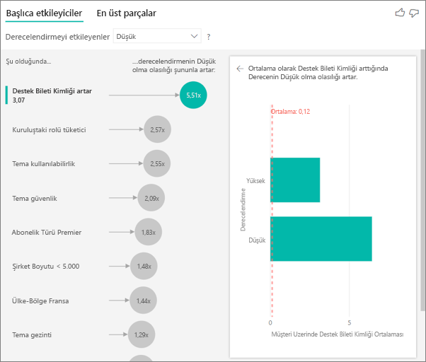

## Sonuçları yorumlayın: En üst parçalar 
 
Her faktörü ayrı ayrı değerlendirmek için **Ana etmenler** sekmesini kullanabilirsiniz. Faktörlerin birleşiminin çözümlediğiniz ölçümü nasıl etkilediğini görmek için **En üst segmentleri** de kullanabilirsiniz. 
 
Başlangıçta, En üst segmentler Power BI’ın bulduğu tüm segmentlere genel bir bakış sağlar. Aşağıdaki örnek, altı segmentin bulunduğunu gösterir. Bu segmentler, segment içindeki düşük derecelendirmelerin yüzdesine göre sıralanır. Örneğin, 1. segmentte müşteri derecelendirmelerinin %74,3'ü düşüktür. Kabarcık ne kadar yüksekteyse düşük derecelendirmelerin oranı o kadar yüksektir. Balon boyutu segment içindeki müşterilerin sayısını temsil eder. 

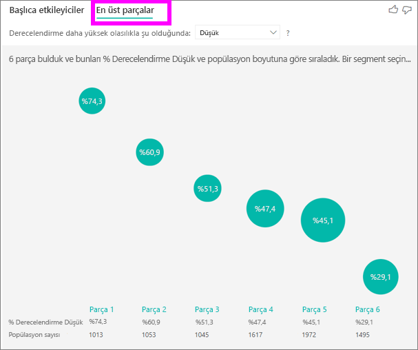

Kabarcık seçildiğinde ilgili segmentin ayrıntıları görüntülenir. Örneğin, 1. segmenti seçerseniz, nispeten uzun vadeli müşterilerden oluştuğunu görürsünüz. Bunlar, 29 ayı aşkın bir süredir müşteri olan ve dörtten fazla destek bileti bulunan kişilerdir. Son olarak, bu müşteriler yayımcı değildir. Yani bunlar tüketici veya yöneticidir. 
 
Bu grupta, müşterilerin %74,3’ü düşük bir puan verdi. Ortalama müşterinin düşük derecelendirme yapma oranı %11,7 olduğuna göre, bu segmentte düşük derecelendirme oranı yüksektir. Bu değer, yüzde 63 puan daha yüksektir. Ayrıca 1. segment verilerin yaklaşık %2,2'sini içerdiğinden nüfusun dikkate alınabilir bir oranını temsil eder. 

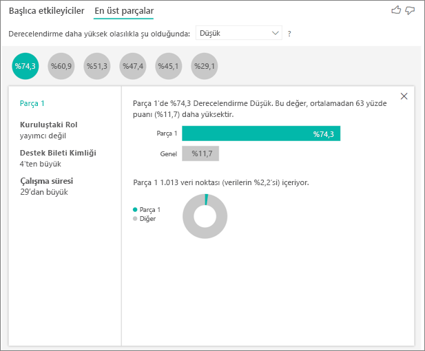

## Sayımlar ekleme

Bazen bir etmen büyük bir etkisi yapabilir ama verilerin çok küçük bir bölümünü temsil ediyor olabilir. Örneğin **Team** is **usability** (Kullanılabilirlik teması) düşük derecelendirmeler için ikinci büyük etmendir. Öte yandan yalnızca bir avuç müşteri kullanılabilirlik konusunda şikayet etmiş olabilir. Sayımlar odaklanmak istediğiniz etmenlerin önceliklerini belirlemenize yardım edebilir.

Biçimlendirme bölmesinin **Analiz kartı** aracılığıyla sayımları açabilirsiniz.

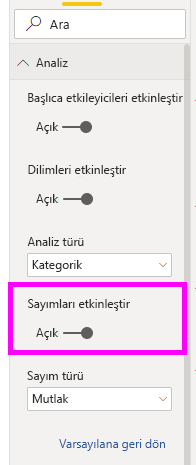

Sayımlar açıldıktan sonra her etmenin kabarcığı çevresinde bu etmenin içerdiği yaklaşık veri yüzdesini temsil eden bir halka görürsünüz. Kabarcığın halka içine alınan bölümü ne kadar fazlaysa içerdiği veriler de o kadar çoktur. **Theme** is **usability**'nin verilerin çok küçük bir bölümünü içerdiğini görebiliriz.

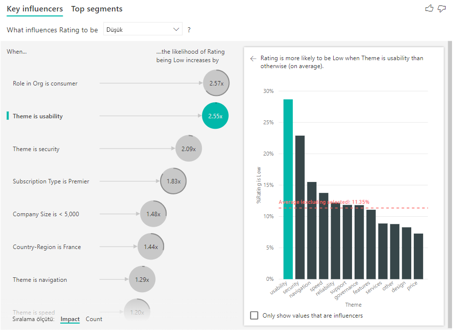

Ayrıca kabarcıkları etmen yerine önce sayıma göre sıralamak için görselin sol alt kısmındaki Sıralama ölçütü iki durumlu düğmesini kullanabilirsiniz. Sayım temel alındığında en önemli etmen **Subscription Type** is **Premier** (Abonelik Türü Premier) etmenidir.

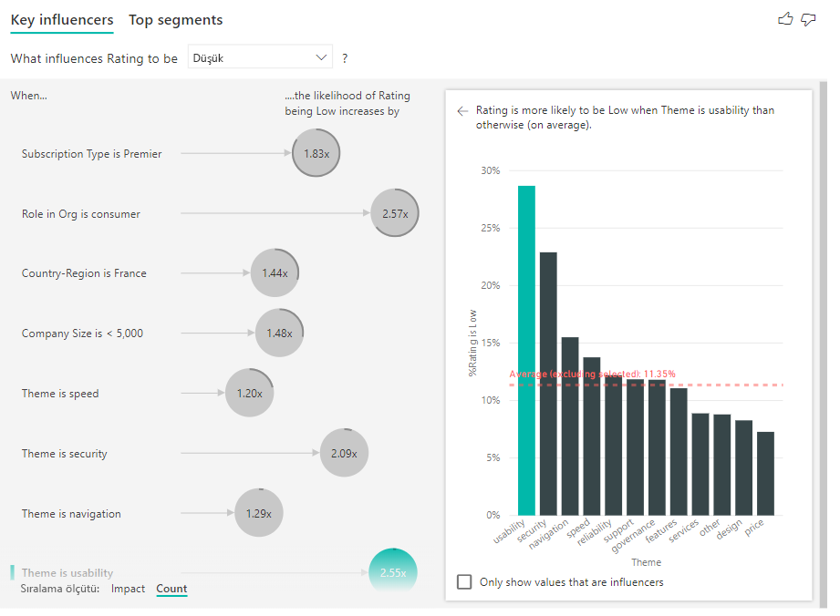

Kabarcığın tam halkasının olması etmenin verilerin %100'ünü kapsadığı anlamına gelir. Biçimlendirme bölmesinin **Analiz kartı** içindeki **Sayım türü** açılan listesini kullanarak sayım türünü maksimum etmene göre olacak şekilde değiştirebilirsiniz. Bu aşamada en fazla veriyi içeren etmen tam halkayla temsil edilir ve diğer tüm sayımlar buna göre ayarlanır.

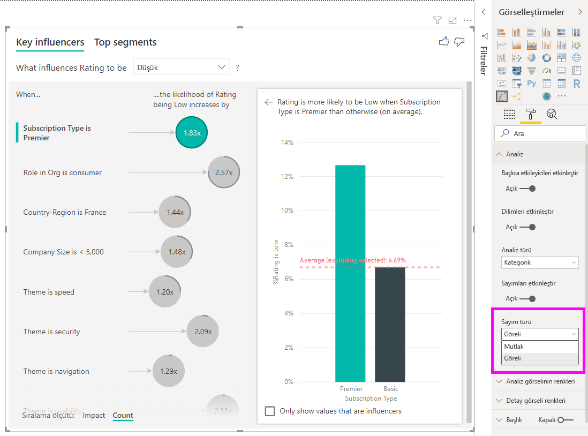

## Sayısal olan bir ölçümü analiz etme

Özetlenmemiş bir sayısal alanı **Çözümle** alanına taşırsanız, bu senaryonun nasıl işleneceğini seçebilirsiniz. **Biçimlendirme Bölmesine** gidip **Kategorik Çözümleme Türü** ve **Sürekli Çözümleme Türü** arasında geçiş yaparak görselin davranışını değiştirebilirsiniz.

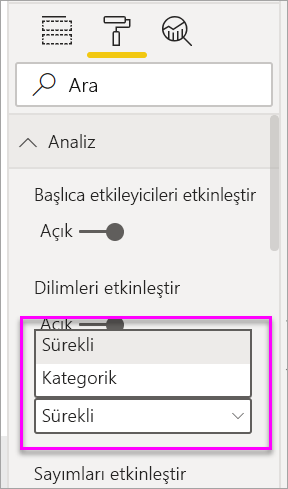

**Kategorik Çözümleme Türü** yukarıda açıklandığı gibi davranır. Örneğin, 1-10 arası değişen anket puanlarını incelerken ‘Ankete 1 Puan verilmesini ne etkiler?’ şeklinde bir soru sorabilirsiniz.

**Sürekli Çözümleme Türü** soruyu sürekli bir soru olarak değiştirir. Yukarıdaki örnekte yeni sorumuz ‘Anket Puanlarının artmasını/azalmasını ne etkiler?’ olurdu.

Bu ayrım, çözümlediğiniz alanda çok fazla benzersiz değer bulunduğunda oldukça yararlıdır. Aşağıdaki örnekte ev fiyatlarına bakacağız. ‘Evin Fiyatının 156.214 olmasına yol açan etmenler neler?’ şeklinde bir soru sormak anlamlı değildir. Bu çok belirli bir soru ve elimizde desen oluşturmaya yetecek kadar veri bulunmuyor.

Bunun yerine, ‘Evin Fiyatının artmasına sebep olan etmenler neler?’ şeklinde bir soru sorabiliriz. Bu soru, ev fiyatlarını ayrı değerlerden ziyade bir aralık olarak değerlendirmemize olanak tanır.

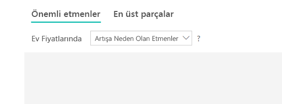

## Sonuçları yorumlayın: Başlıca etkileyiciler 

Bu senaryoda 'Ev fiyatlarında artışa sebep olan etmenlere’ bakacağız. **İnşa Yılı** (evin inşa edildiği yıl), **MutfakKal** (mutfak kalitesi) ve **YenModYıl** (evin yeniden modellendiği yıl) gibi, bir evin fiyatını etkileyebilen farklı açıklayıcı faktörlere bakıyoruz. 

Aşağıdaki örnekte, en üst etmen olarak, mutfak kalitesinin Mükemmel olmasını görüyoruz. Sonuçlar, kategorik ölçümleri çözümlerken gördüğümüz sonuçlara oldukça benziyor. Sadece, arada bazı önemli farklar var:

- Sağdaki sütun grafiği yüzdelerden ziyade ortalamaları ele alıyor. Bu nedenle, mükemmel bir mutfağı olan bir evin (yeşil çubuk) ortalama fiyatını, mükemmel bir mutfağı olmayan bir evin (noktalı çizgi) ortalama fiyatıyla karşılaştırıp bize gösterir
- Balondaki sayı hala kırmızı noktalı çizgi ve yeşil çubuk arasındaki farkı temsil etmektedir. Ancak bu, olasılıktan (1,93 kat daha fazla) ziyade sayı (158.490 ABD Doları) olarak ifade edilir. Ortalama olarak, mükemmel mutfakları olan evler, mükemmel mutfakları olmayan evlerden neredeyse 160 bin ABD Doları daha pahalıdır.

Aşağıdaki örnekte, bir sürekli faktörün (evin yeniden modellenme tarihi) evin fiyatı üzerindeki etkisini ele alacağız. Kategorik ölçümlerin sürekli etmenlerini çözümlerken karşılaştığımız farklar şunlardır:

-   Sağ bölmedeki dağılım grafiği, evin yeniden modellendiği yılın her farklı değeri için ortalama ev fiyatını belirtir. 
-   Balondaki değer, evin yeniden modellendiği yıl standart sapma kadar arttığında (bu örnekte 20 yıl) evin fiyatının ortalama olarak ne kadar yükseldiğini gösterir (bu örnekte 2.870 ABD Doları)

Son olarak, ölçü örneğinde evin inşa edilme yılı ortalamasına bakıyoruz. Çözümleme aşağıdaki gibidir:

-   Sağ bölmedeki dağılım grafiği, tablodaki her farklı değer için ortalama ev fiyatını belirtir
-   Balondaki değer, ortalama yıl standart sapma kadar arttığında (bu örnekte 30 yıl) evin fiyatının ortalama olarak ne kadar yükseldiğini gösterir (bu örnekte 1.350 ABD Doları)

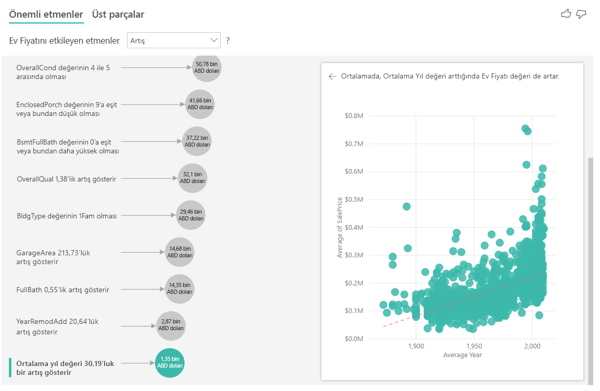

## Sonuçları yorumlayın: En Üst Segmentler

Sayısal hedefler için en üst segmentler, ev fiyatlarının ortalama olarak genel veri kümesindeki fiyatlardan daha yüksek olduğu grupları gösterir. Örneğin, aşağıda **Segment 1**’in **GarajOto** (garajın kaç araba kapasiteli olduğu) değeri 2’den büyük olan ve **ÇatıStil** değeri ortası kabarık çatı olan evlerden oluştuğunu görebiliriz. Verilerdeki ortalama fiyat 180 bin ABD Dolarına kıyasla bu özelliklere sahip evlerin ortalama fiyatı 355 bin ABD Dolarıdır.

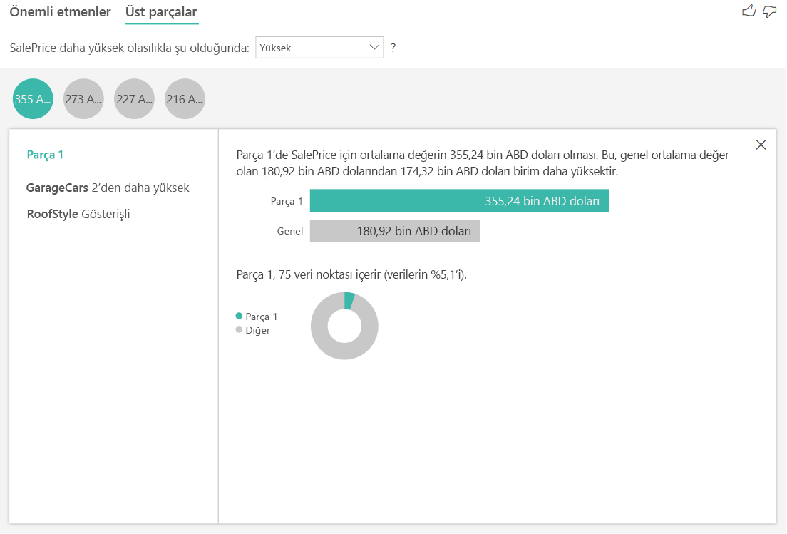

## Ölçü veya özetlenmiş sütun olan bir ölçümü analiz etme

Ölçü veya özetlenmiş sütun söz konusu olduğunda analiz varsayılan olarak [yukarıda](#analyze-a-metric-that-is-numeric) açıklanan **Sürekli Çözümleme Türü** olur. Bu değiştirilemez. Ölçüyü/Özetlenmiş sütunu analiz etmekle özetlenmemiş bir sayısal sütunu analiz etmek arasındaki en büyük fark analizin çalıştırılma düzeyidir.

Özetlenmemiş sütunlar söz konusu olduğunda analiz her zaman tablo düzeyinde çalıştırılır. Yukarıdaki ev fiyatı örneğinde, ev fiyatının artmasını/düşmesini nelerin etkilediğini görmek için **Ev Fiyatı** ölçümünü analiz etmiştik. Analiz otomatik olarak tablo düzeyinde çalıştırıldı. Tablomuzda her ev için benzersiz bir kimlik olduğundan analiz ev düzeyinde çalıştırıldı.

Ölçüler ve özetlenmiş sütunlar için, bunların hangi düzeyde analiz edileceğini hemen bilemeyiz. **Ev Fiyatı** **Ortalama** olarak özetlenmişse, bu ortalama ev fiyatının hangi düzeyde hesaplanmasını istediğiniz konusunda düşünmemiz gerekir. Bu ortalama ev fiyatı mahalle düzeyinde mi? Yoksa bölgesel düzeyde mi?

Ölçüler ve özetlenmiş sütunlar otomatik olarak kullanılan **Açıklama ölçütü** alanlarının düzeyinde analiz edilir. **Açıklama ölçütü**'nde ilgilendiğimiz üç alan olduğunu düşünün: **Kitchen Quality** (Mutfak Kalitesi), **Building Type** (Bina Türü) ve **Air Conditioning** (Havalandırma). Bu üç alanın her benzersiz bileşimi için **Average House Price** (Ortalama Ev Fiyatı) hesaplanabilir. Değerlendirilen verilerin nasıl göründüğüne göz atmak için tablo görünümüne geçmek genellikle yararlı olur.

Bu analiz fazlasıyla özetlenmiş olduğundan regresyon modelinin verilerde öğrenebileceği desenler bulması zor olacaktır. Daha iyi sonuçlar elde etmek için analizi daha ayrıntılı düzeyde çalıştırmalıyız. Ev fiyatını ev düzeyinde analiz etmek isteseydik analize açıkça **ID** (Kimlik) alanını eklememiz gerekecekti. Bununla birlikte ev kimliğinin bir etmen olarak değerlendirilmesini istemiyoruz. Ev kimliği yükseldikçe ev fiyatının yükseldiğini öğrenmek yararlı bir bilgi değil. İşte bu noktada **Genişletme Ölçütü** alanı seçeneği yararlı oluyor. Yeni etmenler aramadan analizin düzeyini ayarlamak amacıyla kullanmak istediğiniz alanları eklemek için **Genişletme Ölçütü**'nü kullanabilirsiniz.

**Genişletme Ölçütü**'ne **ID** alanını eklediğimizde görselleştirmenin nasıl göründüğüne bakın. Ölçünüzün hangi düzeyde değerlendirilmesini istediğinizi tanımladıktan sonra, etmenler [özetlenmemiş sayısal sütunlarla](#analyze-a-metric-that-is-numeric) tam olarak aynı şekilde yorumlanır.

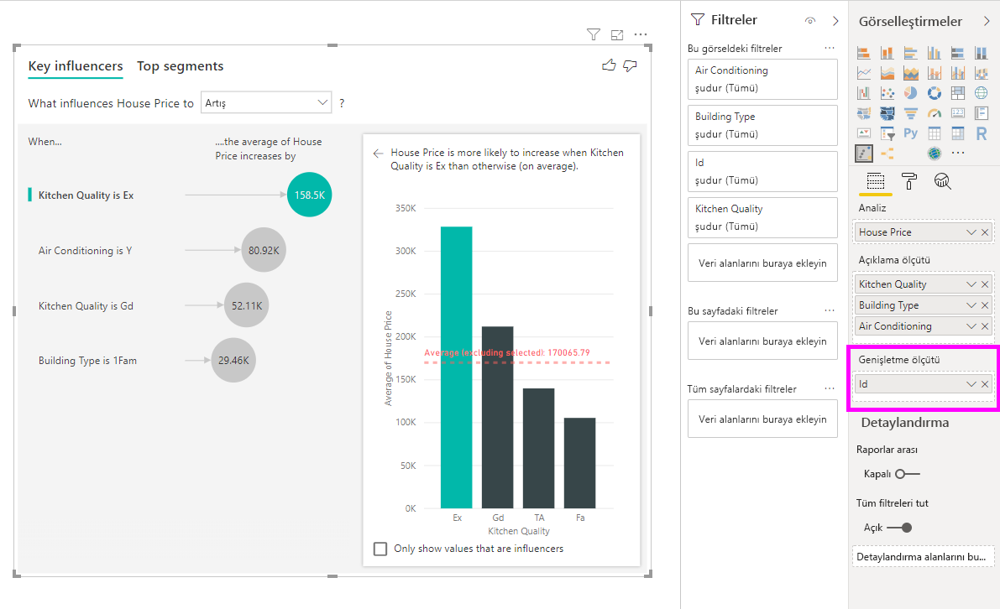

Önemli etmenler görselleştirmesiyle ölçüleri nasıl analiz edebileceğiniz konusunda daha fazla bilgi edinmek istiyorsanız lütfen aşağıdaki videoyu izleyin. Power BI'ın doğal bir şekilde verileri gerekçelendirmek ve içgörüleri ortaya çıkarmak amacıyla arka planda ML.NET'i nasıl kullandığını öğrenmek için bkz. [Power BI'ın ML.NET'i kullanarak önemli etmenleri tanımlaması](https://dotnet.microsoft.com/apps/machinelearning-ai/ml-dotnet/customers/power-bi).

<iframe width="1167" height="631" src="https://www.youtube.com/embed/2X1cW8oPtc8" frameborder="0" allow="accelerometer; autoplay; encrypted-media; gyroscope; picture-in-picture" allowfullscreen></iframe>

## Önemli noktalar ve sorun giderme 
 
**Görsel için sınırlamalar nelerdir?** 
 
Ana etmenler görselinin bazı sınırlamaları bulunur:

- Doğrudan Sorgu desteklenmiyor
- Azure Analysis Services ve SQL Server Analysis Services’e Canlı Bağlantı desteklenmiyor
- Web'de yayımlama desteklenmiyor
- .NET Framework 4.6 veya üzeri gereklidir
- SharePoint Online ekleme işlemi desteklenmez

**Etmen veya segment bulunamadığını belirten bir hata alıyorum. Bunun nedeni nedir?** 

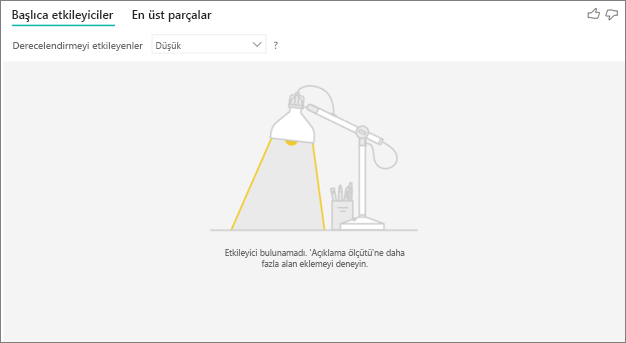

Bu hata, **Açıklama ölçütü**'ne alanları eklemenize rağmen etmen bulunamadığında oluşur. 
- Çözümlediğiniz ölçümü hem **Çözümle** hem de **Açıklama ölçütü** alanına eklediniz. Ölçümü **Açıklama ölçütü** alanından kaldırın. 
- Açıklayıcı alanlarınızın çok az gözlem içeren çok fazla kategorisi var. Bu durum, görselleştirmenin hangi faktörlerin etmen olduğunu belirlemesini zorlaştırır. Birkaç gözlemi temel alarak bunu genelleştirmek zordur. Bir sayısal alanı çözümlüyorsanız, **Çözümleme** kartının altındaki **Biçimlendirme Bölmesi**’ndeki **Kategorik Çözümleme**’den **Sürekli Çözümleme**’ye geçebilirsiniz.
- Açıklayıcı faktörlerinizin genelleştirme yapmak için yeterli sayıda gözlemi var ama görselleştirme, raporlayabileceği anlamlı bağıntılar bulamadı.
 
**Çözümlediğim ölçümün, çözümlemeyi çalıştırmak için yeterli verisi olmadığına ilişkin bir hata görüyorum. Bunun nedeni nedir?** 

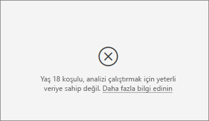

Görselleştirme, bir grubun verilerindeki desenlerin diğer gruplarla karşılaştırılmasıyla çalışır. Örneğin, düşük derecelendirme veren müşterileri, yüksek derecelendirme veren müşterilerle karşılaştırır. Modelinizdeki verilerin çok az gözlemi olduğunda desenleri bulmak zordur. Görselleştirmenin anlamlı etmenler bulmaya yetecek kadar verisi yoksa, çözümlemeyi çalıştırmak için daha fazla veri gerektiğini belirtir. 

Seçilen durum için en az 100 gözleminizin olmasını öneririz. Bu örnekte, durum müşteri kaybıdır. Karşılaştırma amaçlı kullandığınız durumlar için de en az 10 gözlem gerekir. Bu örnekte, karşılaştırma durumu kaybedilmeyen müşterilerdir.

Bir sayısal alanı çözümlüyorsanız, **Çözümleme** kartının altındaki **Biçimlendirme Bölmesi**’ndeki **Kategorik Çözümleme**’den **Sürekli Çözümleme**’ye geçebilirsiniz.

**'Çözümleme' özetlenmediğinde çözümlemenin her zaman üst tablosunun satır düzeyinde çalıştırıldığı bir hata görüyorum. 'Genişletme ölçütü' alanlarıyla bu düzeyin değiştirilmesine izin verilmiyor. Bunun nedeni nedir?**

Sayısal veya kategorik bir sütun çözümlenirken çözümleme her zaman tablo düzeyinde çalıştırılır. Örneğin ev fiyatlarını çözümlüyorsanız ve tablonuz bir kimlik sütunu içeriyorsa, çözümleme otomatik olarak ev kimliği düzeyinde çalıştırılır. 

Ölçü veya özetlenmiş sütunu çözümlerken, çözümlemenin hangi düzeyde çalıştırılmasını istediğinizi açıkça belirtmelisiniz. Ölçüler ve özetlenmiş sütunlar için, yeni etmenler eklemeden çözümleme düzeyini değiştirmek için **Genişletme ölçütü**'nü kullanabilirsiniz. **Ev fiyatı** bir ölçü olarak tanımlandıysa, çözümlemenin düzeyini değiştirmek için **Genişletme ölçütü**'ne ev kimliği sütununu ekleyebilirsiniz.

***Açıklama ölçütü* altındaki bir alanın çözümlediğim ölçümü içeren tabloyla arasında benzersiz bir ilişki olmadığını belirten bir hata görüyorum. Bunun nedeni nedir?**
 
Çözümleme, çözümlenen alanın tablo düzeyinde çalıştırılır. Örneğin, hizmetiniz için müşteri geri bildirimlerini çözümlüyorsanız müşterinin yüksek derecelendirme mi yoksa düşük derecelendirme mi yaptığını gösteren bir tablonuz olabilir. Bu durumda, çözümlemeniz müşteri tablosu düzeyinde çalışır. 

Bununla ilişkili olan ve ölçümünüzü içeren tablodan daha yüksek ayrıntı düzeyiyle tanımlanan bir tablonuz varsa, bu hatayla karşılaşırsınız. İşte bir örnek: 
 
- Hizmetiniz için düşük derecelendirmeler yapan müşterileri neyin yönlendirdiğini çözümlüyorsunuz.
- Müşterinin hizmetinizi kullandığı cihazın, değerlendirmesini etkileyip etkilemediğini görmek istiyorsunuz.
- Müşteri bir hizmeti birçok farklı yolla kullanabilir.
- Aşağıdaki örnekte, kimlik numarası 10000000 olan müşteri hizmetle etkileşim kurmak için hem tarayıcı hem de tablet kullanıyor.

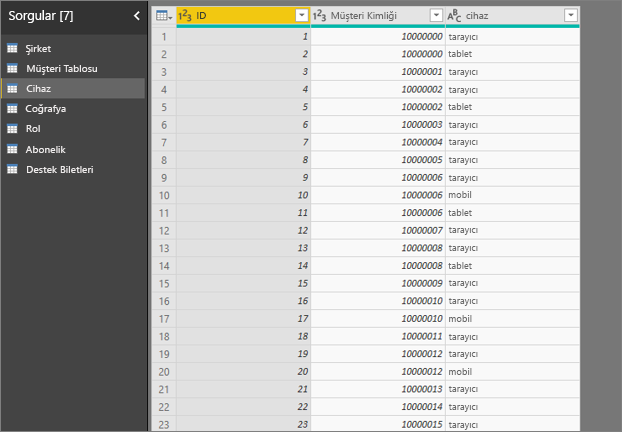

Açıklayıcı faktör olarak cihaz sütununu kullanmaya çalışırsanız aşağıdaki hatayı görürsünüz: 

Cihaz müşteri düzeyinde tanımlanmadığı için bu hatayla karşılaşılır. Müşteri hizmeti birden fazla cihazda kullanabilir. Görselleştirmenin desenleri bulabilmesi için cihazın, müşterinin bir özniteliği olması gerekir. İş anlayışınıza bağlı olarak çeşitli çözümler bulunur: 
 
- Sayılacak cihazların özetlemesini değiştirebilirsiniz. Örneğin, cihazların sayısı, müşterinin verdiği puanı etkileyebilirse sayıyı kullanın. 
- Hizmeti belirli bir cihazda kullanmanın müşteri derecelendirmesini etkileyip etkilemediğini görmek için cihaz sütununu özetleyebilirsiniz.
 
Bu örnekte, tarayıcı, mobil ve tablet için yeni sütunlar oluşturmak amacıyla veriler özetlendi (verilerinizi özetledikten sonra modelleme görünümündeki ilişkilerinizi silip yeniden oluşturmayı unutmayın). Bu belirli cihazları artık **Açıklama ölçütü** alanında kullanabilirsiniz. Tüm cihazların birer etmen olduğunu ve müşteri puanında en büyük etkinin tarayıcıya ait olduğunu buluruz.

Daha kesin belirtmek gerekirse, hizmeti tarayıcıyla kullanmayan müşterilerin düşük puan verme olasılığı tarayıcı kullanan müşterilerden 3,79 kat fazladır. Listenin daha aşağısında yer alan mobil için tam tersi geçerlidir. Mobil uygulama kullanan müşterilerin düşük puan verme olasılığı kullanmayan müşterilere göre daha yüksektir. 

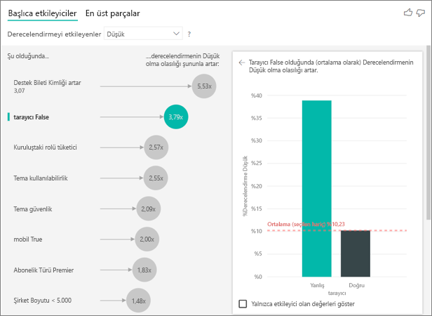

**Ölçülerin çözümlememe dahil edilmediğine ilişkin bir uyarı görüyorum. Bunun nedeni nedir?** 

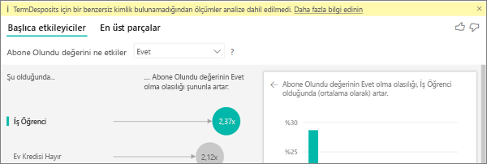

Çözümleme, çözümlenen alanın tablo düzeyinde çalıştırılır. Müşteri kaybını çözümlerseniz bir müşterinin kaybedilip kaybedilmediğini bildiren bir tablo bulabilirsiniz. Bu durumda, çözümlemeniz müşteri tablosu düzeyinde çalışır.
 
Ölçüler ve toplamlar varsayılan olarak tablo düzeyinde çözümlenir. Ortalama aylık harcama için bir ölçü olsaydı, bu ölçü müşteri tablosu düzeyinde çözümlenirdi. 

Müşteri tablosunun benzersiz tanımlayıcısı yoksa, ölçüyü hesaplayamazsınız ve bu ölçü çözümleme tarafından yoksayılır. Bu durumu önlemek için ölçümünüzü barındıran tablonun benzersiz tanımlayıcıya sahip olduğundan emin olun. Bu örnekte, bu müşteri tablosudur ve benzersiz tanımlayıcı da müşteri kimliğidir. Ayrıca Power Query kullanarak kolayca bir dizin sütunu eklenebilir.
 
**Çözümlediğim ölçümün 10'dan fazla benzersiz değeri olduğuna ve bu miktarın, çözümlememin kalitesini etkileyebileceğine ilişkin bir uyarı görüyorum. Bunun nedeni nedir?** 

AI görselleştirmesi, kategorik alanları ve sayısal alanları çözümleyebilir. Kategorik alanlarda, Müşteri Kaybı değerinin Evet veya Hayır olması ve Müşteri Memnuniyeti değerinin Yüksek, Orta veya Düşük olması örnek verilebilir. Çözümlenecek kategori sayısını artırılmasıyla kategori başına düşen gözlem sayısı azalır. Bu durum, görselleştirmenin verilerdeki desenleri bulmasını zorlaştırır. 

Sayısal alanları çözümlerken, sayısal alanları metin gibi ele alma seçeneğiniz bulunur. Bu durumda, kategorik veri için çalıştırdığınız çözümlemeyi (**Kategorik Çözümleme**) çalıştırırsınız. Çok sayıda farklı değer bulunuyorsa, rakamları farklı değerler olarak ele almaktan ziyade bunlar arttıkça veya azaldıkça desenler çıkarabilmemiz için çözümlemeyi **Sürekli Çözümleme** olarak değiştirmenizi öneririz. **Çözümleme** kartının altındaki **Biçimlendirme Bölmesi**’ndeki **Kategorik Çözümleme**’den **Sürekli Çözümleme**’ye geçebilirsiniz.

Daha güçlü etmenler bulabilmek için benzer değerleri tek bir birimde gruplandırmanızı öneririz. Örneğin fiyat için bir ölçümünüz varsa, tek tek fiyat noktalarını kullanmak yerine benzer fiyatları Yüksek, Orta, Düşük gibi kategorilerle gruplandırarak daha iyi sonuçlar elde edebilirsiniz. 

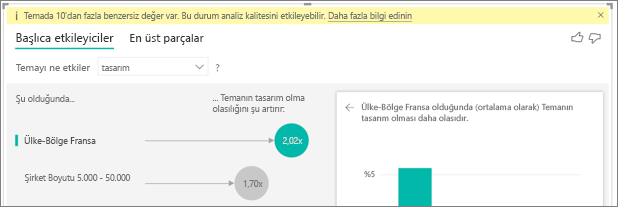

**Verilerimde ana etmen olması gerekiyor gibi görünen ama öyle olmayan faktörler var. Bu nasıl olur?**

Aşağıdaki örnekte, düşük puanlamanın etmeni, %14,93’ü düşük olan derecelendirmeler ile tüketici olan müşterilerdir. Yönetici rolünde de düşük derecelendirme oranı yüksek olsa da (%13,42) bu bir etmen olarak kabul edilmez. 

Bu belirlemenin sebebi, görselleştirmenin etmenleri bulduğunda veri noktalarının sayısını da göz önünde bulundurmasıdır. Aşağıdaki örnekte 29.000’den fazla müşteri ve 10 kat daha az yönetici (yaklaşık 2.900) bulunur. Bunlardan yalnızca 390 tanesi düşük derecelendirme yapmıştır. Görselin yönetici derecelendirmelerinde bir desen mi bulduğunu yoksa bunun rastlantı mı olduğunu saptamak için yeterli verisi yoktur. 

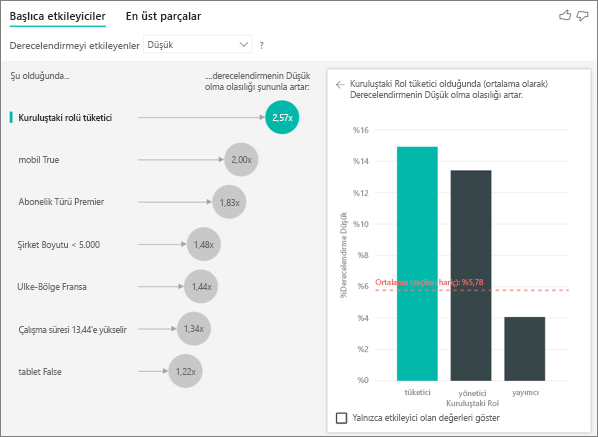

**Ana etmenler için veri noktası sınırları nelerdir?**
Analiz 10.000 veri noktasından oluşan bir örnek üzerinde çalıştırılır. Bir taraftaki kabarcıklar, bulunan ana etmenlerin tamamını gösterir. Diğer taraftaki sütun grafikler ve dağılım grafikleri ise bu temel görsellerin örnekleme stratejilerini kullanır.

**Kategorik çözümleme için ana etmenler nasıl hesaplanır?**

AI görselleştirmesi, ana etmenleri hesaplamak için [ML.NET](https://dotnet.microsoft.com/apps/machinelearning-ai/ml-dotnet) kullanarak arka planda bir lojistik regresyon çalıştırır. Lojistik regresyon, farklı grupları birbiriyle karşılaştıran istatistiksel bir modeldir. 

Düşük derecelendirmeye neyin yol açtığını öğrenmek istiyorsanız, lojistik regresyon düşük puan veren müşterilerin yüksek puan verenlerden ne açıdan farklı olduğunu ele alır. Yüksek, tarafsız ve düşük puanlar gibi birden fazla kategori varsa, düşük derecelendirme veren müşterilerin düşük derecelendirme vermeyen müşterilerden ne yönden ayrıldığına bakabilirsiniz. Bu durumda, düşük derecelendirme veren müşteriler, yüksek veya tarafsız derecelendirme veren müşterilerden ne yönlerden farklıdır? 
 
Lojistik regresyon verilerdeki desenleri arar ve düşük derecelendirme yapan müşterilerin yüksek derecelendirme yapanlardan ne açıdan farklı olduğuna bakar. Örneğin, daha fazla destek bileti olan müşterilerin düşük derecelendirme yapma yüzdesinin destek bileti az olan veya hiç olmayanlardan çok daha yüksek olduğunu bulabilir.
 
Lojistik regresyon kaç veri noktası olduğunu da göz önünde bulundurur. Örneğin, yönetici rolü üstlenen müşteriler nispeten daha fazla olumsuz puan veriyorsa ama çok az sayıda yönetici varsa, bu faktör etmen olarak değerlendirilmez. Bir desen çıkarsamak için yeterli veri noktası olmadığından bu belirleme yapılır. Bir faktörün etmen olarak kabul edilip edilmeyeceğini saptamak için Wald testi olarak da bilinen bir istatistik testi kullanılır. Görsel, eşiği belirlemek için 0,05 p-değeri kullanır. 

**Sayısal çözümleme için ana etmenler nasıl hesaplanır?**

AI görselleştirmesi ana etmenleri hesaplamak için [ML.NET](https://dotnet.microsoft.com/apps/machinelearning-ai/ml-dotnet) kullanarak arka planda bir doğrusal regresyon çalıştırır. Doğrusal regresyon, çözümlediğiniz alanın sonuçlarının açıklayıcı faktörlere göre nasıl değiştiğini ele alan istatistiğe dayalı bir modeldir.

Örneğin, ev fiyatları çözümleniyorsa doğrusal regresyon mükemmel bir mutfağın, bir evin fiyatını nasıl etkilediğini inceler. Mükemmel mutfakları olan evlerin fiyatları, mükemmel mutfakları olmayan evlere kıyasla genellikle daha mı yüksek yoksa daha mı düşük?

Doğrusal regresyon veri noktası sayısını da göz önünde bulundurur. Örneğin, tenis kortları bulunan evlerin fiyatları yüksekse ancak tenis kortu bulunan sadece birkaç tane ev bulunuyorsa, bu faktör etmen sayılmaz. Bir desen çıkarsamak için yeterli veri noktası olmadığından bu belirleme yapılır. Bir faktörün etmen olarak kabul edilip edilmeyeceğini saptamak için Wald testi olarak da bilinen bir istatistik testi kullanılır. Görsel, eşiği belirlemek için 0,05 p-değeri kullanır. 

**Segmentleri nasıl hesaplıyorsunuz?**

AI görselleştirmesi ilginç alt grupları bulmak için [ML.NET](https://dotnet.microsoft.com/apps/machinelearning-ai/ml-dotnet) kullanarak arka planda bir karar ağacı çalıştırır. Karar ağacının amacı ilgilendiğiniz ölçümde görece çok veri noktasından oluşan bir alt grup bulmaktır. Bu, düşük derecelendirme veren müşteriler veya fiyatı yüksek evler olabilir.

Karar ağacı açıklayıcı faktörlerin her birini alır ve hangi faktörün en iyi *bölünmeyi* sağlayacağını gerekçelendirmeyi dener. Örneğin, yalnızca büyük kurumsal müşterileri içerecek şekilde verileri filtrelerseniz, bu yüksek derecelendirme yapan müşterileri düşük derecelendirme yapanlardan ayırır mı? Belki de yalnızca güvenlik hakkında yorum yapan müşterileri içerecek şekilde filtrelemek daha iyi sonuç verir. 

Karar ağacı bölme işlemini yaptıktan sonra verilerin alt grubunu alır ve veri için bir sonraki en iyi bölmeyi belirler. Bu durumda alt grup, güvenlik hakkında yorum yapan müşterilerdir. Her bölme işleminden sonra, bir desen çıkarmak için bunun yeterli veri noktası içeren yeterli bir temsil mi yoksa verilerdeki bir anomali mi olduğunu da (dolayısıyla gerçek bir segment olmadığını) dikkate alır. Bölme koşulunun istatistiksel açıdan anlamlı olup olmadığını denetlemek için 0,05 p değeriyle başka bir istatistik testi uygulanır. 

Karar ağacının çalışması bittikten sonra, güvenlik yorumları ve büyük kuruluş gibi tüm bölmeleri alıp Power BI filtrelerini oluşturur. Bu filtre bileşimi görselde bir segment olarak paketlenir. 
 
***Açıklama Ölçütü* altına daha fazla alanı taşıdığımda neden bazı faktörler etmen haline geliyor veya etmen olmaktan çıkıyor?**

Görselleştirme tüm açıklayıcı faktörleri birlikte değerlendirir. Bir faktör, tek başına etmen olabilir ancak diğer faktörlerle birlikte değerlendirildiğinde olmayabilir. Açıklayıcı faktörler olarak yatak odası sayısı ve evin boyutunu kullanıp bir evin fiyatını neyin yükselttiğini çözümlediğinizi düşünün:

- Kendi başına, daha fazla yatak odası ev fiyatlarını yukarı çekebilir.
- Evin boyutu da çözümlemeye eklendiğinde, artık evin boyutunu sabit tutarak yatak odası sayısına ne olduğuna bakarsınız.
- Evin boyutu 140 metrekareyle sabitse, yatak odası sayısındaki sürekli artışın evin fiyatını önemli ölçüde artırması olası değildir. 
- Evin boyutu düşünülmeden, yatak odaları o kadar önemli bir faktör olmayabilir. 

Raporunuzu bir Power BI iş arkadaşınızla paylaşmak için her ikinizin de bireysel Power BI Pro lisanslarınızın olması veya raporun Premium kapasitede depolanması gerekir. Bkz. [Raporları paylaşma](../collaborate-share/service-share-reports.md).

## Sonraki adımlar
- [Power BI'daki birleşik grafikler](power-bi-visualization-combo-chart.md)
- [Power BI'daki görselleştirme türleri](power-bi-visualization-types-for-reports-and-q-and-a.md)
- [Power BI'ın ML.NET'i kullanarak önemli etmenleri tanımlaması](https://dotnet.microsoft.com/apps/machinelearning-ai/ml-dotnet/customers/power-bi)