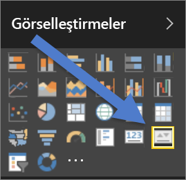
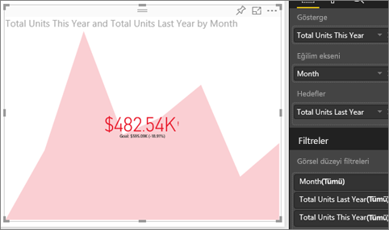

# KPI görselleri
Ana Performans Göstergesi (KPI), ölçülebilen bir hedefe yönelik ilerlemeyi gösteren bir görsel ipucudur. KPI'ler hakkında daha fazla bilgi için bkz. [Microsoft Developer Network](https://msdn.microsoft.com/library/hh272050).

## KPI'ler ne zaman kullanılır?
KPI'ler şunlar için harika seçimdir:

* ilerlemeyi ölçme (ne kadar geride ne kadar ilerideyim?)
* bir hedef için kalan mesafeyi ölçme (ne kadar yakın ne kadar uzağım?)   

## KPI görseli gereksinimleri
Ana Performans Göstergeleri, (KPI'ler) belirli bir ölçüyü temel alır ve geçerli değerin yanı sıra tanımlanmış bir hedefle ilgili ölçümün durumunu değerlendirmenize yardımcı olacak şekilde tasarlanmıştır. Bu nedenle, KPI görselleri, değer döndüren bir *temel* ölçü, bir *hedef* ölçü veya değer ve bir eşik ya da hedef gerektirir.

> [!NOTE]
> Geçerli sürümde KPI veri kümelerinin bir KPI için hedef değerleri içermesi gerekir. Veri kümenizde bulunmuyorsa veri modelinize veya PBIX dosyanıza hedefleri içeren bir Excel sayfası ekleyerek hedefler oluşturabilirsiniz.
> 
> 

## KPI'ler nasıl oluşturulur?
Birlikte ilerleyebilmek için Power BI hizmetinde oturum açın ve **Veri Al > Örnekler > Perakende Analizi Örneği**'ni seçin. Bir satış hedefi için kaydettiğimiz ilerlemeyi ölçen bir KPI oluşturacağız.

Alternatif olarak, Will şu tek ölçümlü görselleri oluştururken ona eşlik edebilirsiniz: ölçerler, kartlar ve KPI'ler.

<iframe width="560" height="315" src="https://www.youtube.com/embed/xmja6EpqaO0?list=PL1N57mwBHtN0JFoKSR0n-tBkUJHeMP2cP" frameborder="0" allowfullscreen></iframe>

1. Raporu [Düzenleme görünümü](../consumer/end-user-reading-view.md)'nde açın ve [yeni bir sayfa ekleyin](../power-bi-report-add-page.md).    
2. **Sales > Total Units This Year** seçeneğini belirleyin.  Bu göstergedir.
3. **Time > Month** seçeneğini ekleyin.  Bu, eğilimi gösterir.
4. ÖNEMLİ: Grafiği sıralamak için **Month** ölçütünü kullanın. Görselleştirmeyi KPI'ye çevirdikten sonra sıralama yapamazsınız.

    
5. Görsel Öğeler bölmesindeki KPI simgesini seçerek görseli bir KPI'ye dönüştürün.
   
    
6. Bir hedef ekleyin. Hedef olarak geçen yılın satışlarını ekleyin. **Total Units Last Year** alanını **Hedefler** alanına ekleyin.
   
    
7. İsteğe bağlı olarak, Biçimlendirme bölmesini açmak üzere boya rulosu simgesini seçerek KPI'yi biçimlendirebilirsiniz.
   
   * **Gösterge**: göstergenin görüntü birimlerini ve ondalık basamakları denetler.
   * **Eğilim ekseni**: **Açık** olarak ayarlandığında, KPI görselinin arka planı olarak eğilim ekseni görüntülenir.  
   * **Hedefler**: **Açık** olarak belirlendiğinde, görsel, hedefi ve yüzde olarak hedefe olan mesafeyi görüntüler.
   * **Renk kodlaması > Yön**: Bazı KPI'ler yüksek değerler için *daha uygun* görülürken bazılarının ise düşük değerler için *daha uygun* olduğu düşünülür. Örneğin kazanç ile bekleme süresi karşılaştırması. Genellikle, kazanç değerinin daha yüksek olması bekleme süresinin daha yüksek olmasından iyidir. **Yüksek daha iyidir**'i seçin ve isterseniz renk ayarlarını değiştirin.

1. KPI'nizi istediğiniz şekilde ayarladıktan sonra [panoya sabitleyin](../service-dashboard-pin-tile-from-report.md).

KPI'leri mobil cihazlarınızda da kullanabilir ve işinizin durumundan her zaman haberdar olabilirsiniz.

## Önemli noktalar ve sorun giderme
* KPI'niz yukarıdaki gibi görünmüyorsa aya göre sıralama yapmamış olabilirsiniz. KPI'lerde sıralama seçeneği bulunmadığından görselleştirmenizi bir KPI'ye dönüştürmeden *önce* aya göre sıralama yapmanız gerekir.

## Sonraki adımlar

[Power BI raporlarındaki görselleştirmeler](power-bi-report-visualizations.md)

Başka bir sorunuz mu var? [Power BI Topluluğu'na başvurun](http://community.powerbi.com/)

