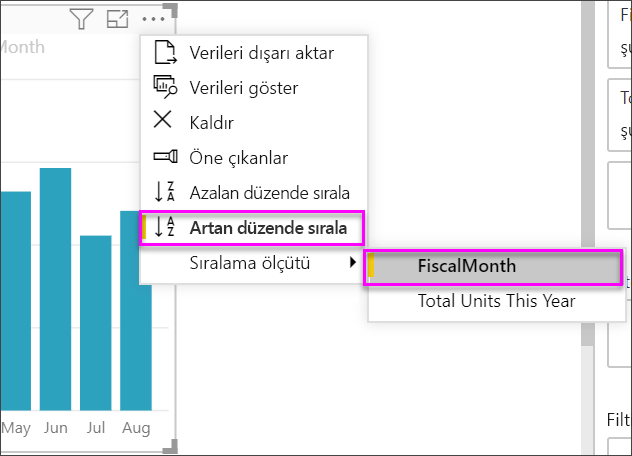
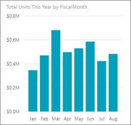
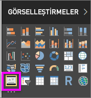
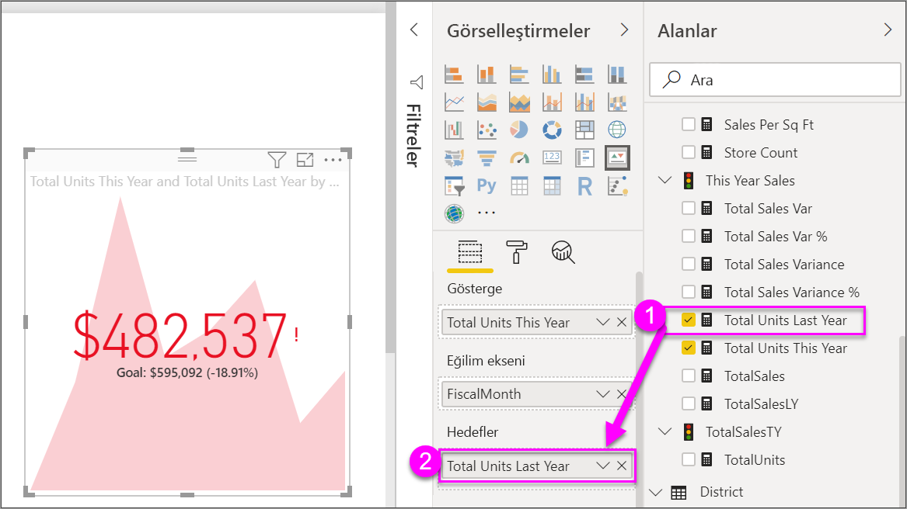

# Ana performans göstergesi (KPI) görselleştirmeleri oluşturma

[!INCLUDE [power-bi-visuals-desktop-banner](../includes/power-bi-visuals-desktop-banner.md)]

Ana Performans Göstergesi (KPI), ölçülebilen bir hedefe yönelik ilerlemeyi gösteren bir görsel ipucudur. KPI’ler hakkında daha fazla bilgi için bkz. [PowerPivot’da Ana Performans Göstergeleri (KPI’ler)](/previous-versions/sql/sql-server-2012/hh272050(v=sql.110)).

Will şu tek ölçümlü görselleri oluştururken ona eşlik edin: ölçerler, kartlar ve KPI'ler.
   > [!NOTE]
   > Bu videoda Power BI Desktop’ın eski bir sürümü kullanılmaktadır.
   > 
   > 
<iframe width="560" height="315" src="https://www.youtube.com/embed/xmja6EpqaO0?list=PL1N57mwBHtN0JFoKSR0n-tBkUJHeMP2cP" frameborder="0" allowfullscreen></iframe>

## KPI'ler ne zaman kullanılır?

KPI'ler şunlar için harika seçimdir:

* İlerleme durumunu ölçme. “Hangi konularda ilerideyim veya hangilerinde gerideyim?” sorusunu yanıtlama.

* Hedefe olan uzaklığı ölçme. “Ne kadar ileride veya gerideyim?” sorusunu yanıtlama.

## KPI gereksinimleri

Tasarımcı, KPI görselini belirli bir ölçüyü temel alarak oluşturur. KPI’nin amacı bir ölçümün geçerli değer ve durumunu tanımlanmış bir hedefe karşı değerlendirmenize yardımcı olmaktır. KPI görselleri, değer döndüren bir *temel* ölçü, bir *hedef* ölçü veya değer ve bir *eşik* ya da *hedef* gerektirir.

KPI veri kümelerinin bir KPI için hedef değerleri içermesi gerekir. Veri kümenizde hedef değerleri bulunmuyorsa veri modelinize veya PBIX dosyanıza hedefleri içeren bir Excel sayfası ekleyerek oluşturabilirsiniz.

## Önkoşullar

Bu öğreticide [Perakende Analizi örneği .PBIX dosyası](https://download.microsoft.com/download/9/6/D/96DDC2FF-2568-491D-AAFA-AFDD6F763AE3/Retail%20Analysis%20Sample%20PBIX.pbix) kullanılmıştır.

1. Menü çubuğunun sol üst köşesinden **Dosya** > **Aç**’ı seçin

1. **Perakende Analizi örneği PBIX dosyasının** kopyasını bulun

1. Rapor görünümünde **Perakende Analizi örneği PBIX dosyasını** açın. 

1. Yeni sayfa eklemek için **+** simgesini seçin. 

## KPI'ler nasıl oluşturulur?

Bu örnekte bir satış hedefine göre kaydettiğiniz ilerlemeyi ölçen bir KPI oluşturacaksınız.

1. **Alanlar** bölmesinden **Sales > Total Units This Year** alanını seçin.  Bu değer gösterge olacaktır.

1. **Zaman > FiscalMonth** ekleyin  Bu değer eğilimi temsil eder.

1. Görselin sağ üst köşesindeki üç nokta simgesini seçin ve Power BI’ın sütunları **FiscalMonth** ile artan düzende sıralayıp sıralamadığını kontrol edin.

    > [!IMPORTANT]
    > Görselleştirmeyi KPI'ye çevirdikten sonra sıralama **yapamazsınız**. Bu aşamada doğru sıralamanız gerekir.

    

    Doğru sıralandıktan sonra görseliniz şöyle görünür:

    

1. **Görselleştirme** bölmesindeki **KPI** simgesini seçerek görseli bir KPI'ye dönüştürün.

    

1. Hedef eklemek için **Total Units Last Year** alanını **Target goals** alanına ekleyin.

    

1. İsteğe bağlı olarak, Biçimlendirme bölmesini açmak üzere boya rulosu simgesini seçerek KPI'yi biçimlendirebilirsiniz.

    * **Gösterge**: göstergenin görüntü birimlerini ve ondalık basamakları denetler.

    * **Eğilim ekseni**: **Açık** olarak ayarlandığında, eğilim eksenini KPI görselinin arka planı olarak gösterilir.  

    * **Hedefler**: **Açık** olarak belirlendiğinde, görsel, hedefi ve yüzde olarak hedefe olan mesafeyi gösterir.

    * **Renk kodlaması > Yön**: Bazı KPI'ler *yüksek* değerler için daha uygun görülürken bazılarının ise *düşük* değerler için daha uygun olduğu düşünülür. Örneğin kazanç ile bekleme süresi karşılaştırması. Genellikle, kazanç değerinin daha yüksek olması bekleme süresinin daha yüksek olmasından iyidir. **Yüksek iyidir**'i seçin ve isterseniz renk ayarlarını değiştirin.

KPI’leri Power BI hizmetinde ve mobil cihazlarınızda kullanabilirsiniz. İşletmenizin can damarına her zaman bağlı olma seçeneği getirir.

## Önemli noktalar ve sorun giderme

KPI'niz yukarıdaki gibi görünmüyorsa **FiscalMonth**’a göre sıralama yapmamış olabilirsiniz. KPI’lerin sıralama seçeneği yoktur. Yeniden başlayarak görselleştirmenizi KPI’ye dönüştürmeden **önce** *FiscalMonth*’a göre sıralamanız gerekir.

## Sonraki adımlar

* [Power BI Harita görselleştirmeleri için ipuçları ve püf noktaları](power-bi-map-tips-and-tricks.md)

* [Power BI'daki görselleştirme türleri](power-bi-visualization-types-for-reports-and-q-and-a.md)

Başka bir sorunuz mu var? [Power BI Topluluğu'na başvurun](https://community.powerbi.com/)
