# Öğretici: Power BI raporuna yeni bir Power Apps görseli ekleme

Bu öğreticide, örnek Power BI raporuna eklenecek yeni bir uygulama oluşturmak için Power Apps görselini kullanacaksınız. Bu uygulama, söz konusu rapordaki diğer görsellerle etkileşimde bulunur.

Power Apps aboneliğiniz yoksa başlamadan önce [ücretsiz bir hesap oluşturun](https://web.powerapps.com/signup?redirect=marketing&email=).

Bu öğreticide aşağıdakilerin nasıl yapılacağını öğreneceksiniz:
> [!div class="checklist"]
> * Power BI raporuna Power Apps görseli ekleme
> * Power BI raporundan verilerin kullanıldığı yeni bir uygulama oluşturmak için Power Apps’te çalışma
> * Raporda Power Apps görselini görüntüleme ve bu görselle etkileşim kurma

## Önkoşullar

* [Google Chrome](https://www.google.com/chrome/browser/) veya [Microsoft Edge](https://www.microsoft.com/windows/microsoft-edge) tarayıcı
* [Fırsat Analizi Örneği](https://docs.microsoft.com/power-bi/sample-opportunity-analysis#get-the-content-pack-for-this-sample)’nin yüklü olduğu bir [Power BI aboneliği](https://docs.microsoft.com/power-bi/service-self-service-signup-for-power-bi)
* [Power Apps’te uygulama oluşturma](https://docs.microsoft.com/powerapps/maker/canvas-apps/data-platform-create-app-scratch) ve [Power BI raporlarını düzenleme](https://docs.microsoft.com/power-bi/service-the-report-editor-take-a-tour) hakkında bilgi sahibi olma

## Yeni uygulama oluşturma
Raporunuza Power Apps görseli eklediğinizde Power Apps ile Power BI arasında dinamik bir veri bağlantısıyla Power Apps Studio başlatılır.

1. Fırsat Analizi örnek raporunu açın ve *Upcoming Opportunities* (Yaklaşan Fırsatlar) sayfasını seçin. 

2. Yeni görsele yer açmak için rapor kutucuklarının bazılarını taşıyın ve yeniden boyutlandırın.

    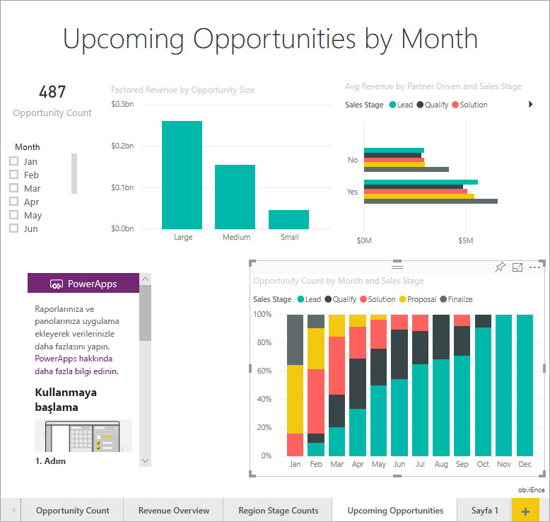

2. Görselleştirmeler bölmesinden Power Apps simgesini seçin ve görseli açtığınız alana sığacak şekilde yeniden boyutlandırın.

    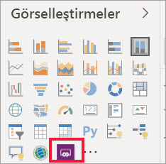

3. **Alanlar** bölmesinde **Ad**, **Ürün Kodu** ve **Satış Aşaması**’nı seçin. 

    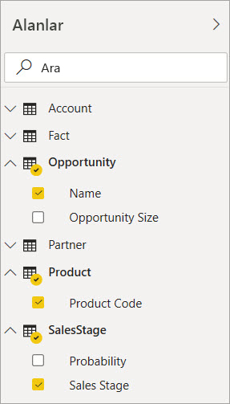

4. Power Apps görselinde uygulamayı oluşturmak istediğiniz Power Apps ortamını seçin ve sonra da **Yeni oluştur**’u seçin.

    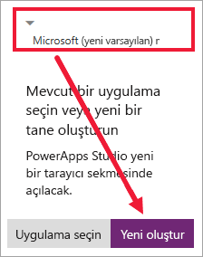

    Power Apps Studio’da, Power BI’da seçtiğiniz alanlardan birini gösteren bir *galeri* ile birlikte temel bir uygulamanın oluşturulduğunu görürsünüz.

    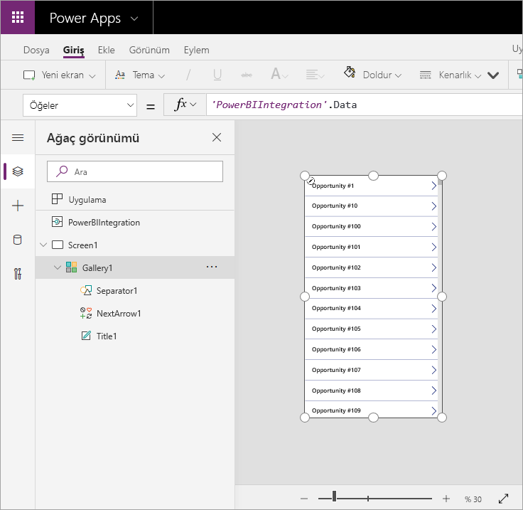

5.  Galeriyi ekranın yalnızca yarısını kaplayacak şekilde yeniden boyutlandırın. 

6. Sol bölmede **Scren1**’i seçin, ardından ekranın **Fill** özelliğini "LightBlue" olarak (raporda daha iyi gösterilmesi için) ayarlayın.

    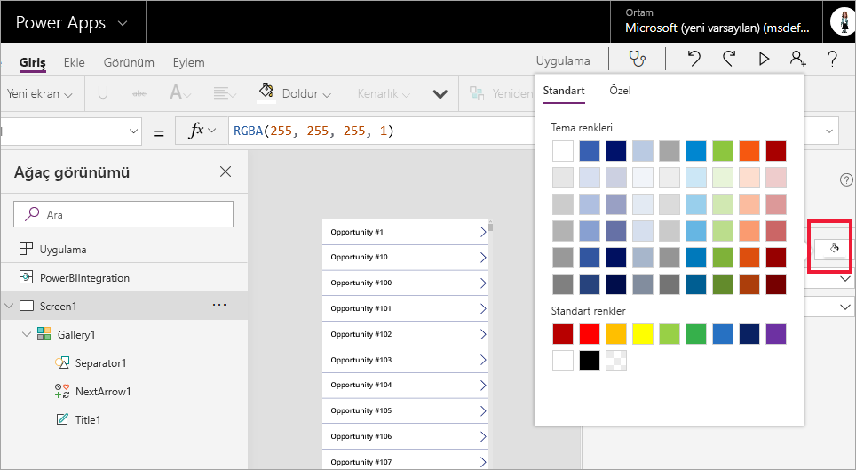

6. Etiket denetimi için biraz yer ayırın. 

    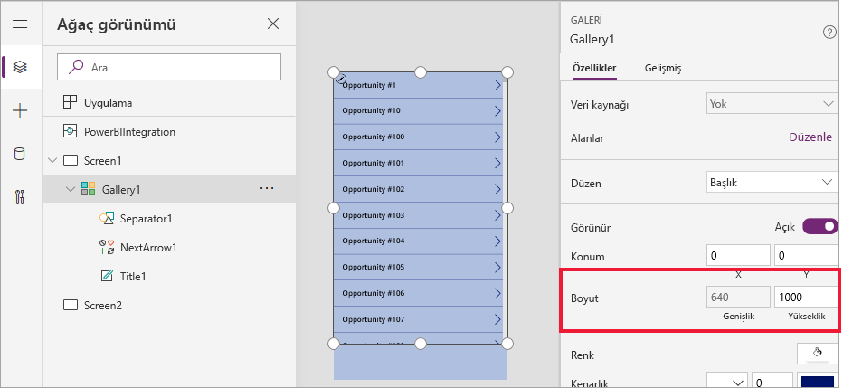

8. **Galeri**’nin altına bir metin etiketi denetimi ekleyin.

   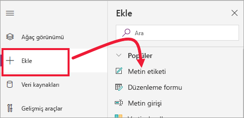

7. Etiketi görselinizin alt kısmına sürükleyin. **Text** özelliğini `"Opportunity Count: " & CountRows(Gallery1.AllItems)` olarak ayarlayın. Bu durumda veri kümesindeki toplam fırsat sayısı gösterilir.

    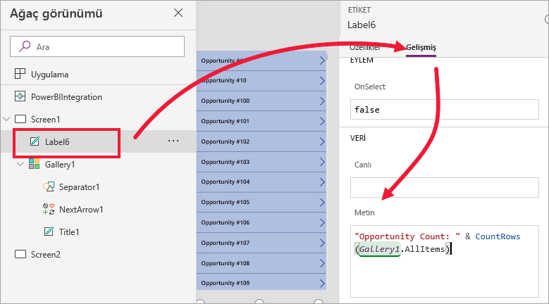

    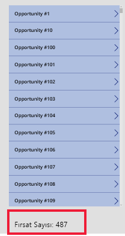

7. Uygulamayı "Opportunities app" adıyla kaydedin. 

    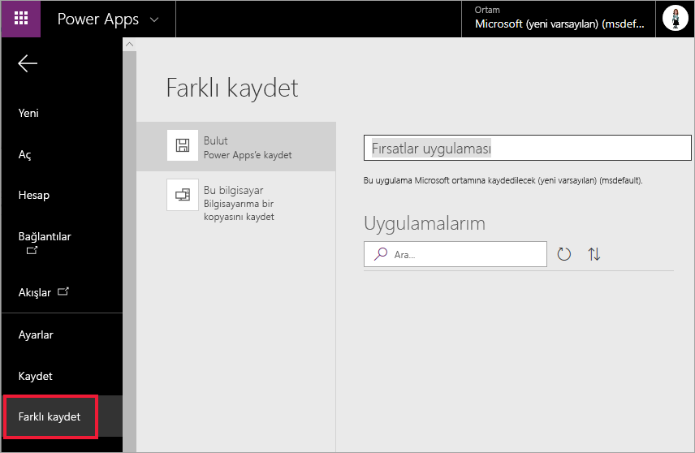

## Uygulamayı raporda görüntüleme
Uygulama artık Power BI raporunda kullanılabilir ve aynı veri kaynağını paylaştığından diğer görsellerle etkileşimde bulunur.

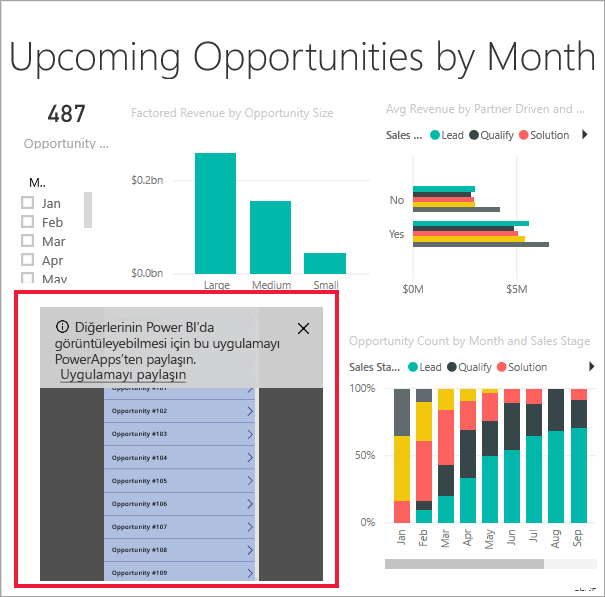

Power BI raporunda, dilimleyiciden uygulamadaki verilerle birlikte tam raporu filtreleyen **Jan** öğesini seçin.

Uygulamadaki fırsat sayısının, raporun sol üst köşesindeki sayıyla eşleştiğine dikkat edin. Rapordaki diğer öğeleri ve uygulama güncelleştirmelerindeki verileri seçebilirsiniz.

## Kaynakları temizleme
Fırsat Analizi Örneğini artık kullanmak istemiyorsanız pano, rapor ve veri kümesini silebilirsiniz.

## Sonraki adımlar
[Soru-Cevap görseli](power-bi-visualization-types-for-reports-and-q-and-a.md)