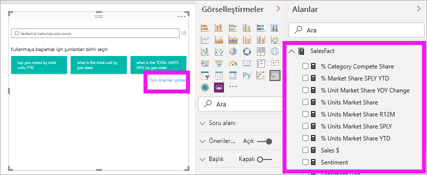

# Power BI Soru-Cevap görseline giriş

[!INCLUDE [power-bi-service-new-look-include](../includes/power-bi-service-new-look-include.md)]

## Soru-Cevap Görseli nedir?

Soru-Cevap görseli, kullanıcıların doğal dil soruları sormasına ve görsel biçiminde yanıtlar almasına olanak tanır. 

[!INCLUDE [power-bi-visuals-desktop-banner](../includes/power-bi-visuals-desktop-banner.md)]

Soru-Cevap görseli hem *tüketicilerin* verilerine hızlıca yanıt almasını hem de *tasarımcıların* bir raporda herhangi bir yere çift tıklayıp çalışmaya başlamak için doğal dili kullanarak görseller oluşturmasını sağlayan bir araç olarak kullanılabilir. Soru-Cevap görseli de diğer tüm görseller gibi davrandığı için çapraz filtre/çapraz vurgu uygulanabilir ve aynı zamanda yer işaretlerini destekler. Soru-Cevap görseli aynı zamanda Power BI’da kullanılan temaları ve diğer varsayılan biçimlendirme seçeneklerini destekler.

Soru-Cevap görseli dört temel bileşenden oluşur;

- Soru kutusu. Burada kullanıcılar sorularını yazar ve soruları tamamlamaya yardımcı öneriler gösterilir.
- Önerilen soruların önceden doldurulmuş bir listesi.
- Soru-Cevap görselini standart bir görsele dönüştürme simgesi. 
- Tasarımcıların temel alınan doğal dil altyapısını yapılandırmasına olanak tanıyan Soru-Cevap aracını açma simgesi.

## Önkoşullar

1. Bu eğitimde [Satış ve Pazarlama örneği PBIX dosyası](http://download.microsoft.com/download/9/7/6/9767913A-29DB-40CF-8944-9AC2BC940C53/Sales%20and%20Marketing%20Sample%20PBIX.pbix) kullanılmaktadır. 

1. Power BI Desktop menü çubuğunun sol üst kısmından **Dosya** > **Aç**’ı seçin
   
2. **Satış ve Pazarlama örneği PBIX dosyası** kopyanızı bulun

1. Dosyayı rapor görünümünde açma geçin.

1. Seç  yeni bir sayfa ekleyin.

Soru-Cevap görseli oluştururken bir hata görürseniz, veri kaynağı yapılandırmasının desteklenip desteklenmediğini öğrenmek için [sınırlamalar](../natural-language/q-and-a-limitations.md) bölümüne göz atın.

## Önerilen bir soruyu kullanarak Soru-Cevap görseli oluşturma
Bu alıştırmada, Soru-Cevap görselimizi oluşturmak için önerilen sorulardan birini seçeceğiz. 

1. Boş bir rapor sayfasında başlayın ve Görselleştirmeler bölmesinden Soru-Cevap görseli simgesini seçin.

    

2. Görseli yeniden boyutlandırmak için kenarlığı sürükleyin.

    

3. Görseli oluşturmak için, önerilen sorulardan birini seçin veya soru kutusuna yazmaya başlayın. Bu örnekte, **gelir toplamı en yüksek coğrafi bölgeler**’i seçtik. Power BI kullanılacak görsel türünü en iyi şekilde seçmeye çalışır. Bu örnekte görsel türü bir haritadır.

    

    Ancak, doğal dil sorgunuza ekleyerek hangi görsel türünü kullanacağını Power BI’a söyleyebilirsiniz. Tüm görsel türlerinin verileriniz üzerinde işe yaramayacağını veya mantıklı olmayacağını unutmayın. Örneğin, bu veriler anlamlı bir dağılım grafiği oluşturmaz. Ancak bir kartogram gibi çalışır.

    

## Doğal dil sorgusu kullanarak Soru-Cevap görseli oluşturma
Yukarıdaki örnekte, Soru-Cevap görselimizi oluşturmak için önerilen sorulardan birini seçtik.  Bu alıştırmada kendi sorumuzu yazacağız. Sorumuzu yazarken, Power BI otomatik tamamlama, öneriler ve geri bildirim ile bize yardımcı olur.

Ne tür sorular soracağınızdan veya hangi terminolojiyi kullanacağınızdan emin değilseniz **Tüm önerileri göster**’i genişletin veya tuvalin sağ tarafında bulunabilecek Alanlar bölmesine bakın. Bunu yaparak Satış ve Pazarlama veri kümesinin terim ve içeriklerini yakından tanıyabilirsiniz.

1. Soru-Cevap alanına bir soru yazın. Power BI tanımadığı sözcüklere kırmızı bir alt çizgi ekler. Mümkün olduğunda, Power BI tanınmayan sözcükleri tanımlamaya yardımcı olur.  Aşağıdaki ilk örnekte, önerilerden birini seçmeniz yeterlidir.  

    

2. Harf girmeye devam ettikçe, Power BI soruyu anlamaması durumunda bize bildirir ve yardımcı olmaya çalışır. Aşağıdaki örnekte Power BI "Şunu mu demek istediniz..." sorusunu sorar ve veri kümemizdeki terminolojiyi kullanarak sorumuzu farklı bir şekilde sormayı önerir. 

    

5. Power BI’ın yardımı sayesinde tüm tanınabilir terimlerle soru sorabildik. Power BI sonuçları çizgi grafik olarak gösterir. 

    

6. Görseli bir sütun grafik olarak değiştirelim. 

    

## Soru-Cevap görselini biçimlendirme ve özelleştirme
Soru-Cevap görseli, biçimlendirme bölmesi kullanılarak ve bir tema uygulanarak özelleştirilebilir. 

### Tema uygulama
Bir tema seçtiğinizde, bu tema tüm rapor sayfasına uygulanır. Aralarından seçim yapabileceğiniz birçok tema vardır; bu yüzden istediğiniz görünümü yapana kadar deneyin. 

1. Menü çubuğundan **Giriş** sekmesini ve **Tema değiştir**’i seçin. 

    

    
    
2. Bu örnekte **Daha fazla tema** > **Renk körlerine uygun**’u seçtik.

    

### Soru-Cevap görselini biçimlendirme
Soru-Cevap görselini, soru alanını ve önerilerin görüntülenme şeklini biçimlendirin. Bir başlığın arka planından, tanınmayan sözcüklerin üzerine gelme rengine kadar her şeyi değiştirebilirsiniz. Burada soru kutusuna gri bir arka plan ekledik ve alt çizgileri sarı ve yeşil olarak değiştirdik. Başlık ortalandı ve sarı bir arka plan uygulandı. 

## Soru-Cevap görselini standart bir görsele dönüştürme
Renk körlerine uygun sütun grafik görselimizi biraz biçimlendirdik: bir başlık ve kenarlık ekledik. Şimdi, raporumuzda standart bir görsele dönüştürmeye ve ayrıca bir panoya sabitlemeye hazırız.

**Bu Soru-Cevap sonucunu standart bir görsele dönüştürmek** için simgeyi  seçin.

Bu görsel artık bir Soru-Cevap görseli değil, standart sütun grafiğidir. Bir panoya sabitlenebilir. Raporda, bu görsel diğer standart görsellerle aynı şekilde davranır. Görselleştirmeler bölmesinde Soru-Cevap görseli simgesinin yerine bir Sütun grafiği simgesinin gösterildiğine dikkat edin.

***Power BI Hizmeti***’ni kullanıyorsanız, raptiye simgesini seçerek görseli bir panoya sabitleyebilirsiniz. 

## Soru-Cevap görselinin gelişmiş özellikleri
Dişli simgesi seçildiğinde Soru-Cevap görseli Araçlar bölmesi açılır. 

Soru-Cevap’a tanımadığı terimleri öğretmek, bu terimleri yönetmek ve bu veri kümesi ile rapor için önerilen soruları yönetmek üzere Araçlar bölmesini kullanın. Araç bölmesinde bu Soru-Cevap görseli kullanılarak sorulan soruları inceleyebilir ve kullanıcılar tarafından işaretlenen soruları görebilirsiniz. Daha fazla bilgi için bkz. [Soru-Cevap Araçları](../natural-language/q-and-a-tooling-intro.md).

## Önemli noktalar ve sorun giderme
Soru-Cevap görseli, veri kümenizin alanlarındaki tanınmayan yaygın sözcükleri eşleştirmek için Office ve Bing ile tümleşiktir.  

## Sonraki adımlar

Doğal dili tümleştirebilmeniz için kullanabileceğiniz çeşitli yollar vardır. Daha fazla bilgi için aşağıdaki makaleleri inceleyin:

* [Soru-Cevap Araçları](../natural-language/q-and-a-tooling-intro.md)
* [Soru-Cevap En İyi Yöntemler](../natural-language/q-and-a-best-practices.md)
