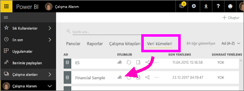
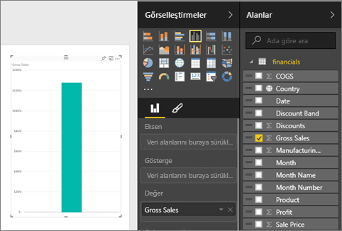
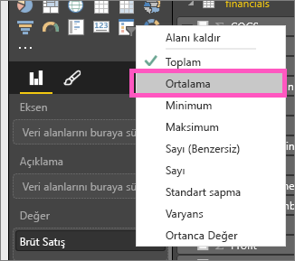
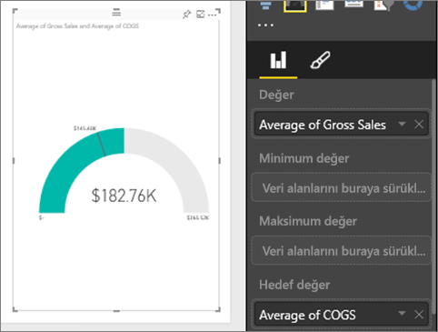
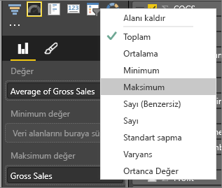
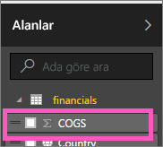

# Power BI'da radyal ölçer grafikleri

Radyal ölçerler dairesel bir yay içerir ve belirli bir hedefe veya Ana Performans Göstergesi’ne (KPI) yönelik ilerlemeyi ölçen tek bir değeri gösterir. Satır veya (*iğne*) hedeflenen veya amaçlanan değeri temsil eder. Gölgelendirme, hedefe yönelik ilerlemeyi temsil eder. Yayın içindeki değer ilerleme değerini temsil eder. Power BI, olası tüm değerleri minimumdan (en soldaki değer) başlayıp maksimumda (en sağdaki değer) sonlanacak şekilde yay boyunca eşit olarak dağıtır.

Bu örnekte, satış ekibinin aylık ortalama satışlarını izleyen bir araba satıcısı olduğunuzu varsayın. İğne 140 arabalık satış hedefini temsil eder. Mümkün olan minimum ortalama satış 0, maksimum ortalama satış ise 200’dür.  Mavi gölge, ekibin bu ayki ortalama satışının 120 olduğunu gösteriyor. Neyse ki, hedefe ulaşmak için bir hafta daha bulunuyor.

Will şu tek ölçümlü görselleri oluştururken ona eşlik edin: ölçerler, kartlar ve KPI'ler.

<iframe width="560" height="315" src="https://www.youtube.com/embed/xmja6EpqaO0?list=PL1N57mwBHtN0JFoKSR0n-tBkUJHeMP2cP" frameborder="0" allowfullscreen></iframe>

## Radyal ölçer ne zaman kullanılır?

Radial ölçerler şunlar için harika bir seçimdir:

* Bir hedefe yönelik ilerlemeyi göstermek.

* KPI gibi bir yüzde değerini göstermek.

* Tek bir ölçünün durumunu göstermek.

* Hızla tarayıp anlayabileceğiniz bilgileri görüntüleyin.

## Önkoşullar

* Power BI hizmeti veya Power BI Desktop

* Financial Sample adlı Excel çalışma kitabı: [Örneği doğrudan indirin](http://go.microsoft.com/fwlink/?LinkID=521962).

## Basit bir radyal ölçer oluşturma

Bu yönergeler Power BI hizmeti için geçerlidir. Birlikte ilerlemek için Power BI hizmetinde oturum açtıktan sonra Financial Sample adlı Excel dosyasını açın.

### 1\. Adım: Financial Sample adlı Excel dosyasını açma

1. Henüz indirmediyseniz, [Financial Sample Excel dosyasını](../sample-financial-download.md) indirin. Dosyayı kaydettiğiniz yeri unutmayın.

1. Power BI hizmetinde **Verileri Al** > **Dosyalar** seçeneğini belirleyin.

1. **Yerel Dosya** seçeneğini belirleyip örnek dosyanın konumuna gidin.

1. **İçeri aktar**'ı seçin. Power BI, Financial Sample’ı çalışma alanınıza bir veri kümesi olarak ekler.

1. **Veri kümeleri** içerik listesinden **Financial Sample** için **Rapor oluştur** simgesini seçin.

    

### 2\. Adım: Gross Sales (Brüt Satış) değerini izlemeye yönelik bir ölçer oluşturma

Son bölümde, **Rapor oluştur** simgesini seçtiğinizde, Power BI düzenleme görünümünde boş bir rapor oluşturdu.

1. **Alanlar** bölmesinden, **Gross Sales** seçeneğini belirleyin.

   

1. Toplama işlemini **Ortalama** olarak değiştirin.

   

1. Ölçer simgesini seçin  Sütun grafiğini ölçer grafiğe dönüştürmek için.

    

    **Financial Sample** dosyasını ne zaman indirdiğinize bağlı olarak, bu sayılarla eşleşmeyen sayılar görebilirsiniz.

    > [!TIP]
    > Varsayılan olarak, Power BI, geçerli değerin (bu örnekte, **Ortalama Gross Sales**) ölçerin ortasındaki değer olduğunun varsayıldığı bir ölçer grafiği oluşturur. **Ortalama Brüt Satış** değeri 182.760 ABD doları olduğundan, başlangıç değeri (Minimum) 0 olarak, bitiş değeri ise (Maksimum) geçerli değerin iki katı olarak ayarlanır.

### 3\. Adım: Hedef değer ayarlama

1. **COGS**’yi **Alanlar** bölmesinden **Hedef değer** kutusuna sürükleyin.

1. Toplama işlemini **Ortalama** olarak değiştirin.

   Power BI **$145.48K** olan hedef değerimizi gösteren bir iğne ekler.

   

    Hedefimize ulaştığımıza dikkat edin.

   > [!NOTE]
   > Elle de bir hedef değer girebilirsiniz. [Minimum, Maksimum ve Hedef değerleri belirlemek için el ile biçimlendirme seçeneklerini kullanma](#use-manual-format-options-to-set-minimum-maximum-and-target-values) bölümüne bakın.

### 4\. Adım: Maksimum değer ayarlama

2\. Adımda, Power BI, minimum ve maksimum değerleri otomatik olarak ayarlamak için **Değer** alanını kullanmıştır. Peki ya maksimum değeri kendiniz belirlemek isterseniz? Mümkün olan maksimum değer olarak geçerli değerin iki katı yerine veri kümenizdeki en yüksek Brüt Satış değerini belirlemek istediğinizi varsayalım.

1. **Alanlar** bölmesindeki **Gross Sales** alanını **Maksimum Değer** kutusuna sürükleyin.

1. Toplama işlemini **Maksimum** olarak değiştirin.

   

   Ölçer, yeni bir bitiş değeriyle (Brüt satıştaki 1,21 milyon değeri) yeniden çizilir.

   

### 5 Adım: Raporunuzu kaydedin

1. [Raporu kaydedin](../service-report-save.md).

1. [Ölçer grafiğini pano kutucuğu olarak ekleyin](../service-dashboard-pin-tile-from-report.md). 

## Minimum, Maksimum ve Hedef değerleri ayarlamak için el ile biçimlendirme seçeneklerini kullanma

1. **Max of Gross Sales** alanını **Maksimum değer** kutusundan kaldırın.

1. **Biçim** bölmesini açmak için boya rulosu simgesini seçin.

   

1. **Ölçer ekseni**'ni genişletin ve **Minimum** ve **Maksimum** değerleri girin.

    

1. Hedef değeri kaldırmak için **Alanlar** bölmesinden **COGS** seçeneğini temizleyin.

    

1. **Ölçer ekseni**'nin altında **Hedef** alanı göründüğünde, buraya bir değer girin.

     

1. İsteğe bağlı olarak, ölçer grafiğinizi biçimlendirmeye devam edebilirsiniz.

Bu adımları tamamladıktan sonra şuna benzeyen bir ölçer grafiğiniz olur:

## Sonraki adım

* [Ana Performans Göstergesi (KPI) görselleri](power-bi-visualization-kpi.md)

* [Power BI'daki görselleştirme türleri](power-bi-visualization-types-for-reports-and-q-and-a.md)

Başka bir sorunuz mu var? [Power BI Topluluğu'na başvurun](http://community.powerbi.com/)