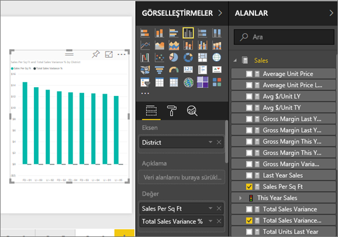
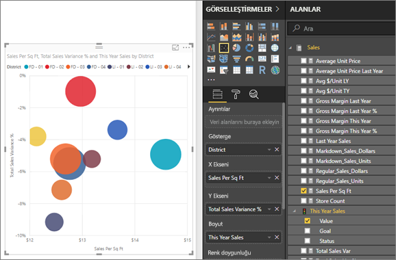
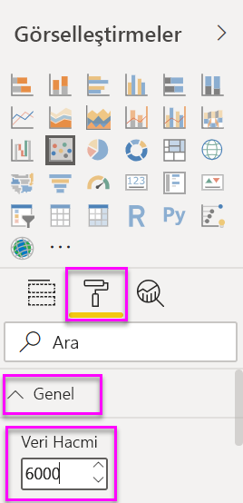
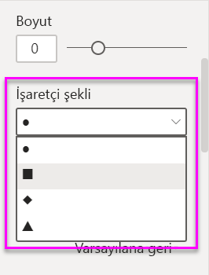
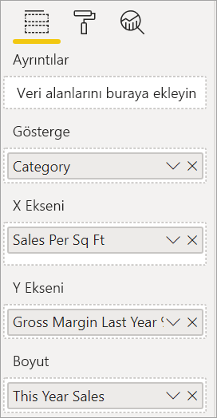
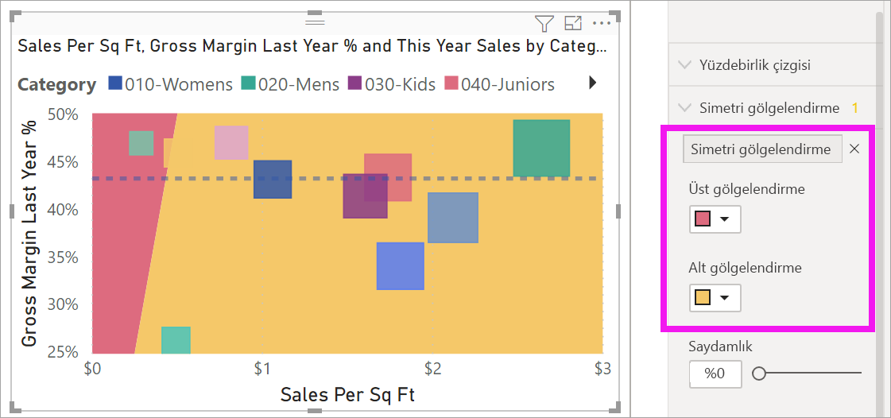
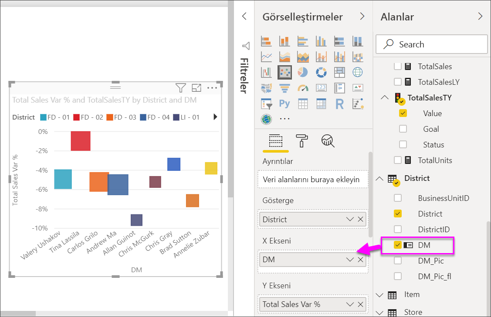
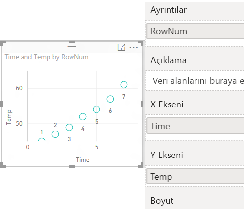

# Power BI’daki dağılım grafikleri, kabarcık grafikleri ve noktalı çizim grafikleri

[!INCLUDE [power-bi-visuals-desktop-banner](../includes/power-bi-visuals-desktop-banner.md)]

Dağılım grafiğinde her zaman iki değer ekseni bulunur: biri yatay eksende bir sayısal veri kümesini, diğeri ise dikey eksen üzerinde bir sayısal değer kümesini gösterir. Grafik, X ve Y sayısal değerlerinin kesişim noktalarını görüntüler ve bu değerleri tekli veri noktalarına dönüştürür. Power BI bu veri noktalarını yatay eksende eşit olarak veya eşit olmayacak şekilde dağıtılabilir. Bu, grafiğin temsil ettiği verilere bağlıdır.

Will'in bir dağılım grafiği oluşturduğu bu videoyu izleyip aşağıdaki adımları kullanarak kendiniz bir dağılım grafiği oluşturun.
   > [!NOTE]
   > Bu videoda Power BI Desktop’ın eski bir sürümü kullanılmaktadır.
   > 
   > 
<iframe width="560" height="315" src="https://www.youtube.com/embed/PVcfPoVE3Ys?list=PL1N57mwBHtN0JFoKSR0n-tBkUJHeMP2cP" frameborder="0" allowfullscreen></iframe>

Veri noktalarının sayısını en fazla 10.000 olarak ayarlayabilirsiniz.  

## Dağılım grafiğinin, kabarcık grafiğinin ve noktalı çizim grafiğinin kullanım alanları

### Dağılım ve kabarcık grafikleri

Dağılım grafiği, iki sayısal değerin arasındaki ilişkiyi gösterir. Kabarcık grafiğinde veri noktaları yerine kabarcıklar kullanılır ve kabarcığın *boyutu* farklı bir üçüncü veri boyutunu temsil eder.

Dağılım grafikleri aşağıdaki durumlarda harika bir seçimdir:

* İki sayısal değer arasındaki ilişkiyi göstermek için.

* İki sayı grubunu tek bir x ve y koordinat dizisi olarak çizmek için.

* Yatay eksenin ölçeğini değiştirmek istediğiniz durumlarda çizgi grafiğin yerine kullanmak için.

* Yatay ekseni logaritmik ölçeğe dönüştürmek için.

* İkili veya gruplanmış değer kümeleri içeren çalışma sayfası verilerini göstermek için.

    > [!TIP]
    > Dağılım grafiğinde eksenlerin ölçeğini ayrı ayrı ayarlayarak gruplanmış değerlerle ilgili daha fazla bilgiye yer verebilirsiniz.

* Doğrusal veya doğrusal olmayan eğilimler, gruplar ve aykırı değerler gibi büyük veri kümelerindeki desenleri göstermek için.

* Zamanı dikkate almadan çok sayıda veri noktasını karşılaştırma.  Bir dağılım grafiğine ne kadar veri eklerseniz yapabileceğiniz karşılaştırmalar da o kadar iyi olur.

Dağılım grafiklerinin sizin için yapabildiklerine ek olarak, kabarcık grafikleri de aşağıdaki durumlarda harika bir seçimdir:

* Verilerinizde her biri değer kümesi içeren üç veri dizisi varsa.

* Finansal verileri sunmak için.  Farklı kabarcık boyutları, belirli değerleri vurgulama açısından kullanışlıdır.

* Çeyrek dairelerle birlikte kullanmak için.

### Noktalı çizim grafikleri

Noktalı çizim grafiği, kabarcık grafiğine ve dağılım grafiğine benzer ancak X ekseninde kategorik veriler çizmek için kullanılır.

X ekseni üzerinde kategorik veriler dahil etmek istiyorsanız harika bir seçimdir.

## Önkoşullar

Bu öğreticide [Perakende Analizi örneği .PBIX dosyası](https://download.microsoft.com/download/9/6/D/96DDC2FF-2568-491D-AAFA-AFDD6F763AE3/Retail%20Analysis%20Sample%20PBIX.pbix) kullanılmıştır.

1. Menü çubuğunun sol üst köşesinden **Dosya** > **Aç**’ı seçin
   
2. **Perakende Analizi örneği PBIX dosyasının** kopyasını bulun

1. **Perakende Analizi örneği PBIX dosyasını** rapor görünümünde  açın.

1. Seç  yeni bir sayfa ekleyin.

## Dağılım grafiği oluşturma

1. Boş bir rapor sayfasında başlayın ve **Alanlar** bölmesinden şu alanları seçin:

    * **Satış** > **Fit Kare Başına Satış**

    * **Satış** > **Toplam Satış Varyansı %**

    * **Bölge** > **Bölge**

    

1. **Görselleştirme** bölmesinde  seçin. küme sütunu grafiğini bir dağılım grafiğine dönüştürmek için.

   

1. **District** öğesini **Ayrıntılar** bölmesinden **Açıklama**'ya sürükleyin.

    Power BI, Y ekseninde **Toplam Satış Varyansı %** verisini, X ekseninde ise **Fit Kare Başına Satış** verisi gösteren bir dağılım grafiğini görüntüler. Veri noktası renkleri bölgeleri göstermektedir:

    

Şimdi üçüncü boyutu ekleyelim.

## Kabarcık grafiği oluşturma

1. **Alanlar** bölmesinden, **Satış** > **Bu Yılın Satışları** > **Değer** öğesini **Boyut** kutusuna sürükleyin. Veri noktaları, satış değeriyle orantılı bir şekilde hacimlere genişler.

   

1. Bir kabarcığın üzerine gelin. Kabarcığın boyutu **This Year Sales** değerini yansıtır.

    

1. Kabarcık grafiğinizde gösterilecek veri noktalarının sayısını ayarlamak için **Görsel Öğeler** bölmesinin **Biçim** bölümünde **Genel**’i genişletin ve **Veri Hacmi**'ni ayarlayın.

    

    Veri hacmi üst sınırını 10.000’e kadar herhangi bir sayıya ayarlayabilirsiniz. Daha yüksek sayıya ulaştıkça iyi performanstan emin olmak için öncelikle test etmeniz önerilir.

    > [!NOTE]
    > Daha fazla veri noktası, yükleme süresinin uzamasına neden olabilir. Raporları, ölçeğin üst uçlarında sınır koyarak yayımlamayı seçerseniz, raporlarınızı web ve mobilde test ettiğinizden emin olun. Grafiğin performansının kullanıcılarınızın beklentileriyle eşleştiğini doğrulayabilirsiniz.

1. Görselleştirme renklerini, etiketlerini, başlıklarını, arka planını ve daha fazlasını biçimlendirmeye devam edin. [Erişilebilirliği artırmak](../desktop-accessibility.md) için her satıra işaretçi şekilleri eklemeyi deneyin. İşaretçi şeklini seçmek için **Şekiller**’i genişletin ve bir **İşaretçi şekli**’ni seçin ve bir şekil belirleyin.

    

    İşaret şeklini baklava, üçgen veya kare olarak değiştirebilirsiniz. Her çizgi için farklı bir işaretçi şekli kullanılması, rapor kullanıcılarının çizgileri (veya alanları) daha kolay bir şekilde ayırt edebilmesini sağlar.

1. Görselleştirmenize ek bilgi eklemek için  Analiz bölmesini açın.  
    - Ortanca çizgisi ekleyin. **Ortanca çizgisi** > **Ekle**'yi seçin. Power BI varsayılan olarak *fit kare başına Satışlar* için bir ortanca çizgisi ekler. 10 veri noktası olduğunu görebildiğimiz ve ortancanın her tarafta beş veri noktası ile oluşturulacağını bildiğimiz için bu çok faydalı değildir. Bunun yerine **Ölçü** seçeneğini *Toplam satış varyansı yüzdesi* olarak değiştirin.  

        

    - X ekseni ölçüsünün hangi noktalarının Y ekseni ölçüsüne kıyasla daha yüksek bir değere sahip olduğunu göstermek için simetri gölgelendirmesi ekleyin. Bunun tam tersi de geçerlidir. Analiz bölmesinde simetri gölgelendirmesini açtığınızda Power BI, geçerli ekseninizin üst ve alt sınırlarına göre dağılım grafiğinizin arka planını simetrik olarak gösterir. Bu, özellikle x ve y ekseniniz için farklı bir eksen aralığınız olduğunda, bir veri noktasının hangi eksen ölçüsünü tercih ettiğini belirlemenin çok hızlı bir yoludur.

        a. **Toplam satış varyansı yüzdesi** alanını **Geçen yılın brüt kar yüzdesi** olarak değiştirin

        

        b. Analiz bölmesinden **Simetri gölgelendirme** ekleyin. Gölgelendirmeden, Hosiery’nin (pembe gölgeli alandaki yeşil balon) mağaza kare ölçüsü başına satışları yerine brüt karı tercih eden tek kategori olduğunu görebiliriz. 

        

    - Verilerinize yönelik ilginç içgörüleri bulmak için Analiz bölmesini keşfetmeye devam edin. 

        

## Noktalı çizim grafiği oluşturma

Noktalı çizim grafiği oluşturmak için sayısal **X ekseni** alanını kategorik bir alanla değiştirin.

**X Ekseni** bölmesinden **Fit kare başına satış** girişini kaldırıp **Bölge** > **Bölge Yöneticisi** ile değiştirin.

## Önemli noktalar ve sorun giderme

### Dağılım grafiğinizde tek bir veri noktası var

Dağılım grafiğinizde X ve Y eksenindeki tüm değerleri toplayan yalnızca bir veri noktası mı var?  Ya da tek bir yatay veya dikey çizgi üzerindeki tüm değerleri mi topluyor?

**Ayrıntılar** kutusuna bir alan ekleyerek Power BI'a değerleri nasıl gruplandırması gerektiğini anlatın. Alanın, çizmek istediğiniz her nokta için benzersiz olması gerekir. Basit bir satır numarası ve kimlik alanı yeterli olur.

Verilerinizde bu bilgiler yoksa X ve Y değerlerinizden her noktada benzersiz verileri tutacak bir alan oluşturabilirsiniz:

Yeni bir alan oluşturmak için [Power BI Desktop Sorgu Düzenleyicisi'ni kullanarak veri kümenize bir Dizin Sütunu ekleyin](../desktop-add-custom-column.md). Ardından bu sütunu görselleştirmenizin **Ayrıntılar** bölümüne ekleyin.

## Sonraki adımlar

* [Power BI dağılım grafiklerinde yüksek yoğunluklu örnekleme](desktop-high-density-scatter-charts.md)

* [Power BI'daki görselleştirme türleri](power-bi-visualization-types-for-reports-and-q-and-a.md)

Başka bir sorunuz mu var? [Power BI Topluluğu'na başvurun](https://community.powerbi.com/)
