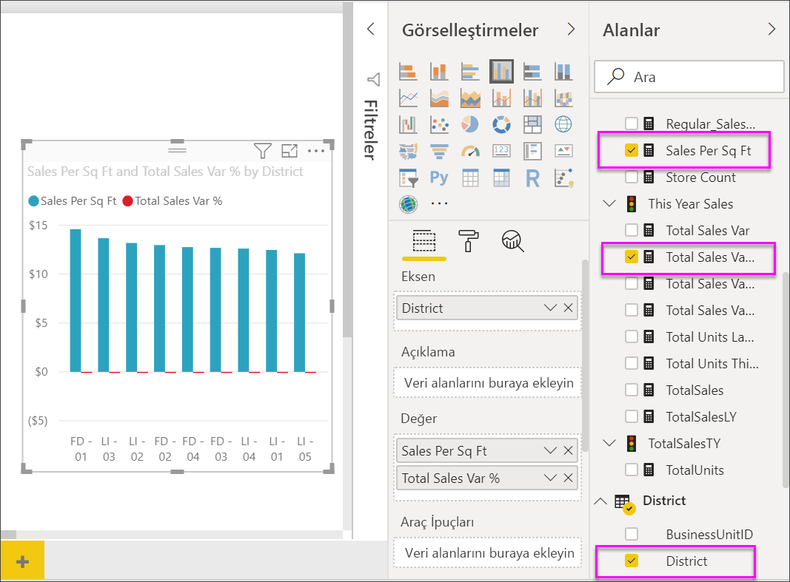
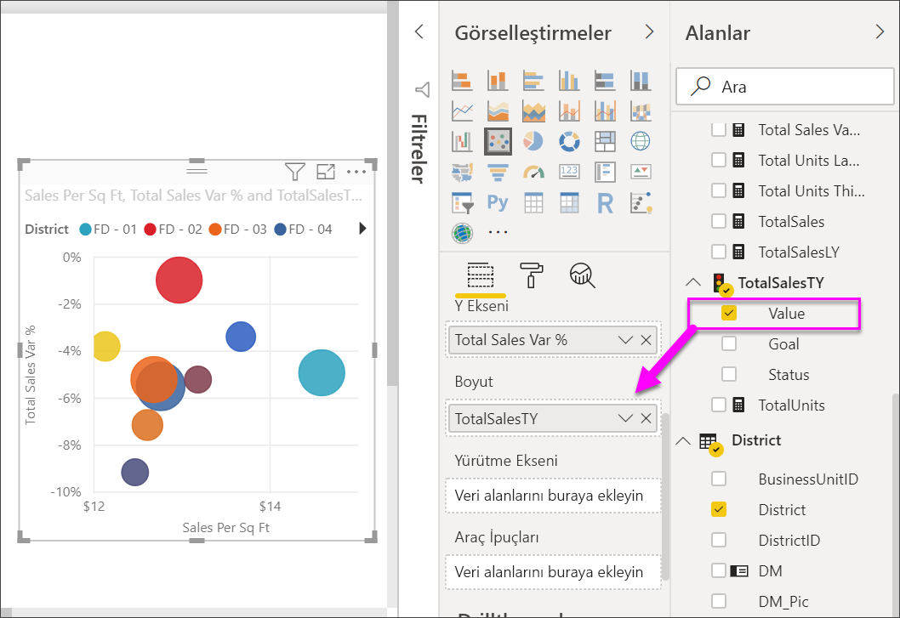

# Power BI’daki dağılım grafikleri, kabarcık grafikleri ve noktalı çizim grafikleri
Dağılım grafiğinde her zaman, biri yatay eksende bir sayısal veri kümesi gösteren, diğeri ise dikey eksen üzerinde bir sayısal değer kümesi gösteren iki değer ekseni bulunur. Grafik, X ve Y sayısal değerlerinin kesişim noktalarını görüntüler ve bu değerleri tekli veri noktalarına dönüştürür. Bu veri noktaları, verilere bağlı olarak yatay eksende eşit veya eşit olmayan şekilde dağıtılabilir.

Kabarcık grafiğinde veri noktaları yerine kabarcıklar kullanılır ve kabarcık *boyutu* verilerin farklı bir boyutunu gösterir.

Noktalı çizim grafiği, kabarcık grafiğine ve dağılım grafiğine benzer ancak onlardan farklı olarak X ekseninde sayısal veya kategorik veriler çizmenize imkan tanır. 

Veri noktalarının sayısını en fazla 10.000 olarak ayarlayabilirsiniz.  

## Dağılım grafiğinin ve kabarcık grafiğinin kullanım alanları
### Dağılım grafikleri aşağıdaki durumlarda harika bir seçimdir:
* 2 (dağılım) veya 3 (kabarcık) **sayısal** değer arasındaki ilişkiyi göstermek için.
* İki sayı grubunu tek bir xy koordinat dizisi olarak çizme.
* yatay eksenin ölçeğini değiştirmek istediğiniz durumlarda çizgi grafiğin yerine    
* yatay ekseni logaritmik ölçeğe dönüştürmek için.
* ikili veya gruplanmış değer kümeleri içeren çalışma sayfası verilerini göstermek için. Dağılım grafiğinde eksenlerin ölçeğini ayrı ayrı ayarlayarak gruplanmış değerlerle ilgili daha fazla bilgiye yer verebilirsiniz.
* doğrusal veya doğrusal olmayan eğilimler, gruplar ve aykırı değerler gibi büyük veri kümelerindeki desenleri göstermek için.
* Zamanı dikkate almadan çok sayıda veri noktasını karşılaştırma.  Bir dağılım grafiğine ne kadar veri eklerseniz yapabileceğiniz karşılaştırmalar da o kadar iyi olur.

### Kabarcık grafikler aşağıdaki durumlarda harika bir seçimdir:
* verilerinizde her biri değer kümesi içeren 3 veri dizisi varsa.
* finansal verileri sunmak için.  Farklı kabarcık boyutları, belirli değerleri vurgulama açısından kullanışlıdır.
* çeyrek dairelerle birlikte kullanmak için.

### Noktalı çizim grafikleri şu durumlarda dağılım veya kabarcık yerine harika bir seçimdir:
* X ekseni üzerinde kategorik veriler dahil etmek istiyorsanız

## Dağılım grafiği oluşturma
Will'in bir dağılım grafiği oluşturduğu bu videoyu izleyip aşağıdaki adımları kullanarak kendiniz bir dağılım grafiği oluşturun.

<iframe width="560" height="315" src="https://www.youtube.com/embed/PVcfPoVE3Ys?list=PL1N57mwBHtN0JFoKSR0n-tBkUJHeMP2cP" frameborder="0" allowfullscreen></iframe>

Bu yönergelerde Perakende Analizi Örneği kullanılmaktadır. Yönergeleri takip etmek için Power BI hizmeti (app.powerbi.com) veya Power BI Desktop [örneğini indirin](../sample-datasets.md).   

1. Boş bir rapor sayfası oluşturmak için, raporu Düzenleme görünümünde açın ve sarı artı simgesini seçin.
 
2. Alanlar bölmesinden aşağıdaki alanları seçin:
   - **Satış** > **Fit Kare Başına Satış**
   - **Satış** > **Toplam Satış Varyansı %**
   - **Bölge** > **Bölge**

     

     Power BI hizmetini kullanıyorsanız raporu [Düzenleme Görünümü](../service-interact-with-a-report-in-editing-view.md)'nde açtığınızdan emin olmanız gerekir.

3. Sonucu dağılım grafiğine dönüştürün. Görsel Öğeler bölmesinde Dağılım grafiği simgesini seçin.

   .

4. **District** öğesini **Ayrıntılar** bölmesinden **Açıklama**'ya sürükleyin. Burada, Y ekseninde **Toplam Satış Varyansı %** verisini, X ekseninde ise **Fit Kare Başına Satış** verisi gösteren bir dağılım grafiği görüntülenir. Veri noktası renkleri bölgeleri göstermektedir:

    

Şimdi üçüncü boyutu ekleyelim.

## Kabarcık grafiği oluşturma

1. **Alanlar** bölmesinden, **Satış** > **Bu Yılın Satışları** > **Değer** öğesini **Boyut** alanına sürükleyin. Veri noktaları, satış değeriyle orantılı bir şekilde hacimlere genişler.
   
   

2. Bir kabarcığın üzerine gelin. Kabarcığın boyutu **This Year Sales** değerini yansıtır.
   
    

3. Kabarcık grafiğinizde gösterilecek veri noktalarının sayısını ayarlamak için **Görsel Öğeler** bölmesinin **Biçimlendirme** bölümünde **Genel** kartını genişletin ve **Veri Hacmi**'ni ayarlayın. Veri hacmi üst sınırını 10.000’e kadar herhangi bir sayıya ayarlayabilirsiniz. Daha yüksek sayıya ulaştıkça iyi performanstan emin olmak için öncelikle test etmeniz önerilir. 

     

   Veri noktası sayısı arttığında yükleme süresi de uzayacağından, raporları ölçeğin uç sınırlarıyla yayımlamayı seçerseniz performansın kullanıcı beklentilerini karşılamasını sağlamak için raporlarınızı hem web üzerinde hem de mobil cihazlarda test ettiğinizden emin olun. 

4. [Görselleştirme renklerini, etiketlerini, başlıklarını, arka planını ve daha pek çok özelliğini biçimlendirebilirsiniz](service-getting-started-with-color-formatting-and-axis-properties.md). [Erişilebilirliği artırmak](../desktop-accessibility.md) için her satıra işaretçi şekilleri eklemeyi deneyin. Her çizgi için farklı bir İşaretçi şekli kullanılması, rapor kullanıcılarının çizgileri (veya alanları) daha kolay bir şekilde ayırt edebilmesini sağlar. İşaretçi şeklini seçmek için **Şekiller** kartını genişletin ve bir işaretçi şekli belirleyin.

      

   İşaretçi şeklini baklava, üçgen veya kare olarak değiştirebilirsiniz:

   

## Noktalı grafik oluşturma
Noktalı grafik oluşturmak için sayısal X ekseni alanını kategorik bir alanla değiştirin.

**X Ekseni** bölmesinden **Fit kare başına satış** girişini kaldırıp **Bölge > DM** ile değiştirin.
   

## Önemli Noktalar ve Sorun Giderme

### **Dağılım grafiğinizde tek bir veri noktası var**
Dağılım grafiğinizde X ve Y eksenindeki tüm değerleri toplayan yalnızca bir veri noktası mı var?  Ya da tek bir yatay veya dikey çizgi üzerindeki tüm değerleri mi topluyor?

**Ayrıntılar** bölümüne bir alan ekleyerek Power BI'a değerleri nasıl gruplandırması gerektiğini anlatın. Alan, çizmek istediğiniz her nokta için benzersiz olmalıdır; basit bir satır numarası veya kimlik alanı gibi.

Verilerinizde bu bilgiler yoksa X ve Y değerlerinizden her noktada benzersiz verileri tutacak bir alan oluşturabilirsiniz:

Yeni bir alan oluşturmak için [Power BI Desktop Sorgu Düzenleyicisi'ni kullanarak veri kümenize bir Dizin Sütunu ekleyin](../desktop-add-custom-column.md).  Ardından bu sütunu görselleştirmenizin **Ayrıntılar** bölümüne ekleyin.

## Sonraki adımlar

[Yüksek yoğunluklu dağılım grafikleri](desktop-high-density-scatter-charts.md)

[Power BI'daki görselleştirme türleri](power-bi-visualization-types-for-reports-and-q-and-a.md)

